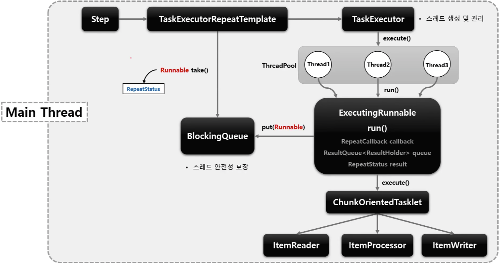

## Spring Batch - multi thread processing 이란?

Spring Batch는 기본적으로 단일 스레드로 동작한다.

복잡한 처리나 대용량 데이터를 다루는 작업의 경우 전체 소요 시간 및 성능 상의 이점을 위해 멀티 스레드 방식을 사용할 수 있다.

멀티 쓰레드 기반으로 각 Chunk를 개별로 처리할 수 있지만, Spring Batch의 큰 장점중 하나인 실패 지점에서 재시작하는 것은 불가능하게 된다.

## 병렬 처리 종류

- Multi-threaded Step (Single process / Local)
  - 단일 Step을 수행할 때, 해당 Step 내의 각 Chunk를 별도의 여러 쓰레드에서 실행 하는 방법
- Parallel Steps (Single Process / Local)
  - 여러개의 Step을 병렬로 실행하는 방법 (각 Step의 성능은 그대로)
- Remote Chunking (Multi process / Remote)
  - 분산환경처럼 Step 처리가 여러 프로세스로 분할되어 외부의 다른 서버로 전송되어 처리하는 방식
  - (A 서버에서 ItemReader를 사용하여 읽고, B 서버에서 ItemWriter를 사용하여 A 서버에서 보낸 데이터를 저장하는 등)
  - 메시지 유실 0%를 보장해야 한다.
- 파티셔닝 (Partitioning) (Single or Multi process / Local or Remote)
  - 매니저 (마스터)를 이용해 데이터를 더 작은 Chunk (파티션이라고 함)로 나눈 다음 파티션에서 슬레이브가 독립적으로 작동하는 방식
  - 원격 슬레이브와 통신하기 위해 다양한 통신 메커니즘을 지원
- AsyncItemProcessor/AsyncItemWriter
  - 별개의 쓰레드를 통해 ItemProcessor와 ItemWriter를 처리하는 방식 
  - spring-batch-integration에서 지원 
  - AsyncItemProcessor 및 AsyncItemWriter는 반드시 함께 사용해야 한다.

## 주의할 점

주의할 점은 Reader, Processor, Writer가 thread-safety가 확실한 지 체크해야 한다.

가능한 thread-safety한 구현체를 선택하되, 존재하지 않다면 SynchronizedItemStreamReader로 감싸서 커스텀하는 방식으로 구현한다.

추가로 일반적으로는 멀티 스레드에서는 실패한 청크부터 재처리하는 것을 원하지 않는다. 그래서 saveState 옵션을 false로 설정한다.

## 참고
- https://jojoldu.tistory.com/m/550

