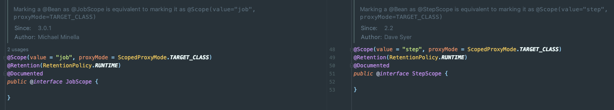

아래는 Spring Quartz + Spring Batch를 사용하여 만든 주식 1분봉 수집 서버 코드 일부이다.
- https://github.com/violetbeach/kis-trading-server/blob/master/boot/data-processing-server/src/main/java/com/violetbeach/kistradingserver/boot/processing/adapter/in/batch/job/DataProcessingStepConfiguration.java

코드를 요약하면 아래와 같다.

Batch Job이 `@Bean`으로 등록되어 있다.

여기서 보면 Step에서 **SpEL**을 사용해서 **stepExecutionContext**에 접근하고 있다.

이게 내부적으로 어떻게 동작하는 것인지 알아보자.
1. 어떤 방식으로 동일한 타입(+ 동일한 이름)의 빈을 여러개 띄우는 지
2. 각 Job/Step이 어떻게 JobParameter, ExecutionContext 등을 공유하는 지
3. 동일한 타입(+ 동일한 이름)의 빈들이 존재할 때, 어떻게 SpEL로 자신 Job/Step의 ExecutionContext를 구별하고 주입하는 지

## Job/Step Scope

Job과 Step이 Bean으로 여러 개 등록될 수 있는 이유는 `@Scope` 때문이다.

`@Scope` 애노테이션은 아래와 다양한 범위가 있다.

`@JobScope`와 `@StepScope`는 내부적으로  `Scope` 애노테이션의 value를 각각 싱글톤이 아닌 "job" / "step" 으로 명시하고 있다.

### Scope 처리

Scope를 등록하는 곳은 `BatchScopeSupport`이다.

- `AbstractBatchConfiguration.ScopeConfiguration`은 `StepScope`와 `JobScope`를 빈으로 등록한다. (애노테이션이 아니라 클래스가 있다.)
- `StepScope`와 `JobScope`가 상속하는 `BatchScopeSupport`는 `BeanFactoryPostProcessor`를 구현한다.
- `JobScope` / `StepScope`(클래스)로 인해 `BeanFactory`에 Scope에 value로 **job/step**과 각각의 애노테이션을 등록한다.

아래는 `AbstractBeanFactory`이다. Job / Step이 실행될 때 아래의 부분을 타게 된다.

결과적으로 매 요청이 올때마다 새로운 Bean이 생성되기 때문에 여러 개의 Job / Step이 빈으로 등록될 수 있다.

그래서 그냥 싱글톤 방식으로 주입받으려고 하면 아래와 같이 에러가 발생한다.

### JobContext / StepContext

동일한 시간대에 여러 개의 동일한 이름의 Step이 실행되고 있다.

아래와 같은 SpEL 방식으로 **동일한 Step**의 Context만 꺼낼 수 있는 이유는 뭘까..?
- `@Value("#{stepExecutionContext['stock_code']}") String stockCode`

Step이 생성될 때 `doExecutionRegistration(stepExecution)`을 호출한다.

해당 메서드는 내부적으로 `StepSynchronizationManager.crateNewContext()`를 통해 `StepContext`를 만든다.

저장된 `StepContext`는 `SynchronizationManagerSupport` ThreadLocal에 저장하고 있다.

즉, Flow를 요약하면 아래와 같다.
- Job은 Step을 실행시킨다.
- Step은 실행될 때 ThreadLocal에 StepContext를 등록한다.
- 각 @StepScope의 빈들은 ThreadLocal에서 StepContext를 참조하여 사용한다.

## SpEL

각 Job/Step의 구성요소들이 Context를 어떻게 공유하는 지도 알 수 있었다.

그러나 아직 남은 마지막 의문이 있었다. 그래서 **SpEL이 왜 동작하는데?**

SpEL에서는 `#{target}`을 사용하면 target이라는 이름의 빈을 꺼내서 사용할 수 있다.
그런데 위에서 꺼내는 `stepExecutionContext`는 빈이 아니다.

이는 아래 StepScope나 JobScope 클래스의 javadoc을 보면 알 수 있다.

가령, `@Value("#{stepExecutionContext['stock_code']}")`로 주입을 받았다면 `Scope`의 구현체인 `StepScope`를 통해 아래와 같이 `StepContext` 프로퍼티를 조회한다.

결과적으로 아래와 같이 `SpelExpression`의 결과 값(value)인 **293780(stepExecution.stockCode)**가 반환되어 프록시 빈에 주입된다.

지금까지의 내용을 정리하면 아래와 같다.
- Spring Batch에서는 Scope를 사용해서 Bean의 생명주기를 관리하고 있다.
  - "job"/"step" 이라는 Scope의 value를 새로 만들어서 프록시 빈을 여러개 띄울 수 있다.
- ThreadLocal로 JobContext/StepContext를 공유하고 있다.
- 각 배치의 동작시점에 SpEL을 통해 JobContext/StepContext에서 프로퍼티를 조회해서 필드에 주입할 수 있다.

## 참고
- https://docs.spring.io/spring-batch/docs/4.1.x/reference/html/jsr-352.html
- https://docs.spring.io/spring-batch/trunk_bkp/apidocs/org/springframework/batch/core/jsr/launch/support/BatchPropertyBeanPostProcessor.html

