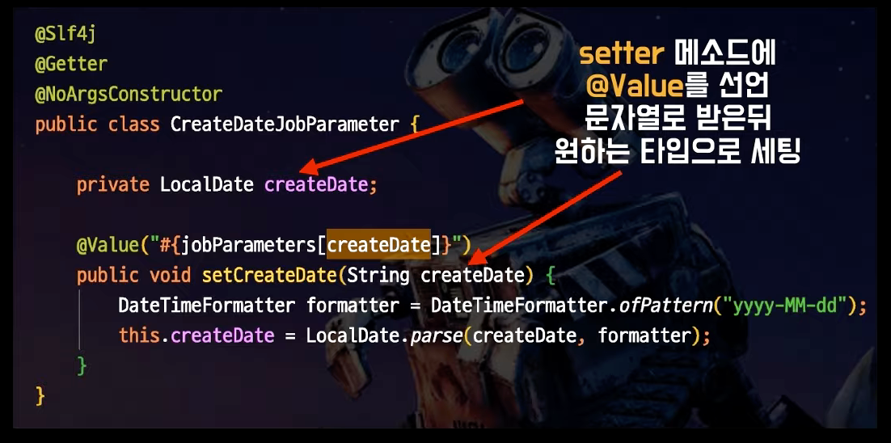

## 우아한 스프링 배치 내용 정리 (+ 통합 테스트 시 SpringTestContext Caching 팁!)

배달의 민족의 주문, 포인트, 정산 시스템에서 향로님께서 적용하면서 얻은 팁을 아래 강연에서 발표했다.
- https://www.youtube.com/watch?v=_nkJkWVH-mo

## Web vs Batch

Web
- 실시간 처리를 위주로 한다.
- 상대적인 처리 속도를 가진다.
- QA가 용이하다.

Batch
- 후속 처리를 위주로 한다.
- 절대적인 처리 속도가 측정된다.
- QA가 복잡하다. (DB나 자바 코드를 까봐야, 문제를 찾을 수 있기 때문)
  - 철저한 테스트 코드가 반드시 필요하다.

## 배치 애플리케이션이 필요한 이유

아래의 경우에는 필수적으로 배치 애플리케이션이 필요할 수 있다.
- 일정 주기로 실행되어야 할 때
- 실시간 처리가 어려운 대량의 데이터를 처리할 때

배민에서는 매출의 경우 5억건 정도가 있고, 매출 상세의 경우 7~8억건이 있었다고 한다.

이 경우 매출 조회에 인덱스를 아무리 태워도 1초만에 조회가 되지 않았다.

그래서 집계를 하거나 캐시가 가능하게 데이터를 만들 때 사용했다고 한다.

## 메모리

배치에서는 모든 데이터를 메모리에 쌓는 것을 권장하지 않는다.
- jpaRepository.findAll() -> X

그래서 Paging 혹은 Cursor를 사용하여 사이즈 만큼만 데이터를 읽어오고 commit을 한다.

이를 프레임워크 레벨에서 지원을 한다.

## JobParameter 문제

Long / String / Double / Date 타입들을 지원하지만, Enum / LocalDate / LocalDateTime을 지원하지 않는다.

그래서 무조건 String을 받아야 한다. (Java 8 이상에서는 Date는 안쓰니까..). 그래서 형변환이 꼭 필요하다.
- 이 귀찮은 형변환을 관점 분리할 수는 없을까?
- 그것도 별도의 Step이나 Tasklet으로 안빼고도 할 수는 없을까?

그래서 @Value읱 특성을 사용하게 된다.

위와 같은 Custom Parameter를 만들면 쓰는 Setter는 String으로 받으면서 쓰는 시점에서는 LocalDate를 Getter로 사용할 수 있다.

---

사실 여기까지는 스프링 배치의 기본 설명정도이다.

이제부터 다룰 내용은 Spring Batch를 사용하면서 생긴 고민들을 해결한 내용이다.

## (중요) 테스트!

사실 이번 강연에서 가장 재밌었던 부분이다.
- 나 역시 실무에서 이 문제를 뼈저리게 경험하고 있다.

강연에서는 Batch Application에서만 테스트가 너무 느린 현상이 발생했다고 한다.

Spring은 통합 테스트(@SpringBootTest) 수행 시 Spring Context를 캐싱해서 사용한다.

위 화면 (SpringBootAppllication이 새로 실행되는 화면)이 모든 테스트 코드에서 있다면 캐싱을 충분히 활용하지 못하고 있는 것을 의미한다.

아래는 Environment가 변경되어 Spring Context가 재시작되는 경우이다.
- 테스트 코드에서 @MockBean / @SpyBean을 사용할 때
  - 기존의 Bean을 Mocking했고, 이는 기존에 환경에 있는 빈이 아니니까 스프링 컨텍스트를 새로 띄운다.
- @TestPropertySource로 환경 변수를 변경할 때
- @ConditionalOnProperty로 테스트마다 Config가 다를 때
  - 테스트를 할 때마다 조건부로 빈을 사용하게 되니까 테스트 할 때마다 스프링 컨텍스트를 새로 띄우게 된다. 

강연에서 소개했던 원인은 Spring Batch를 사용할 때 일반적으로 필요 없는 Config는 포함시키지 않기 위해서 @ConditionalOnProperty를 사용했다.

그리고 테스트 코드에서는 @TestPropertySource를 사용해서 환경 변수를 주입한 후 실제처럼 Job을 실행했다.

그런데!
- 모든 Config를 Loading해도 성능 상 그렇게 큰 차이가 나지 않았다.
  - Web이 아니라 Batch라서 멀티 스레드를 모두 메모리에 올리는 것이 아니기 때문!
- 원하는 배치 Job Bean을 실행한다.

그래서 아래와 같이 변경할 수 있었다.

ApplicationContext를 사용해서 대상 이름의 JobBean을 조회한 후 jobLauncherTestUtils()에서 대상 Job을 선택해줄 수 있었다.

그래서 Util에 JobName을 넘겨주는 것으로 @TestPropertySource와 @ConditionalOnProperty를 대체할 수 있었다.

**결과적으로 10분 걸리던 통합 테스트가 6분으로 줄었다고 한다.** 

부끄럽지만, 나 역시 실무에서 테스트 코드가 400개 정도 있는데, 4분 정도가 소요되고 있다.
- 토스 커버리지 100% 강연 영상에서 1600개의 테스트가 40초만에 수행된다고 해서.. 개선이 필요하다고 생각하고 있었다!
- 혼자 개발하는 SideProject는 방금 돌려봤는데 SpringBoot가 한 번만 로드되었다.. 회사에서 개발하는 프로젝트는 매번 SpringBoot가 실행됬던 것 같다 ㅠ

인수 테스트를 쓸 때 각 테스트에서 필요한 컨텍스트만 로딩하는 것이 좋다고 생각했었다.
- 그래서 WireMock 등 외부 컨텍스트를 정말 필요한 테스트에서만 로드하도록 테스트를 구성했다.
- 나를 포함한 개발자들이 부족해서 @MockBean, @SpyBean 을 남용한 것도 문제였던 듯 하다.

그래서 테스트에서 SpringContext를 재활용하지 못했던 것 같다.

해당 내용을 참고해서 통합 테스트/인수 테스트를 할 때 동일한 Context를 유지해서 개발하도록 수정해봐야겠다.

## 참고
- https://www.youtube.com/watch?v=_nkJkWVH-mo

