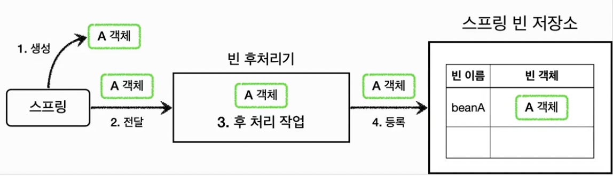

스프링에서 빈 저장소에 등록할 목적으로 생성한 객체를 **등록 직전**에 **조작하고 싶다면** **BeanPostProcessor**를 사용하면 된다.

**BeanPostProcessor**는 빈을 생성한 후 등록하기 전에 처리가 필요할 때 사용한다.

## BeanPostProcessor

BeanPostProcessor(빈 후처리기)는 객체를 조작하거나, 완전히 다른 객체로 바꿔치기 하는 등 원하는 작업을 할 수 있다.

처리 과정을 정리하면 아래와 같다.

만약 A 객체를 B 객체로 바꿔치기 하면 B 빈이 스프링 컨테이너에 등록된다.

## \@PostConstruct

우리가 사용하는 `@PostConstruct`도 빈 후처리기를 사용한 기술이다.

스프링은 `CommonAnnotationBeanPostProcessor`를 자동으로 등록한다.

해당 후처리기에서 `@PostConstruct` 애노테이션이 붙은 메서드를 호출해준다.

