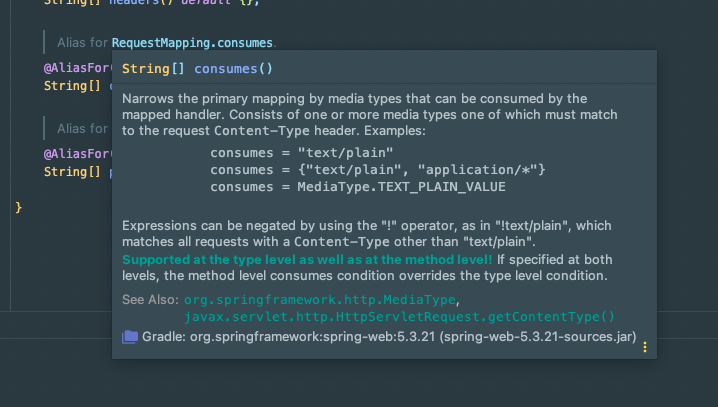
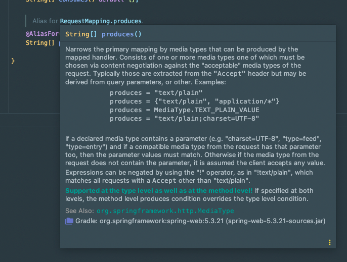

## Spring - consumes와 produces 이해하기!

스프링에서 동일한 URL인데 Content-Type 헤더에 따라 다른 Controller method를 실행시키려면 아래와 같은 애노테이션을 사용한다.
```java
@PostMapping(path = "/resources", consumes = MediaType.APPLICATION_JSON_VALUE) 
```

그 뿐만 아니라 Content-Type에 대한 제약을 걸 때도 consumes를 사용한다.

consumes는 produces와 어떻게 다른 지 알아보자!

## consumes

해당 애노테이션에 들어가서 RequestMapping.consumes의 속성에 대한 description을 확인해봤다.



해당 내용을 번역하면 '미디어 유형별로 매핑 범위를 좁힐 때 사용한다. 미디어 유형 중 하나가 요청 내용의 Content-Type과 일치해야 한다.'정도로 읽을 수 있다.

Content-Type은 요청을 받는 쪽에서 데이터를 어떻게 해석해야 하는 지를 명시하기 위한 헤더로 Request(요청)과 Response(응답)에서 모두 사용할 수 있다. 

위 Descrption을 보면 consumes는 해당 컨트롤러 메서드가 처리할 Content-Type(요청 헤더)를 제한하고자 할 때 사용함을 알 수 있다.

## produces

produces의 경우 반환하는 데이터 타입을 정의한다.



위 내용을 보면 produces는 '미디어 유형별로 매핑 범위를 좁힐 때 사용한다. 해당 구성은 허용 가능한 미디어 유형을 뜻한다. 일반적으로 Accept 헤더에서 추출되지만, 쿼리 매개변수 또는 기타에서 파생할 수도 있다.'

직역이 다소 어렵지만 설명하자면 이렇다.

Accept라는 요청 헤더가 있다.
- Accept 헤더는 요청하는 입장에서 특정 타입의 데이터를 원할 때 사용한다.

그래서 만약 두 개의 Controller method가 아래와 같이 있다고 가정하자.
```java
@PostMapping(path = "/resources", produces = MediaType.APPLICATION_JSON_VALUE)
public ResponseEntity<Dto> getJson() {
    // .. 생략
    return dto;
}

@PostMapping(path = "/resources", produces = MediaType.APPLICATION_OCTET_STREAM)
public ResponseEntity<Resource> getImageResource() {
    // .. 생략
    return imageResource;
}
```

이제 해당 url (/resources)로 요청을 보낼 때 기대하는 결과에 따라서 다른 반환 값을 내려줄 수 있다.

가령 `Accept:application/json` 헤더로 요청한다면 JSON을 내려주고, `Accept:application/octet-stream` 헤더로 요청하면 이미지를 내려주도록 처리가 가능하다.

물론 단순히 서버가 클라이언트에게 반환해줄 수 있는 데이터 타입을 명시하기 위해서 사용할 수도 있다!

## 참고
- https://mungto.tistory.com/438
