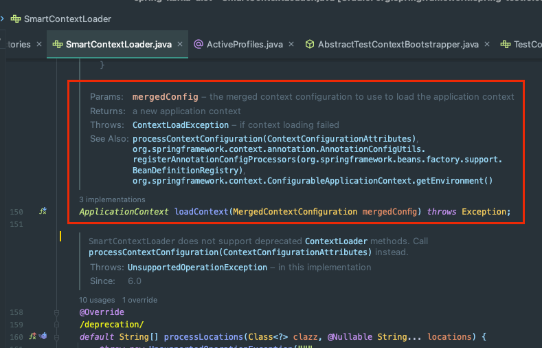
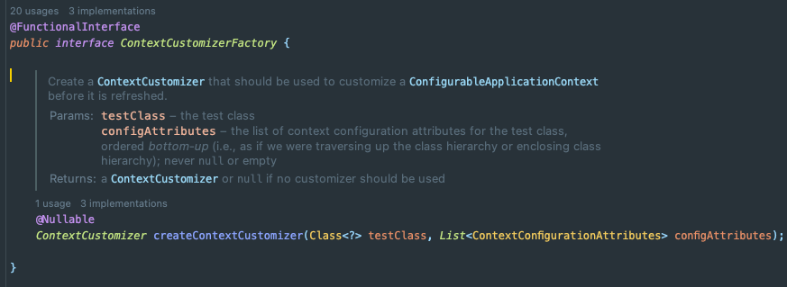
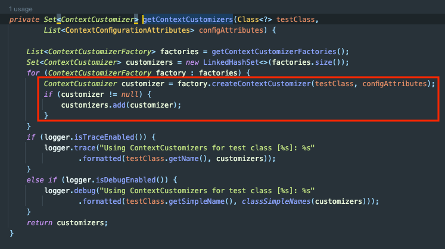
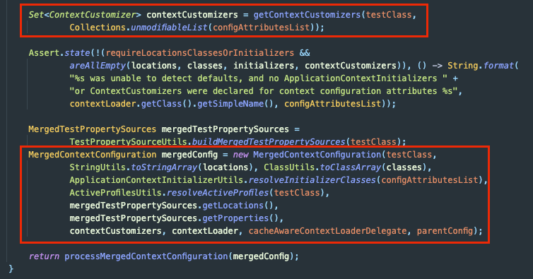

지난 번 Spring-kafka 라이브러리에서 `ContextCustomizerFactory`의 구현체인 `EmbeddedKafkaContextCustomizerFactory`를 수정했었다.
- https://jaehoney.tistory.com/347

`ContextCustomizerFactory`에 대해 알아보자.

## ContextCustomizerFactory

`ContextCustomizerFactory`는 `ContextCustomizer`를 생성하는 클래스이다.

해당 클래스는 **Spring-test** 라이브러리 안에서 관리되며, `ConfigurableApplicationContext`(`ApplictionContext`를 상속하는 인터페이스)가 **Refresh** 되기 전에 Context를 커스터마이징 하기 위해 사용한다. 

일반적으로 `META-INF/spring.factories`파일에 설정된 팩토리들을 명시하고, **AutoConfiguration**에서 이를 읽는 방식으로 사용한다. 

### 코드 파악

전후의 동작 순서를 정리하면 아래와 같다.
- `ContextLoader`의 컨텍스트 구성
- `MergeContextConfiguration` 생성
  - `ContextCustomizerFactory` 적용
- `ConfigurableApplicationContext` 리프레시

참고로 `MergeContextConfiguration`은 **Spring-test** 라이브러리에서 관리하는 클래스이다.

테스트 클래스 및 테스트 클래스의 Super 클래스 및 Inner 클래스에서 `@ContextConfiguration`, `@ActiveProfiles`, `@TestPropertySource`를 읽어와 컨텍스트 구성을 캡슐화한다.

`SmartContextLoader`는 `MergeContextConfiguration`을 사용해서 `ApplicationContext`를 로드한다.

### 동작 원리

내부적으로는 `createContextCustomizer()`를 호출하여 구현 조건에 맞게 **ContextCustomizer의 구현체 인스턴스** 혹은 **null**을 반환한다.

이를 사용하는 곳은 `AbstractTestContextBootstrapper`이다. 아래 코드를 보자.

`AbstractTestContextBootstrapper`에서는 `createContextCustomizer()`의 결과가 null이 아닌 `ContextCustomizer`만 Set 형태로 모아서 반환한다.

`contextCustomizers`는 `MergeContextConfiguration`을 통해 `Context`에 반영된다.

## 참고
- https://docs.spring.io/spring-framework/docs/current/javadoc-api/org/springframework/test/context/MergedContextConfiguration.html
- https://github.com/spring-projects/spring-framework/tree/main/spring-test