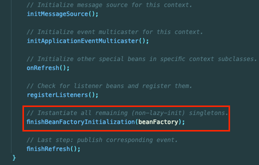
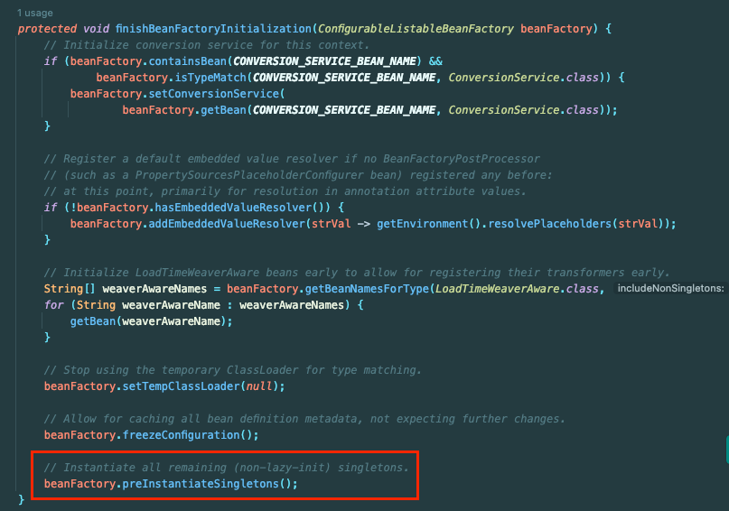

ApplicationContext는 무엇일까..? 일반적으로 스프링 컨테이너라고 불리며 빈을 관리한다 정도로 알고 있다.

더 자세히 알아보자.

## ApplicationContext

> Central interface to provide configuration for an application. This is read-only while the application is running, but may be reloaded if the implementation supports this.
> 
> An ApplicationContext provides:
> - Bean factory methods for accessing application components. Inherited from ListableBeanFactory.
> - The ability to load file resources in a generic fashion. Inherited from the ResourceLoader interface.
> - The ability to publish events to registered listeners. Inherited from the ApplicationEventPublisher interface.
> - The ability to resolve messages, supporting internationalization. Inherited from the MessageSource interface.
> - Inheritance from a parent context. Definitions in a descendant context will always take priority. This means, for example, that a single parent context can be used by an entire web application, while each servlet has its own child context that is independent of that of any other servlet.
> 
> In addition to standard BeanFactory lifecycle capabilities, ApplicationContext implementations detect and invoke ApplicationContextAware beans as well as ResourceLoaderAware, ApplicationEventPublisherAware and MessageSourceAware beans.

ApplicationContext는 아래의 인터페이스를 상속받는다. '아래 인터페이스의 기능들을 제공한다.' 로 이해할 수 있다.
- ListableBeanFactory: **빈에 접근할 수 있게 관리한다.**
  - 빈 생성 및 소멸 등 관리
  - 의존성 주입
- ResourceLoader: 파일 리소스를 로드한다.
- ApplicationEventPublisher: 등록된 리스너에 이벤트를 발행한다.
- MessageSource: 다국어를 지원한다.
- EnvironmentCapable: 프로퍼티에 접근할 수 있게 한다.

ApplicationContext는 여러 개일 수 있으며 자식의 정의를 우선한다.

## vs BeanFactory

앞서 말했듯 ApplicationContext는 ListableBeanFactory를 상속받고 BeanFactory의 자손이다.

즉, BeanFactory와 차이는 존재하지 않고 더 확장된 기능을 제공하는 인터페이스라고 이해하면될 것 같다.
- 파일 리소스 로드, 이벤트 발행, 다국어 지원 등

일반적으로 BeanFactory는 `Lazy Loading`이고, ApplicationContext는 `Eager Loading`이라고 하는데 그렇게 이해하는 것은 적절하지 않은 것 같다.

아래는 `AbstractApplicationContext`의 `refresh()`의 일부이다.

아래는 해당 메서드의 내부이다.

정리하면 Context가 실행될 때 싱글톤 빈을 Eager Loading 형태로 모두 등록한다.
- Context 초기화 시점에 존재하지 않는 빈을 주입하려하거나 순환 참조 등 오류를 잡기 위함이라고 한다.

그렇지만 `ApplicationContext`의 구현에 달린 것이지 `ApplicationContext`의 기본적인 속성이나 개념이 아니다.

그래서 스프링에서 지원하는 `AbstractApplicationContext`가 기본적으로 `EagerLoading`을 사용한다고 이해하는 것이 맞는 것 같다.

## 참고

- https://docs.spring.io/spring-framework/docs/current/javadoc-api/org/springframework/context/support/AbstractApplicationContext.html
- https://velog.io/@saint6839/BeanFactory-%EC%99%80-ApplicationContext%EC%9D%98-%EC%B0%A8%EC%9D%B4