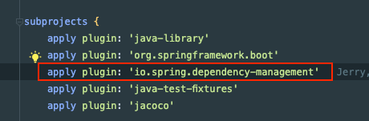
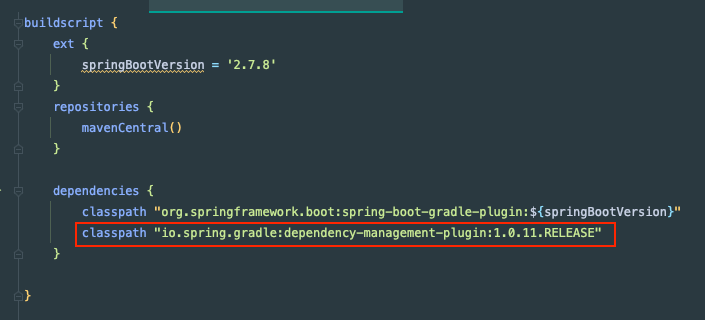
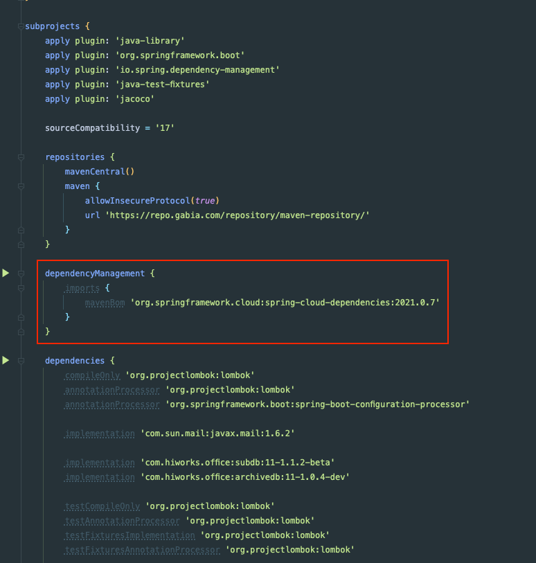
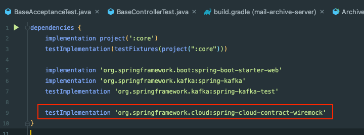

## Gradle - DependencyManagement 이해하기!

멀티 모듈 프로젝트에서 외부 라이브러리를 사용할 때 이런 고민이 있다.
- A 프로젝트와 B 프로젝트와 C 프로젝트에서 모두 동일한 버전의 라이브러리를 사용하고 싶다.
- 각 프로젝트의 build.gradle에서 라이브러리 의존성 버전을 동기화해줘야 한다.

이러한 문제를 더 잘 해결할 수 없을까..?

## Dependency-management-plugin

Gradle의 의존성 관리 플러그인(Dependency-management-plugin)을 사용하면 이를 해결할 수 있다.

의존성 관리 플러그인은 Maven과 같은 의속성의 관리 및 제외를 제공하는 Gradle Plugin이다.
- Gradle 6.8 이상, Java 8 버전 이상에서 지원된다.

## 사용하기 전에

DependencyManagement는 Gradle 플러그인 포탈에서 가져와 적용할 수 있다.
- https://plugins.gradle.org/plugin/io.spring.dependency-management





## 사용 방법
1. DSL을 활용해서 의존성을 직접 구성하는 방법 (기존에 쓰던 방법 - 버전을 직접 명시)
2. MavenBom을 Import 하는 방법

## 실전 코드

종속성 관리 DSL을 활용하는 방법이다.

### 1. 의존성 관리 DSL

```groovy
dependencyManagement {
    dependencies {
        dependency 'org.springframework:spring-core:4.0.3.RELEASE'
    }
}
```

```groovy
dependencyManagement {
    dependencies {
        dependency group:'org.springframework', name:'spring-core', version:'4.0.3.RELEASE'
    }
}
```

먼저 위와 같이 dependencyManagement를 선언하면 의존성에서는 버전 명시가 없어도 dependencyManagement에 있는 버전을 가져와서 사용한다.

```groovy
dependencies {
    implementation 'org.springframework:spring-core'
}
```

그룹 및 버전이 동일한 여러 라이브러리에 대한 의존성을 사용할 경우 집합을 사용할 수 있다.

```groovy
dependencyManagement {
     dependencies {
          dependencySet(group:'org.slf4j', version: '1.7.7') {
               entry 'slf4j-api'
               entry 'slf4j-simple'
          }
     }
}
```


### 2. MavenBom 가져오기

아래는 2번 MavenBom을 활용한 방법이다.

root_gradle의 일부이다. (직접 프로젝트에 적용한 부분을 그대로 따왔다.)



저렇게 dependencyManagement를 등록하면 해당 의존성을 사용하는 모든에서 의존성 버전이 관리된다.

내부적으로는 Maven Bom을 가져와 버전을 프로젝트 의존성에 적용한다.



그래서 하위 모듈에서는 버전을 명시하지 않고 의존성을 추가해주기만 하면 된다.

```groovy
dependencyManagement {
    imports {
        mavenBom 'io.spring.platform:platform-bom:1.1.1.RELEASE'
    }
    dependencies {
        dependency 'com.google.guava:guava:18.0'
    }
}
```

아래와 같이 Bom과 의존성에서 버전이 함께 사용되면 Bom으로 가져온 버전이 무시되고, 의존성에 직접 선언된 버전이 우선된다.

의존성 버전이 덮어써지는 기능을 원하지 않는다면 아래 속성을 추가할 수 있다.
```groovy
dependencyManagement {
    overriddenByDependencies = false
}
```

## 참고

더 다양한 기능에 대해서는 아래를 참고하자.

- https://docs.spring.io/dependency-management-plugin/docs/current/reference/html
- https://docs.spring.io/platform/docs/1.0.1.RELEASE/reference/htmlsingle/#appendix-dependency-versions