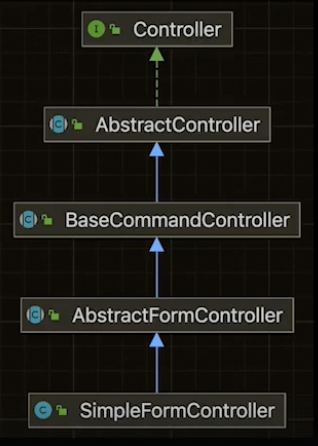

## 배경

스프링 프레임워크는 J2EE, EJB로 대규모 금융 시스템을 리드했던 개발자의 책에서 시작했다.

해당 출판사 독자 게시판에서 오픈소스로 발전했다.

## 공부

- 공식문서 정독
- 튜토리얼 에제 (Pitclinic, ...)
- 스프링 소스코드

## 목표

스프링의 목표는 POJO를 이용해서 선언적, 비침략적인 방법으로 엔터프라이즈 서비스를 개발하는 것
- Java 코드에 수정을 하지 않고 트랜잭션을 적용
- ...

이 목표를 이루기 위한 도구가 DI, IOC

## DI

컨테이너는 서버의 오브젝트 생성과 생명주기를 관리하고, 오브젝트 합성을 처리해서 IoC/DI를 달성한다.

즉, 자바의 다양한 패턴 중 아래 패턴은 상속을 이용한 것이 아니라 **오브젝트 합성**을 사용하기 때문에 DI를 사용하는 스프링을 활용할 수 있다.
- Strategy
- Adapter
- Decoratr
- Proxy
- Composite
- Facade
- Observer
- Singleton
- ...

그러면 스프링에서 이러한 패턴을 사용한 사례가 있는 지 살펴보자.

#### Template/Callback 패턴 (Strategy 패턴)

단일 메서드 인터페이스(람다식)을 아래와 같이 스프링은 잘 적용하고 있다.
- JdbcTemplate
- HibernateTemplate
- RestTemplate
- JMSTemplate
- TransactionTemplate

DispatcherServlet도 HandlerMapping, HandlerAdapter, ViewResolver, ExceptionHandler, ThemeResolver, ... 에서 전략을 구성해서 사용한다.

전략 패턴의 장점은 전략의 변경으로 기능의 확장과 기술의 발전을 이뤄낼 수 있다.

#### Proxy, Decorator

스프링 AOP는 Proxy, Decorator 패턴을 사용한다.

대표적으로 Transaction, Security가 있다.

#### TemplateMethod 패턴

플로우의 뼈대를 젝동하고 각 단계를 변경, 확장한다.

전략패턴을 각 클래스에 적용해서 필요한 부분을 바꿀 수 있게 한다.

#### 설계

스프링이 이러한 패턴을 적용하는 이유는 **변화를 위한 설계**에 있다.

이는 OCP를 만족하고 변화에 흔들리지 않는 견고한 객체지향 설계를 만드는 것이다.

우리가 작성하는 코드에도 이러한 객체지향 설계 원칙을 적용해야 한다.

## 학습 테스트

남이 만든 코드의 사용법을 익히기 위해서 테스트를 작성한다.

## 스프링과 테스트

- DI는 테스트를 위한 것이라는 오해가 있을 정도로 DI는 단위 테스트의 가능성과 편의성을 증대시킨다.
- 스프링은 다양한 테스트 작성 도구를 제공한다.

## 나만의 정의와 설명을 만들자.

공부한 내용을 자신의 언어로 한 문장으로 정의, 한 문단으로 정리를 해야 한다. 