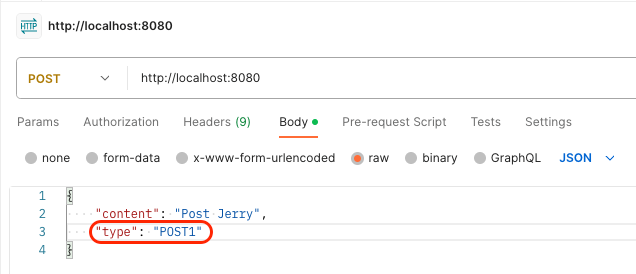

Controller에서 Type과 같이 특정 값에 대해서만 입력을 받아야 하는 경우가 있다.

이때 Enum을 사용하면 아래의 문제가 생길 수 있다.

## 각 Layer의 강결합

아래는 기존의 코드이다.

```java
@RestController
@RequiredArgsConstructor
public class AlarmController {
    private final AlarmUseCase alarmUseCase;

    @PostMapping
    @ResponseStatus(HttpStatus.NO_CONTENT)
    public void postAlarm(@RequestBody PostAlarmRequest request) {
        String content = request.getContent();
        PostType type = request.getType();
        alarmUseCase.send(content, type);
    }
}
```

여기서 문제는 Controller와 UseCase의 Model이 완전히 분리되지 않고 결합된 부분이다.
- PostType이라는 Enum 타입을 공유하고 있다.
- Controller에서 필요에 따라 PostType을 수정하면 코어한 UseCase가 영향을 받는다.

이는 아래와 같이 해결할 수 있다.

```java
@RestController
@RequiredArgsConstructor
public class AlarmController {
    private final AlarmUseCase alarmUseCase;

    @PostMapping
    @ResponseStatus(HttpStatus.NO_CONTENT)
    public void postAlarm(@RequestBody PostAlarmRequest request) {
        String content = request.getContent();
        RequestPostType commandType = request.getType();

        PostType postType = toPostType(commandType);
        alarmUseCase.send(content, postType);
    }
}
```
이제 Controller와 UseCase의 입력 Model을 분리할 수 있다.

하지만 위와 같이 Model을 분리한다고 모든 문제가 해결되지는 않는다.

#### 1. 에러 핸들링
 
만약 아래와 같이 요청을 보냈다고 가정하자.



여기서 문제는 type이 `POST`여야 하는데 `POST1`을 입력한 것이다. 이때 아래의 예외가 발생한다.
```
Resolved [org.springframework.http.converter.HttpMessageNotReadableException:
JSON parse error: Cannot deserialize value of type `com.example.demo.RequestPostType` from String "POST1"
: not one of the values accepted for Enum class: [POST]]
```

문제는 해당 Exception은 핸들링하기가 까다롭다.

아래는 해당 예외를 핸들링하는 코드이다.

```java
@ExceptionHandler(HttpMessageNotReadableException.class)
public void handleHttpMessageNotReadableException() {
    System.out.println("해당 타입이 존재하지 않습니다!");
}
```

`HttpMethodNotReadableException`은 Enum 타입이 존재하지 않는 경우 이외에도 훨씬 다양하게 발생할 수 있다. 

그래서 예외를 범용적으로 핸들링해야 한다는 단점이 있다. Open API를 개발하는 상황이라면 사용자에게 더 자세한 예외 메시지를 내려줄 수는 없는 지 고민이 필요할 것 같다.

#### 2. Client와의 강결합

그 밖에도 다른 문제가 있다.

Controller를 통해 들어오는 Enum이 수정될 경우를 생각해보자. 서버에서 먼저 배포해도 애매하고 클라이언트에서 먼저 배포해도 애매한 상황이 될 수 있다.

아래의 프로세스의 경우 일부 해결할 수는 있을 수도 있다.
- 서버에서 Enum 타입을 하나 더 생성한다.
- 클아이언트에서 Enum 타입을 교체한다.
- 서버에서 기존 Enum 타입을 제거한다.

하지만 **기존 Enum 타입의 프로세스**를 **새로 추가한 Enum 타입이 수행할 수 있게끔** 코드를 작성해야 하고, 이 부분은 어렵고 불편한 과정이다.

즉, Enum을 사용하면 유연하지 못한 API 서버가 될 가능성이 크다.

## 해결 방법

#### 1. Converter 사용

만약 핸들링이 필요한 부분이 **QueryString**이라면 `org.springframework.core.convert.converter.Converter;`를 사용할 수 있다.

아래와 같이 해당 인터페이스를 구현하는 구현체를 만든다.

```java
public class StringToEnumConverter implements Converter<String, RequestPostType> { 
    @Override 
    public RequestPostType convert(String source) {
        try {
            return RequestPostType.valueOf(source.toUpperCase());
        } catch (IllegalArgumentException e) {
            throw new CustomException(e.getMessage());
        }
    }
}
```

그리고 `WebMvcConfigurer`를 사용해서 해당 `Converter`를 등록하면 된다.

```java
@Configuration
public class WebConfig implements WebMvcConfigurer { 
    @Override 
    public void addFormatters(FormatterRegistry registry) {
        registry.addConverter(new StringToEnumConverter());
    }
}
```

이제 `Converter`에서 Custom한 Exception을 발생할 수 있다. Client와의 강결합도 여전히 존재하지만 나름 유연하게 처리가 가능해졌다.

하지만 `ReuqestBody`를 통해 들어오는 부분에서는 `Converter`를 활용할 수 없다.

#### 2. Enum보다는 String

그래서 아래와 같이 Enum 보다는 String을 활용할 수 있다.

```java
@Getter
@NoArgsConstructor(access = AccessLevel.PRIVATE)
public class PostAlarmRequest { 
    private String content;
    private String type;
}
```

Controller에서는 Enum에 대한 변환을 수행하면 된다.

```java
@PostMapping
@ResponseStatus(HttpStatus.NO_CONTENT)
public void postAlarm(@RequestBody PostAlarmRequest request) {
    String content = request.getContent();
    PostType postType = PostType.valueOf(request.getType());
    alarmUseCase.send(content, postType);
}
```

해당 값이 존재하지 않다면 Enum 타입에서 Custom한 Exception을 발생할 수 있을 것이다.

이렇게 하면 더 자세한 예외를 내려줄 수 있게 되고 클라이언트와의 강결합을 끊을 수 있다.

## 정리

나름대로 정리는 해봤지만, 이부분 같은 경우에는 String을 쓰는 것이 좋을 지 Enum을 쓰는 것이 좋을 지 나름대로 고민을 하고 있습니다.

혹시 의견이 있으시다면 댓글로 알려주시면 감사하겠습니다! 👍

## 참고

- https://medium.com/@lifecluee/string을-고집하는-controller-개선기-721cba570756

