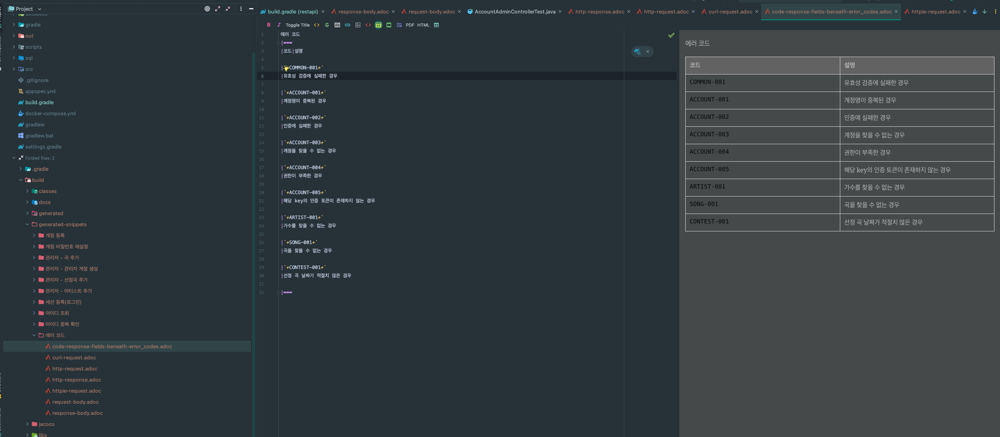
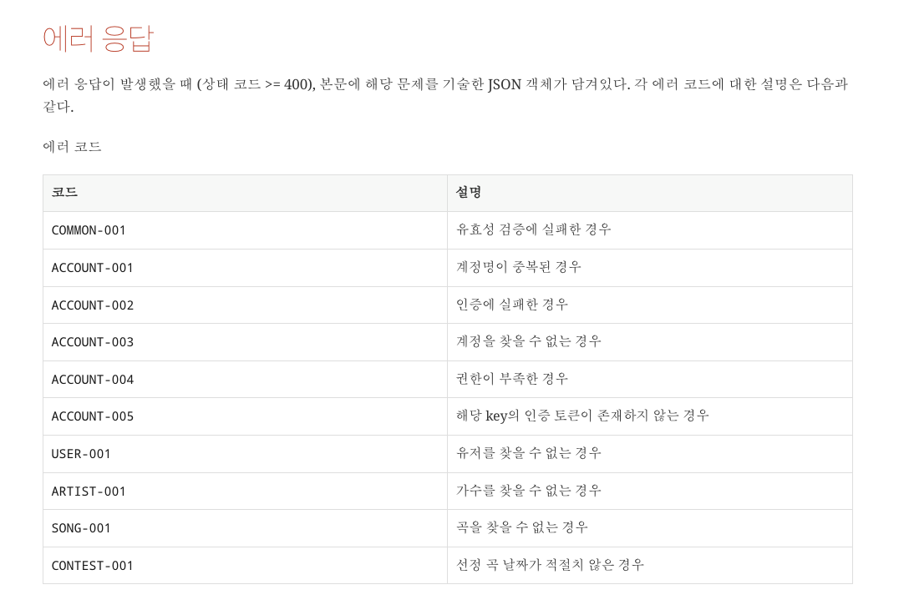

# Spring - Exception 처리 전략 적용기 (+ 에러 코드 문서화!)

요즘에 익셉션에 대한 처리에 관심이 많아져서 관련 포스팅을 썼었다.
- [REST에서 예외를 처리하는 다양한 방법!](https://jaehoney.tistory.com/239)
- [REST API에서 직접 정의한 Error code를 사용해야 하는 이유!](https://jaehoney.tistory.com/240)

이번에 공부한 내용들과 추가로 참고 자료를 활용해서 사이드 프로젝트에서 예외 처리 전략을 풀어내보았고, 결과적으로 만족스러운 결과를 얻었다.

코드를 살펴보자.

## 코드

### ErrorResponse
```java
@Getter
@AllArgsConstructor
public class ErrorResponse {

    private final String code;
    private final String message;

}
```
먼저 예외가 발생했을 때 내려줄 ErrorResponse를 정의한다.

### ErrorCode
```java
public enum ErrorCode {

    INVALID_INPUT_VALUE(400, "COMMON-001", "유효성 검증에 실패한 경우"),
    INTERNAL_SERVER_ERROR(500, "COMMON-002, "서버에서 처리할 수 없는 경우")

    DUPLICATE_LOGIN_ID(400, "ACCOUNT-001", "계정명이 중복된 경우"),
    UNAUTHORIZED(401, "ACCOUNT-002", "인증에 실패한 경우"),
    ACCOUNT_NOT_FOUND(404, "ACCOUNT-003", "계정을 찾을 수 없는 경우"),
    ROLE_NOT_EXISTS(403, "ACCOUNT-004", "권한이 부족한 경우"),
    TOKEN_NOT_EXISTS(404, "ACCOUNT-005", "해당 key의 인증 토큰이 존재하지 않는 경우"),

    ARTIST_NOT_FOUND(404, "ARTIST-001", "가수를 찾을 수 없는 경우"),

    SONG_NOT_FOUND(404, "SONG-001", "곡을 찾을 수 없는 경우"),

    CONTEST_INVALID_DATE(400, "CONTEST-001", "선정 곡 날짜가 적절치 않은 경우");

    private final int status;
    private final String code;
    private final String description;

    ErrorCode(int status, String code, String description) {
        this.status = status;
        this.code = code;
        this.description = description;
    }

    public int getStatus() {
        return status;
    }

    public String getCode() {
        return code;
    }

    public String getDescription() {
        return description;
    }
}
```
추가로 위와 같이 ErrorCode를 정의한다! 각각은 아래의 역할을 수행한다.
- status: Header로 반환할 HTTP Status Code
- code: Payload로 반환할 에러 코드
- description: 에러 코드 문서화를 위한 설명

### ControllerAdvice
```java
@ControllerAdvice
public class GlobalExceptionHandler {

    @ExceptionHandler(MethodArgumentNotValidException.class)
    public ResponseEntity<ErrorResponse> handleValidException(MethodArgumentNotValidException e) {
        ErrorCode errorCode = ErrorCode.INVALID_INPUT_VALUE;
        BindingResult bindingResult = e.getBindingResult();

        StringBuilder builder = new StringBuilder();
        for (FieldError fieldError : bindingResult.getFieldErrors()) {
            builder.append("[");
            builder.append(fieldError.getField());
            builder.append("](은)는 ");
            builder.append(fieldError.getDefaultMessage());
            builder.append(". ");
        }
        builder.deleteCharAt(builder.length() - 1);

        final ErrorResponse response = new ErrorResponse(errorCode.getCode(), builder.toString());
        return new ResponseEntity<>(response, HttpStatus.valueOf(errorCode.getStatus()));
    }

    @ExceptionHandler(BusinessException.class)
    protected ResponseEntity<ErrorResponse> handleBusinessException(BusinessException e) {
        ErrorCode errorCode = e.getErrorCode();
        ErrorResponse response = new ErrorResponse(errorCode.getCode(), e.getMessage());
        return new ResponseEntity<>(response, HttpStatus.valueOf(errorCode.getStatus()));
    }

    @ExceptionHandler(Exception.class)
        protected ResponseEntity<ErrorResponse> handleException(Exception e) {
            ErrorCode errorCode = ErrorCode.INTERNAL_SERVER_ERROR;
            ErrorResponse response = ErrorResponse.of(errorCode.getCode(), e.getMessage());
            return new ResponseEntity<>(response, HttpStatus.ValueOf(errorCode.getStatus()));
        }

}
```
그리고 GlobalExceptionHandler를 등록한다.

핸들러는 우선 2개를 적용했는데 MethodArgumentNotValidException은 SpringBoot의 `ConstraintValidator`(<mark>@Valid</mark>를 통한 검증하는 방식)를 사용했을 때 발생하는 Exception이다.

다른 하나는 BusinessException이다.

### BusinessException
```java
public class BusinessException extends RuntimeException {

    private ErrorCode errorCode;
    private String message;

    public BusinessException(ErrorCode errorCode, String message) {
        super(message);
        this.errorCode = errorCode;
    }

    public ErrorCode getErrorCode() {
        return errorCode;
    }

}
```
해당 핸들러를 통해 예외처리를 하고자 하는 익셉션이 BusinessException을 상속한다면 일관된 예외처리를 할 수 있다.

추가로 필요한 Exception은 GlobalExceptionHandler에 처리를 추가해주면 된다.
- MethodArgumentTypeMismatchException
- HttpRequestMethodNotSupportedException
- BindException
- ...

맨 마지막에 정의한 `@ExceptionHandler(Exception.class)`애노테이션이 붙은 메서드는 이외의 핸들링 메서드를 전부 타지 못했을 때 수행되면서, 예상치 못한 익셉션까지 일관된 예외 처리를 할 수 있게 한다.

이제 예외처리가 설계한 Response로 잘 동작하게 됩니다.
```JSON
HTTP/1.1 400 Bad Request
{
    "code": "ACCOUNT-001"
    "message": "Login Id(violerbeach13) is duplicated."
}
```

## 에러코드 문서화

Custom한 에러코드를 내려주는 이유는 클라이언트 측에서 디테일한 핸들링을 하기 위해서이다.

가령, 댓글을 조회하는데 404가 응답으로 내려왔다. Not Found ? 뭐가 없는 거지? **유저..? 게시글..? 댓글..?** 이런 상태를 방지하기 위함이다.

하지만, 클라이언트 측에서 서버단에서 내려올 Error Code를 다 알기 위해서는 문서가 필요하다.

그래서 RestDocs를 사용해서 Error Code를 자동으로 문서화했다.

먼저 **Test** 패키지에 ErrorCodeView, ErrorCodeController를 생성한다.

### ErrorCodeView
```java
@Getter
@AllArgsConstructor
public class ErrorCodeView {
    private Map<String, String> errorCodes;
}
```
ErrorCodeView는 Key 값으로 에러 코드, Value 값으로 Description을 담을 것이다.

### ErrorCodeController
```java
@RestController
@RequestMapping("/errors")
public class ErrorCodeController {

    @GetMapping
    public ResponseEntity<ErrorCodeView> getErrorCodes() {

        Map<String, String> errorCodes = Arrays.stream(ErrorCode.values())
                .collect(Collectors.toMap(ErrorCode::getCode, ErrorCode::getDescription));

        return new ResponseEntity<>(new ErrorCodeView(errorCodes), HttpStatus.OK);
    }

}
```
추가로 정의된 ErrorCode(enum)를 전부 내려주는 Controller를 작성한다.

앞에서도 언급했듯, 해당 컨트롤러와 ErrorCodeView는 테스트 패키지에서만 존재한다. (RestDocs를 활용한 문서화를 위한 코드이고, 프로덕트 코드에 영향이 없기 때문)

### CustomSnippet
```java
public class CodeResponseFieldsSnippet extends AbstractFieldsSnippet {

    public CodeResponseFieldsSnippet(String type, PayloadSubsectionExtractor<?> subsectionExtractor,
                                     List<FieldDescriptor> descriptors, Map<String, Object> attributes,
                                     boolean ignoreUndocumentedFields) {
        super(type, descriptors, attributes, ignoreUndocumentedFields, subsectionExtractor);
    }

    @Override
    protected MediaType getContentType(Operation operation) {
        return operation.getResponse().getHeaders().getContentType();
    }

    @Override
    protected byte[] getContent(Operation operation) {
        return operation.getResponse().getContent();
    }
}
```
추가로 아래와 같이 Custom한 Snippet을 작성한다. (일반 RestDocs Output format과 달라서)

### code-response-fields.snippet
```adoc
{{title}}
|===
|코드|설명

{{#fields}}
|{{#tableCellContent}}`+{{path}}+`{{/tableCellContent}}
|{{#tableCellContent}}{{description}}{{/tableCellContent}}

{{/fields}}
|===
```

해당 코드를 아래 패키지에 넣으면 custom한 snippet을 추가할 수 있다.
- test/resources/org/springframwork/restdocs/templates

### ErrorCodeDocumentationTest
```java
public class ErrorCodeDocumentationTest extends BaseControllerTest {

    @Test
    @DisplayName("ErrorCode 문서화")
    public void errorCodeDocumentation() throws Exception {
        // given + when
        ResultActions result = this.mockMvc.perform(get("/errors")
                .session(memberSession)
                .accept(MediaType.APPLICATION_JSON));

        // then
        result.andExpect(status().isOk());

        // docs
        result.andDo(document("에러 코드",
                codeResponseFields("code-response", beneathPath("error_codes"),
                        attributes(key("title").value("에러 코드")),
                        enumConvertFieldDescriptor(ErrorCode.values())
                )
        ));
    }

    private FieldDescriptor[] enumConvertFieldDescriptor(ErrorCode[] errorCodes) {
        return Arrays.stream(errorCodes)
                .map(enumType -> fieldWithPath(enumType.getCode()).description(enumType.getDescription()))
                .toArray(FieldDescriptor[]::new);
    }

    public static CodeResponseFieldsSnippet codeResponseFields(String type,
                                                               PayloadSubsectionExtractor<?> subsectionExtractor,
                                                               Map<String, Object> attributes, FieldDescriptor... descriptors) {
        return new CodeResponseFieldsSnippet(type, subsectionExtractor, Arrays.asList(descriptors), attributes
                , true);
    }

}
```

### 결과

아래와 같은 문서를 확인할 수 있다.



해당 doc은 아래와 같이 출력할 수 있었다.



## 마무리

예외 처리 로직이 깔끔해졌다.

예외 처리가 필요한 상황에는 BusinessException 또는 그 하위 요소를 상속한 Exception을 정의해서 터트려주면 GlobalExceptionHandler가 Spec에 맞게 처리해준다.

추가로 ErrorCode가 추가될 때마다 자동으로 문서에 반영되게 하여, 앞으로의 수고로움을 덜을 수 있을 것 같다.

작성한 코드는 아래에서 확인할 수 있다.
> https://github.com/violetbeach/verby-rest-api

문서화한 결과는 아래와 같다.
> https://api.verby.co.kr/docs/api-docs.html

끝

## 참고
- https://cheese10yun.github.io/spring-guide-exception/
- https://techblog.woowahan.com/2597/