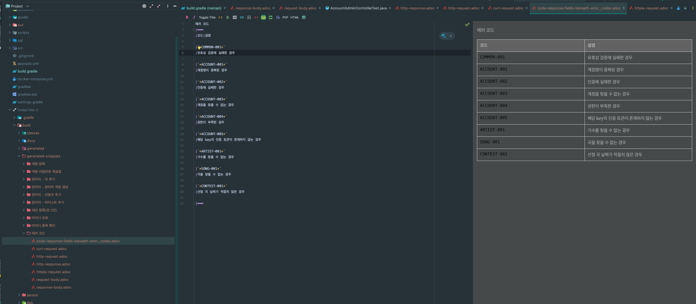
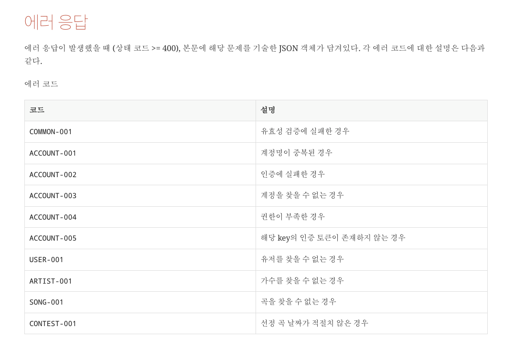

최근 Exception에 대한 처리에 관심이 많아져서 관련 포스팅을 썼었다.
- [REST에서 예외를 처리하는 다양한 방법!](https://jaehoney.tistory.com/239)
- [REST API에서 직접 정의한 Error code를 사용해야 하는 이유!](https://jaehoney.tistory.com/240)

이번에 공부한 내용들과 추가로 참고 자료를 활용해서 사이드 프로젝트에서 예외 처리 전략을 풀어내보았고, 만족스러운 결과를 얻었다.

코드를 살펴보자.

## 코드

### ErrorResponse

먼저 예외가 발생했을 때 Client 측에 내려줄 ErrorResponse를 정의한다.

```java
@Getter
@AllArgsConstructor
public class ErrorResponse {
    private final String code;
    private final String message;
}
```

### ErrorCode

추가로 위와 같이 ErrorCode를 정의한다.

```java
public enum ErrorCode {

    INVALID_INPUT_VALUE(400, "COMMON-001", "유효성 검증에 실패한 경우"),
    INTERNAL_SERVER_ERROR(500, "COMMON-002", "서버에서 처리할 수 없는 경우"),

    DUPLICATE_LOGIN_ID(400, "ACCOUNT-001", "계정명이 중복된 경우"),
    UNAUTHORIZED(401, "ACCOUNT-002", "인증에 실패한 경우"),
    ACCOUNT_NOT_FOUND(404, "ACCOUNT-003", "계정을 찾을 수 없는 경우"),
    ROLE_NOT_EXISTS(403, "ACCOUNT-004", "권한이 부족한 경우"),
    TOKEN_NOT_EXISTS(404, "ACCOUNT-005", "해당 key의 인증 토큰이 존재하지 않는 경우"),

    ARTIST_NOT_FOUND(404, "ARTIST-001", "가수를 찾을 수 없는 경우"),

    SONG_NOT_FOUND(404, "SONG-001", "곡을 찾을 수 없는 경우"),

    CONTEST_INVALID_DATE(400, "CONTEST-001", "선정 곡 날짜가 적절치 않은 경우");

    private final int status;
    private final String code;
    private final String description;

    ErrorCode(int status, String code, String description) {
        this.status = status;
        this.code = code;
        this.description = description;
    }

    public int getStatus() {
        return status;
    }

    public String getCode() {
        return code;
    }

    public String getDescription() {
        return description;
    }
}
```

각 필드는 아래의 역할을 수행한다.
- status: Header로 반환할 HTTP Status Code
- code: Payload로 반환할 에러 코드
- description: 에러 코드 문서화를 위한 설명

#### Custom code가 필요한 이유

Custom한 에러코드(`code` 필드)를 내려주는 이유는 클라이언트 측에서 디테일한 핸들링을 하기 위해서다.

댓글을 조회하는데 404가 응답으로 내려왔다. `Not Found`인데 **유저, 게시글, 댓글 등 뭐가 없는 지 알 수 없다.**

그래서 **커스텀 코드**가 필요한 것이다.

### ControllerAdvice

아래의 GlobalExceptionHandler를 등록한다.

```java
@ControllerAdvice
public class GlobalExceptionHandler {

    @ExceptionHandler(MethodArgumentNotValidException.class)
    public ResponseEntity<ErrorResponse> handleValidException(MethodArgumentNotValidException e) {
        ErrorCode errorCode = ErrorCode.INVALID_INPUT_VALUE;
        BindingResult bindingResult = e.getBindingResult();

        StringBuilder builder = new StringBuilder();
        for (FieldError fieldError : bindingResult.getFieldErrors()) {
            builder.append("[");
            builder.append(fieldError.getField());
            builder.append("](은)는 ");
            builder.append(fieldError.getDefaultMessage());
            builder.append(". ");
        }
        builder.deleteCharAt(builder.length() - 1);

        final ErrorResponse response = new ErrorResponse(errorCode.getCode(), builder.toString());
        return new ResponseEntity<>(response, HttpStatus.valueOf(errorCode.getStatus()));
    }

    @ExceptionHandler(BusinessException.class)
    protected ResponseEntity<ErrorResponse> handleBusinessException(BusinessException e) {
        ErrorCode errorCode = e.getErrorCode();
        ErrorResponse response = new ErrorResponse(errorCode.getCode(), e.getMessage());
        return new ResponseEntity<>(response, HttpStatus.valueOf(errorCode.getStatus()));
    }

    @ExceptionHandler(Exception.class)
        protected ResponseEntity<ErrorResponse> handleException(Exception e) {
            ErrorCode errorCode = ErrorCode.INTERNAL_SERVER_ERROR;
            ErrorResponse response = ErrorResponse.of(errorCode.getCode(), e.getMessage());
            return new ResponseEntity<>(response, HttpStatus.ValueOf(errorCode.getStatus()));
        }

}
```

참고로 `MethodArgumentNotValidException`은 SpringBoot의 `validation` 라이브러리의 `@Valid`를 사용헀을 때 검증이 실패하면 발생하는 Exception이다.

### BusinessException
```java
public class BusinessException extends RuntimeException {

    private ErrorCode errorCode;
    private String message;

    public BusinessException(ErrorCode errorCode, String message) {
        super(message);
        this.errorCode = errorCode;
    }

    public ErrorCode getErrorCode() {
        return errorCode;
    }

}
```
해당 핸들러를 통해 예외처리를 하고자 하는 익셉션이 `BusinessException`을 상속한다면 일관된 예외처리를 할 수 있다.

추가로 필요한 Exception은 GlobalExceptionHandler에 처리를 추가해주면 된다.
- MethodArgumentTypeMismatchException
- HttpRequestMethodNotSupportedException
- BindException
- ...

마지막에 정의한 `@ExceptionHandler(Exception.class)`애노테이션이 붙은 메서드는 다른 핸들링 메서드를 전부 타지 못했을 때 핸들링하는 역할을 한다. 즉, 예상치 못한 익셉션까지 일관된 예외 처리를 할 수 있게 된다.

이제 에외를 터트려보면 설계한 Response로 잘 동작하게 된다.

```http
HTTP/1.1 400 Bad Request
{
    "code": "ACCOUNT-001"
    "message": "Login Id(violerbeach13) is duplicated."
}
```

## 에러코드 문서화

클라이언트 측에서 서버에서 내려오는 Custom한 ErrorCode를 알기 위해서는 문서가 필요하다.

그래서 RestDocs를 사용해서 Error Code를 자동으로 문서화했다.

테스크 코드에 ErrorCodeView, ErrorCodeController를 생성한다.

### ErrorCodeView

```java
@Getter
@AllArgsConstructor
public class ErrorCodeView {
    private Map<String, String> errorCodes;
}
```

ErrorCodeView는 Key 값으로 에러 코드, Value 값으로 Description을 담을 것이다.

### ErrorCodeController

ErrorCode(enum)를 전부 내려주는 Controller를 작성한다.

```java
@RestController
@RequestMapping("/errors")
public class ErrorCodeController {

    @GetMapping
    public ResponseEntity<ErrorCodeView> getErrorCodes() {

        Map<String, String> errorCodes = Arrays.stream(ErrorCode.values())
                .collect(Collectors.toMap(ErrorCode::getCode, ErrorCode::getDescription));

        return new ResponseEntity<>(new ErrorCodeView(errorCodes), HttpStatus.OK);
    }

}
```

해당 컨트롤러와 ErrorCodeView는 테스트 코드에서만 존재한다.
- (RestDocs를 활용한 문서화를 위한 코드이고, 프로덕트 코드에 영향을 주면 안되기 때문)

### CustomSnippet

ErrorCode를 문서화할 format은 일반적인 RestDocs에서 지원하는 format이 다르다.

그래서 Custom한 `Snippet`을 정의해야 한다.

```java
public class CodeResponseFieldsSnippet extends AbstractFieldsSnippet {

    public CodeResponseFieldsSnippet(String type, PayloadSubsectionExtractor<?> subsectionExtractor,
                                     List<FieldDescriptor> descriptors, Map<String, Object> attributes,
                                     boolean ignoreUndocumentedFields) {
        super(type, descriptors, attributes, ignoreUndocumentedFields, subsectionExtractor);
    }

    @Override
    protected MediaType getContentType(Operation operation) {
        return operation.getResponse().getHeaders().getContentType();
    }

    @Override
    protected byte[] getContent(Operation operation) {
        return operation.getResponse().getContent();
    }
}
```
이제 Custom한 Snippet을 작성한다. (일반 RestDocs Output format과 달라서)

### code-response-fields.snippet
```adoc
{{title}}
|===
|코드|설명

{{#fields}}
|{{#tableCellContent}}`+{{path}}+`{{/tableCellContent}}
|{{#tableCellContent}}{{description}}{{/tableCellContent}}

{{/fields}}
|===
```

해당 파일을 아래 폴더에 넣으면 custom한 snippet을 추가할 수 있다.
- test/resources/org/springframwork/restdocs/templates

### ErrorCodeDocumentationTest

마지막으로 작성한 Controller의 response를 Custom한 Snippet으로 문서화한다.

```java
public class ErrorCodeDocumentationTest extends BaseControllerTest {
    @Test
    @DisplayName("ErrorCode 문서화")
    public void errorCodeDocumentation() throws Exception {
        // given + when
        ResultActions result = this.mockMvc.perform(get("/errors")
                .session(memberSession)
                .accept(MediaType.APPLICATION_JSON));

        // then
        result.andExpect(status().isOk());

        // docs
        result.andDo(document("에러 코드",
                codeResponseFields("code-response", beneathPath("error_codes"),
                        attributes(key("title").value("에러 코드")),
                        enumConvertFieldDescriptor(ErrorCode.values())
                )
        ));
    }

    private FieldDescriptor[] enumConvertFieldDescriptor(ErrorCode[] errorCodes) {
        return Arrays.stream(errorCodes)
                .map(enumType -> fieldWithPath(enumType.getCode()).description(enumType.getDescription()))
                .toArray(FieldDescriptor[]::new);
    }

    public static CodeResponseFieldsSnippet codeResponseFields(String type,
                                                               PayloadSubsectionExtractor<?> subsectionExtractor,
                                                               Map<String, Object> attributes, FieldDescriptor... descriptors) {
        return new CodeResponseFieldsSnippet(type, subsectionExtractor, Arrays.asList(descriptors), attributes
                , true);
    }
}
```

이제 결과를 보자.

### 결과

아래와 같은 문서를 확인할 수 있다.



해당 `.adoc` 파일으로 `asciidoctor`를 통해 아래와 같은 `html`을 출력할 수 있었다.



## 추가 - 의존 역류 문제

사내에서 해당 게시글을 참고해서 프로젝트를 구성하는 사람이 많아져서 해당 내용을 추가하게 되었다. **(최신화)**

다시 에러 코드를 보자.

```java
public enum ErrorCode {

    INVALID_INPUT_VALUE(400, "COMMON-001", "유효성 검증에 실패한 경우"),
    INTERNAL_SERVER_ERROR(500, "COMMON-002", "서버에서 처리할 수 없는 경우"),

    DUPLICATE_LOGIN_ID(400, "ACCOUNT-001", "계정명이 중복된 경우"),
    UNAUTHORIZED(401, "ACCOUNT-002", "인증에 실패한 경우"),
    ACCOUNT_NOT_FOUND(404, "ACCOUNT-003", "계정을 찾을 수 없는 경우"),
    ROLE_NOT_EXISTS(403, "ACCOUNT-004", "권한이 부족한 경우"),
    TOKEN_NOT_EXISTS(404, "ACCOUNT-005", "해당 key의 인증 토큰이 존재하지 않는 경우"),

    ARTIST_NOT_FOUND(404, "ARTIST-001", "가수를 찾을 수 없는 경우"),

    SONG_NOT_FOUND(404, "SONG-001", "곡을 찾을 수 없는 경우"),

    CONTEST_INVALID_DATE(400, "CONTEST-001", "선정 곡 날짜가 적절치 않은 경우");

    private final int status;
    private final String code;
    private final String description;

    ErrorCode(int status, String code, String description) {
        this.status = status;
        this.code = code;
        this.description = description;
    }

    public int getStatus() {
        return status;
    }

    public String getCode() {
        return code;
    }

    public String getDescription() {
        return description;
    }
}
```

여기서 ErrorCode가 `HttpStatusCode`를 의존하고 있다.
- 실제 `HttpStatus` 객체는 아니지만, `int`로 **코드**를 가지고 있으므로 **논리적인 의존**이 존재한다.

즉, `Domain`이 `Web`에 역으로 의존하는 형태가 된다.
- 예를 들어 스케줄링을 하는 프로젝트에서는 `HttpStatus`는 필요 없다. 그럼에도 `HttpStatusCode`가 내재된 `ErrorCode`를 알아야 하는 문제가 생긴다. 

더 큰 문제는 `Web`을 변경하면 `Domain`에 까지 변경이 전파된다는 점이다. 
- 특정 에러 코드를 400에서 404로 바꿨을 때, `ErrorCode`가 변경되어야 하고 `Domain`까지 전파되는 문제가 있다.
- 즉, 가장 안정적이어야 하는 도메인이 변경에 취약한 상태가 된다.

#### 해결

그래서 최근에는 아래와 같이 `BusinessException`을 상속해서 계층화를 한 후, `ExceptionHandler`가 각 `Exception`에 따라 `Http Status Code`를 부여하는 방식으로 개발하고 있다. 

```java
@ControllerAdvice
public class GlobalExceptionHandler {

    /**
     *  javax.validation.Valid or @Validated 으로 binding error 발생시 발생한다.
     *  HttpMessageConverter 에서 등록한 HttpMessageConverter binding 못할경우 발생
     *  주로 @RequestBody, @RequestPart 어노테이션에서 발생
     */
    @ExceptionHandler(MethodArgumentNotValidException.class)
    public ResponseEntity<ErrorResponse> handleValidException(MethodArgumentNotValidException e) {
        ErrorCode errorCode = ErrorCode.INVALID_INPUT_VALUE;
        BindingResult bindingResult = e.getBindingResult();

        StringBuilder builder = new StringBuilder();
        for (FieldError fieldError : bindingResult.getFieldErrors()) {
            builder.append("[");
            builder.append(fieldError.getField());
            builder.append("](은)는 ");
            builder.append(fieldError.getDefaultMessage());
            builder.append(". ");
        }
        builder.deleteCharAt(builder.length() - 1);

        final ErrorResponse response = ErrorResponse.of(errorCode, builder.toString());
        return new ResponseEntity<>(response, HttpStatus.BAD_REQUEST);
    }
    
    @ExceptionHandler(HttpRequestMethodNotSupportedException.class)
    protected ResponseEntity<ErrorResponse> handleHttpRequestMethodNotSupportedException(HttpRequestMethodNotSupportedException e) {
        final ErrorResponse response = ErrorResponse.of(ErrorCode.METHOD_NOT_ALLOWED, e.getMessage());
        return new ResponseEntity<>(response, HttpStatus.METHOD_NOT_ALLOWED);
    }

    @ExceptionHandler(ResourceNotFoundException.class)
    protected ResponseEntity<ErrorResponse> handleResourceNotFoundException(final ResourceNotFoundException e) {
        final ErrorCode errorCode = e.getErrorCode();
        final ErrorResponse response = ErrorResponse.of(errorCode, e.getMessage());
        return new ResponseEntity<>(response, HttpStatus.NOT_FOUND);
    }

    @ExceptionHandler(BadRequestException.class)
    protected ResponseEntity<ErrorResponse> handleBadRequestException(final BadRequestException e) {
        final ErrorCode errorCode = e.getErrorCode();
        final ErrorResponse response = ErrorResponse.of(errorCode, e.getMessage());
        return new ResponseEntity<>(response, HttpStatus.BAD_REQUEST);
    }

    @ExceptionHandler(ServerProcessException.class)
    protected ResponseEntity<ErrorResponse> handleServerProcessException(final ServerProcessException e) {
        final ErrorCode errorCode = e.getErrorCode();
        final ErrorResponse response = ErrorResponse.of(errorCode, e.getMessage());
        return new ResponseEntity<>(response, HttpStatus.INTERNAL_SERVER_ERROR);
    }

    @ExceptionHandler(BusinessException.class)
    protected ResponseEntity<ErrorResponse> handleBusinessException(final BusinessException e) {
        log.error("undefined business exception", e);
        final ErrorCode errorCode = e.getErrorCode();
        final ErrorResponse response = ErrorResponse.of(errorCode, e.getMessage());
        return new ResponseEntity<>(response, HttpStatus.BAD_REQUEST);
    }

    @ExceptionHandler(Exception.class)
    protected ResponseEntity<ErrorResponse> handleException(Exception e) {
        log.error("handle not business exception", e);
        final ErrorResponse response = ErrorResponse.of(ErrorCode.INTERNAL_SERVER_ERROR);
        return new ResponseEntity<>(response, HttpStatus.INTERNAL_SERVER_ERROR);
    }
}
```

이렇게 하면 **Web 계층의 변경이 도메인 로직으로 전파되지 않을 수** 있고, **도메인 계층에서 Web 계층으로의 의존이 사라진다.**


## 정리

예외 처리 로직이 깔끔해졌다.

예외 처리가 필요한 상황에 BusinessException 또는 BusinessException을 상속한 Exception을 정의해서 던지면 GlobalExceptionHandler가 Error Spec에 맞게 Client 측에 내려준다.

자동화 관점에서도 ErrorCode가 추가될 때마다 자동으로 문서에 반영되기 때문에 앞으로 수고로움을 덜 수 있을 것 같다.

작성한 코드는 아래에서 확인할 수 있다.
- https://github.com/violetbeach/verby-rest-api

문서화한 결과는 **아래 링크**에서 확인할 수 있다.
- https://api.verby.co.kr/docs/api-docs.html

## 참고
- https://cheese10yun.github.io/spring-guide-exception/
- https://techblog.woowahan.com/2597/