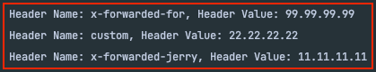

아래는 실무 중에 만난 이슈와 해결 과정에 대해 다룬다.

**정확한 원인**과 **해결 방법**보다는 **풀어나간 과정**에 집중되어 있다.
- 원인과 해결 방안이 궁금한 분은 가장 아래로 내리시면 될 것 같습니다!

## 헤더에 X-Forwarded-For이 안들어오는 문제 발견

아래는 공통 라이브러리의 코드의 일부 코드를 요약한 것이다.

```java
public class HeaderUtil {
    
    static public HeaderInfo initHeaderInfo(HttpServletRequest request){
        return HeaderInfo.builder()
                .token(request.getHeader(HeaderInfo.JWT_HEADER))
                .clientIp(request.getHeader("X-Forwarded-For"))
                .referer(request.getHeader("Referer"))
                .build();
    }
}
```

Filter에서 HeaderInfo에 있는 `clientIp` 정보를 `UserDetails`의 구현체에 넣어서 사용한다.

```java
public class SecurityUser implements UserDetails {
    // ...
    private String clientIp;
}
```

그래서 해당 유저 정보에서 `clientIp`를 꺼내서 저장하는데 아래와 같이 null이라고 나온다. 로컬, 실서버 모두 null으로 나왔다.


그래서 `clientIp`를 사용하던 기존의 소스를 실서버에서 디버깅해봤는데, 전부 Null 또는 Empty로 처리되어 저장되고있었다!

## 물어보기

동료에게 이슈를 알린 후 여쭤봤는데, 왜 안되는 지는 모르지만 다른 헤더 값을 뒤져서 Ip를 추출하고 있었다고 한다.

그래서 **'다른 사람들이 불편을 겪기 전에 내가 해결하자!'** 라고 생각을 하게 되었다.

서버에 다른 헤더가 들어오고 있어서 그거에 맞게 헤더만 수정하면 해결은 되었지만, 확인해본 결과 `X-Forwarded-For`를 사용해야 한다고 한다.

## 원인 지점 파악

아래의 필터를 디버깅 용도로 추가했다.

```java
public class HeaderLoggingFilter implements Filter {
    @Override
    public void doFilter(ServletRequest request, ServletResponse response, FilterChain chain) throws IOException, ServletException {
        HttpServletRequest req = (HttpServletRequest) request;
        Enumeration<String> headerNames = req.getHeaderNames();
        while(headerNames.hasMoreElements()) {
            String headerName = headerNames.nextElement();
            String headerValue = req.getHeader(headerName);
            System.out.println("Header Name: " + headerName + ", Header Value: " + headerValue);
        }
        chain.doFilter(request, response);
    }
}
```

로깅 지점을 정리하면 아래와 같다.


즉, 문제 원인 후보를 두 가지로 나눌 수 있었다.

#### 1. 컨테이너 설정이 문제인 경우

만약 컨테이너 설정이 다른 경우 원인이 될 수도 있어 보였다.

그렇지만 Node와 PHP로 작성된 코드의 경우는 `X-Forwarded-For`이 잘 들어왔다.

해당 프로젝트들도 CI/CD가 Java 기반 서버와 거의 동일해서 실마리를 찾지 못했다.

리버스 프록시도 동일한 서버를 사용하고 있었다.

#### 2. ServletContainer가 문제인 경우

내가 Logging한 지점은 Servlet(Filter)이다.

ServletContainer(Tomcat)이 헤더에 관여한다면 `X-Forwarded-For`이 없는 것도 고려할 수 있는 것 같았다.

그렇지만 `Tomcat`이 헤더에 관여할 이유가 없다고 생각했다!

## 지옥의 디버깅

1번의 경우 문제가 될 수 잇는 지점들을 하나씩 증명하면서 제거해갔는데 해결이 안되었다.
- 서블릿 컨테이너로 들어오기 전 HTTP 원문을 까보기 어려움
- 리버스 프록시에서 헤더가 정말 나온 것이 맞는 지 의심이 커져감
  - 엔지니어 분께 보여달라고 요청 드려봤으나 다른 프로젝트(Node, PHP)도 설정이 동일한데 잘 나온다고만 말씀해주셨다. (확인이 어려우신가 보다..)

그래서 2번인 ServletContainer(Tomcat)을 의심해봤는데 로컬에서는 헤더가 잘 나온다.

그래서 **2번은 절대 아닐 것 같다고 생각**했고, 실제로 적용할 수 있는 거의 모든 옵션을 적용해봤는데 해결이 안되었다.
- `server.use-forward-headers: true/false`
- `server.forward-headers-strategy: FRAMEWORK/NATIVE`

그래서 이것저것 삽질 중 **정말 중요한 단서**를 하나 찾았다!

#### Local에서는 잘 되는데, k8s에서는 안되는 현상

아래의 `curl`을 통해 로컬에서 띄운 서버(`localhost`)로 요청을 보냈다.

```java
curl --location --request PATCH 'http://localhost:8080/product/123456' \
--header 'X-Forwarded-For: 99.99.99.99' \
--header 'Custom: 22.22.22.22' \
--header 'X-Forwarded-Jerry: 11.11.11.11' \
--header 'Content-Type: application/json' \
--data '{
  "memo": "Test Memo",
}'
```

그 결과 `X-Forwarded-For` 헤더까지 잘 나왔다.



그런데 **Container**에서는 달랐다.

개발 서버에서 `localhost`로 동일한 curl을 날리니까


`X-Forwarded-For`만 **사라진 것**을 확인할 수 있었다!

#### 원인이 될만한 지점 파악

두 환경 모두 동일한 소스코드 였기에 아래의 것들을 의심했다.
- jar 실행 스크립트
- jdk 파일
- 컨테이너 설정

세 가지 모두 확인해봤으나, 범인이 아니었고 쟤네가 Request Header에 관여를 할 것 같다는 생각도 전혀 안들었다.

그래서 **Tomcat** 관련 설정을 모두 디버깅해보다가 결국 원인을 찾을 수 있었다.

## server.tomcat.remoteIp.remoteIpHeader

아래는 `server.tomcat.remoteIp.remoteIpHeader` 프로퍼티에 대한 설명인데 `X-Forwarded-For` 헤더에 대한 내용이 나왔다.


> 직역하면 다음과 같다. 원격 IP를 추출할 HTTP 헤더의 이름입니다. 예를 들어 'X-FORWARDED-FOR'입니다.

<br>

조금 더 살펴보니 `TomcatWebServerFactoryCustomizer`는 해당 프로퍼티가 존재한다면 `RemoteIpValue`에 세팅하고 있었다.


`RemoteIpValve`의 `remoteIpHeader` 필드의 기본 값이 `X-Forwarded-For` 이었다.


해당 클래스의 **공식 문서**를 들어가서 해당 필드에 대한 설명을 봤다.
- https://tomcat.apache.org/tomcat-8.5-doc/api/org/apache/catalina/valves/RemoteIpValve.html

해당 필드에 대한 기본값은 `X-Forwarded-For`이고


`Valve`를 거치기 전에는 Header에 값이 있다가, **Valve를 거친 후에는 Header의 값을 삭제**한다고 한다!!! 헤더 값은 **request.remoteAddr에 저장한다.**


실제로 Deque에 처리할 Remote IP 헤더가 존재하지 않을 경우 `remoteHeader()`를 통해 삭제하고 있었다! 


즉, 원인은 **Servlet Container**가 맞았다!

## 로컬에서는 잘 되던 이유

`TomcatWebServerFactoryCustomizer`는 `customizeRemoteIpValue`의 로직을 아래 조건이 통과하지 않으면 실행하지 않는다.


`getOrDeduceUseForwardHeaders()`는 아래와 같이 `CloudPlatform`이 실행중이면 무조건 true를 반환한다. (`platform.isUsingForwardedHeaders()`는 무조건 true를 반환한다.)

`CloudPlatform`은 클라우드 여부에 대한 감지를 위한 Enum 이다.


로컬에서는 클라우드 플랫폼이 아니므로 `false`가 되어서 `Valve`가 동작하지 않았던 것이다.

## 해결

결국 내가 예상은 했지만 아닐 것이라고 믿었던 **ServletContainer(Tomcat)**가 문제였고, 거기서 헤더를 지우는 것이 맞았다.

해결은 코드의 `request.getHeader("X-Forwarded-For")`를 `request.getRemoteAddr()`로 교체해서 간단하게 해결할 수 있었다.

```java
public class HeaderUtil {

    static public HeaderInfo initHeaderInfo(HttpServletRequest request){
        return HeaderInfo.builder()
                .token(request.getHeader(HeaderInfo.JWT_HEADER))
                .clientIp(request.getRemoteAddr())
                .referer(request.getHeader("Referer"))
                .build();
    }
}
```

**적용 후 clientIp가 잘 찍히는 것을 확인**할 수 있었다.

만약 `X-Forwarded-For` 헤더가 없을 경우 아래의 로직을 타게 된다.


해당 부분은 `SocketWrapper`에서 **출발지 IP**를 가지고 온다. 실제로 서버에서 `X-Forwarded-For`가 없을 때 GateWay 서버의 IP가 찍히는 것을 확인했다.

## 참고
- https://tomcat.apache.org/tomcat-8.5-doc/api/org/apache/catalina/valves/RemoteIpValve.html
- https://github.com/spring-projects/spring-framework/tree/main/spring-web
- https://github.com/apache/tomcat


