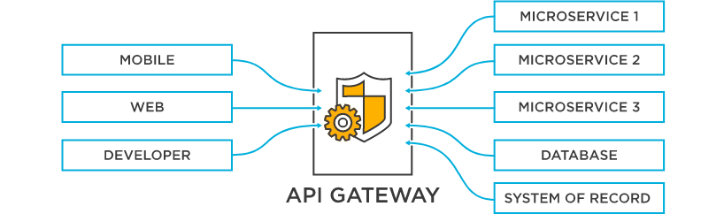
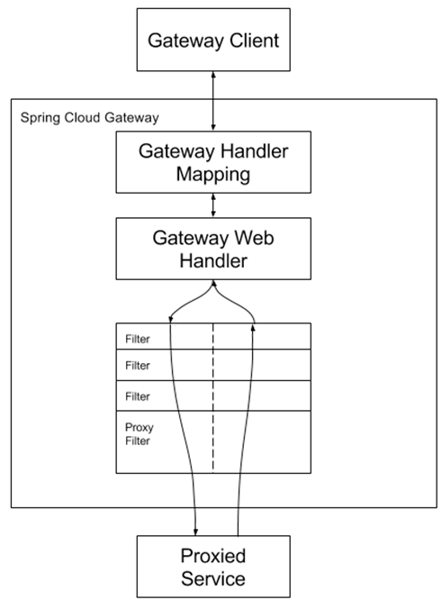
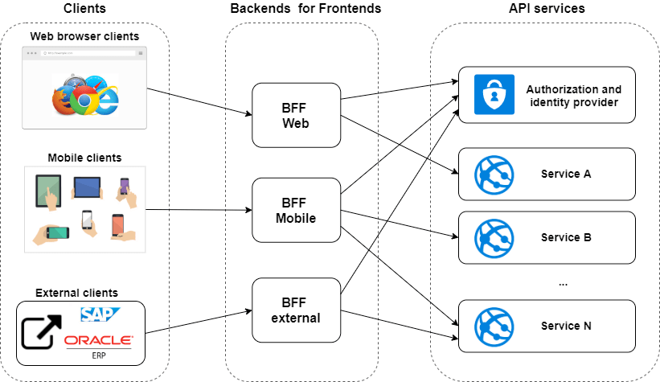

## API Gateway 가볍게 이해하기!

현재 고객 서비스를 위해 도메인 별로 시스템을 만들어서 MSA 환경을 구축하고 있다.

각 클라이언가 직접 마이크로 서비스를 호출하는 것에는 문제점이 있다.
- 클라이언트와 마이크로 서비스 간의 **강한 결합**
- 개별 마이크로 서비스에 대해 **많은 통신**이 필요하다.
- 엣지 기능을 각각의 마이크로 서비스가 직접 구현해야 한다.
  - 보안 및 권한 처리
  - 장애 처리
  - 로깅, 모니터링
  - 요청 개수 제한
  - 캐싱
  - ...

API Gateway 패턴을 사용하면 단일 접점을 활용해서 각각의 마이크로 서비스의 내부에 대해 알 필요가 없다.
- 즉, API 내부 동작에 대한 캡슐화가 이뤄지고 강한 결합이 끊어진다.

그리고 API Gateway가 공통된 기능을 제공하게 되어 각 마이크로 서비스의 책임이 가벼워진다.
- 단일 진입점을 제공
- 각 엣지 기능을 한 곳에서 제공
  - 보안, 권한 제어, 로깅, 모니터링, 캐싱, 부하 분산, 회로 차단 등
- 분산된 마이크로 서비스를 관리

반면 단점은 아래와 같다.
- 단일 장애 포인트가 될 수 있다.
  - 추가적인 고가용성 장비의 유지보수 및 관리의 대상이 된다.
- 추가 네트워크 호출이 필요하다.

## Spring cloud gateway

AWS, Microsoft Azure, Google Cloud 등 클라우드 업체에서 제공하는 API Gateway도 있고, 오픈 소스 기반의 API Gateway도 있다.

스프링 계열에서는 Spring Cloud Gateway를 제공한다.

아래는 Spring Cloud Gateway가 지원하는 기능 목록이다.
- Request 속성 기반의 매칭을 통한 라우팅
- 경로에 따라 Predicate, Filter를 쉽게 제공 수 있도록 인터페이스 제공
- 요청과 응답 변경 가능
- 서킷 브레이커 통합 제공
- 요청 제한
- ...

이처럼 Spring Cloud GateWay는 API Gateway 구성에 필요한 대부분의 기능을 제공한다.

- Gateway Handler - 요청과 경로에 대한 매칭 처리
- Gateway Web Handler
  - Before 필터
  - After 필터
- Route
  - 고유한 ID, 목적지 URI, Predicate, Filter로 구성
  - 조건에 만족하면 설정된 경로로 라우팅
- Predicate
  - 요청이 조건에 충족하는 지 테스트
- Filter
  - 요청과 응답을 중간에 변경할 수 있다.

동작 방식은 아래와 같다.

## BFF(Backend For Frontend) 패턴

앞서 설명했듯 단일 API 게이트 웨이는 아래의 문제가 있다.
- 단일 장애 포인트가 될 수 있음
- 트래픽이 병목될 수 있고, 과도한 책임이 생길 수 있다.

그래서 BFF 패턴(Backend For Frontend)을 활용할 수 있다.

API 게이트 웨이를 클라이언트에 맞춰서 전용 API 게이트 웨이를 제공하면 아래의 장점이 있다.
- 확장, 변경, 배포가 용이하다.
- 부하 분산
- 신뢰성 향상
- SPoF 제거

## 참고

- https://cloud.spring.io/spring-cloud-static/spring-cloud-gateway/2.1.0.RELEASE/single/spring-cloud-gateway.html
- https://dev.to/damikun/web-app-security-understanding-the-meaning-of-the-bff-pattern-i85