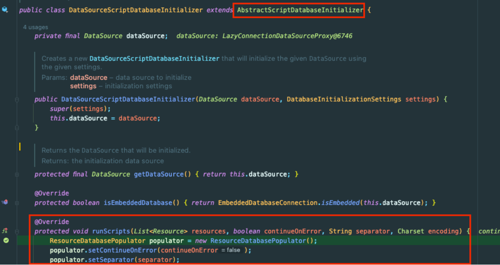
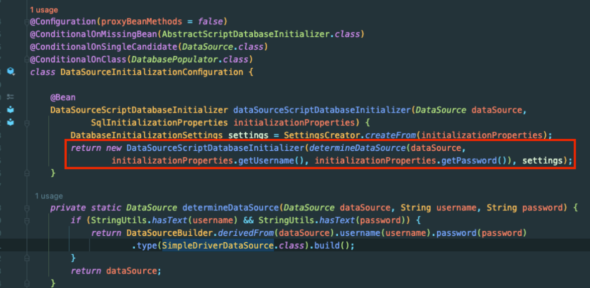
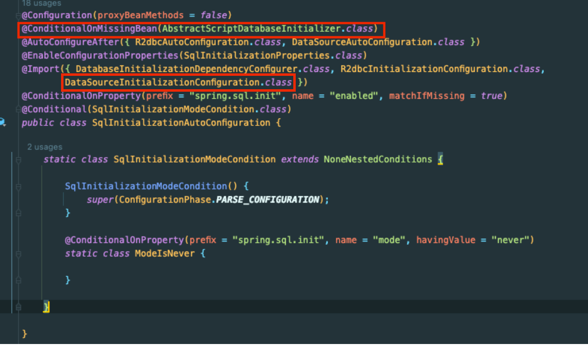
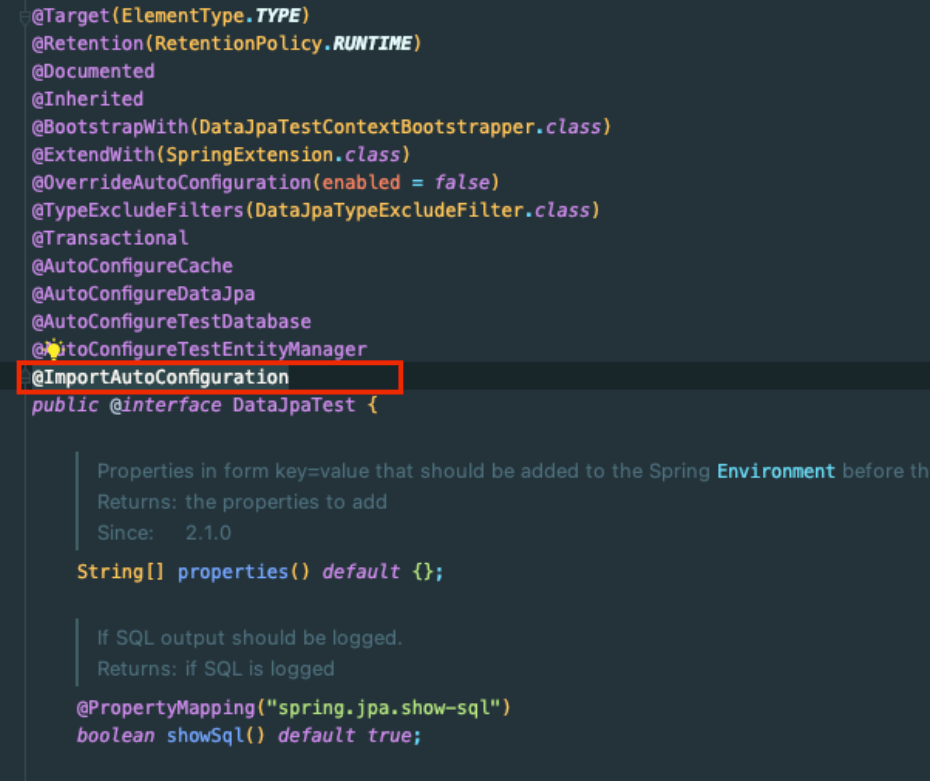
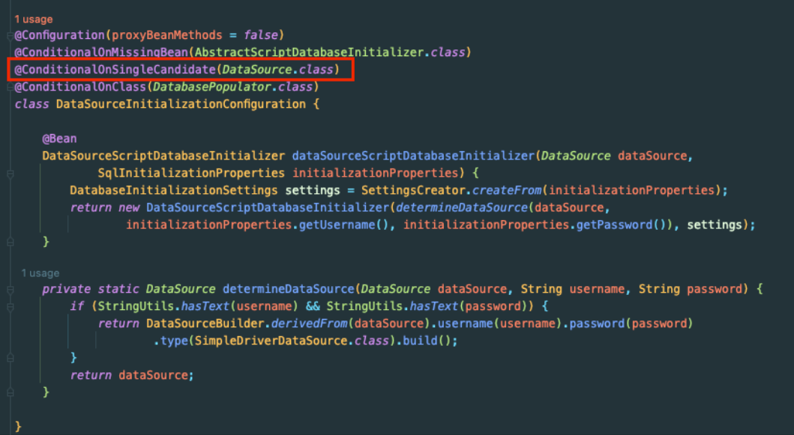

## Spring -  다중 데이터 소스 환경에서 spring.sql.init이 동작하지 않는 이슈 해결

테스트 코드를 돌릴 때 docker-compose에 MySQL을 띄워서 로컬에서만 테스트하고 있었다. 해당 부분은 자동화할 필요가 있다고 느껴서 테스트 코드에 H2 및 테스트 자동화를 적용하기로 했다.

테스트를 수행하기 전에 DDL 스크립트를 실행하도록 처리해야 했다.

# 구현

src/test/resources/application.yml에서 아래의 환경 설정을 적용했다.

```yaml
spring:
  jpa:
    hibernate:
      ddl-auto: none
  sql:
    init:
      schema-locations: classpath:sql/order-schema.sql
      mode: always
```

해당 설정은 Hibernate에서 제공하는 DDL 자동 생성 기능을 사용하지 않고 직접 정의한 sql이 실행되도록 한다.

그런데 해당 설정을 적용하고 전체 테스트는 성공하는데 일부 테스트가 깨지는 현상이 발생한다.
- 전체 테스트: 성공
- Repository Test: 성공
  - Repository method Test: 성공
- Controller Test: 실패
  - Controller method Test: 실패 
- 나머지 테스트: 성공

즉, 전체 테스트에서의 Controller Test는 통과하지만, Controller Test만 따로 실행하면 테스트가 깨졌다.

BaseController에 아래의 애노테이션을 붙여주면 해결되었지만 정확한 원인을 찾아서 확실하게 해결하고 싶었다. 이유는 다음과 같다.
- yml을 통해서 간단하게 풀 수 있을 지 모르는데 불필요한 코드를 중복할 수도 있다.
- 코드를 관리하기 어려워진다.
  - 어떤 테스트에서 해당 애노테이션을 사용하지..?! 에이! 그냥 붙이자 -> init이 두 번 실행 될 수도 있음

```java
@Sql(
    scripts = { "classpath:sql/order-schema.sql" }, 
    config = @SqlConfig(transactionManager = "OrderDBTransactionManager")
)
```

원인을 파악하고자 에러 메시지를 보니까 order-schema.sql이 실행되지 않고 있던 것이었다. 이후 디버깅을 통해 Controller Test만 실행할 때는 해당 sql을 실행해주지 않음을 알 수 있었다.

(Repository Test만 실행할 때는 sql이 정상적으로 실행되었다.)

## 시도 1

처음에는 아래의 프로퍼티를 설정하지 않아서 발생한 이슈로 생각했다.

- defer-datasource-initialization: true

하지만 해당 프로퍼티는 **Hibernate 초기화를 통해 스키마가 생성된 이후**에 **DML로 데이터를 채우기 위한 옵션**으로,

해당 이슈와 전혀 관계가 없었다.

## 시도 2

SqlInitializationAutoConfiguration가 Controller Test에서는 불러오지 않은 것이 아닐까? 라고 생각했지만,

해당 설정은 Controller Test와 Repository Test 시 모두 불러오고 있었다.

그래서 SqlInitializationAutoConfiguration 클래스가 로드 되기 전에 테스트가 실행된 것이 원인일 수 있다고 생각했는데, 디버깅을 해보니까 Controller Test에서는 순서나 로직 진행에 관계없이 Sql을 실행하지 않는다는 것을 알게 되었다.

## 시도 3 (해결)

고민을 하다가.. 생각해보니! 해당 sql이 어떤 DB 서버에 날리는 sql인지 어떻게 알고 실행하지..? 라는 의문이 들었다!

그래서 디버깅을 더 자세히 해봤다.



그래서 Schema, Data를 초기화하는 sql을 실행하는 곳이 `DataSourceScriptDatabaseInitializer`임을 알았다.



해당 클래스를 빈으로 등록한 클래스는 `DataSourceInitializationConfiguration`이다.

(`@ConditionalOnMissingBean`으로 지정된 `AbstractScriptDatabaseInitializer`는 `DataSourceScriptDatabaseInitializer`가 상속하는 추상 클래스이다.)



`DataSourceInitializationConfiguration`는 `SqlInitializationAutoConfiguration`에서 Import하고 있었고,



`@DataJpaTest`는 `@ImportAutoConfiguration` 애노테이션을 통해 `SqlInitializationAutoConfiguration` 설정을 불러온다.

(SpringBoot 실행 시에도 기본적으로 AutoConfiguration을 불러온다.)

그런데! 위에서 봤던 `DataSourceScriptDatabaseIntializer`(init.sql을 실행하는 클래스)를 빈으로 등록하는 `DataSourceInitializationConfiguration` 클래스 를 자세히 보면 `@ConditionalOnSingleCandidate(DataSource.class)`가 있다!



해당 애노테이션은 대상으로 지정한 Bean이 하나만 존재할 때 설정을 사용한다는 것을 의미한다.

## 결론

RepositoryTest에서는 아래와 같이 ComponantScan으로 DataSource를 1개만 빈으로 등록했기 때문에 DataSource 빈이 하나만 있는 상태라서 `DataSourceInitializationConfiguration`이 동작할 수 있었다.

```java
@ComponentScan(basePackages = "com.violetbeach.order")
@DataJpaTest
@AutoConfigureTestDatabase(replace = Replace.NONE)
@Transactional(propagation = Propagation.NOT_SUPPORTED)
public class OrderRepositoryTest {
    // ...
}
```

반면, ControllerTest(통합 테스트)에서는 @SpirngBootTest로 OrderDB의 DataSource 뿐만 아니라 다른 DataSource 빈까지 띄워서 `DataSourceInitializationConfiguration` 설정을 등록 하지 못해서 스크립트 실행이 되지 않았던 것이었다!!

```java
@SpringBootTest
@Transactional
@AutoConfigureMockMvc
@AutoConfigureRestDocs
public class BaseControllerTest {
    // ...
}
```

그래서 필요한 DataSource 설정 내에서 아래의 코드를 추가함으로써 해결했다.

```java
@Bean
@Profile("test")
public DataSourceInitializer dataSourceInitializer(@Qualifier("orderDataSource") final DataSource
orderDataSource) {
    ResourceDatabasePopulator resourceDatabasePopulator = new ResourceDatabasePopulator();
    ClassPathResource schema = new ClassPathResource("sql/orderdb/schema.sql");
    ClassPathResource data = new ClassPathResource("sql/orderdb/data.sql");
    if(schema.exists()) {
        resourceDatabasePopulator.addScripts(schema);
    }
        if(data.exists()) {
        resourceDatabasePopulator.addScript(data);
    }
    DataSourceInitializer dataSourceInitializer = new DataSourceInitializer();
    dataSourceInitializer.setDataSource(orderDataSource);
    dataSourceInitializer.setDatabasePopulator(resourceDatabasePopulator);
    return dataSourceInitializer;
}
```

해당 코드는 DataSourceInitializer를 빈을 등록해서 해당 DataSource가 생성될 때 경로에 sql이 있다면 해당 sql으로 초기화하도록 한다.
