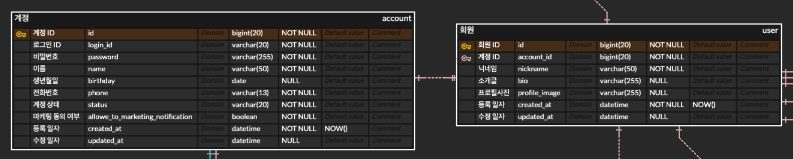

# MySQL - OneToOne 관계일 때 주의할 점 (+ Unique Key 설정)

요즘은 Foreign Key를 잘 사용하지 않는다.

FK를 사용하지 않은 채 JPA의 OneToOne를 사용할 때 고려해야 하는 부분이 있다.

예시를 통해 살펴보자.

## 주어진 상황

아래는 내가 설계한 DB의 일부이다.


계정과 회원을 굳이 분리한 이유는 성격이 다르다고 생각해서이다.

계정은 회원 정보에 속하기 때문에 보안 등급이 더 높고, 다른 테이블에서 Join을 할 때 회원 정보는 필요하지만 계정 정보는 필요하지 않을 수 있기 때문에 해당과 같이 설계하였다.

계정과 회원은 1:1 (OneToOne) 관계를 맺는다.

이때 중요한 것은 서로에 대한 참조 키에 Unieque key를 걸어줘야 한다는 점이다.

### Unieque key

위 DB를 기준으로, User 테이블의 account_id 컬럼에 Unique Key를 걸어줘야 비로소 1:1이 된다.

Unique key 조건을 걸지 않으면 앱 서버단에서 ORM 등을 사용해서 매핑할 때 문제가 생길 가능성이 크다.  

반면, 해당 컬럼에 Unieque key를 걸면 아래의 문제가 생길 수 있다.
- 그럼 Soft Delete는 어떻게 하나요..?!
- User 레코드를 Soft Delete한 후 새로 레코드를 만들면 Unique 제약에 걸리는데요..?!

그것이 Soft Delete의 단점이다. RDB는 key column을 기반으로 관계를 정의한다. <br>
-> 가능하면 로그를 쌓거나 백업 데이터를 모으는 것을 권장한다.

하지만 정말 Soft Delete가 필요한 시점이라면 프로그램 단에서라도 Unique Key를 걸자.

JPA의 경우 아래와 같이 구현할 수 있다.
```java
@Entity
@NoArgsConstructor(access = AccessLevel.PROTECTED)
public class User implements Serializable {

    @Id
    @GeneratedValue(strategy = GenerationType.IDENTITY)
    private Long id;

    @Column(unique = true)
    private long accountId;

}
```

## 참고
- https://kwonnam.pe.kr/wiki/java/jpa/one-to-one
- https://beagle-dev.tistory.com/306


