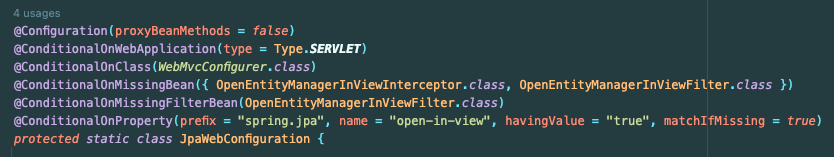
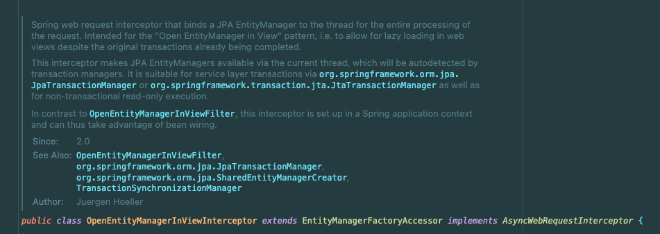
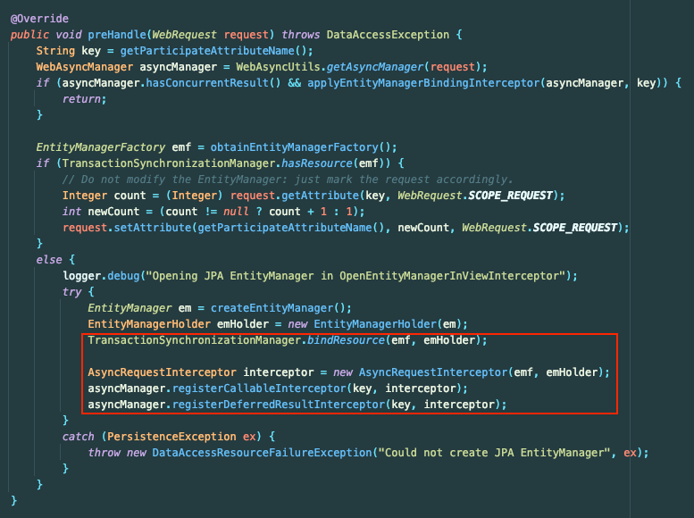
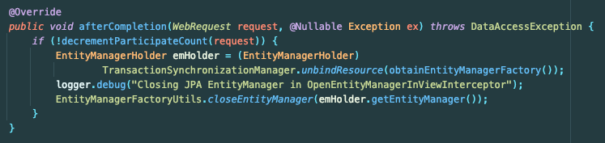
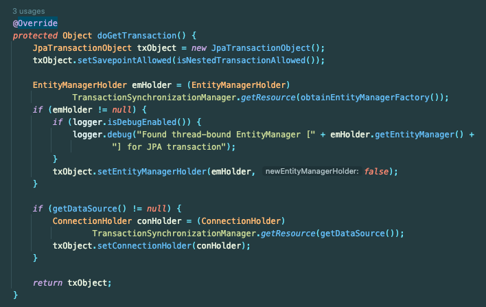
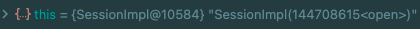
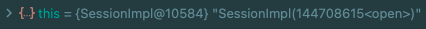
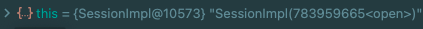
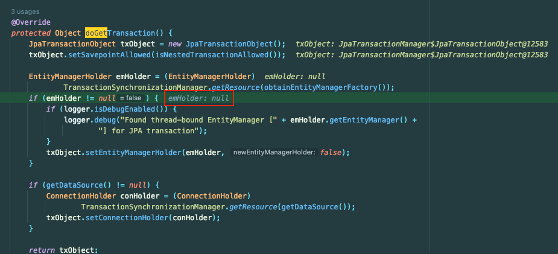

## OSIV(Open Session In View)

OSIV(Open Session In View)는 **영속성 컨텍스트**를 **뷰까지 개방**하는 기능이다.

이를 사용하면 트랜잭션이 종료되어도 영속성 컨텍스트가 관리될 수 있다.

여기까지는 사실 다 아는 내용이고 **OSIV의 동작 원리**에 대해 알아보자.

## OpenInView

Spring 환경에서 보통 아래의 property로 OSIV 설정에 접근한다.

- `spring.jpa.open-in-view`

아래는 `JpaWebConfiguration` 클래스의 애노테이션이다.



`open-in-view` 속성에 따라 해당 Configuration이 등록된다는 것을 알 수 있다. 이를 통해 알 수 있는 놀라운 사실은 '**Spring JPA도 웹과 연관이 있다.**'는 것이다.


`JpaProperties`의 `openInView`에 대한 설명을 번역하면 아래와 같다.

- `OpenEntityManagerInViewInterceptor`를 등록
- JPA EntityManager를 Thread에 바인딩

뭔가 조금 깊게 들어가봐야 정확히 알 수 있을 것 같다.

## OpenEntityManagerInViewInterceptor

`OpenEntityManagerInViewInterceptor`에 대한 설명을 살펴보자.



번역을 하면 `OpenEntityManagerInViewInterceptor`의 역할을 아래와 같이 설명하고 있다.
- 쓰레드에 JPA EntityManager를 바인딩하는 **Web Request Interceptor**
- 트랜잭션이 완료되었더라도 웹 뷰에서 Lazy Loading을 허용하기 위함
- 현재 쓰레드를 통해 JPA EntityManagers를 사용할 수 있게 처리

해당 클래스의 몇 개 메서드를 살펴보자.

### preHandle()

아래는 `OpenEntityManagerInViewInterceptor`의 `preHandle` 메서드이다.



해당 메서드에서는 요청이 들어오면 새로운 `entityManager`를 생성한다.

그리고 `TransactionSynchronizationManager.bindResource(emf, emHolder);`를 호출해서 `ThreadLocal`에 `EntityManager`를 바인딩한다.

### afterCompletion()

응답이 완료되면 아래와 같이 `TransactionSynchronizationManager`에 **저장된 리소스를 언바인드**한다.



그리고 생성했던 `entityManager`를 `close()` 처리한다.

해당 메서드는 `preHandle`이 성공적으로 수행되었을 때만 호출된다.

## EntityManager 재활용

아래는 `JpaTransactionManager`의 `doGetTransaction()` 메서드이다.



해당 코드를보면 `TransactionSynchronizationManager.getResource()`를 호출해서 쓰레드에 할당된 `emHolder`를 찾아 **재활용**한다는 사실을 알 수 있었다.

즉, OSIV를 사용하면 `EntityManager`를 **매번 새로 생성하지 않고 재활용**할 수 있다는 장점이 있다.

### 디버깅해보기

OSIV 설정에 따라 **EntityManager의 생명주기가 변하는 것이 사실인 지 확인**해보자.

이해한 내용을 정리하면 아래와 같다.
- **OSIV가 on일 때 여러 트랜잭션에서도 EntityManager를 재활용**해야 한다.
- **OSIV가 off일 때 EntityManager를 트랜잭션이 실행될 때마다 생성**되어야 한다.

실제로 확인해보자.

```java
@Service
@RequiredArgsConstructor
public class ServiceA {
    private final MemberRepository memberRepository;

    public void execute() {
        memberRepository.save(new Member("test"));
        memberRepository.save(new Member("test"));
    }
}
```

먼저 OSIV를 켰을 때(default) `EntityManager`의 구현체인 `SessionImpl`의 주소가 두 개의 메서드 호출에서 동일하다.



OSIV를 끄면 아래의 결과가 나온다.




주소를 보면 두 EntityManager가 다른 것을 확인할 수 있다.

즉, OSIV 설정을 켜면 **EntityManager를 재활용**할 수 있게 된다.

실제로 OSIV를 끄고 디버깅해보면 `JpaTransactionManager`의 `doGetTransaction()`을 보면 두 번의 메서드 호출 모두에서 `emHolder`가 null인 것을 확인할 수 있었다.



## 마무리

기존에는 무조건 `open-in-view`속성을 끄는 것이 바람직하다고 생각했었다.
- 요청 전체에서 영속성 컨텍스트를 관리하는 것이 비효율적이기 때문

OSIV의 기본 설정값이 `true`인 이유는 Transaction 밖에서도 연관 엔터티 지연로딩 등을 편리하게 사용하기 위함이라고만 알고 있었다.
- 영속성 컨텍스트 밖에서 지연로딩을 사용하면 `LazyInitializationException`가 발생한다.
- DB Connection을 오래 유지하는 문제도 있다.

그러나 OSIV는 Lazy Loading 이외에도 이점이 있었다. **영속성 컨텍스트**의 **생명주기**와 **재활용**과 밀접하게 관련이 있다.
- 트랜잭션 밖에서 재조회 시 영속성 컨텍스트를 활용할 수 있다.
- 요청 1개당 1개의 `EntityManager`만을 생성하고 재사용할 수 있다.

느낀 점이 OSIV는 무조건 끄는 게 좋은 것이 아니라 **Trade-Off** 관계이다.

## 참고

- https://brunch.co.kr/@anonymdevoo/58
