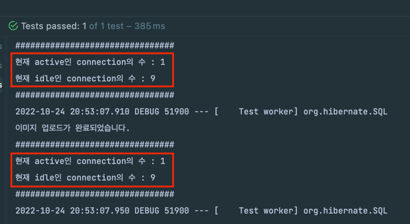
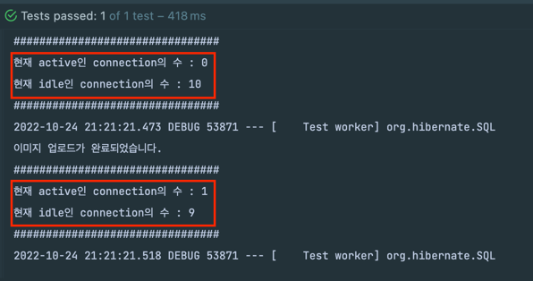
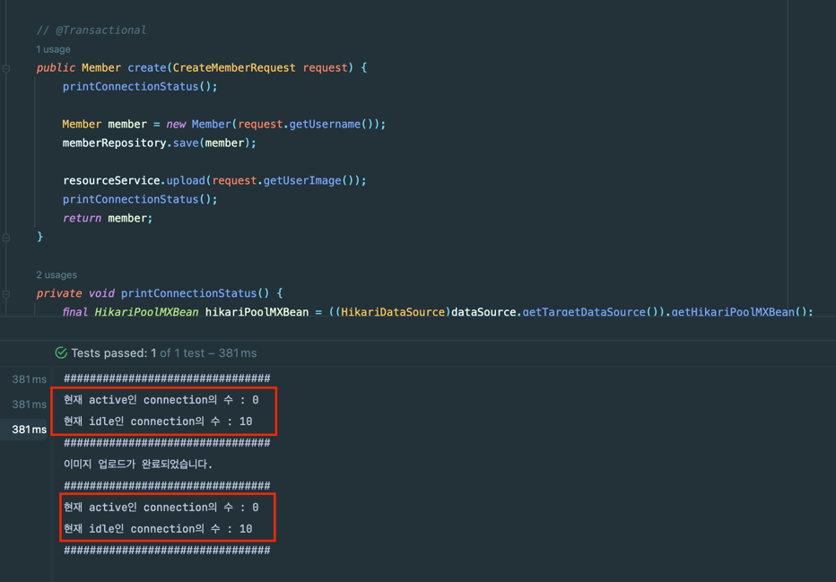
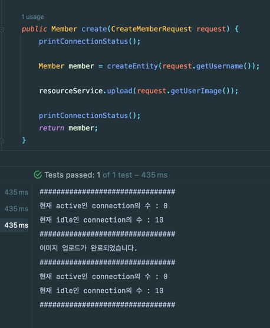

## Spring - Service Layer에서 Storage를 다룰 때 트랜잭션 처리하기!(+ with Hibernate)

게시글 등을 등록할 때 파일을 추가로 업로드하는 경우가 있다.

조회를 할 때 파일도 추가로 조회해야 하는 경우도 있다.

다음의 예시를 보자.

```java
@Service
@RequiredArgsConstructor
public class MemberService {
    
    private final MemberRepository memberRepository;
    private final MemberResourceService resourceService;

    @Transactional
    public Member create(CreateMemberRequest request) {
        Member member = new Member(request.getUsername());
        memberRepository.save(member);

        resourceService.upload(request.getUserImage());

        return member;
    }
}
```

MemberService의 create 메서드는 1개 트랜잭션 안에서 Member를 생성하고 스토리지에 UserImage를 업로드하고 있다.

이러면 괜찮은 걸까..?!

**DB 커넥션을 업로드가 완료될 때까지 계속 잡고 있지는 않을까..?!**

**삽입이 아니라 수정이라면 업로드가 완료될 때까지 해당 레코드에 접근하지 못하는 건 아닐까..?**

어떤 것이 최선의 방법일까?!

알아보자.

## 불필요한 커넥션 점유

정말 업로드가 완료될 때까지 계속 DB 커넥션을 사용하고 있을까?

확인해보자.

```java
@Service
@RequiredArgsConstructor
public class MemberService {

    private final MemberRepository memberRepository;
    private final MemberResourceService resourceService;
    private final DataSource dataSource;

    @Transactional
    public Member create(CreateMemberRequest request) {
        printConnectionStatus();

        Member member = new Member(request.getUsername());
        memberRepository.save(member);

        resourceService.upload(request.getUserImage());

        printConnectionStatus();
        return member;
    }

    private void printConnectionStatus() {
        final HikariPoolMXBean hikariPoolMXBean = ((HikariDataSource) dataSource).getHikariPoolMXBean();
        System.out.println("################################");
        System.out.println("현재 active인 connection의 수 : " + hikariPoolMXBean.getActiveConnections());
        System.out.println("현재 idle인 connection의 수 : " + hikariPoolMXBean.getIdleConnections());
        System.out.println("################################");
    }

}
```

해당 코드는 **트랜잭션 진입 직후**에 커넥션을 사용하는 지 여부와 **트랜잭션 종료 직전**에 커넥션을 사용하는 지 여부를 출력한다.



확인 결과 트랜잭션 시작부터 업로드가 완료되고 트랜잭션이 커밋 되기 직전까지도 DB 커넥션을 사용하고 있었다.

업로드할 파일의 크기가 크다면 DB 커넥션을 크게 낭비하게 된다.

```java
@Configuration
public class DataSourceConfig {

    @Bean
    @Primary
    public DataSource lazyDataSource(DataSourceProperties properties) {
        HikariDataSource dataSource = new HikariDataSource();
        dataSource.setJdbcUrl(properties.getUrl());
        dataSource.setUsername(properties.getUsername());
        dataSource.setPassword(properties.getPassword());
        dataSource.setDriverClassName(properties.getDriverClassName());
        return new LazyConnectionDataSourceProxy(dataSource);
    }

}
```

그렇다면 LazyConnectionDataSourceProxy를 사용하면 어떻게 될까?



트랜잭션 진입 시가 아니라 정말로 쿼리가 나가야 할 때만 DB 커넥션을 가져온다.

즉, 파일 업로드 -> 엔터티 생성 순이라면 DB 커넥션을 낭비하지 않을 수 있다!!

문제는 엔터티 생성이 실패할 경우 Dummy 파일이 남게 된다.
- Cron을 통해 지울 수 있는 정책이 있다면 괜찮다..!
- 보상 트랜잭션을 사용해서 해당 스토리지를 지워주는 처리를 해주는 방법도 있다. (eg. Saga 패턴)

**그러면 엔터티 생성 -> 파일 업로드 시에서는 DB 커넥션 낭비를 막을 수 있는 방법은 없을까?**

아래의 시도를 해봤다.
- AutoIncrement를 사용하지 않고 엔터티 생성 (ID 강제 삽입)
- Batch size 적용

이는 모두 해결 방법이 되지 못했다. (AutoIncrement를 제거해도 새 객체인지 여부를 확인하기 위해 Select을 날린다.)

이때 트랜잭션을 제거하면 DB 커넥션의 낭비를 막을 수 있다.


단, 트랜잭션을 제거하면 Repository Test 안에서만 영속성이 관리된다.
- 참고:https://cupeanimus.tistory.com/102

즉, Repository Layer 이후부터는 엔터티가 준영속 상태가 되기에 추가 로직에서의 DirtyChecking이나 LazyLoading 등을 사용할 수 없다.

## 트랜잭션 분리

그렇다면 트랜잭션 로직을 분리하면 되지 않을까..?

```java
public Member create(CreateMemberRequest request) {
    printConnectionStatus();

    Member member = createEntity(request.getUsername());

    resourceService.upload(request.getUserImage());

    printConnectionStatus();
    return member;
}

@Transactional
public Member createEntity(String username) {
    Member member = new Member(username);
    memberRepository.save(member);
    return member;
}
```
결과를 보자.



결과는 예상대로 커넥션을 낭비하지 않는다.

단, 이 경우 문제가 생길 수 있다.

현재 트랜잭션이 적용된 createEntity 메서드는 사실 트랜잭션이 적용되지 않았다!

이유는 Spring AOP는 프록시 패턴을 기반으로 동작합니다. 즉, A빈에서 B빈을 호출하기 전에 B의 프록시 객체를 호출하게 된다.

그런데 A빈에서 A빈의 메서드를 호출한다 한들 프록시 객체는 호출하지 않으므로 AOP는 동작하지 않는다! @Transactional도 Spring AOP로 동작하기에 정상 동작하지 않는다.

이런 방법을 풀려면 아래의 방법들 중 하나를 고민해야 한다.
- 서비스 클래스를 분리하는 방법 (빈을 분리)
- ObjectProvider를 사용해서 자신의 빈을 조회하는 방법

해당 이슈의 기능(createMember)은 서비스 클래스를 분리하기가 애매하다.
- 그래서 Facade 패턴을 사용해서 계층을 하나 더 만드는 것도 방법이 될 수 있다.

단, 이 경우에도 트랜잭션을 분리함으로써 스토리지에 Upload할 때 예외가 발생할 경우 엔터티는 직접 롤백시켜줘야 한다.

**조회**

삽입이나 수정이 아닌 조회를 하는 경우에는 조금 수월하다.

조회를 하는 경우에는 엔터티를 조회할 동안만 트랜잭션을 유지해도 전혀 문제가 없다.

즉, 엔터티 조회와 파일 조회는 트랜잭션을 분리하는 것이 좋다.

## 정리

데이터를 삽입하거나 수정할 때 파일 시스템이나 외부 시스템에 접근할 때는 아래의 문제가 발생할 수 있다.
- DB 커넥션을 오래 점유하면서 자원이 낭비될 수 있다.
- 트랜잭션 고립 수준에 따라 데드락 등의 이슈도 발생할 수 있다.

그래서 **차근차근 트랜잭션의 범위를 설계**해야 한다.

LazyConnectionDataSourceProxy를 사용하면 이를 조금 완화할 수 있다.
- 참고: https://jaehoney.tistory.com/202

그래도 부족하다면 트랜잭션을 분리하거나 제거하는 방법도 있다.
- 트랜잭션을 끊으면 데이터 정합성을 유지하기 어렵다.
  - Event나 Message를 활용한 보상 트랜잭션(eg. Saga 패턴)을 사용하면 해결이 가능하다.
  - Cron이나 Scheduler 등으로 데이터 정합성을 주기적으로 맞춰주는 것도 고려해볼 수 있다.
  - .. 다른 방법이 있으면 알려주세요 ㅎㅎ!


## 참고
- https://cheese10yun.github.io/spring-transacion-same-bean/
- https://velog.io/@dhk22/Spring-Spring-AOP-%EB%82%B4%EB%B6%80-%EB%A9%94%EC%84%9C%EB%93%9C-%ED%98%B8%EC%B6%9C%EC%8B%9C-%EB%AC%B8%EC%A0%9C%ED%95%B4%EA%B2%B0
- https://www.inflearn.com/questions/227574
- https://suhwan.dev/2020/01/16/spring-transaction-common-mistakes/
- https://steady-coding.tistory.com/610
