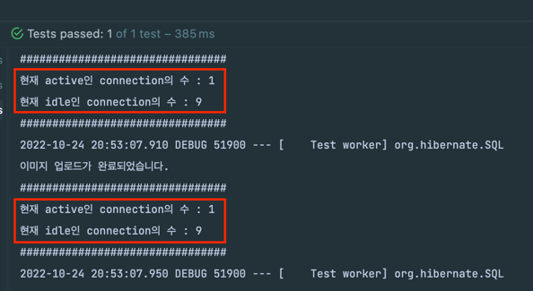
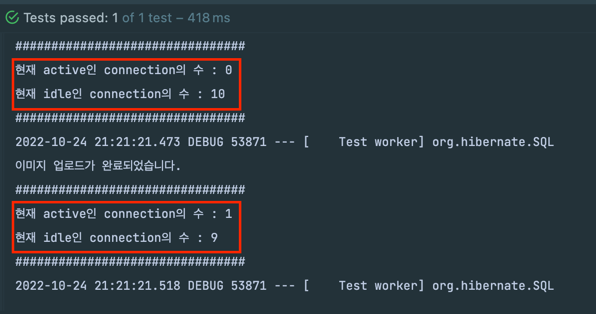
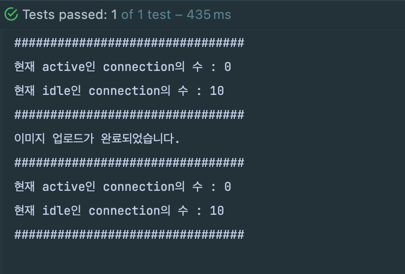
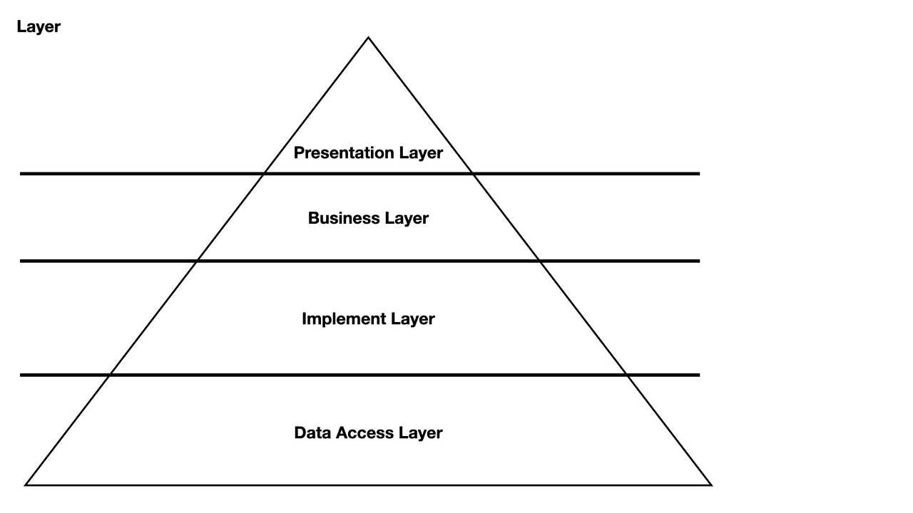

**DB 자원을 등록**할 때 **파일을 추가로 업로드**하는 경우가 있다. 조회를 할 때 **파일도 추가로 조회**해야 하는 경우도 있다.

## Service에서 스토리지 다루기

아래 예시를 보자.

```java
@Service
@RequiredArgsConstructor
public class MemberService {
    private final MemberRepository memberRepository;
    private final MemberResourceService resourceService;

    @Transactional
    public Member create(CreateMemberRequest request) {
        Member member = new Member(request.getUsername());
        memberRepository.save(member);
        resourceService.upload(request.getUserImage());
        return member;
    }
}
```

MemberService의 create 메서드는 `@Trasactional` 내부에서 두 가지 작업을 하고 있다.
- Member를 생성 후 영속화
- **파일 스토리지에 userImage를 업로드**

## 불필요한 커넥션 점유

아래 코드에서 커넥션은 **언제부터 언제까지 점유**할 지 확인해보자.

```java
@Service
@RequiredArgsConstructor
public class MemberService {
    private final MemberRepository memberRepository;
    private final MemberResourceService resourceService;
    private final DataSource dataSource;

    @Transactional
    public Member create(CreateMemberRequest request) {
        printConnectionStatus();

        Member member = new Member(request.getUsername());
        memberRepository.save(member);
        resourceService.upload(request.getUserImage());

        printConnectionStatus();
        return member;
    }
    
    private void printConnectionStatus() {
        final HikariPoolMXBean hikariPoolMXBean = ((HikariDataSource) dataSource).getHikariPoolMXBean();
        System.out.println("################################");
        System.out.println("현재 active인 connection의 수 : " + hikariPoolMXBean.getActiveConnections());
        System.out.println("현재 idle인 connection의 수 : " + hikariPoolMXBean.getIdleConnections());
        System.out.println("################################");
    }
}
```

해당 `printConnectionStatus()`를 사용해서 **트랜잭션 진입 직후**와 **트랜잭션 종료 직전**에 커넥션을 사용하는 지 여부를 출력한다.



확인 결과 **트랜잭션 시작부터 업로드가 완료되고 트랜잭션이 커밋 되기 직전까지 DB 커넥션을 사용**하고 있었다.

그래서 아래 문제가 생길 수 있었다.

- 업로드할 파일의 크기가 크다면 DB 커넥션을 낭비하게 되어 **DB 커넥션 풀 고갈** 문제로 이어질 수 있다.
- DB에서 락을 오래 점유하게 되어 **TPS 저하** 및 **Lock-timeout**이 생길 수 있다.

```java
@Configuration
public class DataSourceConfig {

    @Bean
    public DataSource lazyDataSource(HikariConfig hikariConfig) {
        HikariDataSource dataSource = new HikariDataSource(hikariConfig);
        return new LazyConnectionDataSourceProxy(dataSource);
    }
}
```

## LazyConnectionDataSourceProxy

LazyConnectionDatasourceProxy를 사용하면 이 문제를 완화할 수 있다.



`LazyConnectionDatasourceProxy`를 사용하면 `@Transactional` 애노테이션 진입 시가 아니라 정말로 쿼리 수행이 필요할 때 DB 커넥션을 가져온다.
- 로직이 파일 업로드 - 데이터 영속화 순이라면 파일 업로드 완료 시까지 DB 커넥션을 낭비하지 않을 수 있다.
- 영속화를 먼저 수행된다면 효과가 크지 않다.

## API 분리

**API 요청 자체를 2개로 분리**할 수도 있다.
- 리소스를 업로드
- DB 데이터 생성

리소스와 DB 데이터 간 연결은 아래 두 방법이 있다.
- Unique한 Key를 생성해서 해당 Key로 리소스와 DB 데이터를 생성
- 리소스의 ID나 Path 목록을 메타 데이터 생성할 때 삽입

AWS 같은 클라우드 환경을 사용한다면 Presigned Url 방식을 권장한다.

## 트랜잭션 분리

앞서 `LazyConnectionDataSourceProxy`를 사용하면 커넥션 점유 문제를 일부 막을 수 있었다.

그렇지만 서비스 로직이나 로직 순서 등이 `LazyConnectionDataSourceProxy`에 논리적으로 의존하게 된다.

그래서 **트랜잭션을 분리하는 방법**도 있다. 아래 코드를 보자.

```java
public Member create(CreateMemberRequest request) {
    printConnectionStatus();

    Member member = createEntity(request.getUsername());
    resourceService.upload(request.getUserImage());

    printConnectionStatus();
    return member;
}

@Transactional
public Member createEntity(String username) {
    Member member = new Member(username);
    memberRepository.save(member);
    return member;
}
```
결과를 보자.



커넥션을 낭비하지 않았다. 하지만 이 코드는 큰 문제가 있다.

`createEntity()`는 사실 **트랜잭션이 적용되지 않았다.** Spring AOP는 빈에 프록시를 등록해서 동작한다.
- `@Transactional` 애노테이션은 AOP 기반으로 동작한다.

그래서 인스턴스에서 내부 메서드를 호출하는 것으로는 `Advice`가 동작하지 않는다.

이런 방법을 풀려면 아래의 방법들 중 하나를 고민해야 한다.
- 서비스 클래스를 분리 (빈을 분리)
- Transaction 범위 지정
- 자신의 빈을 주입받아서 호출

### 1. 클래스 분리

빈을 분리시키면 프록시를 동작시킬 수 있다.



그래서 Layer를 하나 더두기만 하면 된다.

해당과 같이 DB 또는 Storage에 접근하면서 영속성을 관리할 수 있는 **Implement Layer**를 분리하고, **DB 접근 클래스에서만 트랜잭션**을 가지면 된다.

이 방법이 **가장 깔끔하고 그나마 이상적**이다.

Service Layer에서 `@Transactional`을 사용하지 않는 방법도 있다. 그러면 Repository 계층의 Transaction만 적용이 될 것이므로 트랜잭션을 분리할 수 있다.

### 2. Transaction 범위 지정

`Spring Transaction`에서 지원하는 `TransactionTemplate`을 사용하면 명시적인 트랜잭션을 사용할 수 있다.

```java
void createMember() {
    transactionTemplate.execute(new TransactionCallbackWithoutResult() {
        @Override
        protected void doInTransactionWithoutResult(TransactionStatus status) {
            Member member = new Member("username");
            memberRepository.save(member);
        }
    });
}
```

### 3. 자신의 빈을 조회

`ObjectProvider`나 `ApplicationContext`를 사용해서 자신의 빈을 조회해서 사용하면 `@Transactional`을 동작시킬 수 잇다.

```java
@Service
@RequiresArgsConsturctor
public class MemberService {
    private final ObjectProvider<MemberService> memberServiceProvider;

    public Member create(CreateMemberRequest request) {
        MemberService memberService = memberServiceProvider.getObject();
        Member member = memberService.createEntity(request.getUsername());
        resourceService.upload(request.getUserImage());
        return member;
    }
  
    @Transactional
    public Member createEntity(String username) {
        Member member = new Member(username);
        memberRepository.save(member);
        return member;
    }
}
```

이렇게 해도 트랜잭션을 분리할 수 있다.

## OSIV

`@Transactional`의 범위를 분리하면 트랜잭션의 범위는 축소된다. 즉, 자원에 대한 락은 해제된다.

하지만 **OSIV 설정**을 켜면 **커넥션은 여전히 사용**하고 있는 상태가 된다. DB 커넥션 안에서 파일을 저장하고 싶지 않다면 OSIV 옵션을 꺼야 한다.

OSIV 관련해서는 아래 포스팅에서 상세히 정리했으니 참고 바란다.
- https://jaehoney.tistory.com/390

## 로직 순서

DB 트랜잭션과 외부 인프라 접근을 분리하는 것을 권장한다고 소개해왔다.

만약 **한 번의 API 요청**에서 **DB 영속화**와 **파일 업로드**를 수행해야 한다면 어떤 것부터 수행해야 할까?

**파일 업로드**부터 수행하는 것이 이상적이다.

DB 영속화부터 실행한다면 아래의 문제가 있다.
- 파일 저장이 실패했을 때 수동으로 DB를 롤백해야 한다.
- 파일 저장 이전에 화면에서 조회가 가능한 문제가 생길 수 있다.

## Dummy 데이터 문제

반면, 파일 저장을 먼저한다면 아래 문제가 있다.

DB 저장이 실패하면 **쓰레기 파일**이 남게 된다.
- **스케줄러**를 통해 쓰레기 데이터를 지워줄 수 있다. (가장 간단하고 확실하다.)
- 보상 트랜잭션을 사용해서 해당 파일를 지워주는 처리를 해주는 방법도 있다. (eg. Saga 패턴)

TransactionalEventListener를 사용하는 방법도 있다.

```java
@Async
@TransactionalEventListener
    classes = MemberResourceSavedEvent.class,
    phase = TransactionPhase.AFTER_ROLLBACK
)
public void handle(MemberResourceSavedEvent event) {
    memberStorageService.delete(event.getResources());
}
```

`@TransactionalEventListener`의 `phase`를 `TransactionPhase.AFTER_ROLLBACK`으로 사용하면 **트랜잭션이 실패했을 때** 이벤트를 소비한다.

그래서 **트랜잭션이 실패했을 때 쓰레기 파일도 삭제**할 수 있게 된다.

## 정리해보자

데이터를 삽입하거나 수정할 때 **파일 시스템이나 외부 시스템에 접근할 때**는 조심해야 한다. **트랜잭션 내부에서 외부 인프라에 접근**한다면 아래의 문제가 발생할 수 있다. 

- **DB 커넥션을 오래 점유**하면서 자원이 낭비될 수 있다.
- **락 과점유** 등의 문제가 생길 수 있다. (MySQL에서는 Index를 기준으로 Lock을 걸기 때문에 충분히 주의해야 한다.)

그래서 **트랜잭션의 범위를 상세하게 설계**해야 한다.

가장 **이상적**이라고 생각하는 방법은 아래와 같다.

1. 가능하면 API를 분리
2. 아키텍처 재설계로 트랜잭션 범위 변경 (+ OSIV 끄기)
3. 파일 스토리지부터 저장 (쓰레기 데이터는 스케줄러를 통해 삭제)

전체 코드는 [GitHub](https://github.com/violetbeach/blog-code/tree/master/spring/jpa/transaction)에서 참고하실 수 있습니다.


## 참고
- https://cheese10yun.github.io/spring-transacion-same-bean/
- https://velog.io/@dhk22/Spring-Spring-AOP-%EB%82%B4%EB%B6%80-%EB%A9%94%EC%84%9C%EB%93%9C-%ED%98%B8%EC%B6%9C%EC%8B%9C-%EB%AC%B8%EC%A0%9C%ED%95%B4%EA%B2%B0
- https://www.inflearn.com/questions/227574
- https://suhwan.dev/2020/01/16/spring-transaction-common-mistakes/
- https://steady-coding.tistory.com/610
- https://geminikim.medium.com/지속-성장-가능한-소프트웨어를-만들어가는-방법-97844c5dab63
