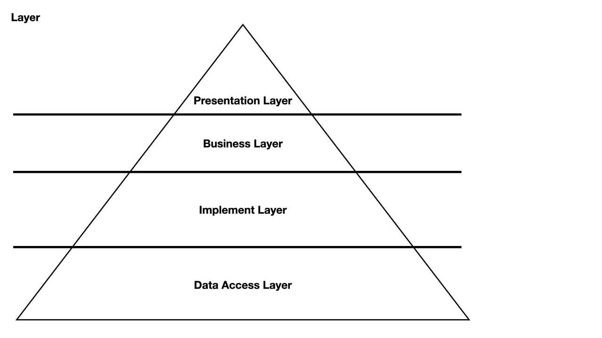

## Service Layer에서 Storage를 다룰 때 트랜잭션 처리하기!

게시글 등을 등록할 때 파일을 추가로 업로드하는 경우가 있다. 조회를 할 때 파일도 추가로 조회해야 하는 경우도 있다.

다음의 예시를 보자.

```java
@Service
@RequiredArgsConstructor
public class MemberService {
    
    private final MemberRepository memberRepository;
    private final MemberResourceService resourceService;

    @Transactional
    public Member create(CreateMemberRequest request) {
        Member member = new Member(request.getUsername());
        memberRepository.save(member);

        resourceService.upload(request.getUserImage());

        return member;
    }
}
```

MemberService의 create 메서드는 1개 트랜잭션 안에서 Member를 생성하고 스토리지에 UserImage를 업로드하고 있다.

알아보자.

## 불필요한 커넥션 점유

정말 업로드가 완료될 때까지 계속 DB 커넥션을 사용하고 있을까?

확인해보자.

```java
@Service
@RequiredArgsConstructor
public class MemberService {

    private final MemberRepository memberRepository;
    private final MemberResourceService resourceService;
    private final DataSource dataSource;

    @Transactional
    public Member create(CreateMemberRequest request) {
        printConnectionStatus();

        Member member = new Member(request.getUsername());
        memberRepository.save(member);

        resourceService.upload(request.getUserImage());

        printConnectionStatus();
        return member;
    }

    // Connection 점유 상황 출력
    private void printConnectionStatus() {
        final HikariPoolMXBean hikariPoolMXBean = ((HikariDataSource) dataSource).getHikariPoolMXBean();
        System.out.println("################################");
        System.out.println("현재 active인 connection의 수 : " + hikariPoolMXBean.getActiveConnections());
        System.out.println("현재 idle인 connection의 수 : " + hikariPoolMXBean.getIdleConnections());
        System.out.println("################################");
    }

}
```

해당 `printConnectionStatus()`를 사용해서 **트랜잭션 진입 직후**와 **트랜잭션 종료 직전**에 커넥션을 사용하는 지 여부를 출력한다.


확인 결과 트랜잭션 시작부터 업로드가 완료되고 트랜잭션이 커밋 되기 직전까지도 DB 커넥션을 사용하고 있었다.

그래서 아래 문제가 생길 수 있다.

- 업로드할 파일의 크기가 크다면 DB 커넥션을 낭비하게 되어 **DB 커넥션 풀 고갈** 문제로 이어질 수 있음
- DB에서 락을 오래 점유하게 되어 락 타임아웃의 문제가 생길 수 있음

```java
@Configuration
public class DataSourceConfig {

    @Bean
    @Primary
    public DataSource lazyDataSource(DataSourceProperties properties) {
        HikariDataSource dataSource = new HikariDataSource();
        dataSource.setJdbcUrl(properties.getUrl());
        dataSource.setUsername(properties.getUsername());
        dataSource.setPassword(properties.getPassword());
        dataSource.setDriverClassName(properties.getDriverClassName());
        return new LazyConnectionDataSourceProxy(dataSource);
    }

}
```

## LazyConnectionDataSourceProxy

LazyConnectionDatasourceProxy를 사용하면 일부 개선의 여지가 생긴다.


트랜잭션 진입 시가 아니라 정말로 쿼리가 나가야 할 때만 DB 커넥션을 가져온다.
- 로직이 파일 업로드 -> 데이터 영속화 순이라면 DB 커넥션을 낭비하지 않을 수 있다.
- 영속화를 먼저 수행된다면 결과는 이전과 크게 다르지 않을 것이다.

파일 업로드를 먼저할 때 문제는 DB 업로드가 실패하면 **쓰레기 파일**이 남게 된다.
- Cron을 통해 지울 수 있는 정책이 있다면 괜찮다.
- 보상 트랜잭션을 사용해서 해당 스토리지를 지워주는 처리를 해주는 방법도 있다. (eg. Saga 패턴)

## 보상 트랜잭션

TransactionalEventListener를 사용하면 보상 트랜잭션의 개념을 사용할 수 있다.

```java
@Async
@TransactionalEventListener
    classes = MemberResourceSavedEvent.class,
    phase = TransactionPhase.AFTER_ROLLBACK
)
public void handle(MemberResourceSavedEvent event) {
    memberStorageService.delete(event.getResources());
}
```

`phase`를 `TransactionPhase.AFTER_ROLLBACK`으로 사용하면 트랜잭션이 실패했을 때 해당 로직이 수행된다.

그래서 트랜잭션이 실패했을 때 쓰레기 파일도 삭제할 수 있게 된다.

꼭 이러한 처리가 아니더라도 스케줄러를 통해 쓰레기 파일을 지워주는 처리도 가능하다. 즉, 엔터티가 나중에 생성되는 구조라면 `LazyDataSourceProxy`를 사용해서 커넥션이 낭비되는 것을 막을 수 있다.

## Presigned Url

Presigned Url 방식으로 리소스를 먼저 서버에 업로드하고 메타 데이터를 생성할 때 자원의 경로를 연결시켜주는 방법도 있다.

즉, API 요청 자체를 2개로 분리하는 것이다.
- 리소스를 업로드
- 메타 데이터를 생성

연결은 Unique한 Key를 생성해서 해당 Key로 리소스와 메타 데이터를 생성해도 되고, 리소스의 ID나 경로 목록을 메타 데이터 생성할 때 넣어주기만 해도 된다.

## 트랜잭션 분리

앞서 `LazyConnectionDataSourceProxy`를 사용하면 커넥션 점유 문제를 일부 막을 수 있었다.

그렇지만 서비스 로직이 해당 클래스에 논리적으로 의존하게 된다. **명시적으로 트랜잭션을 분리하는 방법**도 있다.

먼저 아래 코드를 보자.

```java
public Member create(CreateMemberRequest request) {
    printConnectionStatus();

    Member member = createEntity(request.getUsername());

    resourceService.upload(request.getUserImage());

    printConnectionStatus();
    return member;
}

@Transactional
public Member createEntity(String username) {
    Member member = new Member(username);
    memberRepository.save(member);
    return member;
}
```
결과를 보자.


결과는 예상대로 커넥션을 낭비하지 않는다. 하지만 이 코드는 명백히 문제가 있다.

`createEntity()`는 사실 **트랜잭션이 적용되지 않았다.** Spring AOP는 빈에 프록시를 등록해서 동작한다.
- `@Transactional` 애노테이션은 AOP 기반으로 동작한다.

그래서 인스턴스 메서드를 호출하는 것으로는 프록시가 동작하지 않는다.

이런 방법을 풀려면 아래의 방법들 중 하나를 고민해야 한다.
- 서비스 클래스를 분리 (빈을 분리)
- Transaction 범위 지정
- 자신의 빈을 주입받아서 호출

### 1. 서비스 클래스 분리

빈을 분리시키면 프록시를 동작시킬 수 있다.



그래서 Layer를 하나 더두기만 하면 된다.

해당과 같이 DB 또는 Storage에 접근하면서 영속성을 관리할 수 있는 Implement Layer를 분리하고, DB 접근 클래스에서만 트랜잭션을 가지면 된다.

더 간단한 방법은 그냥 Service Layer에서 트랜잭션을 사용하지 않으면 된다. 그러면 Repository 계층의 Transaction만 적용이 될 것이므로 트랜잭션을 분리할 수 있다.

### 2. Transaction 범위 지정

`Spring Transaction`에서 지원하는 `TransactionTemplate`을 사용하면 명시적인 트랜잭션을 사용할 수 있다.

```java
void createMember() {
    transactionTemplate.execute(new TransactionCallbackWithoutResult() {
        @Override
        protected void doInTransactionWithoutResult(TransactionStatus status) {
            Member member = new Member("username");
            memberRepository.save(member);
        }
    });
}
```

이를 통해 트랜잭션을 분리할 수 있다.


## OSIV

## 정리

데이터를 삽입하거나 수정할 때 파일 시스템이나 외부 시스템에 접근할 때는 아래의 문제가 발생할 수 있다.
- DB 커넥션을 오래 점유하면서 자원이 낭비될 수 있다.
- 트랜잭션 고립 수준에 따라 데드락 등의 이슈도 발생할 수 있다.

그래서 **차근차근 트랜잭션의 범위를 설계**해야 한다.

LazyConnectionDataSourceProxy를 사용하면 이를 조금 완화할 수 있다.
- 참고: https://jaehoney.tistory.com/202

그래도 부족하다면 트랜잭션을 분리하거나 제거하는 방법도 있다.
- 트랜잭션을 끊으면 데이터 정합성을 유지하기 어렵다.
  - Event나 Message를 활용한 보상 트랜잭션(eg. Saga 패턴)을 사용하면 해결이 가능하다.
  - Storage 저장 -> 엔터티 Save 순서라면 Cron이나 Scheduler 등으로 데이터를 주기적으로 정리해주는 것도 고려해볼 수 있다.
  - .. 다른 방법이 있으면 알려주세요 ㅎㅎ!


## 참고
- https://cheese10yun.github.io/spring-transacion-same-bean/
- https://velog.io/@dhk22/Spring-Spring-AOP-%EB%82%B4%EB%B6%80-%EB%A9%94%EC%84%9C%EB%93%9C-%ED%98%B8%EC%B6%9C%EC%8B%9C-%EB%AC%B8%EC%A0%9C%ED%95%B4%EA%B2%B0
- https://www.inflearn.com/questions/227574
- https://suhwan.dev/2020/01/16/spring-transaction-common-mistakes/
- https://steady-coding.tistory.com/610
- https://geminikim.medium.com/지속-성장-가능한-소프트웨어를-만들어가는-방법-97844c5dab63
