## @EmbeddedKafka가 Nested와 사용이 안되는 이슈 해결! (+ Spring-Kafka에 기여!)

개발 중에 EmbeddedKafka를 적용하니 일부 테스트가 깨지는 현상이 발생했다.

딱히 잘못한 부분도 없는 데 깨진 것 같아서 의아했다.

아래는 해당 부분에 대해 해결하고 Spring-kafka에 기여하게 된 내용에 대해 다룬다!

### 최초 확인

확인해보니까 `@Nested` 어노테이션이 달린 클래스의 테스트들만 깨지고 있었다. 왜 그럴까..?
- WireMock 서버가 이미 떠 있다는 경고로 깨지고 있었다.
- WireMock을 제거하니 MockMvc에서 에러가 나고 있었다.

복잡한 원인을 확인하려니까 어려워서 새로 Github Repository를 파서 빈 프로젝트에서 재현을 해보기로 했다.
- Repository: https://github.com/violetbeach/embedded-kafka-nested

## 1. WireMock 문제

아래는 실무에서 발생한 이슈와 동일하게 개인 Repository에서 재현한 부분이다. 

```java
@TestConfiguration
public class WireMockConfiguration {

    @Bean(initMethod = "start", destroyMethod = "stop")
    public WireMockServer wireMockServer() {
        return new WireMockServer(9561);
    }

}
```

```java
@EmbeddedKafka
@SpringBootTest
@Import(WireMockConfiguration.class)
public class WireMockBased {
}
```

```java
class WireMockEmbeddedKafkaTest extends WireMockBased {

    @Test
    void test() {
    }

    @Nested
    class NestedClass {

        @Test
        void test() {
        }

    }

}
```

결과를 보면 실무에서 봤던 에러가 그대로 발생하고 있다.


테스트해본 결과는 아래와 같다.

- @Nested에 속하지 않은 테스트는 문제가 없이 통과한다.
- @Nested에 속한 클래스의 테스트는 WireMockServer가 이미 존재한다는 에러가 발생한다.

디버깅해보니 WireMockServer가 두 번 뜨고 있었다.

특이점을 정리하면 아래와 같다.
- @Nested 클래스 밖으로 테스트를 꺼내면 통과한다.
- @EmbeddedKafka를 제거하면 통과한다.
- WireMockServer의 port를 0(dynamic)으로 하면 통과한다.
  - 2번 뜨지만 dynamic 이므로 충돌이 발생하지 않아서 통과

## 2. RestDocs 문제

```java
@EmbeddedKafka
@AutoConfigureRestDocs
@AutoConfigureMockMvc
@SpringBootTest
public class RestDocsBased {

    @Autowired
    protected MockMvc mockMvc;

}
```

```java
class RestDocsEmbeddedKafkaTest extends RestDocsBased {

    @Test
    void test() throws Exception {
        mockMvc.perform(get("/test"));
    }

    @Nested
    class NestedClass {

        @Test
        void test() throws Exception {
            mockMvc.perform(get("/test"));
        }

    }

}
```

여기서도 케이스는 동일했다.
- @Nested 클래스에 속한 테스트만 깨진다.
- @EmbeddedKafka를 제거하면 테스트에 통과한다.
- @AutoConfigureRestDocs를 제거해도 테스트에 통과한다.

에러 내용은 아래와 같다.

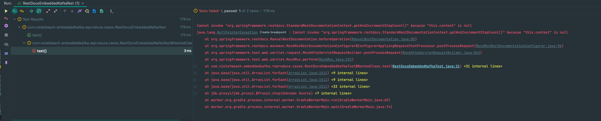

### 추가

추가로 @EmbeddedKafka를 사용할 때 RepositoryTest 등도 꺠졌는데, `Mockito.verify(instance, times(1))` 등에서 1번이 아니라 2번 호출되었다는 등의 에러가 발생한 것을봐서 Context에 영향을 준 듯 하다.
- @Nested와 함꼐 사용할 때 Context에 영향을 준다.

## 뭐가 문제 일까?

디버깅을 하다가 발견한 것은 SpringBootContextLoader.initialize()가 2세트씩 실행되고 있었다.

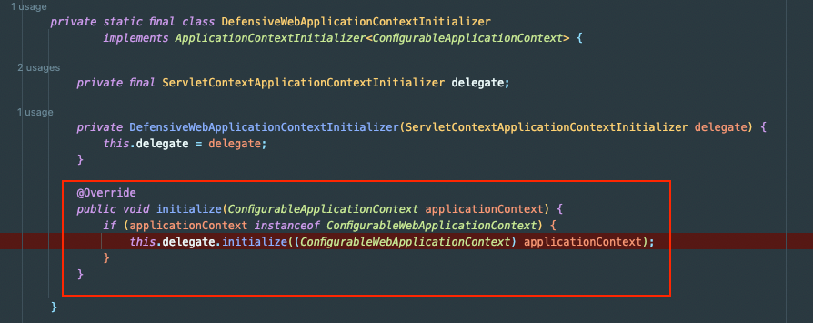

해당 메서드를 호출하는 SpringBootContextLoader.DefensiveWebApplicationContextInitializer에서 initialize()를 @EmbeddedKafka 애노테이션이 있을 때만 2번 실행하는 것이다.

이 방식으로 역으로 계속 타고 올라가니까 계속 init()과 같은 메서드가 두 번씩 호출되고 있었고, SpringBootContextLoader.loadContext()가 두 번 실행되고 있었다.


### Context

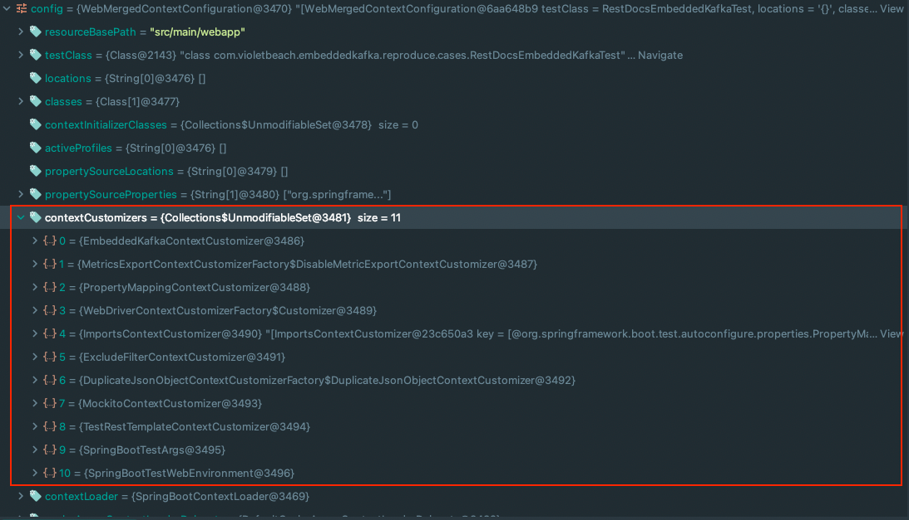

첫 번째 뜰때는 총 11개의 contextCustomizers가 존재했고

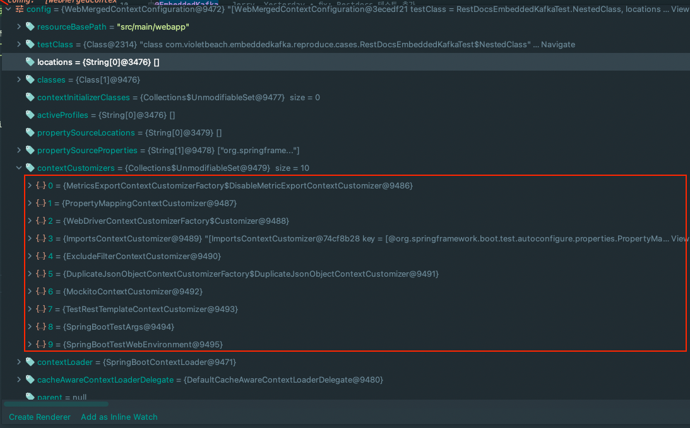

두 번째 컨텍스트 로딩 때는 EmbeddedKafkaContextCustomizer를 제외한 10개만 존재했다.
- ContextCustomizer 관련 내용은 아래 포스팅을 참고해주세요!
- [https://jaehoney.tistory.com/357](https://jaehoney.tistory.com/357)

즉, EmbeddedKafka를 포함한 Context 1개와, 테스트 환경을 위한 Context 1개 총 2개가 뜨고 있었다.

### @Nested의 동작 원리

JUnit 코드를 읽고 디버깅을 하면서 알게 된 사실은 SpringBootTestContextBootstrapper 클래스의 buildTestContext()는 @EmbeddedKafka 애노테이션이랑 관계 없이 @Nested의 테스트라면 반드시 두 번 호출된다.

즉, Context가 두 번 빌드되는 것까지는 맞는 것이었다.


그러나 두 번째 Context를 로드할 때는 캐싱되어서 동일한 컨텍스트를 사용해야 맞는 것이었고,
실제로 @SpringBootTest 애노테이션의 경우 그렇게 동작하고 있었다.


@EmbeddedKafka를 사용하면 두 번째 컨텍스트에는 EmbeddKafkaCustomizer가 없어서 캐싱이 실패하고 컨텍스트가 중복으로 뜨고 있다.
- @Nested Class의 테스트에서는 EmbeddKafkaCustomizer가 Context에 적용이 안되는 것이 문제인 것이다.

## 해결 방법

### 1. @NestedTestConfiguration

가장 먼저 떠오른 방법이다. Junit의 레퍼런스를 보니까 `@NestedTestConfiguration` 애노테이션이 있었다.
- https://docs.spring.io/spring-framework/reference/testing/testcontext-framework/support-classes.html#testcontext-junit-jupiter-nested-test-configuration

해당 애노테이션의 value를 `EnclosingConfiguration.OVERRIDE`로 지정하면 @Nested 클래스에서 테스트 구성이 상속되지 않고 독립적으로 실행된다고 한다.

그래서 해당 애노테이션을 붙여 봤다.

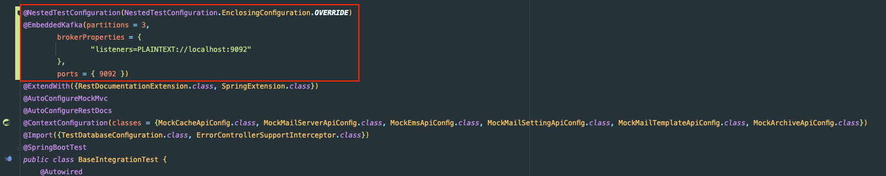

그래도 여전히 문제가 발생했다. 결국 해결 방법이 아니었다. ㅠ

### 2. Test Context를 캐싱 가능하도록 처리

앞서 언급했듯 @Nested가 붙은 클래스의 테스트에서 SpringBootTestContextBootstrapper 클래스의 buildTestContext()는 @EmbeddedKafka 애노테이션이랑 관계 없이 반드시 두 번 수행되었다.

그말은 즉슨, @Nested Class 테스트를 실행할 때 MergedContextConfiguration의 contextCustomizer에 왜 EmbeddedKafka가 없는 지 알아내면 될 것 같다.

맨 처음 의심했었던 EmbeddedKafkaContextCustomizerFactory 클래스를 봤다.

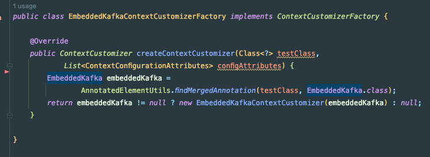

createContextCustomizer()는 대상 클래스에 애노테이션이 붙지 않았다면 null을 반환하고 있다. @Nested의 클래스 테스트에서는 Customizer로 등록되지 못하고 null을 반환한다.
- @Inherited로 인해 상속한 애노테이션은 찾을 수 있지만, Outer Class의 애노테이션은 찾을 수 없었다.

#### InnerClass에 애노테이션 추가 

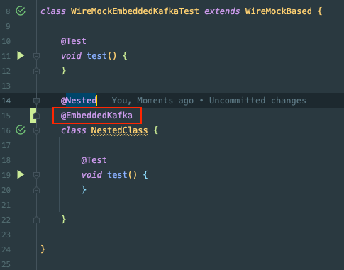

@Nested 클래스에도 @EmbeddedKafka의 ContextCustomizer를 적용해줘야 겠다고 생각했다. 그래서 @EmbeddedKafka 어노테이션을 @Nested 클래스에 추가했더니 테스트가 통과한다.

#### InnerClass에 상속 추가

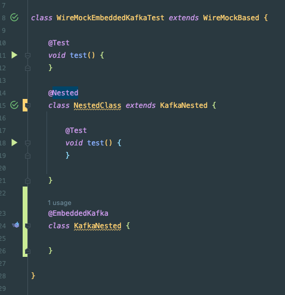

위와 같이 상속으로 애노테이션을 주는 방법도 있었다. 

문제는 이렇게 수동으로 모든 @Nested 클래스에 반영을 해주면 한도 끝도 없고, 실수하기도 쉬워진다. 조금 더 근본적인 해결책이 필요하다.

### OuterClass도 서치하도록 수정

EmbeddedKafka 애노테이션을 검색할 때 아래의 코드를 사용한다.
- `AnnotatedElementUtils.findMergedAnnotation(testClass, EmbeddedKafka.class)`;

문제는 해당 코드는 OuterClass의 애노테이션까지 찾지는 못한다. 그래서 아래와 같이 수정했다.

```java
public class EmbeddedKafkaContextCustomizerFactory implements ContextCustomizerFactory {

	private final IsNestedTestClass isNestedTestClass = new IsNestedTestClass();

	@Override
	public ContextCustomizer createContextCustomizer(Class<?> testClass,
			List<ContextConfigurationAttributes> configAttributes) {
		EmbeddedKafka embeddedKafka =
				AnnotatedElementUtils.findMergedAnnotation(testClass, EmbeddedKafka.class);
		if(embeddedKafka != null) {
			return new EmbeddedKafkaContextCustomizer(embeddedKafka);
		}

		Class<?> search = testClass;
		while(isNestedTestClass.test(search)) {
			search = search.getDeclaringClass();
			embeddedKafka = AnnotatedElementUtils.findMergedAnnotation(search, EmbeddedKafka.class);
			if(embeddedKafka != null) {
				return new EmbeddedKafkaContextCustomizer(embeddedKafka);
			}
		}
		return null;
	}

}
```

이렇게 수정하면 해당 코드는 Inner Class를 우선해서 OuterClass까지 어노테이션을 서칭하고 적용한다.

더 찾아보니 `TestContextAnnotationUtils.findMergedAnnotation()`메서드를 사용하면 OuterClass의 애노테이션도 찾을 수 있길래, 심플하게 해당 코드를 반영했다.

그리고 받아줄진 모르지만 Spring-Kafka 측에 PR을 보냈다.
- https://github.com/spring-projects/spring-kafka/pull/2694

### 테스트 작성

이틀만에 회신이 왔다. `Spring Integration Lead`로 계시는 `Artem Bilan`께 리뷰를 받았고!

수정 사항에 대한 테스트 코드를 추가해줄 수 있겠냐는 내용이었다.

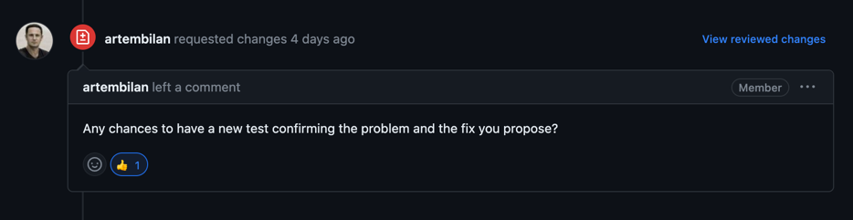

그래서 아래와 같이 테스트를 짰다.

```java
@SpringJUnitConfig
@EmbeddedKafka
@DirtiesContext
public class WithSpringTestContextTests {
	@Test
	void canAutowireBrokerInMethod(@Autowired EmbeddedKafkaBroker broker) {
		assertThat(broker).isNotNull();
	}

	@Nested
	class NestedClass {

		@Test
		void canAutowireBrokerInMethod(@Autowired EmbeddedKafkaBroker broker) {
			assertThat(broker).isNotNull();
		}

	}

	@Configuration
	static class Config {

	}
}
```

그리고는 Context Caching 자체를 테스트할 수도 있었지만, JUnit에 의존할 것 같다는 생각에서 그건 과할 것 같고, @Autowired를 통한 DI가 성공하는 지만 확인하는 테스트를 짰다고 말씀을 드렸고,

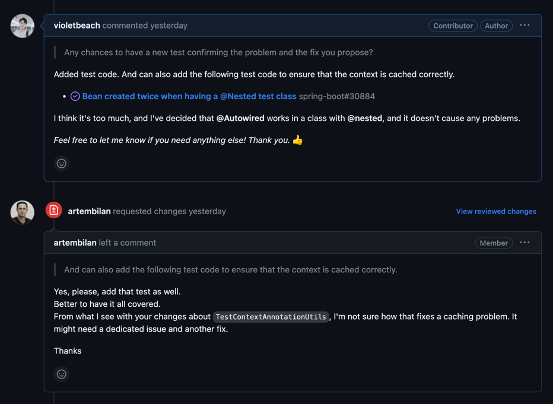

테스트는 가능한 전부 커버할 수록 좋다고 리뷰를 주셔서 아래의 테스트를 추가했다.

```java
@EmbeddedKafka
@SpringJUnitConfig(WithNestedClassContextTests.Config.class)
class WithNestedClassContextTests {

	private static final AtomicInteger counter = new AtomicInteger();

	@Autowired
	private TestClass outer;

	@Nested
	class NestedClass {

		@Test
		void equalsInjected(@Autowired TestClass inner) {
			assertThat(inner).isEqualTo(outer);
		}

		@Test
		void equalsSize(@Autowired List<TestClass> classes) {
			assertThat(classes).hasSize(1);
		}

		@Test
		void equalsCount() {
			assertThat(counter.get()).isEqualTo(1);
		}
	}

	public static class TestClass {
	}

	@Configuration
	static class Config {
		@Bean
		public TestClass testClass() {
			counter.incrementAndGet();
			return new TestClass();
		}
	}
}
```

## 결과

그 결과 하루도 안지나서 메인 브랜치로 코드를 반영해주셨고, 정말 고맙고 더 많이 기대한다는 말씀을 해주셨다!! (압도적 감사! 🙇🙇) 

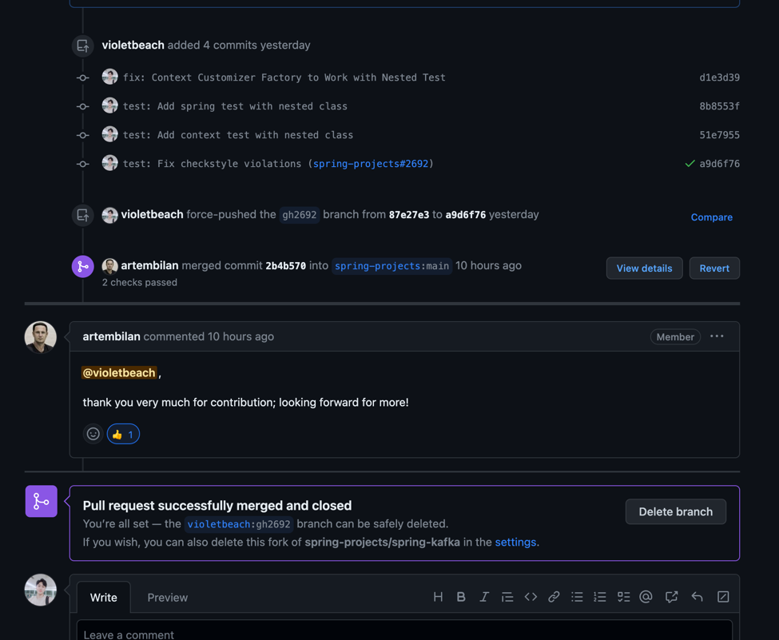

그래서 Spring-kafka의 Contributor가 되었다..! 👍

Spring-kafka 프로젝트에 기여하게 되면서 느낀 점은 오픈 소스를 어떻게 관리하는 지에 대해서 조금 배운 것 같다.
- Gradle - checkstyle
- 정밀한 문서화 (Contributing, Code of Conduct, SInCE, @author, ...)

의사소통도 매우 중요하다고 생각되는데, Spring이 등장하게 된 배경도 EJB의 불편한 문제들을 POJO 기반의 오픈 소스로 대체할 수 있음을 보여주면서 시작한 걸로 알고 있다.
- 지금의 스프링이 있는 것은 오픈 소스의 많은 기여와 그것들을 적절히 수용하고 관리한 스프링 담당 리더들로 인한 것 같다.

나도 사내에서 오픈 라이브러리를 많이 만드는 편인데 행동 강령, 룰을 만들거나 어떻게 해야 좋은 라이브러리로 관리할 수 있는 지 연구해봐야곘다.

## 참고
- https://github.com/spring-projects/spring-kafka
- https://github.com/junit-team/junit5
- https://junit.org/junit5/docs/current/user-guide/


