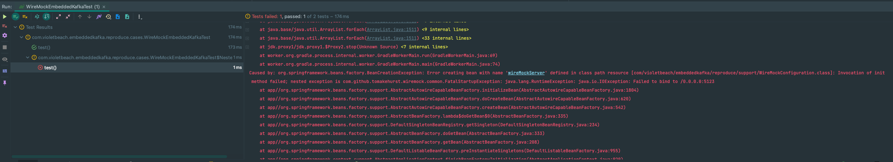

## @Nested와 @EmbeddedKafka가 호환이 안되는 이슈 해결!

개발 중에 EmbeddedKafka를 도입하니까 갑자기 테스트가 깨지는 현상이 발생했다.

딱히 잘못한 부분도 없는 데 깨진 것 같아서 의아했다.

자세히 확인해보니까 `@Nested` 어노테이션이 달린 클래스의 테스트들만 깨지고 있었다. 왜 그럴까..?
- WireMock 서버가 이미 떠 있다는 경고로 깨지고 있었다.
- WireMock을 제거하니 MockMvc에서 에러가 나고 있었다.

복잡한 프로젝트에서 확인하려니까 원인 찾기가 어려워서 새로 Github Repository를 파서 깡통 프로젝트에서 재현을 해보기로 했다.
- Repository: https://github.com/violetbeach/embedded-kafka-nested

## 1. WireMock으로 재현

아래는 실무에서 발생한 이슈와 동일하게 개인 Repository에서 재현한 부분이다. 

```java
@TestConfiguration
public class WireMockConfiguration {

    @Bean(initMethod = "start", destroyMethod = "stop")
    public WireMockServer wireMockServer() {
        return new WireMockServer(9561);
    }

}
```

```java
@EmbeddedKafka
@SpringBootTest
@Import(WireMockConfiguration.class)
public class WireMockBased {
}
```

```java
class WireMockEmbeddedKafkaTest extends WireMockBased {

    @Test
    void test() {
    }

    @Nested
    class NestedClass {

        @Test
        void test() {
        }

    }

}
```

결과를 보면 실무에서 봤던 에러가 그대로 발생하고 있다.



테스트 결과는 아래와 같다.

- @Nested에 속하지 않은 테스트는 문제가 없이 통과한다.
- @Nested에 속한 테스트는 WireMockServer가 이미 존재한다는 에러가 발생한다.

디버깅을 해보니 WireMockServer가 두 번 뜨고 있었다.

특이점을 정리하면 아래와 같다.
- @Nested를 제거하면 통과한다.
- @EmbeddedKafka를 제거하면 통과한다.
- WireMockServer의 port를 0(dynamic)으로 하면 통과한다.
  - 2번 뜨지만 dynamic 이므로 충돌이 발생하지 않아서 통과

## 2. RestDocs로 재현

```java
@EmbeddedKafka
@AutoConfigureRestDocs
@AutoConfigureMockMvc
@SpringBootTest
public class RestDocsBased {

    @Autowired
    protected MockMvc mockMvc;

}
```

```java
class RestDocsEmbeddedKafkaTest extends RestDocsBased {

    @Test
    void test() throws Exception {
        mockMvc.perform(get("/test"));
    }

    @Nested
    class NestedClass {

        @Test
        void test() throws Exception {
            mockMvc.perform(get("/test"));
        }

    }

}
```

여기서도 케이스는 동일했다.
- @Nested에 속한 테스트만 깨진다.
- @EmbeddedKafka를 제거하면 테스트에 통과한다.
- @AutoConfigureRestDocs를 제거해도 테스트에 통과한다.

에러 내용은 아래와 같다.


### 추가

추가로 @EmbeddedKafka를 사용할 때 RepositoryTest 등도 꺠졌는데, `Mockito.verify(instance, times(1))` 등에서 1번이 아니라 2번 호출되었다는 등의 에러가 발생한 것을봐서 Context에 영향을 준 듯 하다.

@EmbeddedKafka 애노테이션을 붙이고 나서 테스트끼리 독립적이지 못하게 된 것 같다.

## 뭐가 문제 일까?

디버깅을 하다가 발견한 것은 SpringBootContextLoader.initialize가 2세트가 실행되고 있었다.


해당 메서드를 호출하는 SpringBootContextLoader.DefensiveWebApplicationContextInitializer에서 initialize()를 @EmbeddedKafka 애노테이션이 있을 때만 2번 실행하는 것이다.

이 방식으로 역으로 계속 타고 올라가니까 계속 init()과 같은 메서드가 두 번씩 호출되고 있었고, SpringBootContextLoader.loadContext()가 두 번 실행된다는 사실을 알게 되었다.


### config


첫 번째 뜰때는 총 11개의 contextCustomizers가 존재했고


두 번째 컨텍스트 로딩 때는 EmbeddedKafkaContextCustomizer를 제외한 10개만 존재했다.

즉, EmbeddedKafka를 포함한 Context 1개와, 테스트 환경을 위한 Context 1개 총 2개가 뜨고 있었다.

그래서 생각해봤을 때 해결 방법은 두 가지가 있었다.
- 2개의 Context가 충돌이 발생하지 않도록 처리
  - WireMock 등은 EmbeddedKafka Context에서도 뜨지 않도록 처리
  - RestDocs를 적용한 MockMvc도 충돌하지 않도록 처리
- 1개의 Context 언애서 모두 처리하도록 처리

사실 크게 고민의 여지가 없었던 게 NestedClass를 사용하지 않으면 EmbeddedKafka를 포함한 1개의 Context만 뜬다. 그래서 1개의 Context가 떠야 맞는 것이라고 판단했다. 

## 해결 방법

### @NestedTestConfiguration

Junit의 레퍼런스를 보니까 `@NestedTestConfiguration` 애노테이션이 있었다.
- https://docs.spring.io/spring-framework/reference/testing/testcontext-framework/support-classes.html#testcontext-junit-jupiter-nested-test-configuration

해당 애노테이션의 value를 `EnclosingConfiguration.OVERRIDE`로 지정하면 테스트 구성이 상속되지 않고 독립적으로 실행된다고 한다.

그래서 해당 애노테이션을 붙여 봤다.


그 결과 WireMock의 포트 중복 문제는 해결되었지만, Restdocs 에러와 컨텍스트가 공유되는 문제는 여전히 발생했다.

결국 해결 방법이 아니었다. ㅠ

### Context 캐싱이 안되는 문제?

조금 더 깊게 디버깅을 해보니 의아한 점을 발견했다.


SpringBootTestContextBootstrapper 클래스의 buildTestContext()는 @EmbeddedKafka 애노테이션이랑 관계 없이 @Nested 라면 반드시 두 번 수행되었다.

즉, 두 번 중 한번은 캐싱되어서 동일한 컨텍스트를 사용할 수 있었다.

@EmbeddedKafka를 사용하면 두 번째 컨텍스트에는 EmbeddKafka가 없어서 캐싱이 실패해서 컨텍스트가 중복으로 뜨는 것이다.
- 즉, NestedClass에서는 EmbeddedKafka가 Context에 적용이 안되는 것이 문제인 것 같다.
  - 캐싱 실패로 이어지기 때문


@Nested Class에도 EmbeddedKafka Context를 적용해줘야 겠다고 생각했다. 그래서 확인 겸 어노테이션을 @Nested 클래스에 추가했더니 테스트가 통과한다.

이제 Merged## NestedTest와 Context의 관계 (feat. EmbeddedKafka)

개발 중에 EmbeddedKafka를 도입하니까 갑자기 테스트가 깨지는 현상이 발생했다.

딱히 잘못한 부분도 없는 데 깨진 것 같아서 의아했다.

자세히 확인해보니까 `@Nested` 어노테이션이 달린 클래스의 테스트들만 깨지고 있었다. 왜 그럴까..?
- WireMock 서버가 이미 떠 있다는 경고로 깨지고 있었다.
- WireMock을 제거하니 MockMvc에서 에러가 나고 있었다.

복잡한 프로젝트에서 확인하려니까 원인 찾기가 어려워서 새로 Github Repository를 파서 깡통 프로젝트에서 재현을 해보기로 했다.
- Repository: https://github.com/violetbeach/embedded-kafka-nested

## 1. WireMock으로 재현

아래는 실무에서 발생한 이슈와 동일하게 개인 Repository에서 재현한 부분이다.

```java
@TestConfiguration
public class WireMockConfiguration {

    @Bean(initMethod = "start", destroyMethod = "stop")
    public WireMockServer wireMockServer() {
        return new WireMockServer(9561);
    }

}
```

```java
@EmbeddedKafka
@SpringBootTest
@Import(WireMockConfiguration.class)
public class WireMockBased {
}
```

```java
class WireMockEmbeddedKafkaTest extends WireMockBased {

    @Test
    void test() {
    }

    @Nested
    class NestedClass {

        @Test
        void test() {
        }

    }

}
```

결과를 보면 실무에서 봤던 에러가 그대로 발생하고 있다.


테스트 결과는 아래와 같다.

- @Nested에 속하지 않은 테스트는 문제가 없이 통과한다.
- @Nested에 속한 테스트는 WireMockServer가 이미 존재한다는 에러가 발생한다.

디버깅을 해보니 WireMockServer가 두 번 뜨고 있었다.

특이점을 정리하면 아래와 같다.
- @Nested를 제거하면 통과한다.
- @EmbeddedKafka를 제거하면 통과한다.
- WireMockServer의 port를 0(dynamic)으로 하면 통과한다.
  - 2번 뜨지만 dynamic 이므로 충돌이 발생하지 않아서 통과

## 2. RestDocs로 재현

```java
@EmbeddedKafka
@AutoConfigureRestDocs
@AutoConfigureMockMvc
@SpringBootTest
public class RestDocsBased {

    @Autowired
    protected MockMvc mockMvc;

}
```

```java
class RestDocsEmbeddedKafkaTest extends RestDocsBased {

    @Test
    void test() throws Exception {
        mockMvc.perform(get("/test"));
    }

    @Nested
    class NestedClass {

        @Test
        void test() throws Exception {
            mockMvc.perform(get("/test"));
        }

    }

}
```

여기서도 케이스는 동일했다.
- @Nested에 속한 테스트만 깨진다.
- @EmbeddedKafka를 제거하면 테스트에 통과한다.
- @AutoConfigureRestDocs를 제거해도 테스트에 통과한다.

에러 내용은 아래와 같다.


### 추가

추가로 @EmbeddedKafka를 사용할 때 RepositoryTest 등도 꺠졌는데, `Mockito.verify(instance, times(1))` 등에서 1번이 아니라 2번 호출되었다는 등의 에러가 발생한 것을봐서 Context에 영향을 준 듯 하다.

@EmbeddedKafka 애노테이션을 붙이고 나서 테스트끼리 독립적이지 못하게 된 것 같다.

## 뭐가 문제 일까?

디버깅을 하다가 발견한 것은 SpringBootContextLoader.initialize가 2세트가 실행되고 있었다.


해당 메서드를 호출하는 SpringBootContextLoader.DefensiveWebApplicationContextInitializer에서 initialize()를 @EmbeddedKafka 애노테이션이 있을 때만 2번 실행하는 것이다.

이 방식으로 역으로 계속 타고 올라가니까 계속 init()과 같은 메서드가 두 번씩 호출되고 있었고, SpringBootContextLoader.loadContext()가 두 번 실행된다는 사실을 알게 되었다.


### config


첫 번째 뜰때는 총 11개의 contextCustomizers가 존재했고


두 번째 컨텍스트 로딩 때는 EmbeddedKafkaContextCustomizer를 제외한 10개만 존재했다.

즉, EmbeddedKafka를 포함한 Context 1개와, 테스트 환경을 위한 Context 1개 총 2개가 뜨고 있었다.

그래서 생각해봤을 때 해결 방법은 두 가지가 있었다.
- 2개의 Context가 충돌이 발생하지 않도록 처리
  - WireMock 등은 EmbeddedKafka Context에서도 뜨지 않도록 처리
  - RestDocs를 적용한 MockMvc도 충돌하지 않도록 처리
- 1개의 Context 언애서 모두 처리하도록 처리

사실 크게 고민의 여지가 없었던 게 NestedClass를 사용하지 않으면 EmbeddedKafka를 포함한 1개의 Context만 뜬다. 그래서 1개의 Context가 떠야 맞는 것이라고 판단했다.

## 해결 방법

### @NestedTestConfiguration

Junit의 레퍼런스를 보니까 `@NestedTestConfiguration` 애노테이션이 있었다.
- https://docs.spring.io/spring-framework/reference/testing/testcontext-framework/support-classes.html#testcontext-junit-jupiter-nested-test-configuration

해당 애노테이션의 value를 `EnclosingConfiguration.OVERRIDE`로 지정하면 테스트 구성이 상속되지 않고 독립적으로 실행된다고 한다.

그래서 해당 애노테이션을 붙여 봤다.


그 결과 WireMock의 포트 중복 문제는 해결되었지만, Restdocs 에러와 컨텍스트가 공유되는 문제는 여전히 발생했다.

결국 해결 방법이 아니었다. ㅠ

### Context 캐싱이 안되는 문제?

조금 더 깊게 디버깅을 해보니 의아한 점을 발견했다.


SpringBootTestContextBootstrapper 클래스의 buildTestContext()는 @EmbeddedKafka 애노테이션이랑 관계 없이 @Nested 라면 반드시 두 번 수행되었다.

즉, 두 번 중 한번은 캐싱되어서 동일한 컨텍스트를 사용할 수 있었다.

@EmbeddedKafka를 사용하면 두 번째 컨텍스트에는 EmbeddKafka가 없어서 캐싱이 실패해서 컨텍스트가 중복으로 뜨는 것이다.
- 즉, NestedClass에서는 EmbeddedKafka가 Context에 적용이 안되는 것이 문제인 것 같다.
  - 캐싱 실패로 이어지기 때문
  
이제 @Nested Class 테스트를 실행할 때 MergedContextConfiguration의 contextCustomizer에 왜 EmbeddedKafka가 없는 지 알아내면 될 것 같다.


위는 AbstractTestContextBootstrapper.getContextCustomizers()이다.

여기서 Customizers 목록을 조회를 한 후 MergeContextConfiguration을 생성한다.
두 번의 실행 모두 15개의 Factories가 조회되었고 EmbeddedKafkaContextCustomizerFactory도 존재했다.

즉, factory.createContextCustomizer 메서드의 결과가 null이 나온 것 같다.

### 돌고 돌아..

결국 돌고 돌아서 맨 처음 의심했던 EmbeddedKafkaContextCustomizerFactory 이다.


대상 클래스에 애노테이션이 붙지 않았다면 null을 반환하고 있다. 그래서 NestedClass의 테스트에서는 Customizere로 등록되지 못했던 것이다.


@Nested Class에도 EmbeddedKafka Context를 적용해줘야 겠다고 생각했다. 확인 겸 어노테이션을 @Nested 클래스에 추가했더니 테스트가 통과한다.

아니면 아래 처럼 상속을 사용해서 해결할 수도 있다.


EmbeddedKafka 애노테이션을 검색할 때 아래의 코드를 사용하는데, outer Class는 조회하지 않지만 super 클래스는 조회한다.
- AnnotatedElementUtils.findMergedAnnotation(testClass, EmbeddedKafka.class);

그래서 원인 파악은 끝냈고, 아래와 같이 수정했다.

```java
public class EmbeddedKafkaContextCustomizerFactory implements ContextCustomizerFactory {

	private final IsNestedTestClass isNestedTestClass = new IsNestedTestClass();

	@Override
	public ContextCustomizer createContextCustomizer(Class<?> testClass,
			List<ContextConfigurationAttributes> configAttributes) {
		EmbeddedKafka embeddedKafka =
				AnnotatedElementUtils.findMergedAnnotation(testClass, EmbeddedKafka.class);
		if(embeddedKafka != null) {
			return new EmbeddedKafkaContextCustomizer(embeddedKafka);
		}

		Class<?> search = testClass;
		while(isNestedTestClass.test(search)) {
			search = search.getDeclaringClass();
			embeddedKafka = AnnotatedElementUtils.findMergedAnnotation(search, EmbeddedKafka.class);
			if(embeddedKafka != null) {
				return new EmbeddedKafkaContextCustomizer(embeddedKafka);
			}
		}
		return null;
	}

}
```

해당 코드는 OuterClass까지 모두 고려한 후, Inner Class를 우선해서 어노테이션을 서칭하고 적용한다.

받아줄진 모르겠지만 Spring-Kafka 측에 PR을 날려봐야겠다.

## 참고
- https://github.com/spring-projects/spring-kafka
- https://github.com/junit-team/junit5


