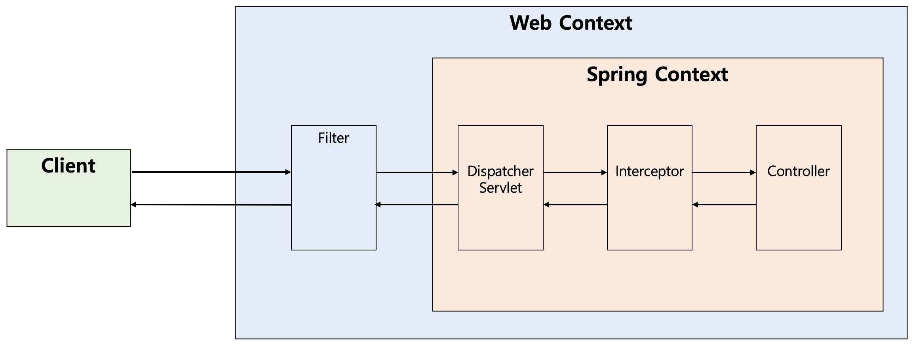
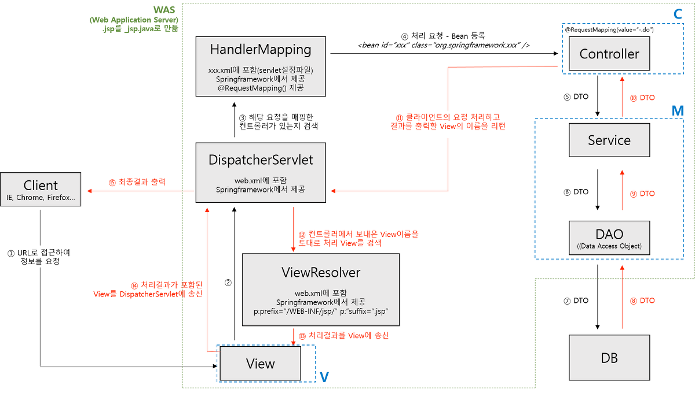

## Spring MVC의 동작 방식

흔히 설명할 때 Spring MVC의 동작 방식을 설명할 때 `DispatcherServlet`에 대해 설명하게 된다.

먼저 `DispatcherServlet`에 들어가기 전 단계에 대해 알아보자.

## Filter, Interceptor

우선 Filter의 경우 Spring Context 밖에 있다. 즉, 스프링과 무관하게 전역적인 처리를 할 때 사용한다.

이후에 DispatcherServlet을 지나서 Controller에 도달하게 되는데, 중간에 interceptor가 있을 수 있다.
- HandlerMapping에 의해 컨트롤러가 매핑된 다음에 요청을 가로채서 Interceptor가 동작을 수행한다.

## Spring 컨테이너 내부

스프링 컨테이너 내부는 다음 그림과 같다.

## 순서 정리

1. 클라이언트가 요청을 보낸다.
2. 클라이언트의 요청을 DispatcherServlet이 가로챈다.
3. HandlerMapping에게 보내 해당 요청을 처리할 Controller를 찾는다.
4. Controller는 비즈니스 로직을 거쳐 기능을 처리한다.
   1. (DispatcherServlet은 ModelAndView밖에 다룰 수 없기 때문에 ControllerAdapter가 DispatchServlet과 Controller간 모델 변환 과정을 수행한다.)
5. ViewResolver를 통해 view 화면을 찾는다.
6. 클라이언트에게 응답을 반환한다.

## 참고
- https://mangkyu.tistory.com/173
- https://javannspring.tistory.com/231