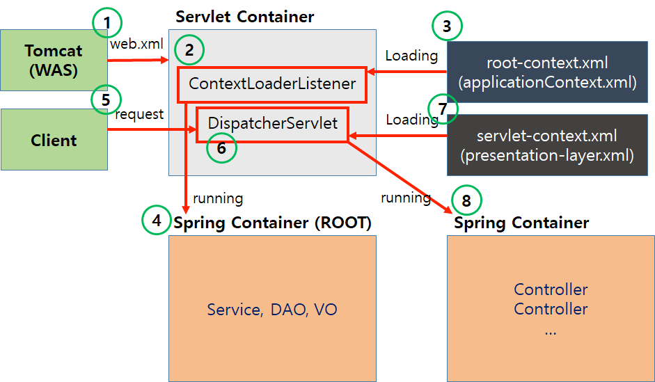
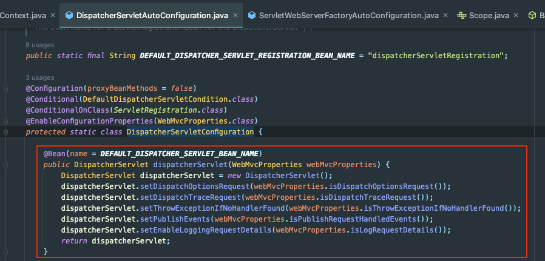

Spring Legacy 프레임워크가 실행되는 순서는 다음과 같다.



위 동작을 단계별로 정리해보자.

## 1. Tomcat(WAS)에 의해 **web.xml** 로드

web.xml은 WAS가 최초 구동될 때 사용하는 웹 애플리케이션 설정 파일이다.

```xml
<?xml version="1.0" encoding="UTF-8"?>
<web-app version="2.5" xmlns="http://java.sun.com/xml/ns/javaee"
    xmlns:xsi="http://www.w3.org/2001/XMLSchema-instance"
    xsi:schemaLocation="http://Java.sun.com/xml/ns/javaee https://java.sun.com/xml/ns/javaee/web-app_2_5.xsd">

    <!-- 첫번째 -->
    <context-param>
        <param-name>contextConfigLocation</param-name>
        <param-value>/WEB-INF/spring/root-context.xml</param-value>
    </context-param>
    
    <!-- 두번째 -->
    <listener>
        <listener-class>org.springframework.web.context.ContextLoaderListener</listener-class>
    </listener>

    <!-- 세번째 -->
    <servlet>
        <servlet-name>appServlet</servlet-name>
        <servlet-class>org.springframework.web.servlet.DispatcherServlet</servlet-class>
        <init-param>
            <param-name>contextConfigLocation</param-name>
            <param-value>/WEB-INF/spring/appServlet/servlet-context.xml</param-value>
        </init-param>
        <load-on-startup>1</load-on-startup>
    </servlet>

    <!-- 네번째 -->
    <servlet-mapping>
        <servlet-name>appServlet</servlet-name>
        <url-pattern>*.do</url-pattern>
    </servlet-mapping>

</web-app>
```

각 태그는 크게 4가지로 분류할 수 있다.

- `<context-param>`: 모든 서블릿과 필터가 공유하는 스프링 컨테이너 정의
- `<listener>`: 모든 서블릿 및 필터가 공유하는 스프링 컨테이너 리스너 정의
- `<servlet>`: DispatcherServlet의 구현 관련 정보(구현체, 파라미터 등) 
    - `<servlet-name>`: 서블릿 이름
    - `<servlet-class>`: 서블릿 구현체 클래스
    - `<init-param>`: 생성 시 필요한 파라미터 정보 
    - `<load-on-startup>`: 로딩 순서. 우선순위가 높은 서블릿부터 구동할 때 쓰이는 값이다.
- `<servlet-mapping>`: uri 패턴을 각 Servlet에 매칭

Spring MVC에서는 `web.xml`에 등록된 정보를 가지고 `ContextLoaderListener`를 생성한다.

`ContextLoaderListener`는 스프링 컨테이너(`ApplicationContext`)를 생성하는 클래스다.

## 2. **ContextLoaderListener**가 **root-context.xml**을 로드

`root-context.xml`에는 등록한 빈들(Service, Repository, ...)에 대한 정보가 명시되어 있다.

```java
public class ContextLoaderListener extends ContextLoader implements ServletContextListener {

    public ContextLoaderListener(WebApplicationContext context) {
        super(context);
    }

    public void contextInitialized(ServletContextEvent event) {
        this.initWebApplicationContext(event.getServletContext());
    }

    public void contextDestroyed(ServletContextEvent event) {
        this.closeWebApplicationContext(event.getServletContext());
        ContextCleanupListener.cleanupAttributes(event.getServletContext());
    }
}
```

`ContextLoaderListener`는 `ApplicationContext`를 구동한다.

`this.initWebApplicationContext()`에서 내부적으로 `root-context.xml`을 사용하여 빈들을 등록한다. 

## 3. **DispatcherServlet**은 **servlet-context.xml**을 로드 

이후 **최초** **클라이언트 요청**이 들어오면 `DispatcherServlet`을 생성하는 절차를 거친다.

```xml
<?xml version="1.0" encoding="UTF-8"?>
<beans:beans xmlns="http://www.springframework.org/schema/mvc"
    xmlns:xsi="http://www.w3.org/2001/XMLSchema-instance"
    xmlns:beans="http://www.springframework.org/schema/beans"
    xmlns:context="http://www.springframework.org/schema/context"
    xsi:schemaLocation="http://www.springframework.org/schema/mvc https://www.springframework.org/schema/mvc/spring-mvc.xsd
        http://www.springframework.org/schema/beans https://www.springframework.org/schema/beans/spring-beans.xsd
        http://www.springframework.org/schema/context https://www.springframework.org/schema/context/spring-context.xsd">

    <!-- DispatcherServlet Context: defines this servlet's request-processing infrastructure -->
    
    <!-- Enables the Spring MVC @Controller programming model -->
    <annotation-driven />

    <!-- Handles HTTP GET requests for /resources/** by efficiently serving up static resources in the ${webappRoot}/resources directory -->
    <resources mapping="/resources/**" location="/resources/" />

    <!-- Resolves views selected for rendering by @Controllers to .jsp resources in the /WEB-INF/views directory -->
    <beans:bean class="org.springframework.web.servlet.view.InternalResourceViewResolver">
        <beans:property name="prefix" value="/WEB-INF/views/" />
        <beans:property name="suffix" value=".jsp" />
    </beans:bean>
    
    <context:component-scan base-package="com.company.devpad" />
    
</beans:beans>
```

`DispatcherServlet`이 `servlet-context.xml`을 로드하여 필요한 빈들을 등록한다.
- `servlet-context.xml`로 정의된 빈은 `root-context.xml`로 정의된 빈을 사용할 수 있다.

결과적으로 스프링 컨테이너(ApplicationContext)가 구동되었으며, `DispatcherServlet`이 빈으로 등록되어 스프링 컨테이너 안에서 실행되고 있다.

## SpringBoot에서는..?

SpringBoot 개발 환경에서는 `web.xml`, `root-context.xml`, `servlet-context.xml` 어느 것도 신경쓰지 않는다. 어떻게 가능할까?



SpringBoot에서는 이러한 설정파일 없이도 **AutoConfiguration**으로 해결하고 있다.
- `web.xml`을 를 사용하지 않고도 `DispatcherServletAutoConfiguration`에서 Import한 `DispatcherServletConfiguration`에서 직접 `DispatcherServlet`을 생성한다.
- `xml` 기반의 빈 구성이 아닌 애노테이션 기반의 빈 구성을 사용(`@ComponentScan`으로 탐색)

## 참고

- https://devpad.tistory.com/24
- https://javannspring.tistory.com/231
