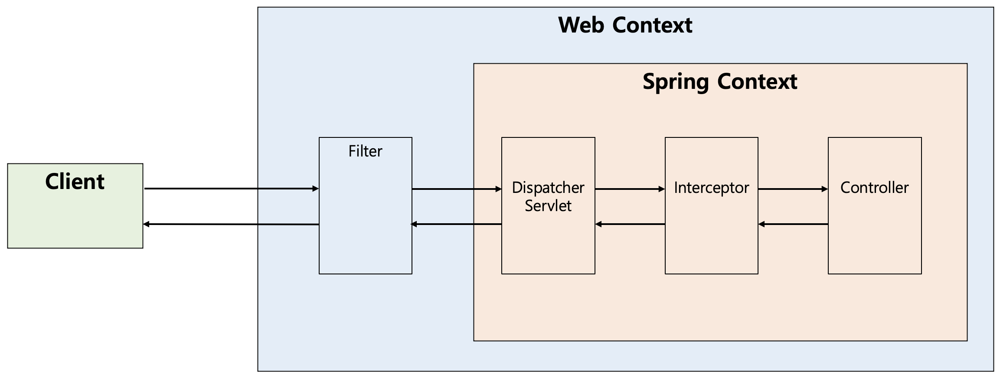
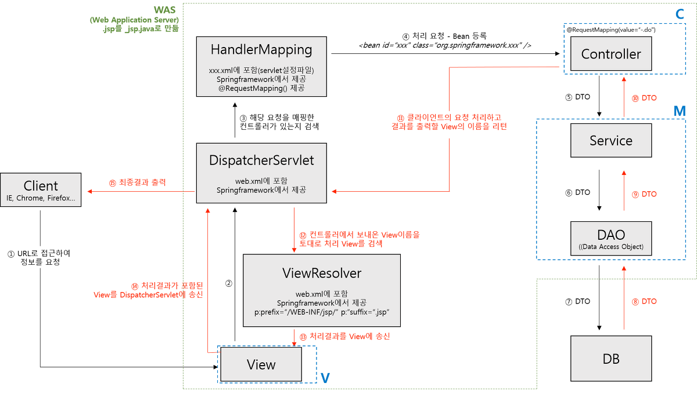
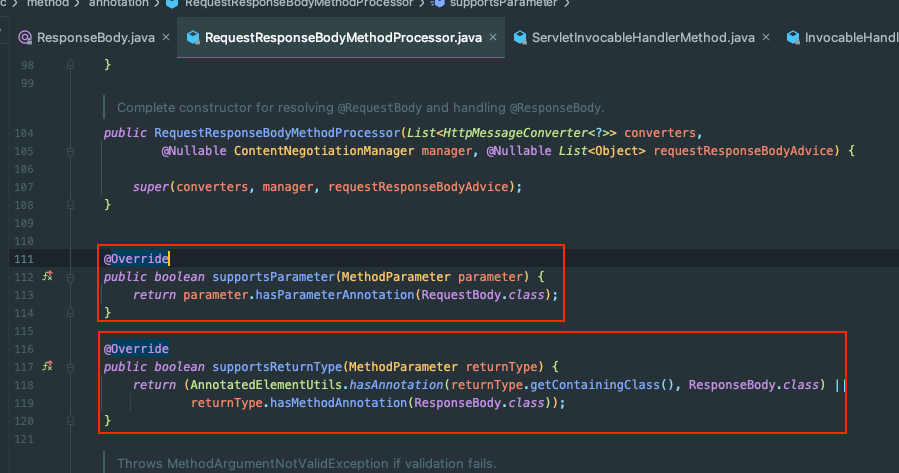
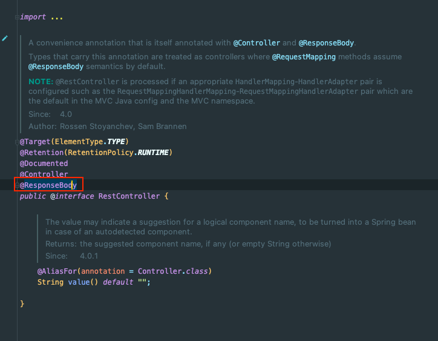
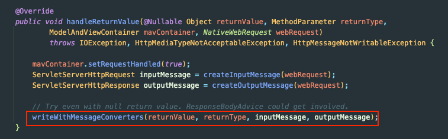

## Spring MVC의 동작 방식

흔히 설명할 때 Spring MVC의 동작 방식을 설명할 때 `DispatcherServlet`에 대해 설명하게 된다.

먼저 `DispatcherServlet`에 들어가기 전 단계에 대해 알아보자.

## Filter, Interceptor

우선 Filter의 경우 Spring Context 밖에 있다. 즉, 스프링과 무관하게 전역적인 처리를 할 때 사용한다.

이후에 DispatcherServlet을 지나서 Controller에 도달하게 되는데, 중간에 interceptor가 있을 수 있다.
- HandlerMapping에 의해 컨트롤러가 매핑된 다음에 요청을 가로채서 Interceptor가 동작을 수행한다.

## Spring 컨테이너 내부

스프링 컨테이너 내부는 다음 그림과 같다.

## 순서 정리

1. 클라이언트가 요청을 보낸다.
2. Servlet Container(Tomcat, ...)가 요청을 수신하고 web.xml의 Servlet(`DispatcherServlet`)에 전달한다.
4. HandlerMapping에게 보내 해당 요청을 처리할 Controller를 찾는다.
5. Controller는 비즈니스 로직을 거쳐 기능을 처리한다.
    - (DispatcherServlet은 ModelAndView밖에 다룰 수 없기 때문에 ControllerAdapter가 DispatchServlet과 Controller간 모델 변환 과정을 수행한다.)
6. ViewResolver를 통해 view 화면을 찾는다.
7. 클라이언트에게 응답을 반환한다.

## RestController에서는..?

컨트롤러에 `@ResponseBody`가 붙어있으면 `ViewResolver` 대신 `RequestResponseBodyMethodProcessor`를 사용한다.

`@RestController` 애노테이션도 `ResponseBody` 애노테이션을 포함한다.

그래서 내부적으로 `HttpMessageConverter`의 구현체를 통해 사용자에게 JSON / String / ByteArray 등 다양한 형태로 나갈 수 있게 된다.

## 참고
- https://mangkyu.tistory.com/173
- https://javannspring.tistory.com/231