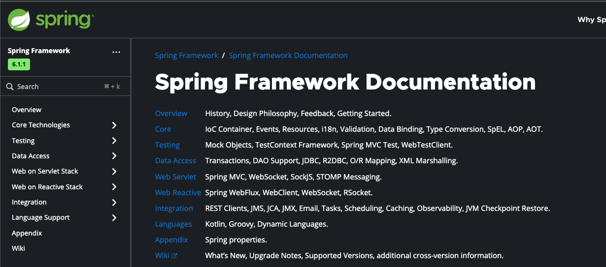
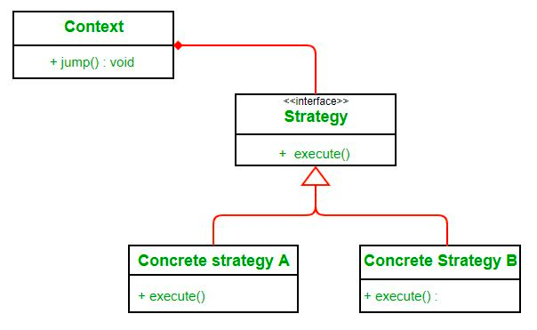
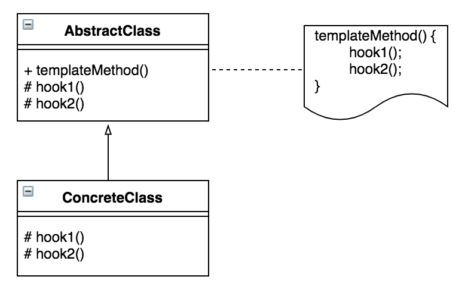

최근에 Spring 기술을 정확하게 모른다는 생각이 들었다.

그래서 Spring에 대해 더 자세히 알고 사용하고 싶고 **더 깊은 레벨로 문제를 해결**하고 싶어서 공식 문서를 정독하기로 했다.

아래는 Spring 공식 문서를 정독하여 얻은 지식을 기록한 것이다.

> **공유**보다는 **기록**이 목적이라 가독성이 매우 좋지 않다.

## 새롭게 알게 되었거나 리마인드할 필요가 있는 것 정리

- 빈은 정적 팩토리 메서드로도 생성할 수 있다.
- 빈은 2개 이상의 이름을 가질 수 있다. `@Bean` 애노테이션을 사용할 경우 `name` 옵션을 `,`로 연결하면 된다.
- 지연 초기화를 사용하면 특수한 경우 성능을 Safe 할 수 있다. (DI도 지연이 가능하다.)
- final class는 프록시를 생성할 수 없다. (final method가 있어서도 안된다.)
- Lookup Method Injection을 사용하면 싱글톤 Bean에서 프로토타입 범위의 Bean을 사용할 수 있다.
- RequestScope Bean을 사용하면 Spring MVC에서 ThreadLocal을 대체할 수 있다.
  - `SpringContext.getBean(T)`에서 리플렉션을 사용하므로 훨씬 느리다. 
  - Context Switching 비용은 줄일 수 있다.
- AOP에서 빈을 프록시로 래핑하는 것은 BeanPostProcessor이다.
- BeanPostPrecssor는 `InitializingBean.afterPropertiesSet()` 같은 컨테이너 초기화 메서드가 실행되기 전후에 콜백을 받게 된다.
- 스프링은 `JSR-250` 기반의 `@Resource` 등을 지원한다. (`@PostConstruct`, `@PreDestroy`)도 JSR-250 이다.
  - `@Autowired`는 필드 타입을 기준으로, `@Resource`는 필드 이름을 기준으로 빈을 찾는다.
  - 생성자 Injection도 필드 타입을 기준으로 실행된다.
- 스프링은 `JSR-330` 기반의 `@Inject`, `@Named`, `@Singleton` 등을 지원한다.
- `@Qualifier`는 빈의 이름과 다르다.
- `@Qualifier`를 상속하면 카테고리 문제를 푸는 데 도움이 된다. [Link](https://docs.spring.io/spring-framework/reference/core/beans/annotation-config/autowired-qualifiers.html)
- `@Qualifier`는 `@Primary`보다 우선권이 높다.
- `@Controller`, `@Repository`, `@Service` 등의 애노테이션은 `@Component` 애노테이션 이외에도 예외 자동 변환 등의 기능을 제공한다.
- `@Lazy`는 제한적이기 때문에 `ObjectProvider<Bean>` 방식을 권장한다.
- `@Bean` 애노테이션은 `@Component` 애노테이션과 다르게 `CGLIB` 프록시를 생성한다.
  - 그래서 `private` 또는 `final` 메서드를 사용할 수 없다.
- `@Component` 애노테이션 표준 자바 시멘틱을 가진다.
- `lite mode`란 CGLib 방식이 아닌 방식을 말한다. 스프링 빈의 싱글톤을 보장하지 않는다. [Link](https://hyojabal.tistory.com/25)
- `AnnotationConfigApplicationContext` 구현으로 `@Bean`, `@Compoennt`, `@Configuration`, `JSR-330` 등의 애노테이션을 인식한다.
- `@Configuration` 애노테이션도 `@Component`를 포함한다.
- `@Profile`, `@ActiveProfiles` 애노테이션에서는 `!`, `&`, `|` 등을 활용한 복잡한 표현식을 지원한다.
- `MessageCodesResolver`를  구현하면 단계적인 검증 에러 메시지를 사용할 수 있다.
- `BeanWrapper`를 사용하면 빈을 조작할 수 있다.
- `TypeDescriptor`를 활용하면 제너릭을 추출할 수 있다. [Link](https://docs.spring.io/spring-framework/reference/core/validation/convert.html)
- `Formatter`를 사용하면 Date 등과 String 사이를 변환하는 것을 전역적으로 적용할 수 있다.
- `SpEL`은 수식 및 메서드 등 생각하는 대부분의 표현이 전부 가능하다.
- `EvaluationContext`를 사용하면 `Context`에 변수를 생하는 등 표현식을 더 폭넓게 사용할 수 있다.
  - `student?.name`과 같은 훨씬 다양한 처리가 가능하다.
- Spring AOP는 순수 java로 구현된다.
- Spring은 `AspectJ`를 비롯한 대부분의 프레임워크가 비즈니스 및 도메인 모델에 침해하지 않도록 구현되었다.
- `Spring AOP`는 여러 개를 사용하고 우선 순위를 지정할 수 있다.
- Spring은 Proxy 매커니즘에서 자체 호출 문제에 대한 방향을 제시하고 있다. [Link](https://docs.spring.io/spring-framework/reference/core/aop/proxying.html)
- Spring에서 제공하는 `Null-Safety Annotation`을 사용하면 외부의 도움을 받아 NPE를 방지할 수 있다.
- Spring은 Java에서 NIO를 위해 지원하는 `ByteBuffer` 외에도 버퍼 재사용 및 성능에 도움되는 `DataBuffer`를 제공한다.
- Spring은 `AOT` 최적화를 지원한다.
  - 정확한 빈 타입 노출 등을 통해 `AOT`를 잘 제공할 수 있는 예시를 제공한다. ([Best Practices](https://docs.spring.io/spring-framework/reference/core/aot.html#aot.bestpractices)를 제공한다.)
- `META-INF`는 `spring.factories` 이외에도 `spring.handlers`, `spring.schemas` 등을 사용해서 문제를 풀거나 최적화할 수 있다.
- `SpringBoot` 3.0부터는 `spring.factories`와 `..AutoConfiguration.imports`를 혼용할 수 없다.
- Spring 팀도 공식적으로 TDD를 지지한다. (IoC를 제대로 사용하면 단위 테스트와 통합 테스트가 용이하다고 한다.)
  - `org.springframework.mock`, `org.springframework.test` 패키지에서 매우 다양하면서 **충분한 지원**을 하고 있다.
- Spring은 단위 테스트 뿐만 아니라 End-to-End 통합 테스트의 필요성도 지지한다.
- `TestExecutionListener`를 사용하면 테스트를 격리 시키기 용이하다.
- `TestContext`에 대해서도 매우 자세히 다루고 있다.
  - `TestContext`는 static 변수에 저장된다. 최대 크기는 32이고 LRU를 사용한다.
- `MockRestServiceServer`를 사용해서 특정 endpoint에 대한 API를 Mocking할 수 있다.
- `HtmlUnit`을 사용하면 js문법으로 뷰를 검증할 수 있다.
- 테스트의 트랜잭션은 `TransactionalTestExecutionListener`에 의해 롤백된다.
  - `ThreadLocal`에 현재 트랜잭션 상태를 관리한다.
- JPAEntity를 안전하게 테스트하려면 명시적인 `flush()`를 호출해야 한다.
- Spring은 `WebFlux`도 그렇고 `Mono`와 `Flux` 같은 Reactor는 메이저하게 다루고 있다.
- `Composed Annotations`를 사용해서 트랜잭션 매니저별로 다른 애노테이션을 적용하면 유용할 수 있다.
- 트랜잭션의 label을 사용하면 공통적인 처리를 할 수 있다.
  - `@Transactional(label = "retryable")`
- `Spring R2DBC` 종류도 이미 `JDBC`와 함께 메이저한 스택으로 작성되어 있다.
- `Transactional`의 `isolation` 중 `REQUIRES_NEW`의 CP 데드락 이슈는 공식문서에서도 다루고 있다.
- Spring Jdbc는 `Stored Procedure`를 위한 `SimpleJdbcCall` 클래스를 지원한다.
- Context의 Layer를 설정하는 것도 공식적으로 다루고 있다. [Link](https://docs.spring.io/spring-framework/reference/web/webmvc/mvc-servlet/context-hierarchy.html)
- WebSocket 방식도 공식적으로 지원한다.
- `Reactor Netty`, `Undertow`, `Tomcat`, `Jetty`를 **ServletContainer**라고 명칭한다.
- `@CrossOrigin` 애노테이션으로 특정 Controller 혹은 Controller 메서드에만 모든 origins, headers, http methods를 허용하는 등의 처리를 할 수 있다.
- `Spring-Kafka`, `ActiveMQ`등은 JMS의 표준을 따른다.
- `Spring`은 캐시 추상화를 제공한다. 특정 `CacheManager`을 지정해서 캐싱 방식을 부여할 수 있다.

## Strategy 패턴과 Template Method 패턴

공식 레퍼런스를 보면서 스프링 프레임워크가 지금까지도 **잘 관리되는 비결**에 대해 **나름대로 정리**할 수 있었다.

**스프링 프레임워크**가 지속 가능한 이유 중 가장 큰 이유로 `Strategy` 패턴과 `Template Method` 패턴이라고 생각하게 되었다.

> Spring에서는 훨씬 더 다양한 디자인 패턴이 존재한다.
> 
> Strategy, Adapter, Decorator, Proxy, Composite, Facade, Observer, Singleton, ...

#### 1. Strategy 패턴

스프링은 수많은 개념을 **추상화**하고 인터페이스로 사용한다. 인터페이스는 추상적인 개념만 담고 있다.

구현체는 **Interface**를 가지고 있고, 그것에 대한 구현을 다시 **전략 패턴**으로 주입을 받아서 사용한다.

스프링은 `Servlet` 1개의 작업을 처리하기 위해 연계된 작업들도 대부분 **Interface**로 추상화를 하고있다.
`Servlet`을 구현한 `DispatcherServlet`을 만들었다.

`DispatcherServlet`은 다시 전략패턴을 사용해서 아래의 **추상화된 개념에만 의존**한다.

- `HandlerMapping`
- `HandlerAdapter`
- `ViewResolver`
- `ThemeResolver`
- `LocaleResolver`
- `ThemeResolver`

해당 **인터페이스의 구현체들은 다시 추상화된 개념(Interface)에만 의존**한다.

- `ErrorResponse`
- `HttpRequestHandler`
- `ExceptionHandler`
- `MultipartResolver`
- `RequestCondition`
- `MultipartFile`
- `HttpResource`
- ...

전략 패턴의 장점은 **기존 구조가 되는 코드를 변경하지 않고**, **무수한 기능의 확장**과 **기술의 발전**이 가능하다.

이러한 설계는 SOLID 원칙 중 다음의 원칙을 만족시킨다.
- SRP (단일 책임 원칙)
- OCP (개방 폐쇄 원칙)
- DIP (의존 역전 원칙)
#### 2. Template method 패턴

아래는 Template method의 구조이다.

스프링은 수많은 개념을 추상화하고 인터페이스로 사용한다.

- `BeanFactory`
- `BeanPostProcessor`
- `CacheManager`
- `JdbcTemplate`
- `JmsOperations`
- `Controller`
- `Expression`
- `Message`

그래서 각 라이브러리나 사용자가 해당 메서드를 구현하면서 조립할 수 있게 한다.

즉, 구현 클래스들은 **추상적인 개념에만 의존**하기 때문에 얼마든지 **교체나 확장이 가능하다**. 낡은 클래스는 보수하거나 새로운 클래스로 교체하면 된다.

만약 인터페이스에서 **특정 부분의 구현만 확장**하고 싶다면 **추상 골격 클래스**를 사용한다.

Spring에서는 아래의 추상 골격 클래스들을 사용한다.
- `AbstractApplicationContext`
- `AbstractResourceReolsver`
- `AbstractRoutingDataSource`
- `AbstractCacheManager`
- `AbstractEncoder`
- `AbstractController`
- `AbstractCacheResolver`
- `AbstractSqlParameterSource`

해당 클래스들 역시 **추상적인 개념**인 인터페이스를 구현하고 있다. 즉, 템플릿 메서드 패턴은 **특정한 부분에 대한 골격을 제공**한다.

스프링은 **전략 패턴과 템플릿 메서드 패턴의 활용**으로 **지속 가능한 소프트웨어**로 발전시킬 수 있었다.

**'추상화가 무조건 좋다'가 아니다.** **올바른 추상화**는 **지속 가능한 소프트웨어**에 도움이 된다는 것이다. (Interface로 추출했어도 **논리적**으로 구현에 의존하고 있다면 **잘못된 추상**화이다.) 

## 마무리

**공식문서**를 다시 **정독**하면서 모르는 걸 하나씩 정리하면서 **스프링 전체 생태계에 대한 지식**이 더 쌓이는 것을 느꼈다.

스프링 생태게 뿐만 아니라 **다양한 패턴의 활용이나, 라이브러리에서 뭘 고려해야 하는 지** 등 시각이 조금 넓어지는 것 같다.

처음 공식 문서를 봤을 때는 잘 이해가 안되었는데, `아는 만큼 보인다`고 지금은 더 많이 보이게 되었다.

1년 뒤에는 지금보다 더 많이 보일 것이다.

## 참고
- https://docs.spring.io/spring-framework/reference
- https://coding-factory.tistory.com/712#google_vignette
- https://velog.io/@dvmflstm/Review-소프트웨어-개발의-지혜-TEMPLATE-METHOD-및-STRATEGY-패턴-상속과-위임