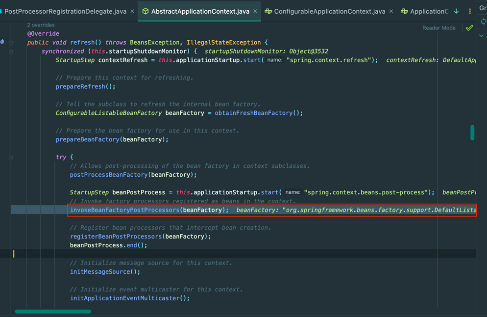

스프링 공식 문서를 읽다가 **Spring Bean**은 **어떤 자료구조에 저장**되어 있고 **어떤 과정으로 찾아서 의존을 주입하는 지**가 궁금해졌다.

해당 부분을 찾아가면서 알게된 결과에 대해 다룬다. 아래에서 말하는 Bean은 **싱글톤 빈**임을 가정한다.

#### 들어가기 전에

Spring의 경우 **템플릿 메서드 패턴과 전략 패턴을 충분히 활용**해서 **수 많은 인터페이스에 책임을 위임하고 있고 구현체도 아주 많다.**

그러다보니 자세히 다루면 양이 너무 방대해지는 문제가 있어서 **어디까지 다룰 것인가**에 대한 고민이 있었다.

너무 Deep한 문제는 다루지 않고 **내용을 다루기에 이해가 필요한 부분까지**만 다룰 것이니 겁먹지 마시고 봐주시면 좋겠다!

## getBean()

아래를 보면 `ApplicationContext`의 `refresh()`가 수행되면 `invokeBeanFactoryProcessors()`를 수행한다.



해당 메서드에서는 `getBean()` 메서드를 호출한다. 해당 포스팅에서 주요하게 다룰 메서드이다!

`getBean()`은 아래와 같이 `doGetBean()`를 호출한다.


#### Map에서 싱글톤 오브젝트를 조회

메서드에서 가장 먼저 실행되는 부분은 Bean의 **이름**으로 싱글톤 인스턴스를 가져오는 부분이다.


해당 메서드 내부를 살펴보면 기본적으로 `this.singletonObjects`라는 인스턴스 필드에서 `get()`을 호출해서 객체를 조회하고 있고 


해당 메서드에서 인스턴스 필드는 아래와 같다.


 
인스턴스 필드들을 보면 기본적으로 Map에 저장된 것을 알 수 있다.

메서드의 동작을 간략히 정리해봤다.
- singletonObjects에서 빈을 조회한다.
- 존재하지 않는다면 earlySingletonObjects에서 빈을 조회한다.
- synchronized 키워드와 함께 위 과정을 다시 한 번 수행한다.
- singletonFactories에서 해당 빈이 존재하는 지 조회한다.

**빈은 Key를 빈의 이름, Value가 인스턴스**인 **Map**에다가 저장해두고 조회하는 방식을 사용한다!


싱글톤은 위와 같이 타입을 변환해서 반환한다.

## 번외

싱글톤 빈이 어디에 저장되고 어떻게 찾는 지도 알 수 있었다.

그러면 **언제 어떻게 저장이 될까?**

디버깅을 위해 `TestConfig` 클래스를 생성하고 `@Configuration`으로 등록했다. Breaking Point는 **생성자 호출**로 잡았다.


디벼깅 결과 아래 부분이 수행됨을 알 수 있었고, 해당 부분은 `AbstractApplicationContext`의 `refresh()`의 일부이다.

```java
// Instantiate all remaining (non-lazy-init) singletons.
finishBeanFactoryInitialization(beanFactory);
```

해당 메서드를 파고 가보면 `getBean()`을 호출한다.


신기한 점은 디버깅을 위해 생성한 클래스의 **생성자가 호출되기 전에** `getBean()`이 호출되었다.

여기서도 중요한 것은 `doGetBean()`에 있었다.


빨간 색으로 표시한 부분은 아까 싱글톤 메서드를 가져올 때 생략했던 부분이다.

해당 부분에서는 **singleton**이 아닌 범위에 대한 분기도 포함하지만, **빈이 존재하지 않을 때**의 분기도 포함한다!


빈이 존재하지 않는다면 빨간 사각 부분이 실행된다.
1. createBean() 호출
2. getSingleton() 호출

`createBean()`는 복잡하지만 내부적으로 아래의 로직을 수행한다.

```java
BeanWrapper instanceWrapper = createBeanInstance(beanName, mbd, args);
return instanceWrapper.getWrappedInstance();
```

즉, 인스턴스를 생성해서 빈을 반환하고

`getSingleton()` 메서드는 내부적으로 아래 로직을 수행한다.

```java
synchronized (this.singletonObjects) {
    this.singletonObjects.put(beanName, singletonObject);
    this.singletonFactories.remove(beanName);
    this.earlySingletonObjects.remove(beanName);
    this.registeredSingletons.add(beanName);
}
```

정리하면 싱글톤으로 등록된 모든 빈의 `getBean()` 메서드가 실행되고, 해당 메서드가 실행될 때 Bean이 내부 자료구조에 존재하지 않는다면 **인스턴스를 생성**하고 **Map에 넣는다.**

이 과정을 우리는 **빈을 등록**한다고 부르는 것 같다.

## 참고

- https://docs.spring.io/spring-framework/reference
- https://github.com/spring-projects/spring-framework


