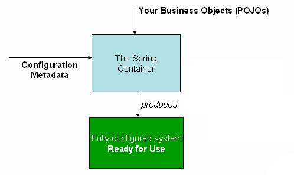

## 핵심 기술

> Foremost amongst these is the Spring Framework’s Inversion of Control (IoC) container. A thorough treatment of the Spring Framework’s IoC container is closely followed by comprehensive coverage of Spring’s Aspect-Oriented Programming (AOP) technologies. The Spring Framework has its own AOP framework, which is conceptually easy to understand and which successfully addresses the 80% sweet spot of AOP requirements in Java enterprise programming.

스프링의 수 많은 핵심 기술 중 가장 중요한 것은 `IOC Container`라고 소개한다. 그 뒤에 `AOP` 기술에 대한 내용이 밀접하게 관련되어 있다.

## Container

`ApplicationContext`는 `Spring IOC 컨테이너`를 의미하며 Bean의 인스턴스화, 구성 및 어셈블을 담당한다.

과거에는 `ClassPathXmlApplicationContext`나 `FileSystemXmlApplicationContext`의 인스턴스를 생성했지만 지금은 `Java 기반 구성`이나 `Groovy` 기반 구성을 사용하도록 컨테이너에 지시할 수 있다.

Spring 동작 방식은 아래와 같다.

