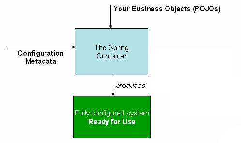

최근에 AOP를 비롯해서 Spring 기술을 정확하게 모른다는 생각이 들었다.

실무만 장애없이 처리할 수 있는 수준으로 구사할 수 있다.

그래서 Spring에 대해 더 자세히 알고 사용하고 싶고 더 깊은 레벨로 문제를 근본적으로 해결하고 싶어서 공식 문서를 정독하기로 했다.

아래는 Spring 공식 문서를 정독한 것을 기록한 것이다.

## 핵심 기술

> Foremost amongst these is the Spring Framework’s Inversion of Control (IoC) container. A thorough treatment of the Spring Framework’s IoC container is closely followed by comprehensive coverage of Spring’s Aspect-Oriented Programming (AOP) technologies. The Spring Framework has its own AOP framework, which is conceptually easy to understand and which successfully addresses the 80% sweet spot of AOP requirements in Java enterprise programming.

스프링의 수 많은 핵심 기술 중 가장 중요한 것은 `IOC Container`라고 소개한다. 그 뒤에 `AOP` 기술에 대한 내용이 밀접하게 관련되어 있다.

## Container

`ApplicationContext`는 `Spring IOC 컨테이너`를 의미하며 Bean의 인스턴스화, 구성 및 어셈블을 담당한다.

과거에는 `ClassPathXmlApplicationContext`나 `FileSystemXmlApplicationContext`의 인스턴스를 생성했지만 지금은 `Java 기반 구성`이나 `Groovy` 기반 구성을 사용하도록 컨테이너에 지시할 수 있다.

Spring 동작 방식은 아래와 같다.

## 새롭게 알게 되었거나 정확히 모르던 것

- 빈은 2개 이상의 이름을 가질 수 있다. `@Bean` 애노테이션을 사용할 경우 `name` 옵션을 `,`로 연결하면 된다.
- 빈은 정적 팩토리 메서드로도 생성할 수 있다.
- 지연 초기화를 사용하면 특수한 경우 성능을 Safe 할 수 있다. (DI도 지연이 가능하다.)
- final class는 CGLib 기반 프록시를 생성할 수 없다. (final method가 있어서도 안된다.)
- Lookup Method Injection을 사용하면 싱글톤 Bean에서 프로토타입 범위의 Bean을 사용할 수 있다.
- RequestScope Bean을 사용하면 Spring MVC에서 ThreadLocal을 대체할 수 있다.
  - `SpringContext.getBean(T)`에서 리플렉션을 사용하므로 훨씬 느리다. 
  - Context Switching 비용은 줄일 수 있다.
- AOP에서 빈을 프록시로 래핑하는 것은 BeanPostProcessor이다.
- BeanPostPrecssor는 빈 초기화 콜백 메서드가 호출된 후, `InitializingBean.afterPropertiesSet()` 같은 컨테이너 초기화 메서드가 실행되기 전에 콜백을 받게 된다.
- 스프링은 `JSR-250` 기반의 `@Resource` 등을 지원한다. (`@PostConstruct`, `@PreDestroy`)도 JSR-250 이다.
  - `@Autowired`는 필드 타입을 기준으로, `@Resource`는 필드 이름을 기준으로 빈을 찾는다.
- 스프링은 `JSR-330` 기반의 `@Inject`, `@Named`, `@Singleton` 등을 지원한다.
- `@Qualifier`는 빈의 이름과 다르다.
- `@Qualifier`를 상속하면 카테고리 문제를 푸는 데 도움이 된다. [Link](https://docs.spring.io/spring-framework/reference/core/beans/annotation-config/autowired-qualifiers.html)
- `@Qualifier`는 `@Primary`보다 우선권이 높다.
- `@Controller`, `@Repository`, `@Service` 등의 애노테이션은 `@Component` 애노테이션 이외에도 예외 자동 변환 등의 기능을 제공한다.
- `@Lazy`는 제한적이기 때문에 `ObjectProvider<Bean>` 방식을 권장한다.
- `@Bean` 애노테이션은 `@Component` 애노테이션과 다르게 `CGLIB` 프록시를 생성한다.
  - 그래서 `private` 또는 `final` 메서드를 사용할 수 없다.
- `@Component` 애노테이션 표준 자바 시멘틱을 가진다.
- `lite mode`란 CGLib 방식이 아닌 방식을 말한다. 스프링 빈의 싱글톤을 보장하지 않는다. [Link](https://hyojabal.tistory.com/25)
- `AnnotationConfigApplicationContext` 구현으로 `@Bean`, `@Compoennt`, `@Configuration`, `JSR-330` 등의 애노테이션을 인식한다.
- `@Configuration` 애노테이션도 `@Component`를 포함한다.
- `@Profile`, `@ActiveProfiles` 애노테이션에서는 `!`, `&`, `|` 등을 활용한 복잡한 표현식을 지원한다.
- `MessageCodesResolver`를  구현하면 단계적인 검증 에러 메시지를 사용할 수 있다.
- `BeanWrapper`를 사용하면 빈을 조작할 수 있다.
- `TypeDescriptor`를 활용하면 제너릭을 추출할 수 있다. [Link](https://docs.spring.io/spring-framework/reference/core/validation/convert.html)
- `Formatter`를 사용하면 Date 등과 String 사이를 변환하는 것을 전역적으로 적용할 수 있다.
- `SpEL`은 수식 및 메서드 등 생각하는 대부분의 표현이 전부 가능하다.
- `EvaluationContext`를 사용하면 `Context`에 변수를 생하는 등 표현식을 더 폭넓게 사용할 수 있다.
  - `student?.name`과 같은 훨씬 다양한 처리가 가능하다.
- Spring AOP는 순수 java로 구현된다.
- Spring은 `AspectJ`를 비롯한 대부분의 프레임워크가 비즈니스 및 도메인 모델에 침해하지 않도록 구현되었다.
- `Spring AOP`는 여러 개를 사용하고 우선 순위를 지정할 수 있다.
- Spring은 Proxy 매커니즘에서 자체 호출 문제에 대한 방향을 제시하고 있다. [Link](https://docs.spring.io/spring-framework/reference/core/aop/proxying.html)
- Spring에서 제공하는 `Null-Safety Annotation`을 사용하면 외부의 도움을 받아 NPE를 방지할 수 있다.
- Spring은 Java에서 NIO를 위해 지원하는 `ByteBuffer` 외에도 버퍼 재사용 및 성능에 도움되는 `DataBuffer`를 제공한다.
- Spring은 `AOT` 최적화를 지원한다.
  - 정확한 빈 타입 노출 등을 통해 `AOT`를 잘 제공할 수 있는 예시를 제공한다. ([Best Practices](https://docs.spring.io/spring-framework/reference/core/aot.html#aot.bestpractices)를 제공한다.)

## Template Method 패턴

공식 레퍼런스를 보면서 스스로 생각하는 스프링 프레임워크가 지금까지도 잘 유지되고 있는 이유를 찾았다.

바로 `Template Method` 패턴이다.

공식문서를 보면서 `Scope` 인터페이스를 구현할 수도 있지만, `ScopeMetadataResolver`와 같은 해당 인터페이스를 사용하는 쪽도 모두 인터페이스로 되어있다.

작업 A를 하기 위해서 A -> B -> C -> D Task로 나눈다고 봤을 때 A, B, C, D 모두 인터페이스로 되어 있고 템플릿 메서드패턴으로 설계되어 있다.

예를 들면 아래의 것들이 전부 인터페이스인 것과 같다.
- Servlet
- HandlerMapping
- HandlerAdapter
- ViewResolver
- ExceptionHandler
- ThemeResolver
- ...

즉, Task 자체를 Interface로 나타내고 구현은 절대 담지 않는 것이다.

이 방법의 장점은 초기 설계만 잘하면 무수한 기능의 확장과 기술의 발전이 가능하다. 설령 초기 설계를 못했더라도 특정 Task 들을 묶어서 인터페이스를 교체하면 된다.

> https://docs.spring.io/spring-framework/reference/core/databuffer-codec.html

## 소감

정독을 하면서 모르는 걸 하나씩 알게 되고 메모했고, 그것들이 합쳐져서 스프링에 대한 지식이 더 깊어짐을 느꼈다.

입문자..(?)는 조금 어려울 수 있지만, 스프링에 대해 더 깊게 이해하고 싶은 사람이 있다면 꼭 추천한다!

## 참고
- https://docs.spring.io/spring-framework/reference