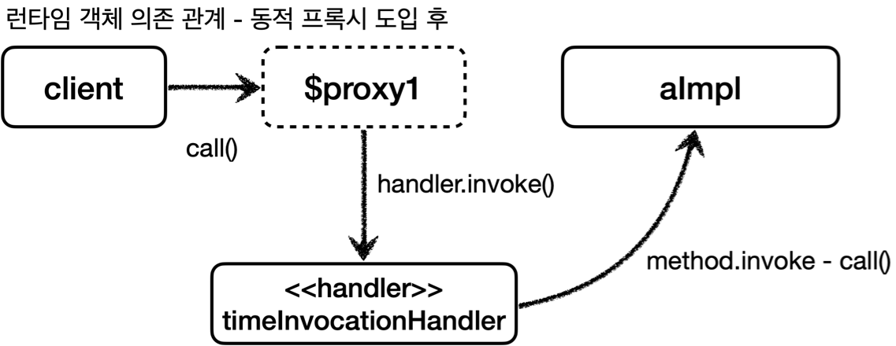
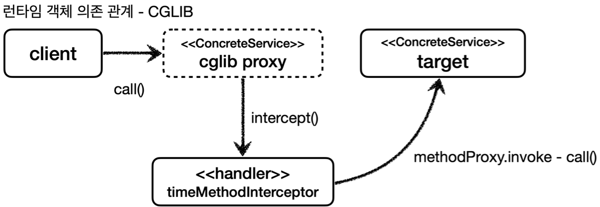

지난번 AOP를 적용하면서 생겼던 문제에 대해 소개했다.
- https://jaehoney.tistory.com/375

이번 포스팅에서는 실무보다는 **기본 개념**에 대해 집중적으로 알아보자.

해당 포스팅은 **김영한님의 스프링 핵심 원리 - 고급편**의 프록시 관련 내용을 정리한 것이며, **프록시와 AOP의 동작의 기본 개념**이라고 보면 된다.

## 프록시 패턴

프록시 패턴에서는 프록시가 너무 많이 생기는 문제가 있다.

아래는 GOF 프록시 패턴의 예시이다.


예로 들면 `Repository` 1개마다 전부 프록시 클래스를 생성해야 한다. 프록시를 적용할 클래스가 100개라면 100개의 프록시를 적용하는 코드를 만들어야 한다.
- **단일 책임 원칙**에 어긋나게 된다.

이 문제를 해결하기 위한 기술이 **Dynamic proxy** 이다.

## 다이나믹 프록시

프록시 패턴에서는 대상 클래스 1개마다 클래스를 1개 추가해야 한다는 단점이 필요하다.

프록시 1개만 사용해서 모든 클래스에 프록시를 적용할 수 없을까? 이걸 해결하는게 **동적 프록시(Dynamic Proxy)** 방식이다.

동적 프록시 중에서 JDK 동적 프록시를 이해하기 위해 **리플렉션**에 대해 가볍게 살펴보자.

#### 리플렉션

리플렉션을 사용하면 **프록시를 적용할 코드 1개로** **프록시 객체를 많이 생성**할 수 있다.

아래와 같이 코드를 작성하면 `dynamicCall()`이라는 공통 메서드를 추출할 수 있다.

```java
@Test
void reflection() throws Exception {
    Class classHello = Class.forName("jaehoney.proxy.jdkdynamic.ReflectionTest$Hello"); 
    Hello target = new Hello();

    Method method = classHello.getMethod("print");
    dynamicCall(method, target);
}

private void dynamicCall(Method method, Object target) throws Exception {
    log.info("Hello");
    Object result = method.invoke(target);
    log.info("result={}", result);
}
```

## JDK 다이나믹 프록시

아래는 JDK 다이나믹 프록시를 사용한 예시이다.

`java.lang.reflect.InvocationHandler`를 구현한 클래스를 생성한다. 

```java
@Slf4j
public class TimeInvocationHandler implements InvocationHandler {

    private final Object target;

    public TimeInvocationHandler(Object target) {
        this.target = target;
    }

    @Override
    public Object invoke(Object proxy, Method method, Object[] args) throws Throwable {
        long startTime = System.currentTimeMillis();

        Object result = method.invoke(target, args);

        long endTime = System.currentTimeMillis();
        long resultTime = endTime - startTime;
        log.info("TimeProxy 종료 resultTime={}", resultTime);
        return result;
    }
}
```

이제 모든 클래스에 동일한 코드로 프록시를 적용할 수 있다.

```java
AInterface target = new AImpl();
TimeInvocationHandler handler = new TimeInvocationHandler(target);
AInterface proxy =
        (AInterface) Proxy.newProxyInstance(AInterface.class.getClassLoader(), new class[] {AInterface.class}, handler);
proxy.call();
```

주의할 점은 이 방식(Jdk Dynamic Proxy)은 **Interface**가 있어야만 사용할 수 있다.



JDK Dynamic Proxy를 사용하면 필요한 프록시 인스턴스 수는 N으로 동일하지만, 프록시를 적용할 클래스는 1개만 만들면 된다. 그래서 부가 기능은 `InvocationHandler`의 구현체에서만 관리해주면 된다.

즉, **단일 책임 원칙**을 지킬 수 있게 되었다.

## CGLib

JDK Dynamic Proxy는 **Interface**가 꼭 있어야만 동작한다.

그래서 클래스만 있는 경우에는 **CGLib**이라는 **바이트코드를 조작**하는 라이브러리를 사용한다.

`org.springframework.cglib.proxy.MethodInterceptor`를 구현하면 CGLib 기반 프록시로 동작시킬 수 있다. DynamicProxy와 다르게 java 패키지가 아닌 스프링 패키지에 있다.

MethodInterceptor의 구현체를 아래와 같이 정의한다.

```java
@Slf4j
public class TimeMethodInterceptor implements MethodInterceptor {

    private final Object target;

    public TimeMethodInterceptor(Object target) {
        this.target = target;
    }

    @Override
    public Object intercept(Object obj, Method method, Object[] args, MethodProxy methodProxy) throws Throwable {
        long startTime = System.currentTimeMillis();

        Object result = methodProxy.invoke(target, args);

        long endTime = System.currentTimeMillis();
        long resultTime = endTime - startTime;
        log.info("TimeProxy 종료 resultTime={}", resultTime);
        return result;
    }
}
```

그리고 아래와 같이 프록시를 만들어서 실행시킬 수 있다.

```java
AClass target = new AClass();
Enhancer enhancer = new Enhancer();
enhancer.setSuperclass(AClass.class);
enhancer.setCallback(new TimeMethodInterceptor(target));
AClass proxy = (AClass) enhancer.create();
proxy.call();
```

`CGLib`에서는 `JDK Dynamic Proxy`와 다르게 구체 클래스를 상속받아서 프록시를 생성한다. 그래서 Interface가 없어도 동작하도록 구현되었다. (스프링 프로퍼티 설정으로 변경할 수 있다.)



Spring은 기본적으로 Interface가 있는 경우  `JDK Dynamic Proxy`를 만들고, Interface가 없는 경우 `CGLib Proxy`를 만든다. Spring-Boot 2.0 부터는 `CGLib` 기반 프록시가 기본으로 채택되었다.

**주의사항**
- CGLib는 자식 클래스를 동적으로 생성하기 때문에 기본 생성자가 필요하다.
- 클래스에 final 키워드가 붙으면 예외가 발생한다.
- 메서드에 final 키워드가 붙으면 프록시 로직이 동작하지 않는다.

## 프록시 팩토리

스프링에서 인터페이스가 있을 경우에는 JDK 다이나믹 프록시를 적용하고, 인터페이스가 없을 때는 CGLib를 적용해야 한다.

스프링은 동적 프록시를 통합해서 편리하게 만들어주는 **프록시 팩토리**를 사용한다.


스프링은 아래와 같이 `adviceInvocationHandler`나 `adviceMethodInterceptor`는 **Advice**를 호출한다.

그래서 개발자는 프록시 전후에 실행되어야 하는 로직을 가진 **Advice**만 만들면 동적 프록시를 적용할 수 있다.


프록시 팩토리는 이 뿐만 아니라 **중요한 역할**이 하나 더있다.

인스턴스 1개에 여러 개의 AOP를 적용할 때 프록시는 **1개만 생성**된다. 그 이유는 프록시 팩토리가 여러 개의 Advisor를 가지기 때문이다.


Advisor는 1개의 Advice, 1개의 Pointcut을 가진다. 실제 동작은 Advisor의 Advice에서 하므로 프록시를 Advisor 수 만큼 생성할 이유가 없다.

그래서 스프링에서는 일반적으로 대상 클래스 1개당 1개의 프록시만 만들어서 사용한다.

## BeanPostProcessor

설명했듯 Jdk Dynamic Proxy나 CGLib Proxy 모두 1개의 클래스로 여러 프록시를 만들 수 있도록 동작한다.

AOP는 이를 `BeanPostProcessor` 를 사용해서 이를 해결하고 있다.

스프링에서 빈 저장소에 등록할 목적으로 생성한 객체를 **등록 직전**에 **조작하고 싶다면** **BeanPostProcessor**를 사용하면 된다.

**BeanPostProcessor**는 빈을 생성한 후 등록하기 전에 객체를 조작하거나, 완전히 다른 객체로 바꿔치기 하는 등을 할 수 있다.


만약 A 객체를 B 객체로 바꿔치기 하면 B 빈이 스프링 컨테이너에 등록된다.

#### \@PostConstruct

우리가 사용하는 `@PostConstruct`도 빈 후처리기를 사용한 기술이다.

스프링은 `CommonAnnotationBeanPostProcessor`를 자동으로 등록한다.

해당 후처리기에서 `@PostConstruct` 애노테이션이 붙은 메서드를 호출해준다.


### AOP

아래의 `BeanPostProcessor`를 살펴보자.

```java
public class PackageLogTracePostProcessor implements BeanPostProcessor {

    private final String basePackage;
    private final Advisor advisor;

    public PackageLogTracePostProcessor(String basePackage, Advisor advisor) {
        this.basePackage = basePackage;
        this.advisor = advisor;
    }
    
    @Override
    public Object postProcessAfterInitialization(Object bean, String beanName) throws BeansException {
        //프록시 적용 대상이 아니면 원본을 그대로 진행
        String packageName = bean.getClass().getPackageName();
        if (!packageName.startsWith(basePackage)) {
            return bean;
        }

        //프록시 대상이면 프록시를 만들어서 반환
        ProxyFactory proxyFactory = new ProxyFactory(bean);
        proxyFactory.addAdvisor(advisor);

        Object proxy = proxyFactory.getProxy();
        return proxy;
    }
}
```

bean을 가져와서 원하는 조건으로 체크를 한 후 **프록시로 Wrapping해서 반환**한다. 생성된 모든 빈에 대해 해당 메서드를 실행하므로 프록시를 일괄적으로 적용할 수 있다.

**Spring-AOP**에서도 크게 다르지 않다.


Spring-AOP는 `@Aspect`를 전부 찾아서 `Advisor`로 변환한다. 찾은 `Adivsor` 하나당 등록된 모든 빈을 대상으로 **Pointcut을 보고 대상을 체크**한다. 대상은 **Advice**를 적용한 프록시로 빈을 **Wrapping**한다. 

그래서 일괄적으로 프록시를 적용할 수 있다.

## 주의 사항

프록시 및 AOP에는 아래의 제약이 있다.
- JDK Dynamic Proxy, CGLib 둘다 메서드 오버라이딩 방식으로 동작한다.
  - 생성자, static 메서드, 필드 값 접근 에는 프록시를 상용할 수 없다.
  - 스프링 AOP의 조인 포인트는 **메서드 실행**으로 제한된다.
- 프록시 방식을 사용하는 **스프링 AOP**는 **스프링 빈**에만 적용할 수 있다.


