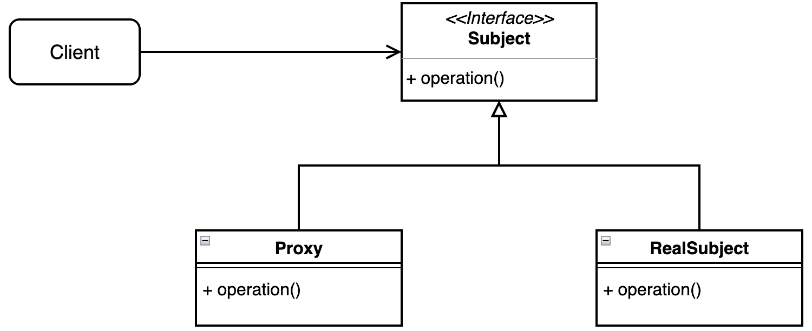
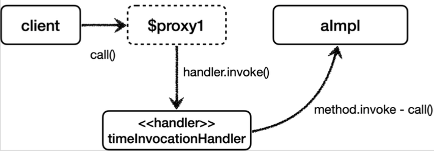

이번 포스팅은 **김영한님의 스프링 핵심 원리 - 고급편**의 내용을 정리한 것이다.

## GOF - 프록시 패턴

GOF의 프록시 패턴만을 사용하면 프록시가 너무 많이 생기는 문제가 발생한다.

아래는 GOF 프록시 패턴의 예시이다.



저 경우에는 적절할 수 있지만, 만약 트랜잭션을 적용하는 프록시를 예로 들면 `Repository` 1개마다 전부 프록시 클래스를 생성해야 한다. 프록시를 적용할 클래스가 100개라면 100개의 프록시 클래스를 만들어야 한다.

이 문제를 해결하기 위한 기술이 **Dynamic proxy** 이다.

## 다이나믹 프록시

프록시 패턴에서는 대상 클래스 1개마다 클래스를 1개 추가해야 한다는 단점이 필요하다.

프록시 1개만 사용해서 모든 클래스에 프록시를 적용할 수 없을까?

먼저 리플렉션을 상기해보자.

#### 리플렉션

리플렉션을 사용하면 프록시를 적용할 코드 1개만 만들면 동적 프록시를 사용해서 프록시 객체를 많이 생성할 수 있다.

가령 아래와 같이 코드를 작성하면 `dynamicCall()`이라는 공통 메서드를 추출할 수 있다.

```java
@Test 
void reflection() throws Exception {
    Class classHello = Class.forName("jaehoney.proxy.jdkdynamic.ReflectionTest$Hello"); 
    Hello target = new Hello();

    Method methodA = classHello.getMethod("callA");
    dynamicCall(methodA, target);
}

private void dynamicCall(Method method, Object target) throws Exception {
    log.info("Hello");
    Object result = method.invoke(target);
    log.info("result={}", result);
}
```

문제는 리플렉션은 **런타임에 동작**하기 때문에 매우 위험한 문제가 있다. 즉, 실제 메서드가 호출되고 리플렉션이 실패해서 에러가 터질 수 있다. .

#### JDK 다이나믹 프록시

아래는 JDK 다이나믹 프록시를 사용한 예시이다.

```java
@Sl4j 
public class TimeInvocationHandler implements InvocationHandler {
	private final Object target;
    
    public TimeInvocationHandler (Object target) { this.target = target; }
    
    @Override 
    public Object invoke(Object proxy, Method method, Object[] args) throws Exception {
        log.info("Hello");
        Object result = method.invoke(target, args);
        log.info("result={}", result);
        return result;
    }
}
```

이제 모든 클래스에 아래와 같이 프록시를 적용할 수 있다.

```java
AInterface target = new AImpl();
TimeInvocationHandler handler = new TimeInvocationHandler(target);
AInterface proxy =
        (AInterface) Proxy.newProxyInstance(AInterface.class.getClassLoader(), new class[] {AInterface.class}, handler);
proxy.call();
```



GOF 프록시 패턴과 비교했을 때 필요한 인스턴스 수는 N으로 동일하지만, 클래스는 1개만 만들면 된다. 그래서 부가 기능은 `InvocationHandler`의 구현체에서만 관리해주면 된다.

## CGLib