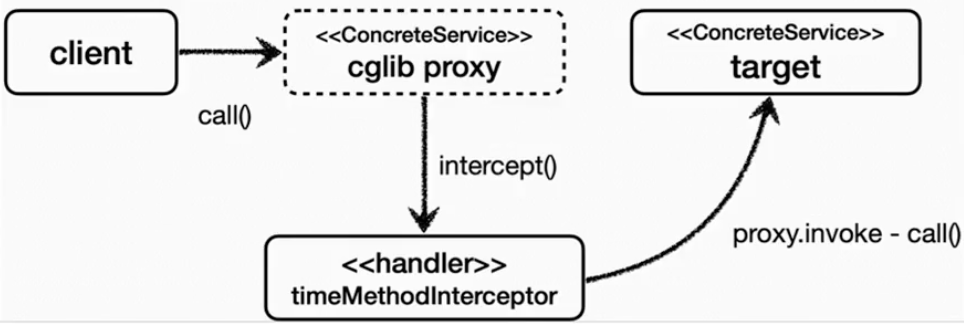
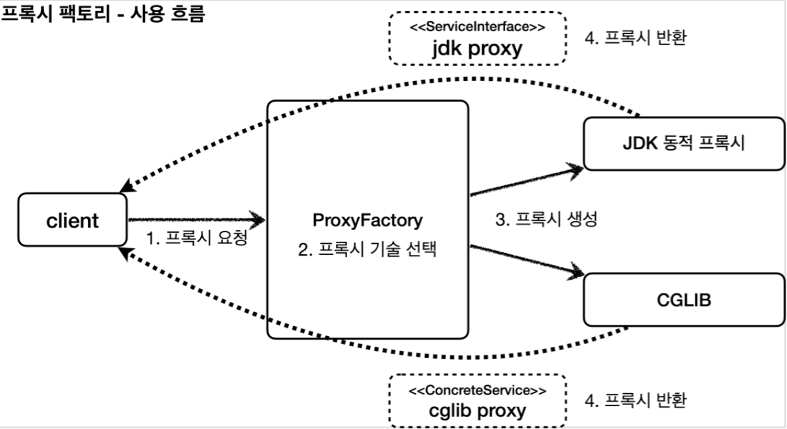
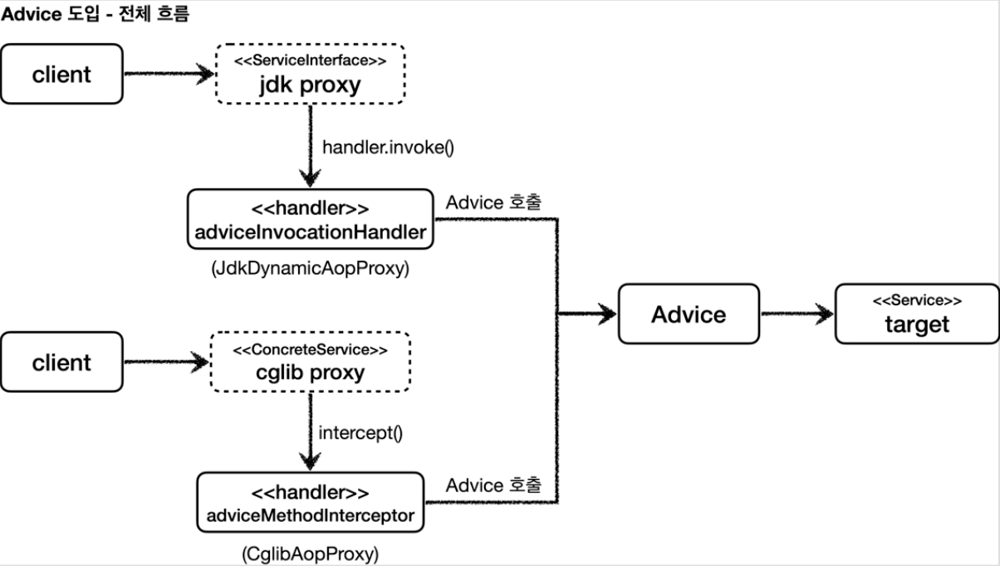
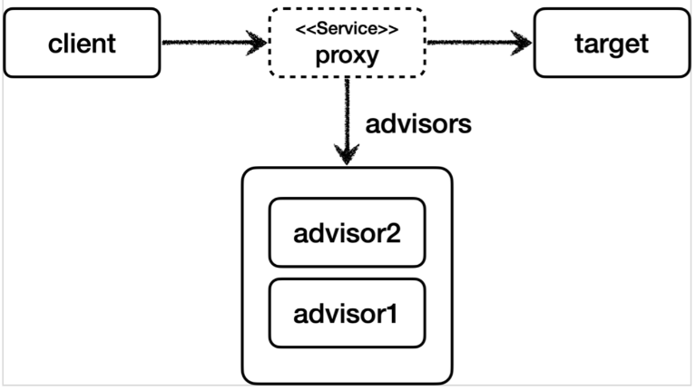

이번 포스팅은 **김영한님의 스프링 핵심 원리 - 고급편**의 프록시 관련 내용을 정리한 것이다.

## GOF - 프록시 패턴

GOF의 프록시 패턴만을 사용하면 프록시가 너무 많이 생기는 문제가 발생한다.

아래는 GOF 프록시 패턴의 예시이다.


저 경우에는 적절할 수 있지만, 만약 트랜잭션을 적용하는 프록시를 예로 들면 `Repository` 1개마다 전부 프록시 클래스를 생성해야 한다. 프록시를 적용할 클래스가 100개라면 100개의 프록시 클래스를 만들어야 한다.

이 문제를 해결하기 위한 기술이 **Dynamic proxy** 이다.

## 다이나믹 프록시

프록시 패턴에서는 대상 클래스 1개마다 클래스를 1개 추가해야 한다는 단점이 필요하다.

프록시 1개만 사용해서 모든 클래스에 프록시를 적용할 수 없을까? 이걸 해결하는게 **JDK Dynamic Proxy** 방식이다.

먼저 리플렉션에 대해 가볍게만 살펴보자.

#### 리플렉션
리플렉션을 사용하면 프록시를 적용할 코드 1개만 만들면 동적 프록시를 사용해서 프록시 객체를 많이 생성할 수 있다.

가령 아래와 같이 코드를 작성하면 `dynamicCall()`이라는 공통 메서드를 추출할 수 있다.

```java
@Test [20231025_181752_nana(nana@baihong.com)_Re__RE__Re__RE__Re__PET_INQUIRmail.eml](..%2F..%2F..%2F..%2FDownloads%2F20231025_181752_nana%28nana%40baihong.com%29_Re__RE__Re__RE__Re__PET_INQUIRmail.eml)
void reflection() throws Exception {
    Class classHello = Class.forName("jaehoney.proxy.jdkdynamic.ReflectionTest$Hello"); 
    Hello target = new Hello();

    Method methodA = classHello.getMethod("callA");
    dynamicCall(methodA, target);
}

private void dynamicCall(Method method, Object target) throws Exception {
    log.info("Hello");
    Object result = method.invoke(target);
    log.info("result={}", result);
}
```

문제는 리플렉션은 **런타임에 동작**하기 때문에 매우 위험한 문제가 있다. 즉, 실제 메서드가 호출되고 리플렉션이 실패해서 에러가 터질 수 있다. .

## JDK 다이나믹 프록시

아래는 JDK 다이나믹 프록시를 사용한 예시이다.

`java.lang.reflectInvocationHandler`를 구현한 클래스를 생성한다. 

```java
@Slf4j
public class TimeInvocationHandler implements InvocationHandler {

    private final Object target;

    public TimeInvocationHandler(Object target) {
        this.target = target;
    }

    @Override
    public Object invoke(Object proxy, Method method, Object[] args) throws Throwable {
        long startTime = System.currentTimeMillis();

        Object result = method.invoke(target, args);

        long endTime = System.currentTimeMillis();
        long resultTime = endTime - startTime;
        log.info("TimeProxy 종료 resultTime={}", resultTime);
        return result;
    }
}
```

이제 모든 클래스에 아래와 같이 프록시를 적용할 수 있다.

```java
AInterface target = new AImpl();
TimeInvocationHandler handler = new TimeInvocationHandler(target);
AInterface proxy =
        (AInterface) Proxy.newProxyInstance(AInterface.class.getClassLoader(), new class[] {AInterface.class}, handler);
proxy.call();
```

주의할 점은 이 방식(Jdk Dynamic Proxy)은 **Interface**가 있어야만 사용할 수 있다.


JDK Dynamic Proxy를 사용하면 필요한 인스턴스 수는 N으로 동일하지만, 클래스는 1개만 만들면 된다. 그래서 부가 기능은 `InvocationHandler`의 구현체에서만 관리해주면 된다.

## CGLib

JDK Dynamic Proxy는 **Interface**가 꼭 있어야만 동작한다.

그래서 클래스만 있는 경우에는 **CGLib**이라는 **바이트코드를 조작**하는 라이브러리를 사용한다.

`org.springframework.cglib.proxy.MethodInterceptor`를 구현하면 CGLib 기반 프록시로 동작시킬 수 있다. DynamicProxy와 다르게 java 패키지가 아닌 스프링 패키지에 있다.

MethodInterceptor의 구현체를 아래와 같이 정의한다.

```java
@Slf4j
public class TimeMethodInterceptor implements MethodInterceptor {

    private final Object target;

    public TimeMethodInterceptor(Object target) {
        this.target = target;
    }

    @Override
    public Object intercept(Object obj, Method method, Object[] args, MethodProxy methodProxy) throws Throwable {
        long startTime = System.currentTimeMillis();

        Object result = methodProxy.invoke(target, args);

        long endTime = System.currentTimeMillis();
        long resultTime = endTime - startTime;
        log.info("TimeProxy 종료 resultTime={}", resultTime);
        return result;
    }
}
```

그리고 아래와 같이 프록시를 만들어서 실행시킬 수 있다.

```java
AClass target = new AClass();
Enhancer enhancer = new Enhancer();
enhancer.setSuperclass(AClass.class);
enhancer.setCallback(new TimeMethodInterceptor(target));
AClass proxy = (AClass) enhancer.create();
proxy.call();
```

`CGLib`에서는 `JDK Dynamic Proxy`와 다르게 구체 클래스를 상속받아서 프록시를 생성한다. 그래서 Interface가 없어도 동작하도록 구현되었다. (스프링 프로퍼티 설정으로 변경할 수 있다.)



Spring은 기본적으로 Interface가 있는 경우  `JDK Dynamic Proxy`를 만들고, Interface가 없는 경우 `CGLib Proxy`를 만든다. Spring-Boot 2.0 부터는 `CGLib` 기반 프록시가 기본으로 채택되었다.

**주의사항**
- CGLib는 자식 클래스를 동적으로 생성하기 때문에 기본 생성자가 필요하다.
- 클래스에 final 키워드가 붙으면 예외가 발생한다.
- 메서드에 final 키워드가 붙으면 프록시 로직이 동작하지 않는다.

## 프록시 팩토리

스프링에서 인터페이스가 있을 경우에는 JDK 다이나믹 프록시를 적용하고, 인터페이스가 없을 때는 CGLib를 적용해야 한다.

스프링은 동적 프록시를 통합해서 편리하게 만들어주는 **프록시 팩토리**를 사용한다.



스프링은 아래와 같이 `adviceInvocationHandler`나 `adviceMethodInterceptor`는 **Advice**를 호출한다.

그래서 개발자는 프록시 전후에 실행되어야 하는 로직을 가진 **Advice**만 만들면 동적 프록시를 적용할 수 있다.



프록시 팩토리는 이 뿐만 아니라 **중요한 역할**이 하나 더있다.

인스턴스 1개에 여러 개의 AOP를 적용할 때 프록시는 **1개만 생성**된다. 그 이유는 프록시 팩토리가 여러 개의 Advisor를 가지기 때문이다.



Advisor는 Advice, Pointcut을 가진다. 실제 동작은 Advice에서 하므로 프록시를 Advisor 수 만큼 생성할 이유가 없어지는 것이다.


