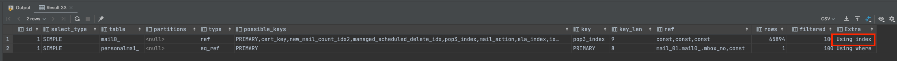

## Querydsl - Pagination(페이지 네이션)에서 커버링 인덱스 적용하기!

## 기존 쿼리

기존에는 Querydsl을 통해 아래의 쿼리문으로 데이터를 조회하고 있었다.

```sql
select
    mail0_.id as no1_7_0_,
    mail0_.office_id as basic_in2_7_0_,
    # 생략 (메일 데이터)

    mailconfid2_.id as no1_6_1_,
    mailconfid2_.office_id as basic_in2_6_1_,
    # 생략 (메일 상태 데이터)
from
    mail.mail_content mail0_
        left outer join
    mail.mailbox mailbox_
    on (
        mailbox_.id=mail0_.mbox_no
        and mail0_.office_id=mailbox_.office_no
    )
    left outer join
    mail.mail_confidence mailconfid2_
    on (
        mail0_.id=mailconfid2_.fk_mail_content_no
            and mail0_.office_id=mailconfid2_.office_no
            and mail0_.user_id=mailconfid2_.user_no
    )
where
    (
        mail0_.del_flag = 'N'
        )
  and mail0_.office_id= 1994
  and mail0_.user_id= 1
  and (
     mailbox_.lockinfo_type not in  ('LOCK' , 'LIMIT')
) limit 10
```

실행 계획은 아래와 같았다.


(메인 쿼리에서 PK를 타고 있었다.)

수행 시간은 환경별로 아래와 같다.
- dev → 3s 362
- prod → 1s 491

API 요청 수행 시간 (Http Transaction)
- dev -> 3.96s

## 개선

기존 - 2개의 쿼리
- 목록 조회
- 카운트 조회

수정 후 - 3개의 쿼리
- 커버링 인덱스 조회
- 카운트 조회
- 목록 조회

### 1. 커버링 인덱스 조회

```sql

select
        mail0_.id as col_0_0_
    from
        mail.mail_content mail0_
    left outer join
        mail.mailbox mailbox_
            on (
                mailbox_.id=mail0_.mbox_no
                and mail0_.office_id=mailbox_.office_no
            )
    where
        (
            mail0_.del_flag = 'N'
        )
        and mail0_.office_id=1994
        and mail0_.user_id=1
        and (
            mailbox_.lockinfo_type not in  (
                'A' , 'B'
            )
            or mailbox_.no is null
        ) limit 10
```

dev -> 123ms가 소요되었다.



실행 계획을 보면 커버링인덱스로 조회를 했고, PK가 아니라 사용된 인덱스를 사용할 수 있었다.

### 2. 카운트 쿼리

```sql
select
       count(mail0_.no) as col_0_0_
   from
       mail.mail_content mail0_
   left outer join
       mail.mailbox mailbox_
           on (
               mailbox_.id=mail0_.mbox_no
               and mail0_.office_id=mailbox_.office_no
           )
   where
       (
           mail0_.del_flag = 'N'
       )
       and mail0_.office_id=1994
       and mail0_.user_id=1
       and (
           mailbox_.lockinfo_type not in  (
               'A' , 'B'
           )
           or mailbox_.no is null
```

dev -> 351ms가 소요

카운트 쿼리도 커버링 인덱스로 조회할 수 있었다.


### 3. 목록 조회

마지막으로 SELECT를 해서 살을 붙이는 쿼리이다.

```sql
select
    mail0_.id as no1_7_0_,
    mail0_.office_id as basic_in2_7_0_,
    # 생략 (메일 데이터)

    mailconfid2_.id as no1_6_1_,
    mailconfid2_.office_id as basic_in2_6_1_,
    # 생략 (메일 상태 데이터)
   from
       mail.mail_content mail0_
   left outer join
       mail.mail_confidence mailconfid1_
           on (
               mail0_.id=mailconfid1_.fk_mail_content_no
               and mail0_.office_id=mailconfid1_.office_no
               and mail0_.user_id=mailconfid1_.user_no
           )
   where
       (
           mail0_.del_flag = 'N'
       )
       and (
           mail0_.no in (
               ? , ? , ? , ? , ? , ? , ? , ? , ? , ? , ? , ? , ? , ? , ? , ? , ? , ? , ? , ?
           )
       )
       and mail0_.office_id= 1994
       and mail0_.user_id= 1
```

dev -> 180ms 소요


PK만으로 조회를 하기 때문에 빠르게 조회가 가능하다.

## 코드

```java
// 조회 대상 id 목록을 커버링 인덱스로 조회한다.
JPAQuery<Long> idsQuery = subJpaQueryFactory
                .select(mail.id.no)
                .from(mail)
                .leftJoin(personalMailbox)
                .on(personalMailbox.no.eq(mail.mailbox.id), mail.id.officeNo.eq(personalMailbox.officeNo))
                .where(
                        mail.id.officeNo.eq(officeNo),
                        mail.officeUserNo.eq(officeUserNo)
                );

        // 동적 쿼리 (where)을 입히는 부분
        applyMailListSearchCondition(idsQuery, search);

        // 페이지 네이션을 적용하는 부분 (offset, limit을 써도 무방하다. 사내 라이브러리를 사용)
        JPQLQuery<Long> idsPageQuery = querydsl.applyPagination(pageable, idsQuery);

        // 토탈 카운트를 위해 카운트 쿼리를 날린다. 기존 쿼리의 Metadata를 꺼내면 where 조건을 그대로 입힐 수 있다.
        JPAQuery<Long> countQuery = createMailListCountQuery(idsPageQuery.getMetadata().getWhere());

        // 조회 쿼리 실행
        Page<Long> idsPage = PageableExecutionUtils.getPage(idsPageQuery.fetch(), pageable, countQuery::fetchOne);

        // 실제 데이터 블록 조회 쿼리
        JPAQuery<MailDto.ListInfo> query = subJpaQueryFactory.select(
                        new QMailDto_ListInfo(mail, mailConfidence))
                .from(mail)
                .leftJoin(mailConfidence)
                .on(mail.id.no.eq(mailConfidence.mailContentNo), mail.id.officeNo.eq(mailConfidence.id.officeNo), mail.officeUserNo.eq(mailConfidence.officeUserNo))
                .where(
                        mail.id.no.in(idsPage.getContent()),
                        mail.id.officeNo.eq(officeNo),
                        mail.officeUserNo.eq(officeUserNo)
                );

        // 정렬 필드 적용 및 조회
        List<MailDto.ListInfo> result = querydsl.applySorting(pageable.getSort(), query).fetch();

        return new PageImpl<>(result, idsPage.getPageable(), idsPage.getTotalElements());
```

코드는 위와 같이 작성할 수 있었다.

중요한 점은 기존 카운트 쿼리를 작성할 때 Where 조건을 동일하게 적용하는 것이다.
- count 쿼리의 결과가 바뀌진 않는 지 주의해야 한다. (기존 쿼리에 LeftOuterJoin이 있는 경우, ...)

이는 jpaQuery.getMetadata().getWhere()로 재사용할 수 있었다.

### DtoProjection

추가로 아직 문제가 있었는데 필요하지 않는 컬럼까지 조회한다는 것이다.
- DtoProjection을 잘못 사용해서 발생하고 있었다.
- 생성자의 인수로 필요한 컬럼만을 넘겨야 한다.

즉, Dto가 실제로 가지는 필드보다 생성자의 인수가 더 중요하다.

```java
JPAQuery<MailDto.ListInfo> query = subJpaQueryFactory.select(
                        new QMailDto_ListInfo(
                                mail.id,
                                // 필요한 메일 데이터 목록
                                mailConfidence.id,
                                // 필요한 메일 상태 데이터 목록
                        ))
                .from(mail)
                .leftJoin(mailConfidence)
                .on(mail.id.no.eq(mailConfidence.mailContentNo), mail.id.officeNo.eq(mailConfidence.id.officeNo), mail.officeUserNo.eq(mailConfidence.officeUserNo))
                .where(
                        mail.id.no.in(idsPage.getContent()),
                        mail.id.officeNo.eq(officeNo),
                        mail.officeUserNo.eq(officeUserNo)
                );
```

실제 데이터 블록을 조회하는 쿼리를 위와 같이 변경한 이후에는 필요한 데이터만 조회할 수 있었다.


## 결과 정리

dev 환경 기준으로 아래의 결과가 있었다.

- DB 조회
    - 기존 쿼리
      - 목록 조회 - 3s 362ms
      - 카운트 조회 - 207 ms
    - 수정 후
      - id 조회 - 123ms
      - 카운트 쿼리 - 207ms
      - 목록 조회 - 180ms
- HTTP 트랜잭션 수행 시간
  - 기존 - 3.792s
  - 수정 후 - 371ms
  - (약 100배)
  