MySQL 5.7을 사용하는 프로젝트의 **QueryDSL 동적 쿼리에서 특정 경우에 인덱스를 안타는 문제**가 발생했다.

운영 중인 서비스에서 **커버링인덱스를 탈 수 있는 상황에서는 인덱스를 선택**했지만, **인덱스에 없는 컬럼 정렬** 등에서 **PK**를 타서 쿼리가 밀리는 현상이 자주 생겼다.

그래서 `Index Hint`를 QueryDsl에서 사용할 수 있도록 조치가 필요했다. 아래는 해당 처리를 위해 길을 떠나면서 얻게된 방법들이다.

## 1. JPASQLQuery

`querydsl-jpa`는 `JPASQLQuery`라는 것을 제공한다. 아래는 해당 클래스의 설명이다.

> JPASQLQuery is an SQLQuery implementation that uses JPA Native SQL functionality to execute queries
> - http://querydsl.com/static/querydsl/4.1.3/apidocs/com/querydsl/jpa/sql/JPASQLQuery.html

직역하면 다음과 같다.

> JPASQLQuery는 JPA의 Native SQL 기능을 사용하는 Query이다.

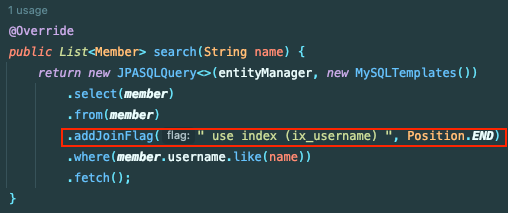

`JPASQLQuery`의 `addJoinFlag()`를 사용하면 **가장 최근에 추가한 Join(From) 이후**에 SQL을 삽입할 수 있었다.

결과 아래와 같이 `Use Index` 구문이 포함되어 잘 실행되었다.

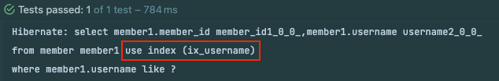

참고로 `force index`가 아니라 `use index`를 사용한 이유는 **강제**보다는 **권장** 정도로 충분했기 때문이다.

## 2. MySQLQueryFactory

다음은 `querydsl-sql`이라는 라이브러리를 사용하는 방법이다.
- `implementation "com.querydsl:querydsl-sql:{version}"`

아래는 `MySQLQueryFactory` 클래스에 대한 설명이다.

> MySQL specific implementation of SQLQueryFactory

직역하면 다음과 같다.

> MySQL 명세의 SqlQueryFactory 구현

`SqlQueryFactory`는 `JpaQueryFactory`와 다르게 **Native Query**를 동적으로 생성해주는 클래스이다.

`MySQLQueryFactory`를 사용하면 `MySQL`에서 지원하는 문법들을 메서드로 제공한다.

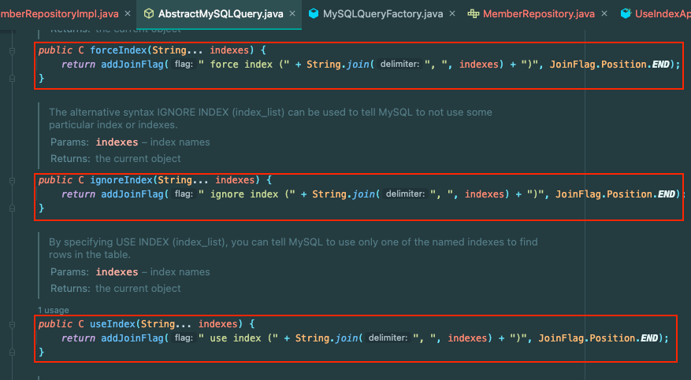

아래 코드를 실행해보자.

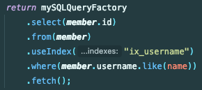

결과 아래와 같이 인덱스 힌트가 정상적으로 들어갔다.

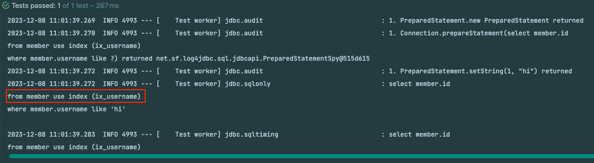

`SQLQueryFactory`는 Class 기반으로 **Native Query**를 생성하기 때문에 **DB 컬럼과 필드명이 정확히 일치**한 새로운 엔터티 모델을 생성해야 한다.

## 3. StatementInspector 사용

1번과 2번은 다소 불편하고 `JPQLQuery`를 구현하지 않으므로 `QueryDsl` 클래스와 같은 유틸 클래스를 활용하기 어렵다.

아래는 기존의 `JpaQueryFactory` 방식을 유지하는 방식이다.

`StateInspector`는 Hibernate에서 실행하는 쿼리의 일부를 대체하거나 전체를 교체할 수 있다.

아래와 같이 SQL 문에서 `{tablename} {alias}`을 찾아서 뒤에 인덱스 힌트를 추가한 문자열로 Replacing 할 수 있다. (테이블 명이 포함되지 않은 SELECT 절이나 WHERE 절은 그대로 유지된다.)

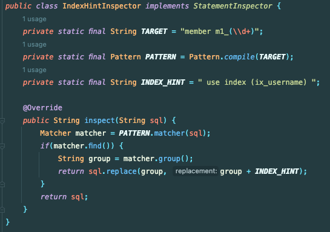

아래에서는 `HibernatePropertiesCustomizer`를 사용해서 `HibernateProperties`에 `StatementInspector`를 등록한다.

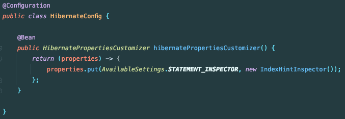

그 결과 아래와 같이 인덱스 힌트를 사용할 수 있다.

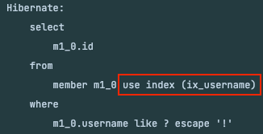

실제로도 잘 적용이 되는 것을 확인했다.

그렇지만 **해결해야 될 문제**가 있다.

#### 모든 쿼리에서 적용되는 문제

`Member` 엔터티를 사용하는 단건 조회에서도 해당 `StateInspector`가 특정 인덱스를 유도하면 안될 수 있다.

그래서 `QueryDsl`의 특정 로직에서만 **Alias**를 걸 수 있는 방법을 찾아봤다.

그러나 `new QMember(Member.class, "member_filtering")`로 생성한 **alias**의 경우 `hql`에는 반영이 되었다.

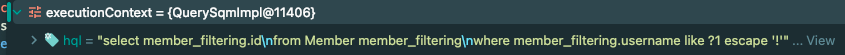

그렇지만 실제 `sql`에는 `alias`가 반영되지 않았다.

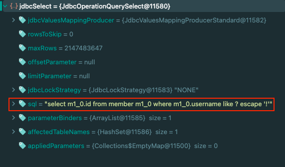

`alias`를 설정하는 로직은 `Hibernate-ORM`과 같은 영속성 라이브러리 및 **버전**에 따라 다르다. 사용하는 버전에 맞게 **어떻게든** `StatementInspector`와 `Entity` 클래스를 맞춰야 한다.

그래서 `StatementInspector`가 `Hibernate-ORM`에 논리적으로 강하게 의존해야한다.

그럼에도 1번과 2번은 사용하기가 어려운 상황이라서 이 방법을 사용하기로 했다.

### Hibernate ORM 5.6 에서는

Hibernate ORM 5.6 에서는 `FromElementFactory`에서 `tableAlias`를 세팅한다.

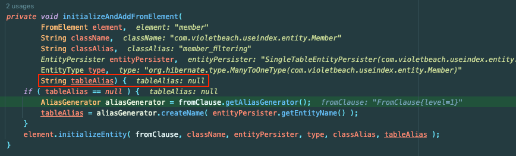

그런데 `FromElement`를 생성할 때 `tableAlias`를 null로 그냥 넣어버린다.

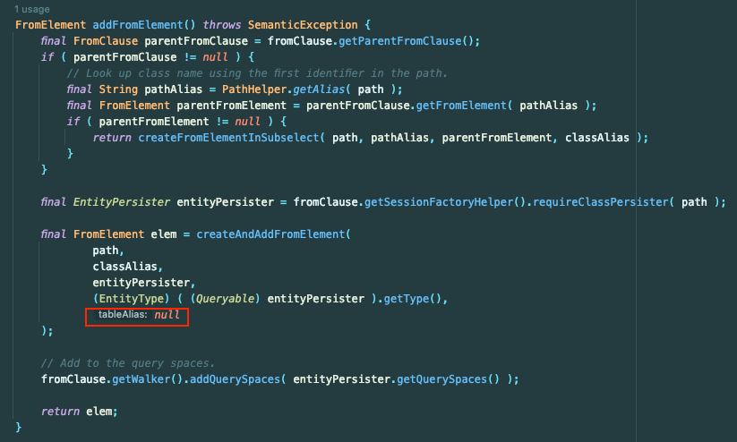

즉, `tableAlias`가 없을 때 타는 로직인 `AliasGenerator`에 의존적으로 구현하면 된다.

`AliasGenerator`는 다음의 룰을 따른다.
- `Entity` 클래스명을 소문자로 변경
- 앞에서 10자를 자른다.
- 끝에 `{count}_`를 붙인다.

즉, `AliasGenerator`는 Entity명에 종속적이므로 **Filtering을 위한 Entity 클래스**를 한 개 더 만든다.

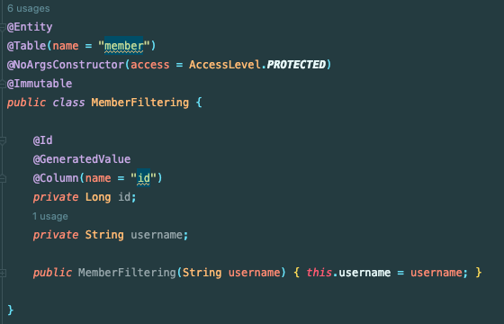

그리고 `AliasGenerator`에 의존해서 `StatementInspector`를 구현한다.

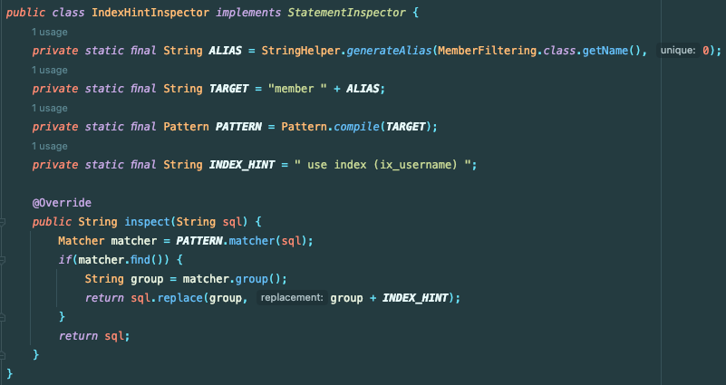

그리고 해당 Index를 타야하는 순간에만 해당 Entity를 사용하면 된다.

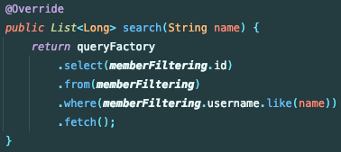

그 결과 아래와 같이 인덱스를 잘 탈 수 있게 되었다.

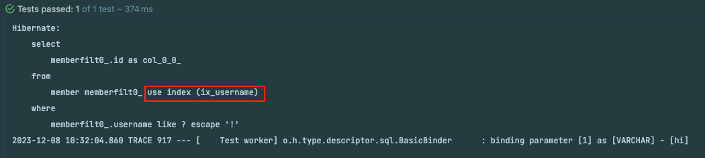

## 정리

실무 문제를 해결하려고 `QueryDSL`에서 `MySQL`의 `Index Hint`를 줄 수 있는 방법을 알아봤다.

`QueryDSL`이 해당 부분에 대한 지원이 커져서 쉽게 반영할 수 있게 되었으면 좋겠다.
 
> 혹시 위 방법들 이외에도 좋은 해결법을 아시는 분은 공유해주세요!