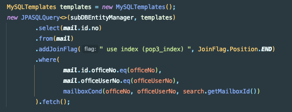
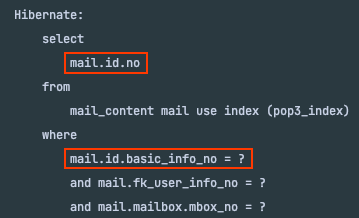
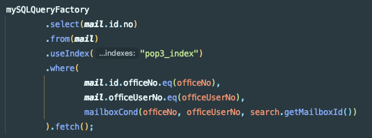
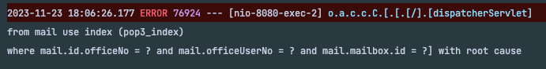
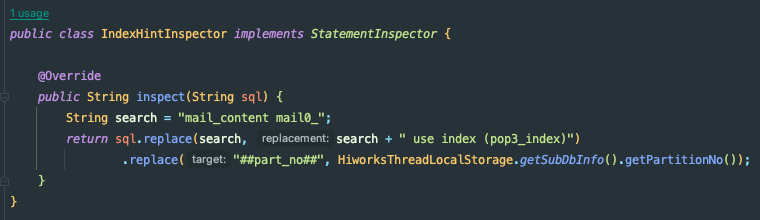
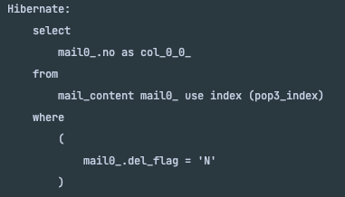
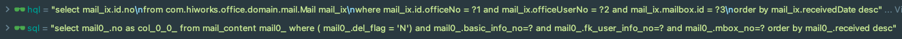
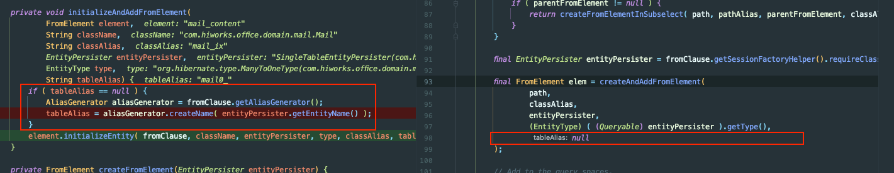

## 1. JPASQLQuery

JPASQLQuery is an SQLQuery implementation that uses JPA Native SQL functionality to execute queries
- http://querydsl.com/static/querydsl/4.1.3/apidocs/com/querydsl/jpa/sql/JPASQLQuery.html

> 직역: JPA의 Native SQL 기능을 사용하는 Query

**복합키 인식 불가**

## 2. MySQLQueryFactory

MySQL specific implementation of SQLQueryFactory
- http://querydsl.com/static/querydsl/latest/apidocs/com/querydsl/sql/mysql/MySQLQueryFactory.html

> 직역: MySQL 스펙의 SqlQueryFactory 구현

**Jdbc 기반이라서 필드가 그대로 찍힘**

## 3. Inspector 사용

StateInspector를 사용하면 Hibernate에서 실행하는 쿼리의 일부를 대체하거나 전체를 교체할 수 있습니다.

아래와 같이 특정 문구를 잡아서 처리한다면 해결이 가능해보입니다.
- 목록 조회에서만 특정 Alias를 사용
- 특정 Alias에 Inspector를 사용해서 대체
    - From에만 적용 불가능 (쿼리 검증에서 에러! Where, Select 모두 동일 Q객체 사용 필요)
- SubDB 모듈 수정 필요
    - JpaProperties를 내부적으로 생성해서 추가할 수 없게 되어있음

로그에 정상적으로 pop3_index 사용이 찍히며, 실제로도 적용되는 것 확인

## 4. BooleanTemplate

적용 불가능, Full Text Scan을 사용하기 위한 솔루션이었음

From에 Index를 거는 것과는 무관함

## 추가

`new QMail(Mail.class, "mail_ix")`로 생성한 `variable`의 경우 hql에 반영됨

sql에는 반영 안됨

Interceptor의 경우 `sql`을 기준으로 반영

--- 

`sql`을 적용하는 Table Alias 코드 확인

Alias 적용 불가