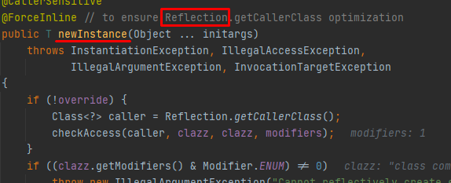
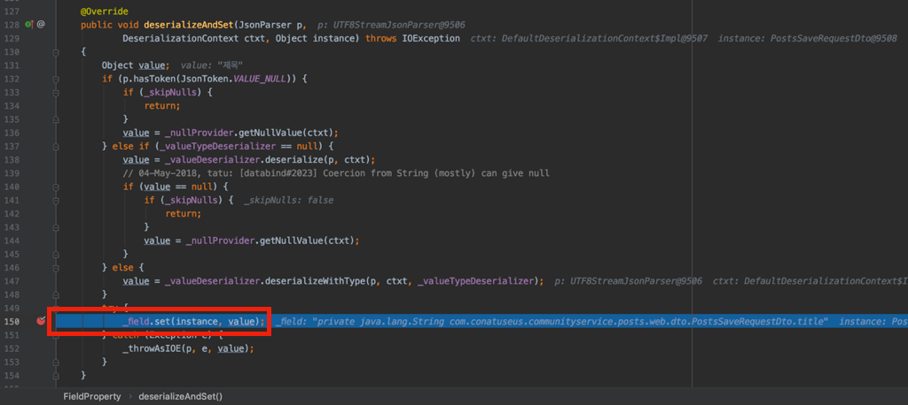

## Spring - Request DTO에 NoArgsConstructor의 AccessLevel을 어떻게 설정할까?!

RequestDTO에 NoArgsConstructor(기본 생성자)가 반드시 필요하다.

이유는 **@RequestBody**를 사용할 때 **Jackson2HttpMessageConverter를** 사용하기 때문이다.

그러면 RequestDTO에 Lombok의 @NoArgsConstructor 애노테이션을 설정해주었다.

```java
@Getter
@AllArgsConstructor
@NoArgsConstructor
public class CreateArtistRequest {

    @NotBlank
    private String name;
}
```

이거면 충분할까? 그렇지 않다!

## Reflection

Jackson2HttpMessageConverter는 기본 생성자를 통해 DTO의 인스턴스를 생성한다.

중요한 것은 이때 사용되는 것이 Reflection이라는 점이다.



즉, 우리는 코드 단에서 접근하지 않는 기본 생성자를 @RequestBody를 사용하기 위해 만들어준다.

그렇다면 이 `기본 생성자`라는 인터페이스(java의 interface와 다르다.)가 코드 단에 제공되게 된다. 우리는 정말로 사용하지 않을 인터페이스를 제공해선 안된다.

추가로 Effective Java - Item 15의 내용에서 **접근 제한자**는 **가능한 좁히는 것을 원칙**으로 개발해야 한다고 한다.

그래서 서비스에서 제공하는 모든 RequestDTO의 기본생성자의 접근 제한자를 private으로 변경했다.

```java
@Getter
@AllArgsConstructor
@NoArgsConstructor(access = AccessLevel.PRIVATE)
public class CreateArtistRequest {

    @NotBlank
    private String name;
}
```

Jackson2HttpMessageConverter는 Reflection으로 동작하기에 기본 생성자가 private method라도 관계 없다. 



필드 값도 리플렉션을 통해 생성한 DTO에 Request Body의 값들을 할당한다.

관련 commit은 아래에서 확인할 수 있다.
- https://github.com/violetbeach/verby-rest-api/commit/6fcf2f96b94d522bda69332b46e0e6b52341c84b


## 참고
- https://velog.io/@conatuseus/RequestBody%EC%97%90-%EC%99%9C-%EA%B8%B0%EB%B3%B8-%EC%83%9D%EC%84%B1%EC%9E%90%EB%8A%94-%ED%95%84%EC%9A%94%ED%95%98%EA%B3%A0-Setter%EB%8A%94-%ED%95%84%EC%9A%94-%EC%97%86%EC%9D%84%EA%B9%8C-3-idnrafiw
- https://velog.io/@ggomjae/ObjectMapper-JPA-Entity-NoArgsConstructor-Java-Reflection