요즘 들어서 Spring의 동작 원리에 대해 많이 부족하다고 느낀다.

2년차인데.. 부끄럽다! 다시 초심으로 돌아가자 ㅠ

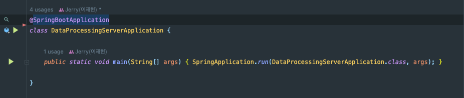

보통 스프링부트로 개발하면 `main()` 메서드를 통해 `SpringApplication.run()` 메서드를 호출한다.

`SpringApplication.run()`을 호출하면 일어나는 일에 대해 알아보자.

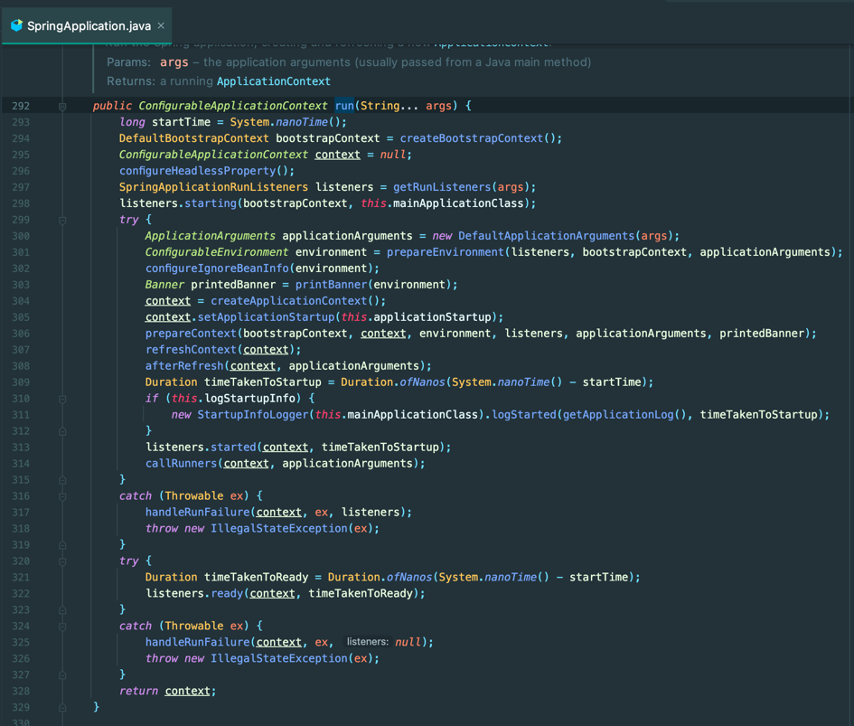

## SpringApplication.run()

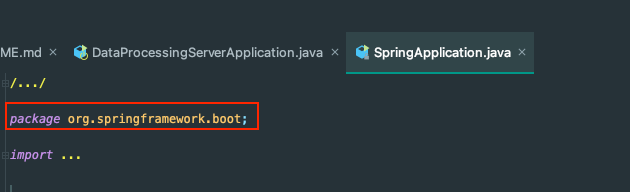

가장 먼저 알아야할 것은 해당 코드는 `SpringApplication` 클래스는 SpringBoot에서**만** 사용한다는 점이다.


그러면 일반 Spring Legacy 에서는 어떻게 사용할까? Spring Legacy는 SpringApplication을 직접 실행하지 않는다.
빌드를 한 후에 WAS에 `war`를 내장시켜서 돌리는 방식이다. 

## 코드

 ```java
public ConfigurableApplicationContext run(String... args) {
    // 1. SpringApplication 전체 실행 시간 측정 시작
    StopWatch stopWatch = new StopWatch();
    stopWatch.start();
    
    // 2. BootstrapContext 생성
    DefaultBootstrapContext bootstrapContext = createBootstrapContext();
    ConfigurableApplicationContext context = null;
    
    // Headless Property 설정 적용
    configureHeadlessProperty();
    
    // 4. Spring Application Listener 실행
    SpringApplicationRunListeners listeners = getRunListeners(args);
    listeners.starting(bootstrapContext, this.mainApplicationClass);
    try {
    
        // 5. Arguments 및 Environment 생성
        ApplicationArguments applicationArguments = new DefaultApplicationArguments(args);
        ConfigurableEnvironment environment = prepareEnvironment(listeners, bootstrapContext, applicationArguments);
        
        // 6. IgnoreBeanInfo 설정
        configureIgnoreBeanInfo(environment);
        
        // 7. Spring Banner 출력
        Banner printedBanner = printBanner(environment);
        
        // 8. Application Context 생성
        context = createApplicationContext();
        context.setApplicationStartup(this.applicationStartup);
        
        // 9. ApplicationContext 준비
        prepareContext(bootstrapContext, context, environment, listeners, applicationArguments, printedBanner);
        
        // 10. Context Refresh
        refreshContext(context);
        
        // 11. Context Refresh 후처리
        afterRefresh(context, applicationArguments);
        
        // 12. 실행 시간 출력 및 리스너 구독 시작
        stopWatch.stop();
        if (this.logStartupInfo) {
            new StartupInfoLogger(this.mainApplicationClass).logStarted(getApplicationLog(), stopWatch);
        }
        listeners.started(context);
        
        // 13. Runners 실행
        callRunners(context, applicationArguments);
    }
    catch (Throwable ex) {
        handleRunFailure(context, ex, listeners);
        throw new IllegalStateException(ex);
    }

    try {
        listeners.running(context);
    }
    catch (Throwable ex) {
        handleRunFailure(context, ex, null);
        throw new IllegalStateException(ex);
    }
    return context;
}
 ```

해당 부분을 잘게 잘라서 살펴보자.

####  1. SpringApplication 전체 실행 시간 측정 시작

 ```java
StopWatch stopWatch = new StopWatch();
stopWatch.start();
 ```

SpringApplication을 실행할 때 실행 시간을 측정한다.

#### 2. BootstrapContext 생성

 ```java
DefaultBootstrapContext bootstrapContext = createBootstrapContext();
 ```
BootstrapContext는 SpringBoot 애플리케이션 초기 실행 시 사용하는 인터페이스이다.

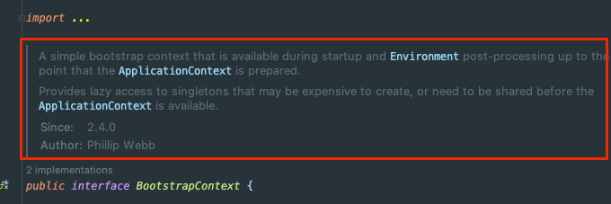

ApplicationContext가 준비되기 전에 **Environment**를 관리하는 역할을 한다.

#### 3. Headless Property 설정 적용

 ```java
configureHeadlessProperty();
 ```

`java.awt.headless` 설정을 찾아서 적용합니다. `(default = true)`

해당 값이 true일 경우 Java Application이 window, dialog boxes 등을 표시하지 않으며, 키보드나 마우스를 사용하지 않습니다.

#### 4. Spring Application Listener 실행 

 ```java
SpringApplicationRunListeners listeners = getRunListeners(args);
listeners.starting(bootstrapContext, this.mainApplicationClass);
 ```

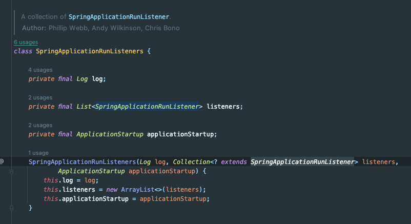

여기서 Listeners는 `SpringApplicationRunListeners`이고, 해당 클래스는 `SpringApplicationRunListener`의 일급 컬렉션이다.

`SpringApplicationRunListener`의 구현체는 아직까지 `EventPublishingRunListener` 밖에 없다.

#### 5. Arguments 및 Environment 생성

 ```java
ApplicationArguments applicationArguments = new DefaultApplicationArguments(args);
ConfigurableEnvironment environment = prepareEnvironment(listeners, bootstrapContext, applicationArguments);
 ```

main() 호출 시 받은 args를 인스턴스화 후, 불러왔던 프로퍼티들을 조합하여 Environment를 생성한다.

Environment의 구조는 대략적으로 아래와 같다.

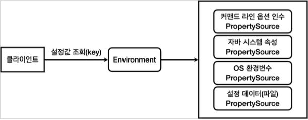

스프링에서는 커맨드 라인 인수, 자바 시스템 속성, OS 환경 변수 등을 추상화하여 Environment를 생성하여 사용한다.

#### 6. IgnoreBeanInfo 설정

 ```java
configureIgnoreBeanInfo(environment);
 ```

`spring.beaninfo.ignore` 설정이 존재하지 않는다면 기본값인 true로 설정한다.

해당 옵션은 BeanInfo 클래스 탐색을 생략할 지 여부이다.

#### 7. Spring Banner 출력

 ```java
Banner printedBanner = printBanner(environment);
 ```

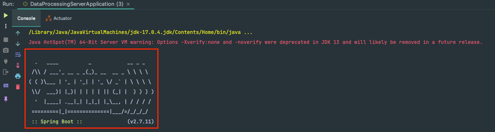

Spring 배너를 출력한다.

#### 8. Application Context 생성

 ```java
ConfigurableApplicationContext context = createApplicationContext();
context.setApplicationStartup(this.applicationStartup);
 ```

`Spring Container` 라고도 부르는 `ApplicationContext`를 생성하는 부분이다. 

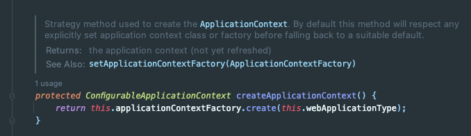

ApplicationContextFactory에게 Context 생성을 위임한다.
ApplicationContextFactory는 아래의 구현체가 있다.
- DefaultApplicationContextFactory
- AnnotationConfigReactiveWebServerApplicationContext.Factory.class
- AnnotationConfigServletWebServerApplicationContext.Factory.class

#### 9. ApplicationContext 준비

 ```java
prepareContext(bootstrapContext, context, environment, listeners, applicationArguments, printedBanner);
 ```

클린 코드에서 인자는 0~1개가 바람직하다고 했거늘.. 이렇게 많은 코드도 쓰는구나

 ```java
private void prepareContext(DefaultBootstrapContext bootstrapContext, ConfigurableApplicationContext context,
        ConfigurableEnvironment environment, SpringApplicationRunListeners listeners,
        ApplicationArguments applicationArguments, Banner printedBanner) {
    context.setEnvironment(environment);
    postProcessApplicationContext(context);
    applyInitializers(context);
    listeners.contextPrepared(context);
    bootstrapContext.close(context);
    if (this.logStartupInfo) {
        logStartupInfo(context.getParent() == null);
        logStartupProfileInfo(context);
    }
    // Add boot specific singleton beans
    ConfigurableListableBeanFactory beanFactory = context.getBeanFactory();
    beanFactory.registerSingleton("springApplicationArguments", applicationArguments);
    if (printedBanner != null) {
        beanFactory.registerSingleton("springBootBanner", printedBanner);
    }
    if (beanFactory instanceof AbstractAutowireCapableBeanFactory) {
        ((AbstractAutowireCapableBeanFactory) beanFactory).setAllowCircularReferences(this.allowCircularReferences);
        if (beanFactory instanceof DefaultListableBeanFactory) {
            ((DefaultListableBeanFactory) beanFactory)
                .setAllowBeanDefinitionOverriding(this.allowBeanDefinitionOverriding);
        }
    }
    if (this.lazyInitialization) {
        context.addBeanFactoryPostProcessor(new LazyInitializationBeanFactoryPostProcessor());
    }
    context.addBeanFactoryPostProcessor(new PropertySourceOrderingBeanFactoryPostProcessor(context));
    // Load the sources
    Set<Object> sources = getAllSources();
    Assert.notEmpty(sources, "Sources must not be empty");
    load(context, sources.toArray(new Object[0]));
    listeners.contextLoaded(context);
}
 ```

내부적으로는 아래의 동작을 수행한다.

**[Context에 특정 인스턴스를 주입]**
- 생성한 Environment를 주입
- beanNameGenerator 주입
- classLoader, resourceLoader 주입
- ApplicationContextInitializer 주입
- BeanFactoryPostProcessor 주입

**[Context를 특정 인스턴스에 주입]**
- SpringApplicationRunListeners에 Context 주입
- StartupInfoLogger에 Context 주입

**[그 밖에..]**
- beanFactory에 사용자 설정 적용
  - 순환 참조 허용 (allow_circular_references - default: false)
  - 빈 오버라이딩(allow_bean_definition_overriding - default: false)
- BootstrapContext 종료
- ...

#### 10. Context Refersh


 ```java
refreshContext(context);
 ```

해당 메서드 내부에서는 `AbstractApplicationContext`의 `refresh()`를 호출하고 있다.

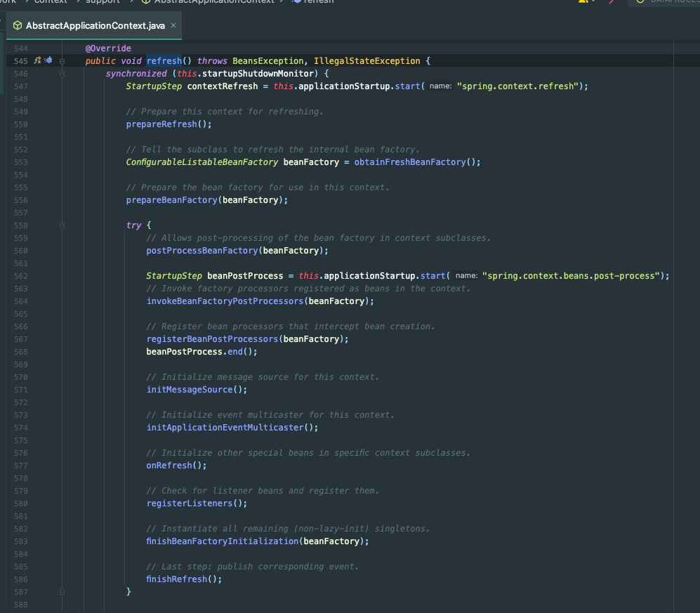

처음엔 메서드 명이 `refresh()`라서 다소 이상하게 생각했었다. (뭔가 동작 -> refresh를 하는 게 절차지향적인 느낌이 들었었다.)

하는 일을 정리해보면 아래와 같다.

- 빈 팩토리 프로세서 허용
- 빈 팩토리 프로세서 호출
- 메시지 소스 초기화
  - 다국어 처리를 위해 사용된다.
- 이벤트 멀티캐스터 초기화
  - 여러 `ApplicationListener`를 관리한다.
  - ApplicationEvent도 내부적으로 이벤트 멀티캐스터를 통해 동작한다.
- 리스너 빈 확인 및 등록
- 나머지 싱글톤 빈 인스턴스화
- ...

그런데 내부 동작을 보니까 이해가 된다. 모든 빈 팩토리가 생성되고 Context가 설정되고 나서야 할 수 있는 처리들을 한다.

우리가 `@Bean`, `@Component` 등으로 등록한 클래스나 인스턴스를 반환하는 메서드도 `refresh()`에 있는 `finishBeanFactoryInitialization(beanfactory)`에서 호출되거나 생성되고 조립되어서 빈으로 등록된다.

`SpringApplication.run()`에서 가장 중요하고, 개발하면서 필요한 부분이라고 한다.

#### 11. Context Refresh 후처리

 ```java
afterRefresh(context, applicationArguments);
 ```

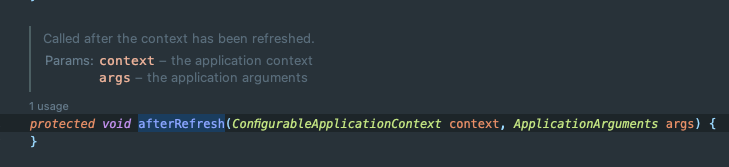

현재 해당 메서드가 비어있다. Custom하게 Refresh 이후 동작이 필요할 때 SpringApplication을 상속해서 Overriding할 수 있다.

#### 12. 실행 시간 출력 및 리스너 구독 시작

 ```java
stopWatch.stop();
if (this.logStartupInfo) {
    new StartupInfoLogger(this.mainApplicationClass).logStarted(getApplicationLog(), stopWatch);
}
listeners.started(context);
 ```

지금까지 했던 작업(Application Context가 Refresh되기 까지)의 총 실행 시간을 출력한 후 `SpringApplicationRunListener`를 모두 구독 시작 상태로 돌린다.

#### 13. Runners 실행

 ```java
callRunners(context, applicationArguments);
 ```

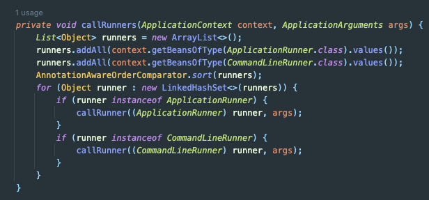

여기서 Runner란 뭘까..? DemoProject를 실행해봤지만 Runners 개수가 0이 나온다.

Spring Batch를 사용하면 기본적으로 Job을 바로 실행한다. 그때 사용되는 `JobLauncherApplicationRunner`가 `ApplicationRunner`의 구현체이다.

**앱이 실행되었을 때 즉시 실행**되어야 하는 **작업**들을 등록할 수 있다.

## 참고
- https://mangkyu.tistory.com/213
- https://code-run.tistory.com/5