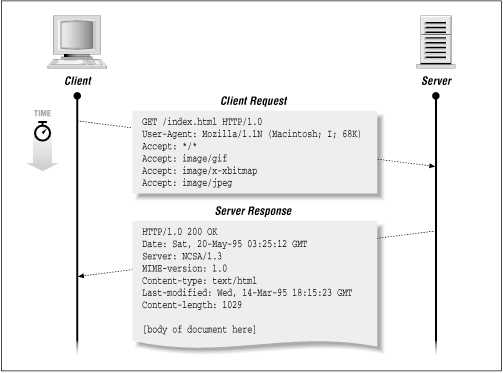
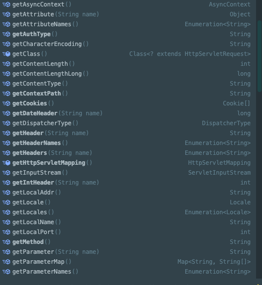
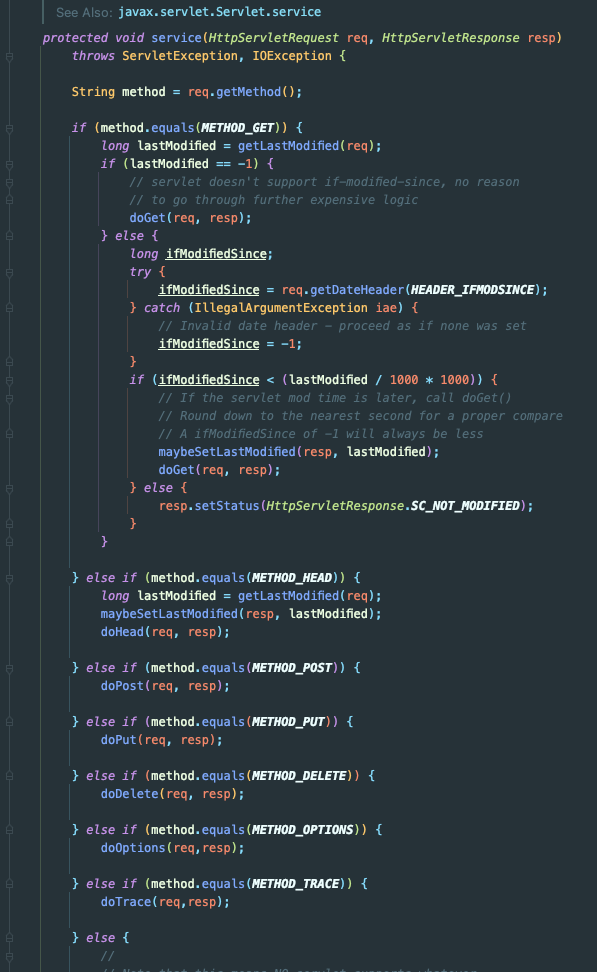
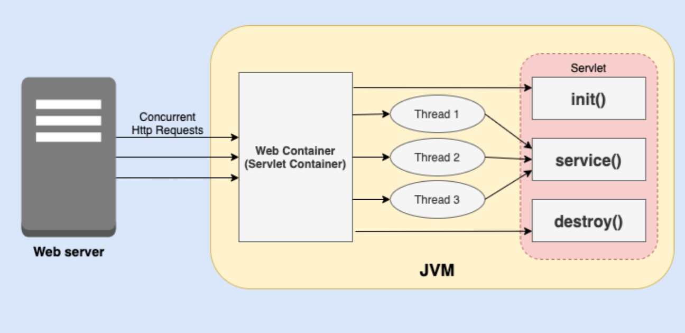
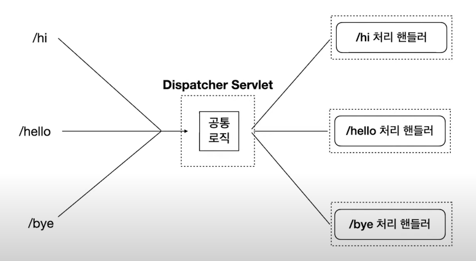

## Spring - Servlet과 Spring의 Dispatcher servlet의 차이!

## Servlet

처음 웹 서버는 클라이언트 요청에 의해 정적인 컨텐츠만 응답할 수 있었다.

그래서 웹 서버에 프로그램을 붙여서 동적인 페이지를 시작했다. 서블릿도 동적인 페이지를 만들기 위해 웹서버에 붙이는 프로그램 중 하나이다.



만약 이러한 Client 요청이 들어왔을 때 HTTP 원문을 파싱해서 Server Response처럼 HTTP 원문을 만들어서 응답해야 한다면 개발이 힘들 것이다.
- 모든 규약을 확인한다.
- 긴 텍스트로 들어온 요청을 분석한다.
- 거기에 맞는 처리를 한다.
- 처리한 결과를 규약에 맞춰서 응답으로 보내준다.

HttpServletRequest는 이러한 처리를 위해 아래와 같이 많은 메서드를 사용한다.



HttpServletRequest의 메소드를 호출하면 텍스트를 일일이 파싱하는 수고로움 없이 HTTP 요청을 쉽게 사용할 수 있고 처리 결과를 응답으로 쉽게 반환할 수 있다.

```java
public class MyServlet extends HttpServlet {
    public void init(ServletConfig config) throws ServletException {
        super.init();
    }

    public void destroy() {
        super.init();
    }

    public void service(HttpServletRequest request, HttpServletResponse response) {
        super.service();
    }
}
```

Servlet의 기본 구현은 위와 같다.
- Abstract class인 HttpServlet은 Abstract class인 GenericServlet을 상속한다.
- GenericServlet은 Servlet interface를 구현한다.

여기서 요청을 처리할 때 호출되는 메서드는 service()이다. HttpServlet의 Service부분을 보면 아래의 형태를 가진다.



service() 메서드를 간단히 설명하면 요청 메서드에 따라 doXXX() 메서드를 실행하는 역할을 수행한다.

그래서 Servlet으로 요청을 처리하겠다 하면 아래와 같이 Servlet을 구현할 수 있다.

```java
@WebServlet("/resources")
public class MyServlet extends HttpServlet {
    
    @Override
    protected void doGet(HttpServletRequest req, HttpServletResponse resp) throws  IOException {
        // HttpServletRequest와 HttpServletResponse를 사용해서 재정의
    }
}
```

해당 서블릿이 처리할 url을 매핑해주고, 해당 서블릿에서 doXXX 메서드만 재정의했을 때 해당 요청이 오면 우리가 재정의한대로 메서드가 실행되어 요청이 처리되게 된다. 

## Servlet Container

그렇다면 해당 Servlet의 service() 메서드는 어떻게 실행되게 될까..?!



처리를 설명하면 아래와 같다.
- Servlet Container는 해당 요청과 매핑된 Servlet을 찾게 된다.
- 해당 Servlet의 존재유무를 파악한 후 없으면 해당 Servlet을 생성한다.
- Servlet Container에 스레드를 생성하고
- 미리 만든 req, res를 인자로 해당 Servlet의 service() 메서드를 실행한다.

## Front Controller 패턴

위 내용을 정리하면 Servlet은 하나의 요청을 담당하여 수행한다.

그렇다면 공통 로직을 각각의 Servlet에서 실행할 수 있도록 처리하는 과정이 필요하다.
- 단순히 service 메서드에서 공통 로직을 호출할 수는 있지만, 누락이 생길 수도 있고 우리는 실제 로직에만 집중하고 싶다.

Spring MVC는 이러한 공통 로직 처리를 위해 Front Controller 패턴을 사용한다.



이때 모든 요청을 받는 전면 Controller를 Dispatcher Servlet이라고 부른다. 즉, Spring은 서블릿을 하나만 두고 해당 Servlet이 모든 요청을 처리할 수 있도록 한다.


## 참고
- https://www.youtube.com/watch?v=calGCwG_B4Y
- https://codeburst.io/understanding-java-servlet-architecture-b74f5ea64bf4