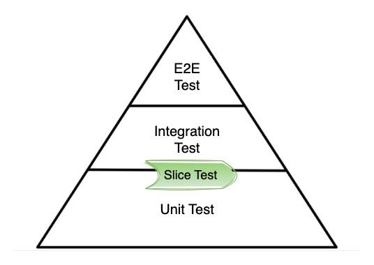

TDD, ATDD를 하면서 `@DataJpaTest`, `@DataJdbcTest`, `@WebMvcTest` 등 다양한 테스트를 하게 된다.

통합 테스트와 단위 테스트 범위에 특정한 Layer만 테스트할 때가 생긴다.



사용하는 명칭에 대해서는 의견이 분분하다. 컨트롤러 단위테스트, 웹 통합 테스트, 영속성 통합 테스트, ... 해당 포스팅에서는 `Slice Test`라는 명칭을 사용할 것이다.

## \@ContextConfiguration

`@ContextConfiguration`을 사용하면 원하는 클래스를 빈으로 등록할 수 있다.

```java
@ExtendWith({SpringExtension.class})
@ContextConfiguration(
        classes = {
                UserController.class,
                UserService.class
        }
)
public class ApplicationTest {
    @Autowired
    UserController userController;
}

```