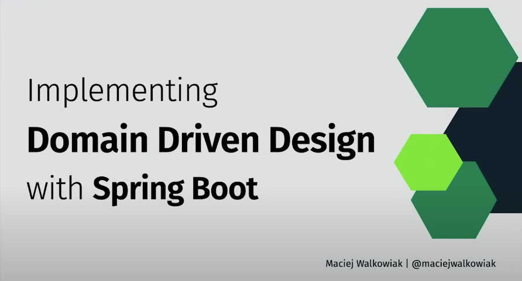
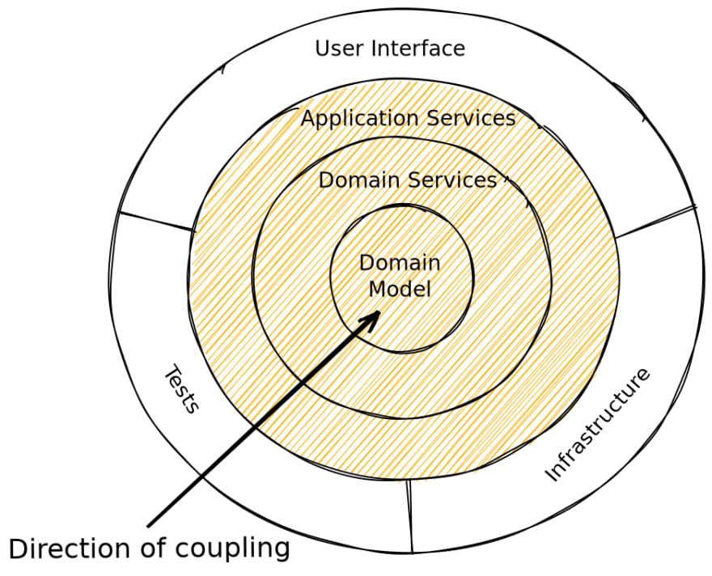

Spring I/O 2024에서 DDD(Domain Driven Design) 관련된 강연을 했다.
- [Implementing Domain Driven Design with Spring by Maciej Walkowiak @ Spring I/O 2024](https://www.youtube.com/watch?v=VGhg6Tfxb60)

해당 강연은 DDD의 기본부터 Spring을 활용한 구현 방법을 설명한다. 아래는 해당 강연 내용을 해석한 내용이다.

## DDD

마틴파울러는 DDD를 아래와 같이 설명한다.

> **DDD(Domain-Driven-Design)** is an approach to software development that centers the development on programming a **domain model** that has a rich **understanding** of the processes and rules of a domain 

DDD는 소프트웨어 개발에 대한 접근 방식으로, 도메인의 프로세스와 규칙에 대한 **풍부한 이해**를 가진 **도메인 모델**을 프로그래밍하는데 집중하는 방식이다.

즉, **풍부한 이해**를 바탕으로 **도메인**을 활용해서 도메인 모델을 만드는 것이 중요하다.

DDD를 구현할 때 아래 과정을 거친다.
- 도메인 이해
- 도메인을 서브 도메인으로 분리
- 유비쿼터스 언어 개발
- 도메인 모델 개발

#### 도메인 이해

뱅킹 소프트웨어를 만들기 위해서는 뱅킹과 은행업을 배우는 수 밖에 없다. 하지만 현실적으로는 시간이 부족해서 쉽지 않다.

다른 합리적인 방법은 사람들과 대화하는 것이다. 사람들과 대화하고 도메인을 이해해나가면서 전문가가 될 수 있다.

#### 도메인을 서브 도메인으로 분리

도메인을 어느정도 이해하게 되면 해당 도메인은 일반적으로 복잡하다. 한 번에 해결하기 어렵기 때문에 문제를 더 작은 문제로 나누어야 한다.

그래서 가능한 독립적으로 문제를 해결하고 함께 동작하도록 만들어야 한다.

#### 유비쿼터스 언어 개발

유비쿼터스 언어로 우리는 문서를 작성하고 해당 언어를 사용해서 커뮤니케이션한다.

그 결과 코드에 대한 내용을 공유해도 개발자가 아닌 관계자도 요점을 알 수 있게 된다. 즉, 코드와 고객(관계자) 간의 격차가 줄여야 한다.

## 도메인 모델 개발

이해한 도메인의 내용을 반영하는 코드를 작성한다는 의미이다. 
 
## 도메인 모델

도메인 모델의 책임은 다음과 같다.
- 도메인 캡슐화
- 도메인 지식
- 도메인 프로세스
- 도메인 규칙
- 제약
- 행동
- 상태 변경

도메인 모델을 개발하는 데 사용할 수 있는 것 들은 다음과 같다.
- Entities
- Value Objects
- Domain Services
- Factories
- Aggregates
- Repositories

## 아키텍처

도메인 모델은 프레임워크 등과 관계가 없다. 

Onion Architecture, Hexagonal Architecture, Clean Architercture에서 가장 중요한 것은 동일하다. 도메인 모델이 중앙에 있고 종속성 화살표가 안쪽으로 향하는 것이다.



Infrastructure Layer의 경우 Application Services와 Domain Services를 통해 DomainModel에 의존하지만 반대는 허용되지 않는다.

지금까지 DDD의 기본 개념에 대해 설명했다. Spring으로 어떻게 구현하는 지로 넘어가자.

## 도메인 모델 핵심

전통적인 구조에서는 패키지명으로 dto, entity, repository, service 등을 사용한다. 여기서 Entity는 데이터 컨테이너일 뿐이다. 모든 논리는 서비스에 있다.

이러한 프로젝트는 소규모 서비스, 토이 프로젝트에 매우 적합할 수 있다. 하지만 성장하면 결국 수십 개의 서비스 클래스를 가지게 되고, 서비스가 여러 곳에서 사용되어 남용된다.

그렇다면 DDD는 어떤 식으로 구현해야 할까?

도메인 모델이 **User Story**를 담아야 한다. 이는 사용자가 애플리케이션을 사용하여 수행하려는 실제 작업을 나타낸다. 도서관 시스템을 예를 들면 다음과 같다.
- 사서는 책의 사본을 등록한다.
- 사용자는 책을 가질 수 있다.
- 책에는 ISBN이 있고, 사본에는 바코드가 있다. 각 사본은 동일한 ISBN을 가진다.
- 사용자는 책을 대여하고 반납할 수 있다.
- 책은 카탈로그로 분류된다.

UserStory는 유비쿼터스 언어를 사용해서 개발한다. 그리고 **UserStory를 기반으로 코드를 구현하는 데 집중**해야 한다.

## 구현

구현을 살펴보자.
- 예시 코드는 [GitHub](https://github.com/maciejwalkowiak/implementing-ddd-with-spring-talk)에서 확인할 수 있다.

코드에서 Spring Modulith를 사용한다. 요즘 Spring 관련 컨퍼런스에서 자주 보이는데 자세한 부분은 다음에 다루자.

Spring Modulith는 도메인 중심적인 Spring Boot Application을 구축할 수 있고, 각 모듈의 이벤트 기반 아키텍처를 구축할 수 있도록 지원한다.

MSA를 사용할 경우 **경계**를 잘못 설정하면 올바르게 변경하는 것이 매우 어렵다. 다른 DB에 저장될 경우 복잡한 마이그레이션을 수행해야 한다.

아래는 도메인 모델이다.

```java
public class Book {
    private BookId id;
    private String title;
    private Isbn isbn;

    public Book(String title, Isbn isbn) {
        Assert.notNull(title, "title must not be null");
        Assert.notNull(isbn, "isbn must not be null");
        this.id = new BookId();
        this.title = title;
        this.isbn = isbn;
    }
}
```

중요한 점은 Book은 스스로 생성자에서 자신의 요구사항을 검증한다.

Isbn 클래스를 먼저 보자.

```java
public record Isbn(String value) {
    private static final ISBNValidator VALIDATOR = new ISBNValidator();

    public Isbn {
        if (!VALIDATOR.isValid(value)) {
            throw new IllegalArgumentException("invalid isbn: " + value);
        }
    }
}
```

Isbn도 생성자를 통해 해당 객체가 가진 책임에 대한 내용을 검증하고 있다. 해당 객체는 Value-Object 이기 때문에 record는 최선의 선택이 된다.

다음으로 각 엔터티의 ID에 대한 전용 클래스를 만들어야 한다.

```java
public record BookId(UUID id) {

    public BookId {
        Assert.notNull(id, "id must not be null");
    }

    public BookId() {
        this(UUID.randomUUID());
    }
}
```

다음으로 Repository를 보자. 도메인 모델을 만들 때에는 두 가지 옵션이 있다.
- Entity를 도메인 모델으로 사용하는 것
- 도메인 모델을 순수한 상태로 유지하는 것

후자의 경우 많은 구현이 추가로 필요하다. 아래와 같이 Entity로의 변환을 통해 접근한다.

```java
@Component
public class JpaBookRepository implements BookRepository {
    private final BookEntityRepository bookEntityRepository;
    public JpaBookRepository(BookEntityRepository bookEntityRepository) {
        this.bookEntityRepository = bookEntityRepository;
    }
    @Override
    public Book save(Book book) {
        BookEntity entity = new BookEntity(book.getId().id(), book.getTitle(), book.getIsbn().value());
        bookEntityRepository.save(entity);
        return book;
    }
}
```

헥사고날 아키텍처의 Adaptor와 유사하다. 이 부분은 상황에 따라 선택하면 될 것 같다.

#### 서비스


서비스 구현의 경우 일반적으로 BookService, CopyService, LibraryService를 만드는 방법이 있다.

좋은 방법이지만 유지보수와 테스트를 유지하기 어렵다는 단점이 있는 것 같다. 그래서 클린아키텍처의 개념인 UseCase을 사용하는 것을 권한다.

```java
@UseCase
public class RegisterBookCopyUseCase {
    private final CopyRepository copyRepository;

    public RegisterBookCopyUseCase(CopyRepository copyRepository) {
        this.copyRepository = copyRepository;
    }

    public void execute(@NotNull BookId bookId, @NotNull BarCode barCode) {
        copyRepository.save(new Copy(bookId, barCode));
    }
}
```

UseCase는 단 1개의 메서드만을 가진다. 파라미터로 String이 아닌 Value Object를 받으므로 이점을 충분히 볼 수 있다. Kotlin을 사용한다면 invoke() 메서드를 사용하는 것도 좋은 선택일 것이다.

#### Infrastructure

외부 의존이 필요한 경우에 대해 알아보자.

아래의 도메인 계층의 Service(Interface)가 있다.

```java
public interface BookSearchService {
    BookInformation search(Isbn isbn);
}
```

Infrastructure는 해당 Service(Interface)를 구현한다.


```java
@Service
class OpenLibraryBookSearchService implements BookSearchService {
    private final RestClient restClient;

    public OpenLibraryBookSearchService(RestClient.Builder builder) {
        this.restClient = builder
                .baseUrl("https://openlibrary.org/")
                .build();
    }

    public BookInformation search(Isbn isbn) {
        OpenLibraryIsbnSearchResult result = restClient.get().uri("isbn/{isbn}.json", isbn.value())
                .retrieve()
                .body(OpenLibraryIsbnSearchResult.class);
        return new BookInformation(result.title());
    }
}
```

해당 InfraStructure의 클래스들은 package-private을 사용한다.

#### 도메인 모델의 파라미터

DDD에서 고민되는 점이 있다. 검증에서 데이터 조회가 필요한 경우가 있다.

그 경우 아래와 같이 UseCase에서 검증하는 방법이 있다.

```java
@UseCase
public class RentBookUseCase {
    private final LoanRepository loanRepository;
    public RentBookUseCase(LoanRepository loanRepository) {
        this.loanRepository = loanRepository;
    }
    public void execute(CopyId copyId, UserId userId) {
        if(loanRepository.isAvailable(copyId)) {
            throw new IllegalArgumentException();
        }
        loanRepository.save(new Loan(copyId, userId));
    }
}
```

하지만 UseCase보다는 도메인 모델이 더 코어한 영역이다.

그래서 도메인 모델인 Loan의 생성자에서 Repository를 파라미터로 받아서 검증하는 방법을 권한다.

```java
public Loan(CopyId copyId, UserId userId, LoanRepository loanRepository) {
    Assert.notNull(copyId, "copyId must not be null");
    Assert.notNull(userId, "userId must not be null");
    Assert.isTrue(loanRepository.isAvailable(copyId), "copy with id = " + copyId + " is not available");
    this.loanId = new LoanId();
    this.copyId = copyId;
    this.userId = userId;
    this.createdAt = LocalDateTime.now();
    this.expectedReturnDate = LocalDate.now().plusDays(30);
    this.registerEvent(new LoanCreated(this.copyId));
}
```

그 결과 모든 애플리케이션에서 해당 검증을 놓치지 않을 수 있다.

## 이벤트

다수의 도메인을 함께 사용하는 등의 처리가 필요할 때는 이벤트를 활용한다.

이벤트를 발행하는 쪽에서는 구독자 계층에 대해서는 신경쓰지 않는다.  그리고 사본 도메인에서는 이벤트를 구독하여 대여가 시작되면 해당 사본은 사용하지 못하는 상태로 변경하도록 처리한다.

```java
@Component
public class DomainEventListener {

    private final CopyRepository copyRepository;

    public DomainEventListener(CopyRepository copyRepository) {
        this.copyRepository = copyRepository;
    }

    @ApplicationModuleListener
    public void handle(LoanCreated event) {
        Copy copy = copyRepository.findById(new CopyId(event.copyId().id())).orElseThrow();
        copy.makeUnavailable();
        copyRepository.save(copy);
    }

    @ApplicationModuleListener
    public void handle(LoanClosed event) {
        Copy copy = copyRepository.findById(new CopyId(event.copyId().id())).orElseThrow();
        copy.makeAvailable();
        copyRepository.save(copy);
    }
}
```

여기서 `@ApplicationModuleListener`는 아래의 애노테이션을 조합한 것과 동일한 역할을 한다. 즉 Save를 통해 해당 이벤트가 발행된 객체가 저장되면 반드시 구독이 수행된다.

```java
@Async
@Transactional(propagation = Propagation.REQUIRES_NEW)
@TransactionalEventListener
```

결과적으로 최종적 일관성을 보장하게 된다.

## Review

DDD 관련 책이나 여러 강연을 봤기 때문에 생소한 내용이 많지는 않았다. Spring I/O에서 DDD 구현에 대한 강연을 한다는 것이 꼭 보고 싶은 이유가 되었다.

최근에 영어 공부와 더불어 오픈소스 코드 스타일을 배우고 싶다는 생각도 있었다.

강연 내용은 한국에 번역한 도메인 주도 개발 책과 내용과 예제가 겨우 유사했다. 하지만 파라미터를 어떻게 다룰 지, 이벤트를 어떤 관점에서 바라볼 지, 등 핵심 개념 등을 자세히 설명해주는 것 같아 좋았다.

다음에는 Spring Modulith에 대해 자세히 알아봐야겠다.

## 참고

- https://www.youtube.com/watch?v=VGhg6Tfxb60
- https://docs.spring.io/spring-data/relational/reference/jdbc/domain-driven-design.html
- https://dev.to/barrymcauley/onion-architecture-3fgl
