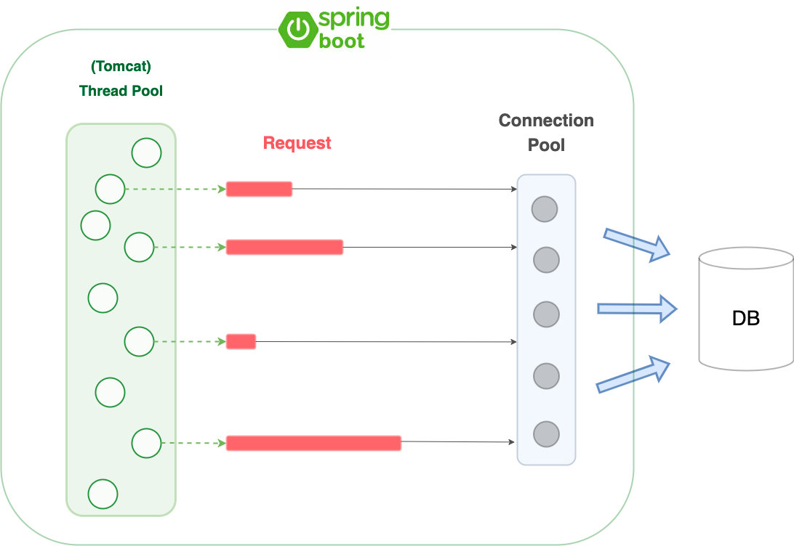

## Spring Boot - Thread Pool을 관리하는 방법! (Spring Boot에서의 Thread 동작) [ThreadPoolExecutor]

### Spring Boot - Multi thread

Spring Boot에서 Multi thread의 동작은 아래와 같습니다.



내장 Tomcat에 Thread Pool을 만들고, Request가 들어오면 해당 Thread가 해당 요청을 담당해서 로직을 태워 처리합니다.

쓰레드는 Connection Pool에서 유휴 상태인 DB Connection이 존재하면 사용하고, 생성해야 한다면 생성합니다.

그리고 Connection을 이용해서  DB에 접근합니다.

### ThreadPoolExecutor

스프링 부트에서 멀티 쓰레드(Multi thread)를 관리하기 위해서 ThreadPoolExecutor를 사용합니다.

Spring Boot가 실행되면 내부적으로 ThreadPoolExecutor 구현체를 생성해서 내장 톰캣이 사용할 쓰레드 풀을 생성하는 구조입니다.

application.yml에 아래와 같이 쓰레드 풀 프로퍼티를 추가할 수 있습니다.

```
server:
  tomcat:
    threads:
      max: 200
      min-spare: 10
    accept-count: 100
  port: 8080
```

위의 설정은 스프링부트 default로 사용되는 설정입니다.

-   threads.max - 쓰레드의 최대 개수
-   threads.min-spare - 활성화 상태로 유지할 최소 쓰레드의 개수
-   tomcat.accept-count - 모든 스레드가 사용 중일때 들어오는 연결 요청 큐의 최대 길이

더 상세한 설정은 공식문서의 application-properties 부분을 참고하시면 됩니다.

[https://docs.spring.io/spring-boot/docs/current/reference/html/application-properties.html](https://docs.spring.io/spring-boot/docs/current/reference/html/application-properties.html)

Spring Boot는 해당 설정이 있다면 가져와서 ThreadPoolExecutor 빈(tomcatThreadPool)을 등록할 때 사용합니다.

---

**Reference**

-   [https://velog.io/@sihyung92/how-does-springboot-handle-multiple-requests](https://velog.io/@sihyung92/how-does-springboot-handle-multiple-requests)
-   [https://d2.naver.com/helloworld/5102792](https://d2.naver.com/helloworld/5102792)
-   [https://www.baeldung.com/java-web-thread-pool-config](https://www.baeldung.com/java-web-thread-pool-config)

​