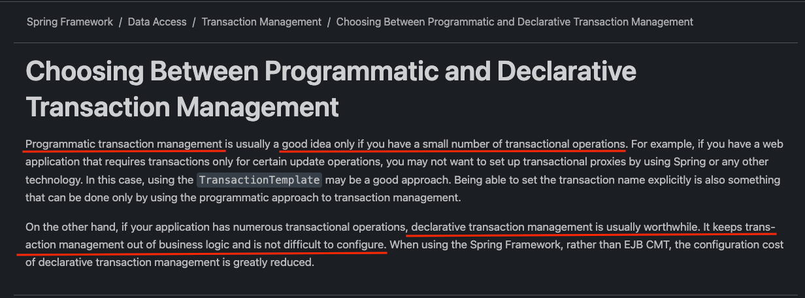

스프링에서 트랜잭션은 방식에 따라 크게 2가지로 나뉜다.
- 선언적 트랜잭션
- 프로그래밍 트랜잭션

선언적 트랜잭션(Declarative Transaction)이란 `@Transactional`과 같은 애노테이션을 기반으로 트랜잭션을 처리하는 방식을 말한다.

## 선언적 트랜잭션 vs 프로그래밍 트랜잭션

[공식문서](https://docs.spring.io/spring-framework/reference/data-access/transaction/tx-decl-vs-prog.html)를 보면 아래와 같이 명시되어있다.

해당 부분을 요약하면 다음과 같다.

**프로그래밍적 트랜잭션**은 트랜잭션 수가 적을 때에 한해서 좋다. 트랜잭션을 사용하는 곳이 적다면, 그런 적은 사용을 위해 스프링이나, 프록시와 같은 기술을 신경쓰지 않을 수 있다.

반면, 트랜잭션 작업이 많은 경우 **선언적 트랜잭션**이 좋다. 선언적 트랜잭션 관리는 비즈니스 로직에 집중할 수 있게 도와주고 트랜잭션 처리가 비교적 간단하기 때문이다.

## 프로그래밍 트랜잭션

스프링에서 지원하는 프로그래밍적 트랜잭션은 크게 아래 2가지 방법이 있다.
- TransactionTemplate
- TransactionalOperator

`TransactionTemplate`은 PlatformTransactionManager를 기반으로 동작한다. 즉, 동기식 코드에 적합하다.

반응형 코드에서는 `TransactionalOperator`를 권장한다.

`TransactionalOperator`는 콜백 방식을 사용하고, `ReactiveStream`을 기반으로 동작한다.

## 참고

- https://docs.spring.io/spring-framework/reference/data-access/transaction/tx-decl-vs-prog.html
