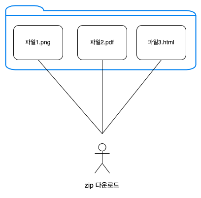
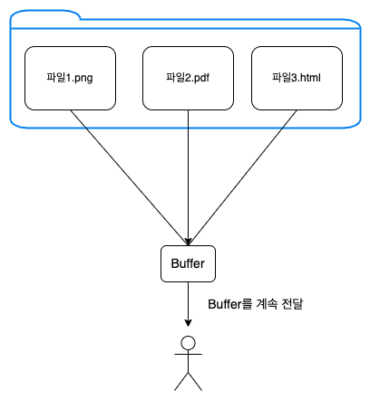
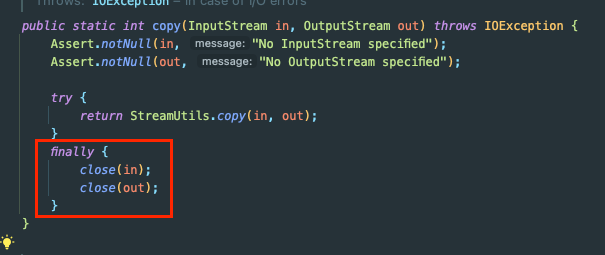
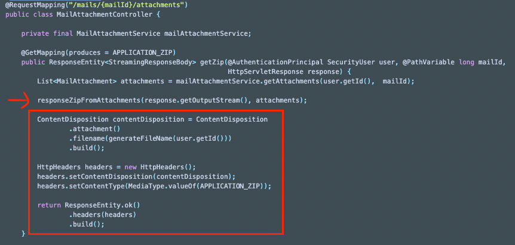
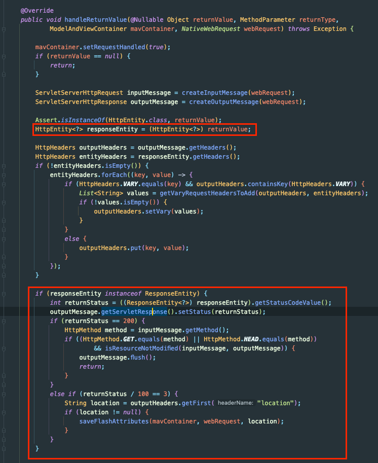

## SpringBoot - zip 압축 및 다운 로드 구현하기!

Spring 프로젝트에서 zip 다운로드를 구현한 내용을 공유한다.

요구사항은 아래와 같다.



사용자로 부터 GET 요청을 받으면 파일 시스템 내의 특정 폴더의 파일들을 zip 형태로 내려준다.

## Content-Type / Accept

API를 설계하면서 Content-Type과 수용 가능한 Accept 설계가 필요하다.

아래의 두 가지 중 고민이 있었다.

- application/zip
- application/octet-stream

아래 부분 참고했을 때 application/zip이 MIME 표준으로 적합한 솔루션이라고 한다.
- [참고 - stackoverflow](https://stackoverflow.com/questions/4411757/zip-mime-types-when-to-pick-which-one)

추가로 아래의 이유로 application/zip을 선택했습니다.
- zip 이외의 다운로드가 추가될 수 있음 (end-point: /mails/:mailNo/attachments)
- 타 레퍼런스 참조 (메일 솔루션)
    - Naver mail는 application/zip
    - Gmail은 application/x-zip-compressed

하지만 (Java의 MediaType에서는 `application/zip`을 지원하지 않음)
- static 변수 처리

## Zip 로직 위치

Zip으로 만드는 기능을 표현(Presentation) 계층에 둘 지 응용 서비스(Application) 계층에 둘 지 고민이 있었다.

해당 부분의 경우 Controller(Presentation)에서 담당하는 것이 적합하다고 생각했으며, 나중에 보겠지만 Response를 활용해서 바로 Zip을 스트리밍 형식으로 전달하기 때문에 Presentation이 더 적합했다.

추가로 Zip으로 만들어서 응답을 내려주는 것은 Controller에서 하지만, Zip으로 만드는 것 자체는 재활용이 가능하도록 별도의 모듈 형태로 분리하는 것이 좋을 것 같다.

나머지는 차차 언급하기로 하고 구현에 대해 살펴보자.

## 구현 (최초)

구현 부분은 설명을 위해 불필요한 로직은 생략했다.

아래는 최초 구현이다.

```java

@RestController
@RequiredArgsConstructor
@RequestMapping("/mails/{mailId}/attachments")
public class MailAttachmentController {

    private final MailAttachmentService mailAttachmentService;

    @GetMapping(produces = APPLICATION_ZIP)
    public ResponseEntity<StreamingResponseBody> getZip(@AuthenticationPrincipal SecurityUser user, @PathVariable long mailId,
                                                        HttpServletResponse response) {
        List<MailAttachment> attachments = mailAttachmentService.getAttachments(user.getId(),  mailId);

        responseZipFromAttachments(response.getOutputStream(), attachments);

        ContentDisposition contentDisposition = ContentDisposition
                .attachment()
                .filename(generateFileName(user.getId()))
                .build();

        HttpHeaders headers = new HttpHeaders();
        headers.setContentDisposition(contentDisposition);
        headers.setContentType(MediaType.valueOf(APPLICATION_ZIP));

        return ResponseEntity.ok()
                .headers(headers)
                .build();
    }
    
    private void responseZipFromAttachments(OutputStream os, List <MailAttachments> attachments) {
        try(ZipOutputStream zos = new ZipOutputStream(os)) {
            for (MailAttachmentDto.Detail attachment: attachments) {
                ZipEntry zipEntry = new ZipEntry(attachment.getFilename());
                zos.putNextEntry(zipEntry);
                zos.write(attachment.getBytes());
                zos.closeEntry();
            }
        } catch(IOException e) {
            throw new StorageIOException(e);
        }
    }

}

```

### MediaType

produces(Accept)와 Content-type에 application/zip을 사용하기로 했다.

그런데 org.springframework.http.MediaType에서는 static 변수로 application/zip을 지원하지 않는다.

그래서 아래와 같이 static 변수를 선언하였다.

```java
public class CustomMediaTypes {
    public static final String APPLICATION_ZIP = "application/zip";
}
```

### ZipOutputStream

ZipOutputStream을 구현한 부분이다.

```java
private void responseZipFromAttachments(OutputStream os, List <MailAttachments> attachments) {
    try(ZipOutputStream zos = new ZipOutputStream(os)) {
        for (MailAttachmentDto.Detail attachment: attachments) {
            ZipEntry zipEntry = new ZipEntry(attachment.getFilename());
            zos.putNextEntry(zipEntry);
            zos.write(attachment.getBytes());
            zos.closeEntry();
        }
    } catch(IOException e) {
        throw new StorageIOException(e); // Custom Exception
    }
}
```

간략하게 소개해주면 ZipEntry(zip 구성 요소)에 파일명을 하나씩 명시한 후 ZipOutputStream에 넣고 데이터를 넣는 작업을 반복한다.
- stream을 사용하지 않은 이유는 내부에서 예외처리를 하면 코드가 복잡해지고, 순서 보장이 중요하기 때문이다! (한번 시도해보는 것도 추천한다.)

(아실 분은 아시겠지만) 해당 코드에는 몇가지 문제가 있었다.

#### 1. Memory 낭비

위와 같이 Response의 OutputStream을 바로 ZipOutputStream으로 변환해서 사용한 이유는 메모리 낭비를 줄이기 위해서이다.

가령 ZipOutputStream을 ByteArrayInputStream에다가 옮겨 닮은 후에 InputStreamResource로 내려주는 방법도 생각할 수 있었다.
- 해당 경우에는 zip 파일(ByteArrayInputStream)이 메모리에 모두 올라가게 된다.

그러한 메모리 낭비를 줄이기 위해 아래 그림과 같이 파일을 메모리에 전부 올리지 않고 데이터를 조금씩 지속적으로 읽으면서 응답하길 원했다.



그런데 attachment.getBytes()의 내부 구현을 보니까 모든 byte를 읽어서 메모리에 올리고 있었다.

```java
public byte[] getBytes() {
    try {
       return inputStream.readAllBytes();
    } catch (IOException e) {
        throw new StorageIOException(e.getMessage());
    }
}
```

즉, 폴더의 전체 파일이 메모리로 올라가진 않았지만, 파일을 하나씩 통째로 메모리에 올리고 있었다.

그래서 해당 부분을 변경했다.

```java
// zos.write(attachment.getBytes()); <- 삭제
InputStream is = attachment.getInputStream()
try {
    StreamUtils.copy(is, zos);
} finally {
    is.close();
}
```

StreamUtils를 사용하면 InputStream의 내용을 OutputStream으로 write할 수 있다.

(InputStream의 close를 직접해야 한다는 불편함이 있는데, 다른 Util은 없을까..?) 

FileCopyUtils를 사용하면 close까지도 직접 해준다.



문제는 ZipOutputStream이 닫히면 다음 Entry를 쓸 수 없다. 그래서 해당 처리가 없는 StreamUtils를 활용해서 데이터를 옮긴 다음 InputStream만 닫아주는 처리가 필요하다.

즉, StreamUtils를 사용하도록 한다.

이제 메모리 문제는 해결되었다.

#### 2. 헤더 적용

위 Controller 코드를 다시 보면 OutputStream에서 write를 한 다음 ResponseEntity를 만들어서 반환하고 있다.



여기서 아래 부분은 동작하지 않는다. 즉, 헤더가 설정되지 않은 채로 응답을 보내게 된다.

zip파일을 쓰는 데 사용했던 HttpServletResponse는 javax.sevlet에서 지원하는 객체이다. 반면 ResponseEntity는 org.springframework.http에 있는 Spring에서 제공하는 추상화된 응답 객체이다.



HttpEntityMethodProcessor를 보면 Spring에서는 ResponseEntity를 HttpServletResponse 형태로 다시 변경해주는 방식이다.

해당 부분이 동작하지 않았던 이유는 os.write()로 이미 응답을 모두 내려주고 OutputStream을 닫았기 때문에 더 이상 응답을 내려주지 않았다.

이를 해결하기 위해서는 두 가지 방법이 있었다.

#### StreamingResponseBody

response의 OutputStream에 바로 출력하려고 하니 ResponseEntity의 header가 적용되지 않는 이슈가 있었습니다.

해당 부분을 처리하려면 zip 파일을 쓰기(`os.write`) 전에 아래의 처리가 필요합니다.
```
response.setHeader("Content-Disposition", "attachment; filename=\"" + fileName + "\";");
response.setHeader("Content-Type", contentType);
```

```java
@GetMapping(produces = APPLICATION_ZIP)
    @SubDbUserSet
    public void getZip(@AuthenticationPrincipal SecurityHiworksUser hiworksUser, @PathVariable long mailNo, HttpServletResponse response) {
        Office officeSetting = officeService.getOfficeSetting(hiworksUser.getOfficeNo());

        List<MailAttachmentDto.Detail> noCidAttachments = mailAttachmentService.getAttachments(hiworksUser.getOfficeNo(), hiworksUser.getOfficeUserNo(), mailNo, hiworksUser.getUserId(), officeSetting, true);

        response.setHeader("Content-Disposition", "attachment; filename=\"" + generateFileName(hiworksUser.getUserId()) + "\";");
        response.setHeader("Content-Type", APPLICATION_ZIP);

        responseZipFromAttachments(response, noCidAttachments);
    }
```
(메서드는 void를 반환하게 됨)

해당 부분이 너무 row한 것 같아서 StreamingResponseBody를 사용해서 구현하였습니다.
- thread를 추가로 사용하게 되는 단점
  - 예외 처리는 가능
