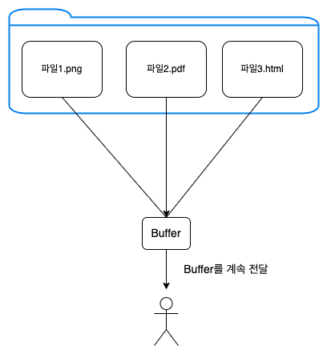
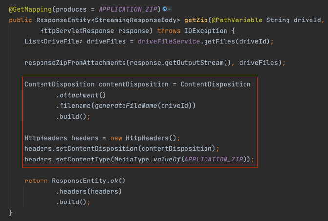
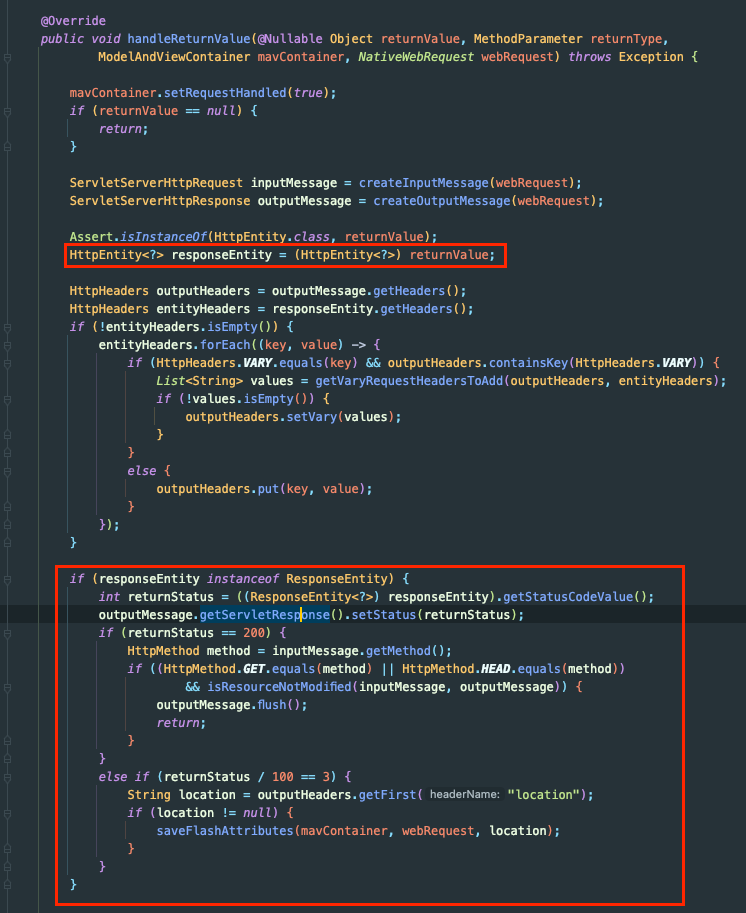
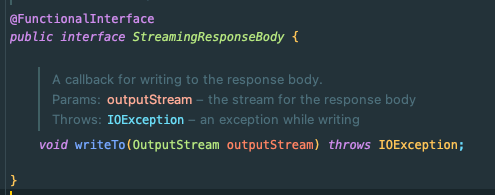
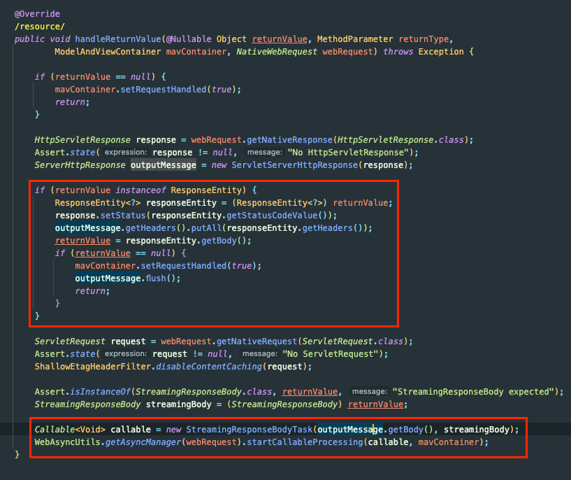

Spring 프로젝트에서 zip 다운로드를 구현한 내용을 공유한다.

요구사항은 아래와 같았다.

사용자로부터 GET 요청을 받으면 파일 시스템 내의 특정 폴더의 파일들을 zip 형태로 내려준다.

## Content-Type / Accept 스펙 설계

API를 설계하면서 Content-Type과 수용 가능한 Accept 설계가 필요하다. 아래의 두 가지 중 선택에 고민이 있었다.

- application/zip
- application/octet-stream

아래 부분 참고했을 때 `application/zip`이 IANA에 공식적으로 등록된 MIME 표준이라서 가장 적합한 솔루션이라고 한다.

- [참고 - stackoverflow](https://stackoverflow.com/questions/4411757/zip-mime-types-when-to-pick-which-one)

추가로 아래의 이유가 있어서 application/zip을 선택했다.

- zip 이외의 다운로드가 추가될 수 있음 (폴더 다운로드, csv 다운로드 등)
    - 각각 필요한 헤더값을 사용해야 하므로 `application/octet-stream`과 같은 범용적인 것보다 zip을 표현하는 것이 확장성이 있었다.
- 각기 다른 포맷의 다운로드를 url로 분기하는 것보다 Accept 헤더로 분기하는 것이 바람직하다고 생각했다. [참고 - NHN 기술 블로그](https://meetup.nhncloud.com/posts/92)

`org.springframework.http.MediaType`에서는 `application/zip`을 지원하지 않는다.

그래서 아래와 같이 static 변수를 선언하였다.

```java
public class MediaTypes {
    public static final String APPLICATION_ZIP = "application/zip";
}
```

## 레이어 설계

Zip으로 만드는 기능을 표현(Presentation) 계층에 둘 지 응용 서비스(Application) 계층에 둘 지 고민이 있었다.

응답의 형태를 정의하는 부분이라서 Presentation Layer에서 담당하는 것이 적합하다고 생각했다.

## 구현

아래는 예시를 위해 구현한 코드이다.

```java

@RestController
@RequiredArgsConstructor
@RequestMapping("/drives/{driveId}/files")
public class FileController {

    private final DriveFileService driveFileService;

    @GetMapping(produces = APPLICATION_ZIP)
    public ResponseEntity<StreamingResponseBody> getZip(@PathVariable String driveId,
        HttpServletResponse response) {
        List<DriveFile> driveFiles = driveFileService.getFiles(driveId);

        responseZip(response.getOutputStream(), driveFiles);

        ContentDisposition contentDisposition = ContentDisposition
            .attachment()
            .filename(generateFileName(driveId))
            .build();

        HttpHeaders headers = new HttpHeaders();
        headers.setContentDisposition(contentDisposition);
        headers.setContentType(MediaType.valueOf(APPLICATION_ZIP));

        return ResponseEntity.ok()
            .headers(headers)
            .build();
    }
}
```

## ZipOutputStream

아래는 ZipOutputStream의 java-doc 일부이다.
> This class implements an output stream filter for writing files in the ZIP file format. Includes support for both
> compressed and uncompressed entries.

ZipOutputStream은 java.util.zip 패키지에 있으며 zip 형식으로 파일을 쓰기 위한 출력 스트림을 구현한다.

```java
void responseZip(OutputStream os, List<DriveFile> driveFiles) {
    try (ZipOutputStream zos = new ZipOutputStream(os)) {
        for (DriveFile driveFile : driveFiles) {
            ZipEntry zipEntry = new ZipEntry(driveFile.getFilename());
            zos.putNextEntry(zipEntry);
            zos.write(driveFile.getBytes());
            zos.closeEntry();
        }
    } catch (IOException e) {
        throw new DriveIOException(e);
    }
}
```

각 ZipEntry에 파일명과 함께 생성한 후 ZipOutputStream에 넣고 파일 데이터(Binary)를 write하는 작업을 반복한다.

해당 코드에는 몇가지 문제점이 있었다.

### 1\. Memory 낭비

Response의 OutputStream을 바로 ZipOutputStream으로 변환해서 사용한 이유는 메모리 낭비를 줄이기 위해서였다.

예를 들어 ZipOutputStream을 ByteArrayInputStream에다가 옮겨 닮은 후에 InputStreamResource로 내려주는 방법도 생각할 수 있었다.

- 해당 경우에는 ZIP 파일의 데이터(ByteArrayInputStream)가 모두 메모리에 로드된다.

그래서 메모리 낭비를 줄이기 위해 파일을 메모리에 전부 올리지 않고 데이터를 조금씩 지속적으로 읽으면서 응답하길 원했다.



아래는 responseZip()의 일부이다.

```java
zos.write(attachment.getBytes());
```

attachment.getBytes()의 내부 구현을 보니까 모든 파일 데이터(bytes)를 읽어서 메모리에 올리고 있었다.

```java
public byte[] getBytes() {
    try {
        return inputStream.readAllBytes();
    } catch (IOException e) {
        throw new DriveIOException(e.getMessage());
    }
}
```

즉, 파일을 하나씩 통째로 메모리에 올리고 있었다.

그래서 해당 부분을 아래와 같이 변경했다.

```java
void responseZip(OutputStream os, List<DriveFile> driveFiles) {
    try (ZipOutputStream zos = new ZipOutputStream(os)) {
        for (DriveFile driveFile : driveFiles) {
            ZipEntry zipEntry = new ZipEntry(driveFile.getFilename());
            zos.putNextEntry(zipEntry);
            // zos.write(driveFile.getBytes());
            try(InputStream is = driveFile.getInputStream()) {
                StreamUtils.copy(driveFile.getInputStream(), zos);
            }
            zos.closeEntry();
        }
    } catch (IOException e) {
        throw new DriveIOException(e);
    }
}
```

StreamUtils를 사용하면 InputStream의 내용을 OutputStream으로 write할 때 getBytes()와 같은 메서드를 호출하지 않는다.

즉, FileInputStream의 구현대로 **버퍼 방식으로 write**할 수 있게된다. 모든 bytes를 메모리에 한 번에 올리지 않아도 된다.

참고 - InputStream의 리소스 관리를 try-with-resources로 직접해야 한다는 불편함이 있는데, 다른 Util은 없을까?

FileCopyUtils를 사용하면 close까지도 직접 해준다.


ZipOutputStream까지 닫아버리면 다음 Entry를 쓸 수 없다. 그래서 **StreamUtils**를 사용했다.

### 2\. 헤더 적용 안되는 문제

Controller의 코드를 보면 OutputStream에서 write를 한 이후에 ResponseEntity를 반환하고 있다.



해당 부분이 동작하지 않았다. 즉, 헤더가 설정되지 않은 채로 응답을 보내게 된다.

ZIP 파일을 쓰는 데 사용했던 `HttpServletResponse`는 `javax.sevlet`의 클래스이다. `ResponseEntity`는 `org.springframework.http`에서 제공하는 추상화된 응답
객체이다.

Spring에서는 HttpEntityMethodProcessor가 ResponseEntity를 HttpServletResponse 형태로 다시 변경해서 처리해주고 있다.



os.write()로 이미 응답을 모두 내려주고 OutputStream을 닫았기 때문에 더 이상 응답에 관여할 수 없었던 것이다.

즉, `responseZip()`를 호출한 시점에 이미 사용자는 응답을 받았고, 이후에 헤더를 설정해서 ResponseEntity를 반환하는 것은 의미가 없었다.

이를 해결하기 위해서는 두 가지 방법이 있었다.

#### StreamingResponseBody

Spring 4.2부터 지원하는 StreamingResponseBody를 사용하면 헤더를 세팅한 후에 ResponseEntity의 body로 응답을 내려주는 것이 가능하다.

StreamingResponseBody는 OutputStream을 받는 Functional Interface이다. 



아래는 StreamingResponseBodyReturnValueHandler의 일부이다.



헤더부터 세팅한 다음 비동기 스레드를 활용해서 응답 OutputStream에 데이터를 출력하는 방식이라고 이해하면 된다.

해당 부분은 예외를 콜백받을 수는 있지만 Thread를 추가로 사용하게 된다는 단점이 있다.

Spring.io(공식 문서)에 StreamingResponseBody 설명을 보면 TaskExecutor를 명시적으로 구성하는 것이 좋다고 한다.

- [https://docs.spring.io/spring-framework/docs/current/javadoc-api/org/springframework/web/servlet/mvc/method/annotation/StreamingResponseBody.html](https://docs.spring.io/spring-framework/docs/current/javadoc-api/org/springframework/web/servlet/mvc/method/annotation/StreamingResponseBody.html)

아래는 코드를 구현한 것이다.

```java
@GetMapping(produces = APPLICATION_ZIP)
public ResponseEntity<StreamingResponseBody> getZip(@PathVariable String driveId,
    HttpServletResponse response) throws IOException {
    List<DriveFile> driveFiles = driveFileService.getFiles(driveId);

    ContentDisposition contentDisposition = ContentDisposition
        .attachment()
        .filename(generateFileName(driveId))
        .build();

    HttpHeaders headers = new HttpHeaders();
    headers.setContentDisposition(contentDisposition);
    headers.setContentType(MediaType.valueOf(APPLICATION_ZIP));
    
    StreamingResponseBody streamingResponseBody =
        out -> responseZip(response.getOutputStream(), driveFiles);
    
    return ResponseEntity.ok()
        .headers(headers)
        .body(streamingResponseBody);
}
```

#### javax.servlet.http.HttpServletResponse

StreamingResponseBody를 사용하지 않고도 이를 처리할 수 있다. `HttpServletResponse`에서 헤더를 먼저 세팅하고 `outputStream.write()`를 수행하면 된다.

즉, zip 파일을 응답에 쓰기(`os.write()`) 전에 아래의 처리를 수행해야 한다.

```java
response.setHeader("Content-Disposition","attachment; filename=\""+fileName+"\";");
response.setHeader("Content-Type",contentType);
```

단점은 Spring에서 지원하는 추상화된 객체들을 사용할 수 없어서 String으로 하드코딩된 헤더를 넘겨야 한다.

- HttpHeaders, ResponseEntity 등

StreamingResponsebody를 사용하면 스레드가 추가로 필요했고, 시스템이 복잡해지는 것보다는 낫다고 판단했다. (해당 기능이 주 기능이 아니라, 부가 기능이기 때문)

그래서 아래는 구현이다.

```java
@RestController
@RequiredArgsConstructor
@RequestMapping("/drives/{driveId}/files")
public class FileController {
    private final DriveFileService driveFileService;

    @GetMapping(produces = APPLICATION_ZIP)
    public void getZip(@PathVariable String driveId,
        HttpServletResponse response) {
        List<DriveFile> driveFiles = driveFileService.getFiles(driveId);

        response.setHeader("Content-Disposition", "attachment; filename=\"" + generateFileName(driveId) + "\";");
        response.setHeader("Content-Type", APPLICATION_ZIP);

        StreamingResponseBody streamingResponseBody =
            out -> responseZip(response.getOutputStream(), driveFiles);
    }

    private void responseZip(OutputStream os, List<DriveFile> driveFiles) {
        try (ZipOutputStream zos = new ZipOutputStream(os)) {
            for (DriveFile driveFile : driveFiles) {
                ZipEntry zipEntry = new ZipEntry(driveFile.getFilename());
                zos.putNextEntry(zipEntry);
                try (InputStream is = driveFile.getInputStream()) {
                    StreamUtils.copy(driveFile.getInputStream(), zos);
                }
                zos.closeEntry();
            }
        } catch (IOException e) {
            throw new DriveIOException(e);
        }
    }
}
```

이제 메모리 낭비 문제와 헤더 적용 문제가 해결되었다.

고려해야 할 점이 아ㅁ 있다. 코드의 재사용성과 파일명 중복에 대한 문제이다.

### 모듈화

Zip을 응답으로 내려주는 코드 구현은 완료되었지만 해당 기능을 활용해야 하는 요구사항이 추가된다면 재사용이 어렵다.
있다.

그래서 아래와 같이 Zip 모듈을 추가하게 되었다.

```java
public class ZipModule {
    public static void writeZip(OutputStream os, ZipRequest request) {
        Map<String, Integer> fileNames = new HashMap<>();

        try (ZipOutputStream zos = new ZipOutputStream(os)) {
            for (ZipRequest.ZipEntry entry : request.getEntries()) {
                String fileName = entry.getFileName();
                fileNames.put(fileName, fileNames.getOrDefault(fileName, 0) + 1);

                int duplicatedCount = fileNames.get(fileName);
                if (duplicatedCount > 1) {
                    fileName = String.format("%s_%s_%s", FilenameUtils.getBaseName(fileName), duplicatedCount,
                        FileNameUtils.getExtension(fileName));
                }

                ZipEntry zipEntry = new ZipEntry(fileName);
                zos.putNextEntry(zipEntry);
                try (InputStream is = entry.getInputStream()) {
                    StreamUtils.copy(is, zos);
                }
                zos.closeEntry();
            }
        } catch (IOException e) {
            throw new DriveIOException(e.getMessage());
        }
    }
}
```

여기서 Map으로 파일명을 저장하여 처리하는 이유는 ZipOutputStream에서는 ZipEntry를 파일명의 Hash로 구분한다.

- 동일한 파일 명을 가진 Entry가 있으면 하나로 인식하고 1개의 Entry에 데이터가 덮어써지는 문제가 발생한다.

그래서 test.png가 2개가 있을 때, 하나는 test_2.png로 처리하였다.

아래는 모듈이 사용할 데이터 객체이다.

```java
@Getter
public class ZipRequest {
    private final List<ZipEntry> entries;

    public ZipRequest() {
        this.entries = new ArrayList<>();
    }

    public void addEntry(InputStream is, String fileName) {
        entries.add(new ZipEntry(is, fileName));
    }

    @Getter
    @AllArgsConstructor
    static class ZipEntry {
        private final InputStream inputStream;
        private final String fileName;
    }

}
```

ZipReqest는 ZipOutputStream을 사용하는 데 필요한 각 InputStream과 파일명을 보관한다.

결과적으로 `responseZip()`는 아래와 같이 구성된다.

```java
void responseZip(OutputStream os, List<DriveFile> driveFiles) {
    ZipRequest zipRequest = new ZipRequest();
    driveFiles.stream()
        .forEach(driveFile -> zipRequest.addEntry(driveFile.getInputStream(), driveFile.getFilename()));
    ZipModule.writeZip(os, zipRequest);
}
```

파일명이 중복된 파일이 존재할 경우와 모듈화까지도 완료할 수 있었다.

## 참고

- [https://docs.spring.io/spring-framework/docs/current/javadoc-api/org/springframework/web/servlet/mvc/method/annotation/StreamingResponseBody.html](https://docs.spring.io/spring-framework/docs/current/javadoc-api/org/springframework/web/servlet/mvc/method/annotation/StreamingResponseBody.html)
- [https://madplay.github.io/post/java-file-zip](https://madplay.github.io/post/java-file-zip)
- [https://stackoverflow.com/questions/53885467/java-zip-files-from-streams-instantly-without-using-byte](https://stackoverflow.com/questions/53885467/java-zip-files-from-streams-instantly-without-using-byte)
- [https://velog.io/@dailylifecoding/file-zip-and-download](https://velog.io/@dailylifecoding/file-zip-and-download)