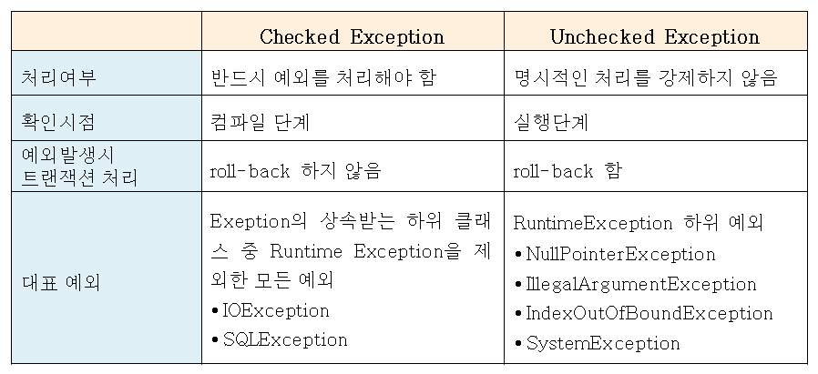
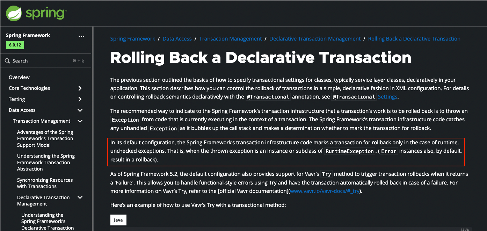

자바에서 CheckedException과 UncheckedException의 차이를 아는가..?

구글에 CheckedException의 UncheckedException의 차이에 대해서 검색해봤다.

그래서 상위 7~8개 정도의 블로그 모두 동일한 문장이 있었다.

UncheckedException은 예외가 발생 시 트랜잭션이 롤백된다는 것이다.

나는 이 부분이 잘못된 학습의 폐해라고 생각한다.

## 검증

#### 트랜잭션

UncheckedException이 발생하면 트랜잭션이 롤백된다고 한다.

트랜잭션은 MessageQueue 트랜잭션도 있고 DB 트랝객션도 있고 다른 의미의 트랜잭션도 있을 수 있다.

그래서 일반적으로 **트랜잭션**을 롤백한다는 것은 말이 안된다.

더 중요한 것은 그것이 아니다.

#### DB 트랜잭션

만약에 DB 트랜잭션이라고 가정했을 때도 말이 안된다. 자바의 패키지 관점에서 Exception의 Level(수준)에서 DB 트랜잭션을 알 리가 없다.

DB 트랜잭션에서 **롤백을 언제 실행할 지는 개발자가 정하는 것**이다.

그러면 저런 표의 기원이 뭘까..?

## 오해의 기원

이 오해의 기원은 `Spring Transaction`에서 시작된 것이다.

아래 Spring 공식문서를 보면
- https://docs.spring.io/spring-framework/reference/data-access/transaction/declarative/rolling-back.html

## 참고
- https://www.youtube.com/watch?v=_WkMhytqoCc

