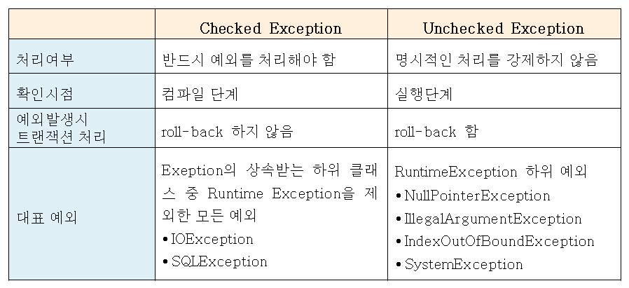
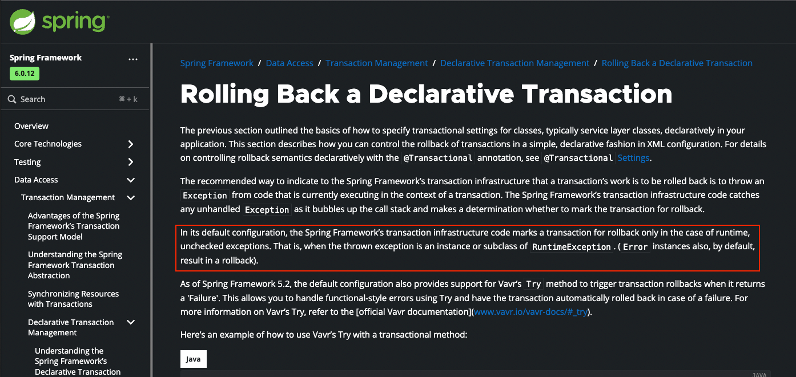
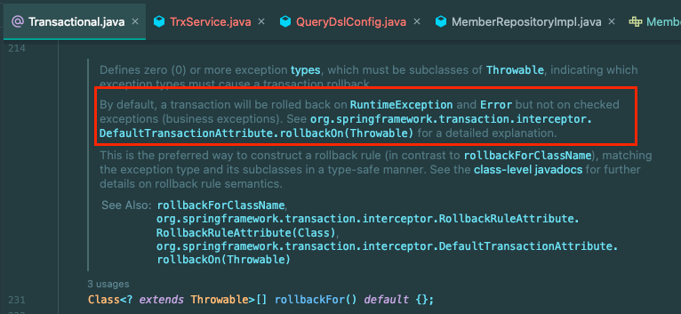
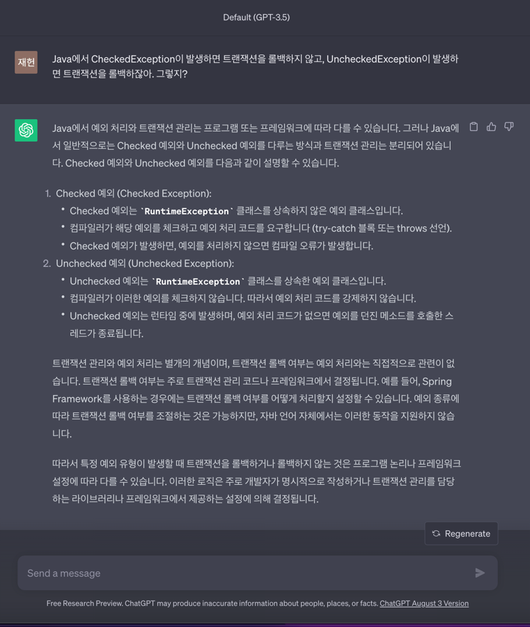

자바에서 CheckedException과 UncheckedException의 차이를 아는가? 구글에 CheckedException의 UncheckedException의 차이에 대해서 검색해봤다.

상위 7~8개 정도의 블로그 모두 동일한 표가 있었다.

여기서 의아한 점이 **UncheckedException은 예외가 발생 시 트랜잭션이 롤백된다는 것**이다.

나는 이 부분이 잘못된 **학습의 폐해**라고 말하고 싶다.

#### 트랜잭션

UncheckedException이 발생하면 트랜잭션이 롤백된다고 한다.

트랜잭션은 MessageQueue 트랜잭션도 있고 DB 트랝객션도 있고 다른 의미의 트랜잭션도 있을 수 있다. 그래서 **트랜잭션**을 롤백한다는 것은 말이 안된다.

#### 데이터베이스 트랜잭션

만약 데이터베이스 트랜잭션이라고 가정했을 때도 말이 안된다. **자바 Exception**의 **Level(수준)**에서 **데이터베이스 트랜잭션**을 알 리가 없다.

패키지 관점에서도 `java.lang.RuntimeException`이 **데이터베이스 트랜잭션**의 롤백 여부를 결정하는 것도 말도 안된다.

DB 트랜잭션에서 **롤백을 언제 실행할 지는 개발자가 정하는 것**이다.

그러면 저런 문장의 기원이 뭘까..?

## 오해의 기원 - Spring Transaction

이 오해의 기원은 `Spring Transaction`에서 시작된 것이다.

아래 Spring 공식문서를 보면 `Spring Transaction`에서 기본적으로 `RuntimeException`및 그 하위 Exception이 발생할 경우 **트랜잭션을 롤백**한다고 적혀있다. 
- https://docs.spring.io/spring-framework/reference/data-access/transaction/declarative/rolling-back.html

`spring-tx`의 `@Transactional` 애노테이션에서도 아래와 같이 `rollbackFor`에 대한 **기본 동작**을 문서로 제공하고 있다.

**매우 작은 범위(`Spring` - `DB Transaction` - `default configuration`)안에서 발생하는 현상**을 가지고 `Java`의 `UncheckedException`의 개념인 것처럼 누군가 블로그를 작성했고, 그것이 **Copy & Paste로 와전**된 것이다.

UncheckedException이 발생했을 때 Rollback이 발생하는 현상는 `Spring`에서 제공하는 `Transaction`의 **기본 동작**일 뿐이고 롤백을 직접 수행하거나 Framework의 설정을 얼마던지 변경할 수 있다.

## 정리

결론은 위 사례와 같은 **무지성 학습**을 하면 안된다는 점이다.

**짧게 보면 지식 1개만 잘못되는 것**이지만 **꼬리를 물고 물어** **방향 자체가 틀어질 가능성**이 있다.  무지성 학습은 **깊이 있게 지식을 확장해나가기 어렵다.**

블로그를 참고하는 것은 좋지만 **공식적이고 신뢰성이 충분히 확보**된 **공식 레퍼런스**를 **메인으로 학습**해야 하고, 빅테크 기업의 기술 블로그까지는 그나마 믿을만하다.

**개인이 운영하는 검증되지 않는 블로그**는 정보가 부족할 때 **단순 참고용**으로만 사용하자.

## 번외 - ChatGPT 함정 수사

ChatGPT를 상대로 이 부분을 함정 수사하면 걸릴 것만 같았다.

그래서 ChatGPT한테 아래와 같이 물어봤다.

내 예상과 다르게 ChatGPT는 똑똑했고.. 내 질문에 낚이지 않았다!

## 참고
- https://www.youtube.com/watch?v=_WkMhytqoCc

