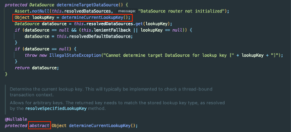

### 동적 데이터 소스와 스키마 이름

팀에서 API를 개발할 때 **Java Spring**으로 프로젝트를 진행하고 싶었는데 어려움이 있었다.

서비스의 DB구조 때문이다. 아래는 운영중인 서비스의 DB 구조와 동일하게 만든 것이다.



구조를 보면 DB 서버를 여러 대로 **샤딩(Sharding)** 하고 있고, **스키마도 분산**되어 있다.
- 사내에서는 아주 오래 전부터 해당과 같은 구조라고 했다.

데이터를 저장할 때 유저가 속한 **그룹별**로 데이터를 **특정 DB서버**의 **특정 스키마**에 저장해서 사용한다.
- 사내에서는 `mail_01`에서 `01`을 파티션이라는 용어로 사용한다.

해당 유저가 찾는 테이블이 **어느 DB**의 **몇 번째 스키마**에 저장되어 있는지는 MasterDB라고 부르는 DB 서버에 저장되어 있고, 매번 DB 질의가 비효율적이므로 JWT에 발급해서 사용한다.

#### 정리하자면

DB 서버가 샤딩(Sharding)된 구조를 가진다.

일반적으로 사용하는 DBMS에서 지원하는 파티셔닝은 논리적으로는 하나의 테이블이지만 물리적으로는 여러 개의 테이블로 나누는 구조를 가진다.

해당 서비스에서는 자체적으로 스키마를 파티셔닝해서 논리적으로도 물리적으로도 여러 개의 **스키마**로 나누어져 있다.

### 그럼 뭐가 문제일까?

기존에 사용하던 NodeJS의 Sequelize나 PHP의 Laravel의 경우에는 모델(Entity)을 **런타임 중에 동적으로 생성**할 수 있었다.

```typescript
class UserModelFactory {
    private models = new Map<string, ModelStatic<UserModel>>();
    public getModel = async (host: string, partition: string): Promise<ModelStatic<UserModel>> => {
        const key = `${host}_${partition}`;
        if( this.models.has(key) ) {
            return this.models.get(key);
        }

        const conn = await DBConnectionFactory.getConnection(host);
        const model = conn.define<UserModel>(`user_${key}`,
            ModelAttributes, {
                tableName: "user",
                schema: "user" + partition,
                timestamps: false
            });

        this.models.set(key, model);
        return model;
    };
}
```

모델의 정의를 `host, partition`을 key로 해서 맵에 찾는 모델이 없을 경우 생성해서 사용하면 된다.

정리하면 **모델을 사용할 때마다 매번 jwt에서 꺼낸 host, partition으로 특정 DB의 특정 스키마와 매핑되는 모델을 만든다**고 생각하면된다.

### JPA에서는 못하는 이유

JPA에서는 기존에 DB 정보와 함께 모델을 생성하는 게 불가능했다.

JPA에서는 1개의 EntityModel을 사용한다. 기존의 방식으로는 DB 서버와 스키마 명이 여러 개인 문제를 해결할 수 없었다.

팀 내에서 이러한 DB 구조 때문에 Java로 개발을 못하고 있었으며, 자바로 개발된 프로젝트가 1개 있었는데 전부 JdbcTemplate을 사용했다.
- DataSource를 DB 서버 개수만큼 생성
- 파티션을 포함한 스키마명은 `sql`에 명시

JPA와 같은 ORM을 사용할 수 없었고, JdbcTemplate을 사용하더라도 DB 서버가 늘어나면 그것에 맞게 DataSource 개수도 추가해줘야 하는 문제가 있었다.

이 문제를 해결해야 했다.

## 해결 방식

Spring의 대부분 프로젝트에서 Template Method 패턴과 Strategy 패턴을 충분히 사용한다.

주어진 문제는 2개의 추상화된 문제로 분리할 수 있었다.
1. DB Sharding
2. Schema name 동적 처리

## 1. DB Sharding

샤딩의 다양한 기법에 대해서는 아래 포스팅에서 정리했었다.
- https://jaehoney.tistory.com/296

아래에서 설명할 방법은 **앱 서버** 레벨에서 샤딩된 DB를 매핑하는 방법이다.

#### AbstractRoutingDataSource

관련된 정보나 라이브러리를 찾으면서 삽질을 하던 중 `Spring Jdbc`에서 `AbstractRoutingDataSource` 라는 클래스를 확인할 수 있었다.

해당 클래스는 여러 개의 `DataSource`를 등록하고 `키`를 통해 동적으로 `DataSource`와 커넥션을 맺을 수 있는 `DataSource` 이다.

아래는 공식문서이다.
- https://docs.spring.io/spring-framework/docs/current/javadoc-api/org/springframework/jdbc/datasource/lookup/AbstractRoutingDataSource.html

정리하면 Java Application에서 Sharding된 DataSource를 선택해서 접근을 할 수 있는 클래스였다.

해당 부분을 검토해보기로 했다.

#### ThreadLocal

`AbstractRoutingDataSource`의 Key를 관리하는 방법으로 `ThreadLocal`을 선택하게 되었다.
- 각 요청마다 파라미터 없이 DB 정보를 구할 수 있어야 함
- (Request Scope) Bean vs ThreadLocal을 검토 하다가 ThreadLocal을 선택하게 되었다.
  - Request Scope의 Bean도 내부적으로 ThreadLocal을 사용
  - ThreadLocal은 이미 많이 사용되고 있음


아래는 `AbstractRoutingDataSource`의 구현체이다.

```java
class MultiDataSource extends AbstractRoutingDataSource {
    @Override
    protected Object determineCurrentLookupKey() {
        return DBContextHolder.getIp();
    }
}
```

아래와 같이 ThreadLocal에 정적으로 접근할 수 있는 Util 클래스를 만든다.

```java
public class DBContextHolder {
    private static final ThreadLocal<DbInfo> threadLocal = new ThreadLocal();

    public static void setDbInfo(String ip, String partition) {
        DbInfo dbInfo = new DbInfo(ip, partition);
        threadLocal.set(dbInfo);
    }

    public static DbInfo getDbInfo() {
        DbInfo dbInfo = threadLocal.get();
        if(dbInfo == null) {
            throw new IllegalStateException("DbInfo가 존재하지 않습니다.");
        }
        return dbInfo;
    }

    public static String getIp() {
        DbInfo dbInfo = getDbInfo();
        return dbInfo.ip();
    }

    public static String getPartition() {
        DbInfo dbInfo = getDbInfo();
        return dbInfo.partition();
    }

    public static void clear() {
        threadLocal.remove();
    }
}
```

DbInfo 클래스에는 host와 partition을 담는다.

```java
public record DbInfo(String ip, String partition) {
}
```

이제 DataSource를 선택하는 코드는 작성되었다.

#### MultiDataSourceManager

런타임 중에 AbstractRoutingDataSource의 dataSource를 추가할 수 있어야 한다.

AbstractRoutingDataSource를 관리하는 클래스를 하나 만들자.

```java
@Slf4j
@Configuration
public class MultiDataSourceManager {
    // vey = hostIp, value = DataSource
    // 동시성을 보장해야 하므로 ConcurrentHashMap을 사용한다.
    private final Map<Object, Object> dataSourceMap = new ConcurrentHashMap<>();

    private AbstractRoutingDataSource multiDataSource;
    private final DataSourceCreator dataSourceCreator;

    public MultiDataSourceManager(DataSourceCreator dataSourceCreator) {
        MultiDataSource multiDataSource = new MultiDataSource();
        // AbstractRoutingDataSource의 targetDataSource를 지정
        multiDataSource.setTargetDataSources(dataSourceMap);
        // Key 대상이 없을 경우 호출되는 DataBase 지정 (해당 프로젝트에서는 Key가 없으면 예외가 터지도록 설계)
        multiDataSource.setDefaultTargetDataSource(dataSourceCreator.defaultDataSource());
        this.multiDataSource = multiDataSource;
        this.dataSourceCreator = dataSourceCreator;
    }

    @Bean
    public AbstractRoutingDataSource multiDataSource() {
        return multiDataSource;
    }

    public void addDataSourceIfAbsent(String ip) {
        if (!this.dataSourceMap.containsKey(ip)) {
            DataSource newDataSource = dataSourceCreator.generateDataSource(ip);
            try (Connection connection = newDataSource.getConnection()) {
                dataSourceMap.put(ip, newDataSource);
                // 실제로 사용하는 resolvedTargetDataSource에 반영하는 코드
                multiDataSource.afterPropertiesSet();
            } catch (SQLException e) {
                log.error("datasource connection failed ip: {}", ip);
                throw new IllegalArgumentException("Connection failed.");
            }
        }
    }
}
```

이제 **최초 JPA EntityLoading** 시 필요한 DataSource를 만들어야 한다.

```java
@Configuration
@RequiredArgsConstructor
public class DataSourceCreator {
    private final DBProperties dbProperties;

    public DataSource generateDataSource(String ip) {
        HikariConfig hikariConfig = initConfig(ip);
        return new HikariDataSource(hikariConfig);
    }
    
    public DataSource defaultDataSource() {
        String defaultHostIp = dbProperties.getDefaultHostIp();
        String defaultHostPartition = dbProperties.getDefaultPartition();

        HikariConfig hikariConfig = initConfig(defaultHostIp);
        HikariDataSource datasource = new HikariDataSource(hikariConfig);
        // JPA 엔터티 최초 로딩 시 파티션 보관 필요
        DBContextHolder.setDbInfo(defaultHostIp, defaultHostPartition);
        return datasource;
    }

    private HikariConfig initConfig(String hostIp) {
        HikariConfig hikariConfig = new HikariConfig();
        hikariConfig.setJdbcUrl(getConnectionString(hostIp));
        hikariConfig.setUsername(dbProperties.getUsername());
        hikariConfig.setPassword(dbProperties.getPassword());
        hikariConfig.setDriverClassName(dbProperties.getDriver());
        return hikariConfig;
    }

    public String getConnectionString(String hostname) {
        StringBuilder sb = new StringBuilder()
            .append("jdbc:mysql://")
            .append(hostname)
            .append(":").append(dbProperties.getPort())
            .append("/").append(dbProperties.getDefaultSchema());
        return sb.toString();
    }
}
```

해당 클래스는 `Jwt`에서 얻어온 `hostIp`로 DataSource를 만드는 책임도 진다.

### Filter

이제 Filter에서 해당 `ThreadLocal`에 데이터를 넣어주자. 
- Filter가 아니더라도 AOP나 Interceptor 등의 방식으로 풀면 된다.

```java
@Component
@RequiredArgsConstructor
public class ShardingFilter extends OncePerRequestFilter {
    private final MultiDataSourceManager multiDataSourceManager;

    protected void doFilterInternal(HttpServletRequest request, HttpServletResponse response, FilterChain filterChain) throws ServletException, IOException {
        DbInfo dbInfo = JwtParser.getDbInfoByRequest(request);
        DBContextHolder.setDbInfo(dbInfo);

        // DataSource가 존재하지 않을 경우에 새로 생성해준다.
        multiDataSourceManager.addDataSourceIfAbsent(dbInfo.ip());

        try {
            filterChain.doFilter(request, response);
        } finally {
            // ThreadPool을 사용하기 때문에 다른 요청이 재사용할 수 없도록 반드시 clear()를 호출해야 한다.
            DBContextHolder.clear();
        }
    }

}
```

이러면 꿈에 그리던 샤딩 문제가 해결되었다!

### Multi Schema Name

한가지 문제가 남아있다. 스키마명도 jwt에 있는 partition을 사용해서 바꿔야 한다.

`org.hibernate.resource.jdbc.spi.StatementInspector`를 구현하면 됩니다.

```sql
public class HibernateInterceptor extends EmptyInterceptor {

    @Override
    public String onPrepareStatement(String sql) {
        String partition = ThreadLocalStorage.getDbInfo() != null ?
                ThreadLocalStorage.getDbInfo().getPartition() : "";
        sql = sql.replaceAll("##part_no##", partition);
        return super.onPrepareStatement(sql);
    }
}
```

**해당 인터셉터를 등록하면 쿼리가 나갈 때 엔터티의 ##part\_no## 대신에 ThreadLocalStorage의 partition이 삽입되어 나간다**.

```
@Entity
@Table(name = "user", schema = "database_##part_no##")
@Getter
@NoArgsConstructor(access = AccessLevel.PROTECTED)
public class User {

    @Id
    @GeneratedValue
    private Long id;

    @Column
    private String name;

    public void setName(String name) {
        this.name = name;
    }
    
    public User (String name) {
        this.name = name;
    }

}
```

즉, User Entity에 대해 쿼리가 나갈 때 "database\_##part\_no##.user"가 아니라 jwt에서 꺼낸 partition이 03이었다면 "database\_03.user"이 된다.

이로써 Multi schema name 설정도 끝났다.

### DataSourceConfiguration

이제 DataSourceConfiguration 클래스를 작성한다. 특이점은 아까 만든 AbstractRoutingDataSource 구현체로 **LazyConnectionDataSourceProxy**를 만들어서 사용해야 한다.

스프링은 트랜잭션이 시작되는 시점부터 DataSource를 가져오게 된다. 그 결과 **데이터 소스가 정해지기 전에 @Transaction에 의해 데이터 소스를 불러오다가 예외가 터지게 된다.**

LazyConnectionProxy를 사용하면 실제 커넥션 이용시간이 줄어든다는 장점도 있다.

```
@Configuration
@EnableJpaRepositories(basePackageClasses = UserRepository.class, entityManagerFactoryRef = "userDBEntityManager", transactionManagerRef = "userDBTransactionManager")
@EnableTransactionManagement
public class DatasourceConfiguration {

    @Bean
    public DataSource multiDataSource(DatabaseManager databaseManager) throws SQLException {
        return databaseManager.createMultiDataSource();
    }

    @Bean
    @Primary
    public DataSource lazyDataSource(@Qualifier("multiDataSource") DataSource dataSource) {
        return new LazyConnectionDataSourceProxy(dataSource);
    }

    @Bean
    @Primary
    public LocalContainerEntityManagerFactoryBean userDBEntityManager(final JpaProperties customerJpaProperties, @Qualifier("lazyDataSource") DataSource dataSource) {
        EntityManagerFactoryBuilder builder =
                new EntityManagerFactoryBuilder(new HibernateJpaVendorAdapter(), customerJpaProperties.getProperties(), null);

        return builder.dataSource(dataSource).packages(User.class)
                .persistenceUnit("userDBEntityManager").build();
    }

    @Bean
    @Primary
    public PlatformTransactionManager userDBTransactionManager(@Qualifier("userDBEntityManager") final EntityManagerFactory factory) {
        return new JpaTransactionManager(factory);
    }

}
```

### JpaProperties

마지막으로 application.yml 에서 JpaProperties를 등록하면 된다. 여기서 아까 생성한 인터셉터를 등록한다. hibernate.ejb.interceptor에서 경로를 명시하면 된다.

```
app:
  customer:
    jpa:
      properties:
        hibernate:
          ejb.interceptor: com.violetbeach.dynamicdatabase.config.hibernate.HibernateInterceptor
          dialect: org.hibernate.dialect.MySQL8Dialect
          show_sql: true
          format_sql: true
          default_batch_fetch_size: 500
          logging:
            level:
              com.zaxxer.hikari.HikariConfig: DEBUG
              com.zaxxer.hikari: TRACE
```

### 결과

다음은 테스트코드의 일부로 Mvc 통합 테스트의 결과이다. 전부 성공했다.

[##_Image|kage@qBzZV/btrBaxCJH9l/qle7G59ggqT0bK8CNhITJK/img.png|CDM|1.3|{"originWidth":443,"originHeight":114,"style":"alignLeft","width":610,"height":157}_##]

이제 트랜잭션 결과만 잘나오면 된다.

[##_Image|kage@9caTD/btrBhvZbyr8/gsmg2ut0ejQrgcXk76mrj0/img.png|CDM|1.3|{"originWidth":588,"originHeight":166,"style":"alignLeft","width":503,"height":142}_##][##_Image|kage@bm1izb/btrBcIXhvQV/rqBJuXM13NizVkYpjAaAB0/img.png|CDM|1.3|{"originWidth":453,"originHeight":35,"style":"alignLeft","width":505,"height":39}_##]

쿼리도 문제 없이 나가고 DB 반영도 잘 된다.

[##_Image|kage@bjgJKA/btrBaQverxq/HCTxKIwy4A5rIPfJ2Mvbkk/img.png|CDM|1.3|{"originWidth":734,"originHeight":323,"style":"alignLeft","width":654,"height":288,"filename":"blob"}_##]

> 추가 개선점 고민: [https://jaehoney.tistory.com/296](https://jaehoney.tistory.com/296)
>

#### **afterPropertiesSet()**

현재 DatabaseManager 클래스에서 데이터소스를 추가할 때마다 AbstractRoutingDataSource의 **afterPropertiesSet()** **메서드**를 호출하고 있다. 원래는 해당 메소드를 사용하지 않고 있다가 해당 데이터소스가 동작하지 않아서 찾아봤다.

[##_Image|kage@z9k2J/btrCxGQ4gIY/EsXeI4JqTITErRIfsWvbO1/img.png|CDM|1.3|{"originWidth":848,"originHeight":357,"style":"alignCenter"}_##]

해당 메서드는 원래 빈이 등록된 후 실행되는 메서드이다. AbstractRoutingDataSource는 afterPropertiesSet() 메서드를  오버라이딩해서 특별한 기능을 제공한다.

afterPropertiesSet() 메서드는 우리가 설정한 targetDataSources를 resolvedDataSources에 매핑해주는 역할을 수행한다.

그렇다면 왜 targetDataSources를 resolvedDataSources에 매핑해야 할까?! 아래는 AbstractRoutingDataSource의 **determineTargetDataSource()** 메서드 로직이다.

```
protected DataSource determineTargetDataSource() {
	Assert.notNull(this.resolvedDataSources, "DataSource router not initialized");
	Object lookupKey = determineCurrentLookupKey();
	DataSource dataSource = this.resolvedDataSources.get(lookupKey);
	if (dataSource == null && (this.lenientFallback || lookupKey == null)) {
		dataSource = this.resolvedDefaultDataSource;
	}
	if (dataSource == null) {
		throw new IllegalStateException("Cannot determine target DataSource for lookup key [" + lookupKey + "]");
	}
	return dataSource;
}
```

가장 중요한 메서드인 determineTargetDataSource() 메서드(determineCurrentLookupKey로 선택한 key의 데이터 소스를 꺼내는 메서드)가 targetDatasources가 아닌 resolvedDataSources를 기반으로 동작하기 때문이다.

우리는 targetDataSources를 등록했지만 **resolvedDataSources**를 등록하지 않았다.

즉, AbstractRoutingDataSource의 afterPropertiesSet() 메서드를 통해 **targetDataSources를 이용해서 resolvedDataSources에 DataSource를 추가**하는 과정이 반드시 필요했다.


## 정리

실제 프로젝트에 적용된 코드는 아니고 설명을 위해 간소화한 코드입니다.

혹시나 코드가 필요하시다면 Github(링크) 참고 부탁드리며, 필요에 맞게 수정하셔서 사용하시길 권장드립니다.