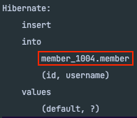
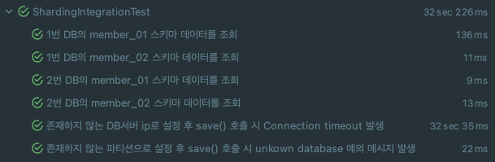
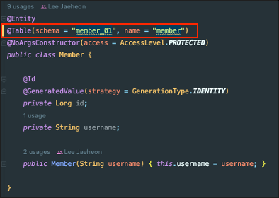

### 동적 데이터 소스와 스키마 이름

팀에서 API를 개발할 때 **Java Spring**으로 프로젝트를 진행하고 싶었는데 어려움이 있었다.

서비스의 DB구조 때문이다. 아래는 운영중인 서비스의 DB 구조와 동일하게 만든 것이다.


구조를 보면 DB 서버를 여러 대로 **샤딩(Sharding)** 하고 있고, **스키마도 분산**되어 있다.
- 사내에서는 아주 오래 전부터 해당과 같은 구조라고 했다.

데이터를 저장할 때 유저가 속한 **회사별**로 데이터를 **특정 DB서버**의 **특정 스키마**에 저장해서 사용한다.
- `mail_01`에서 `01`을 파티션이라는 용어로 사용한다.

구조를 정리하면 아래와 같다. (사내 기술 세미나에서 내가 발표한 내용의 일부이다.)



해당 유저의 정보가 **어떤 DB 서버**의 **몇 번째 스키마**에 저장되어 있는지는 MasterDB라고 부르는 DB 서버에 저장되어 있고, DB를 조회할 때마다 매번 Master DB를 질의하면 비효율적이므로 **JWT**에 발급해서 사용한다.

#### 요약

DB 서버가 샤딩(Sharding)된 구조를 가진다.

일반적으로 사용하는 DBMS에서 지원하는 파티셔닝은 논리적으로는 하나의 테이블이지만 물리적으로는 여러 개의 테이블로 나누는 구조를 가진다.

사내 서비스에서는 자체적으로 스키마를 파티셔닝해서 논리적으로도 물리적으로도 여러 개의 **스키마**로 나누어져 있다.

### 그럼 뭐가 문제일까?

기존에 사용하던 NodeJS의 Sequelize나 PHP의 Laravel의 경우에는 모델(Entity)을 **런타임 중 동적으로 생성**할 수 있었다.

아래의 예시를 보자.

```typescript
class UserModelFactory {
    private models = new Map<string, ModelStatic<UserModel>>();
    public getModel = async (host: string, partition: string): Promise<ModelStatic<UserModel>> => {
        const key = `${host}_${partition}`;
        if( this.models.has(key) ) {
            return this.models.get(key);
        }

        const conn = await DBConnectionFactory.getConnection(host);
        const model = conn.define<UserModel>(`user_${key}`,
            ModelAttributes, {
                tableName: "user",
                schema: "user" + partition,
                timestamps: false
            });

        this.models.set(key, model);
        return model;
    };
}
```

key를 `${host}_${partition}`로 해시 맵에 찾는 모델이 없을 경우 새로 생성해서 사용한다.

즉, **모델을 사용할 때마다 매번 jwt에서 꺼낸 host, partition으로 특정 DB의 특정 스키마와 매핑되는 모델을 만든다**.

### JPA를 사용할 수 없는 이유

JPA에서는 위 예시처럼 DB 정보와 함께 **모델을 매번 생성**하는 게 **불가능**하다.

JPA에서는 **1개의 EntityModel**을 사용한다. 그래서 기존 방식으로는 DB 서버와 스키마 명이 여러 개인 문제를 해결할 수 없었다.

팀에서 이러한 문제 때문에 Java로 개발을 못하고 있었고, 자바로 개발된 프로젝트가 1개 있었는데 전부 JdbcTemplate을 사용했다.
- DataSource를 DB 서버 개수만큼 생성
- 파티션을 포함한 스키마명은 `sql`에 명시

즉, **JPA와 같은 ORM을 사용할 수 없는 문제**가 있었고, JdbcTemplate을 사용하더라도 **DB 서버가 늘어나면 그것에 맞게 DataSource 개수도 추가**해줘야 하는 문제가 있었다.

이 문제를 해결해야 했다.

## 해결 방식

Spring의 대부분 프로젝트에서 Template Method 패턴과 Strategy 패턴을 충분히 사용한다.

여기서도 추상화된 작은 문제들로 분리를 해야겠다고 생각했다.

주어진 문제는 **2개의 추상화된 문제로 분리**할 수 있었다.
1. DB Sharding
2. Schema name 동적 처리

## 1. DB Sharding

샤딩의 다양한 기법에 대해서는 아래 포스팅에서 정리했었다.
- https://jaehoney.tistory.com/296

아래에서 설명할 방법은 **앱 서버** 수준에서 **샤딩 DB를 매핑**하는 방법이다.

#### AbstractRoutingDataSource

정보나 라이브러리를 찾으면서 **삽질**을 하던 중 `Spring Jdbc`에서 **AbstractRoutingDataSource** 라는 클래스를 확인할 수 있었다.

해당 클래스는 여러 개의 `DataSource`를 등록하고 `key`로 특정 `DataSource`와 커넥션을 맺을 수 있는 `DataSource` 이다.

아래는 공식문서이다.
- https://docs.spring.io/spring-framework/docs/current/javadoc-api/org/springframework/jdbc/datasource/lookup/AbstractRoutingDataSource.html

정리하면 Java Application에서 **Sharding된 DataSource를 선택해서 커넥션**을 할 수 있는 클래스였다.

해당 부분을 검토해보기로 했다.

#### ThreadLocal

`AbstractRoutingDataSource`의 Key를 관리하는 방법으로 `ThreadLocal`을 선택하게 되었다.
- 해당 유저의 DB 정보를 구할 수 있어야 한다. (인자를 받을 수 없다.)
- Request Scope Bean vs ThreadLocal을 검토 하다가 ThreadLocal을 선택하게 되었다.
  - Request Scope의 Bean도 내부적으로 ThreadLocal을 사용
  - ThreadLocal은 샤딩 솔루션에 많이 사용되고 있었다.


아래는 `AbstractRoutingDataSource`의 구현체이다.

```java
class MultiDataSource extends AbstractRoutingDataSource {
    @Override
    protected Object determineCurrentLookupKey() {
        return DBContextHolder.getIp();
    }
}
```

아래와 같이 ThreadLocal에 정적으로 접근할 수 있는 Util 클래스를 만든다.

```java
public class DBContextHolder {
    private static final ThreadLocal<DbInfo> threadLocal = new ThreadLocal();

    public static void setDbInfo(String ip, String partition) {
        DbInfo dbInfo = new DbInfo(ip, partition);
        threadLocal.set(dbInfo);
    }

    public static DbInfo getDbInfo() {
        DbInfo dbInfo = threadLocal.get();
        if(dbInfo == null) {
            throw new IllegalStateException("DbInfo가 존재하지 않습니다.");
        }
        return dbInfo;
    }

    public static String getIp() {
        DbInfo dbInfo = getDbInfo();
        return dbInfo.ip();
    }

    public static String getPartition() {
        DbInfo dbInfo = getDbInfo();
        return dbInfo.partition();
    }

    public static void clear() {
        threadLocal.remove();
    }
}
```

DbInfo 클래스에는 host와 partition을 담는다.

```java
public record DbInfo(String ip, String partition) {
}
```

지금까지 **샤딩된 DataSource를 선택하는 코드**를 작성했다.

#### MultiDataSourceManager

런타임 중에 AbstractRoutingDataSource의 dataSource를 추가할 수 있어야 한다.

**AbstractRoutingDataSource를 관리하는 클래스**를 하나 만들자.

```java
@Slf4j
@Configuration
public class MultiDataSourceManager {
    // vey = hostIp, value = DataSource
    // 동시성을 보장해야 하므로 ConcurrentHashMap을 사용한다.
    private final Map<Object, Object> dataSourceMap = new ConcurrentHashMap<>();

    private AbstractRoutingDataSource multiDataSource;
    private final DataSourceCreator dataSourceCreator;

    public MultiDataSourceManager(DataSourceCreator dataSourceCreator) {
        MultiDataSource multiDataSource = new MultiDataSource();
        // AbstractRoutingDataSource의 targetDataSource를 지정
        multiDataSource.setTargetDataSources(dataSourceMap);
        // Key 대상이 없을 경우 호출되는 DataBase 지정 (해당 프로젝트에서는 Key가 없으면 예외가 터지도록 설계)
        multiDataSource.setDefaultTargetDataSource(dataSourceCreator.defaultDataSource());
        this.multiDataSource = multiDataSource;
        this.dataSourceCreator = dataSourceCreator;
    }

    @Bean
    public AbstractRoutingDataSource multiDataSource() {
        return multiDataSource;
    }

    public void addDataSourceIfAbsent(String ip) {
        if (!this.dataSourceMap.containsKey(ip)) {
            DataSource newDataSource = dataSourceCreator.generateDataSource(ip);
            try (Connection connection = newDataSource.getConnection()) {
                dataSourceMap.put(ip, newDataSource);
                // 실제로 사용하는 resolvedTargetDataSource에 반영하는 코드
                multiDataSource.afterPropertiesSet();
            } catch (SQLException e) {
                log.error("datasource connection failed ip: {}", ip);
                throw new IllegalArgumentException("Connection failed.");
            }
        }
    }
}
```

이제 **최초 JPA EntityLoading** 시 필요한 `defaultDataSource`를 만들어야 한다.

추가로 `hostIp`를 입력받아서 `DataSource`를 만드는 책임도 아래 클래스에서 수행한다.

```java
@Configuration
@RequiredArgsConstructor
public class DataSourceCreator {
    private final DBProperties dbProperties;

    public DataSource generateDataSource(String ip) {
        HikariConfig hikariConfig = initConfig(ip);
        return new HikariDataSource(hikariConfig);
    }
    
    public DataSource defaultDataSource() {
        String defaultHostIp = dbProperties.getDefaultHostIp();
        String defaultHostPartition = dbProperties.getDefaultPartition();

        HikariConfig hikariConfig = initConfig(defaultHostIp);
        HikariDataSource datasource = new HikariDataSource(hikariConfig);
        // JPA 엔터티 최초 로딩 시 파티션 보관 필요
        DBContextHolder.setDbInfo(defaultHostIp, defaultHostPartition);
        return datasource;
    }

    private HikariConfig initConfig(String hostIp) {
        HikariConfig hikariConfig = new HikariConfig();
        hikariConfig.setJdbcUrl(getConnectionString(hostIp));
        hikariConfig.setUsername(dbProperties.getUsername());
        hikariConfig.setPassword(dbProperties.getPassword());
        hikariConfig.setDriverClassName(dbProperties.getDriver());
        return hikariConfig;
    }

    public String getConnectionString(String hostname) {
        StringBuilder sb = new StringBuilder()
            .append("jdbc:mysql://")
            .append(hostname)
            .append(":").append(dbProperties.getPort())
            .append("/").append(dbProperties.getDefaultSchema());
        return sb.toString();
    }
}
```

`AbstractRoutingDataSource`와 관련된 코드는 모두 작성했다.

이제 `ThreadLocal`에 DbInfo를 넣어주고, `DataSource`가 없는 경우 생성해줘야 한다. 

작성한 코드에서는 Filter, AOP 두 방식을 지원한다.

### Filter로 처리

아래는 **Filter로 처리**를 구현한 코드이다.

```java
@RequiredArgsConstructor
public class ShardingFilter extends OncePerRequestFilter {
    private final MultiDataSourceManager multiDataSourceManager;

    protected void doFilterInternal(HttpServletRequest request, HttpServletResponse response, FilterChain filterChain) throws ServletException, IOException {
        DbInfo dbInfo = JwtParser.getDbInfoByRequest(request);
        DBContextHolder.setDbInfo(dbInfo);

        // DataSource가 존재하지 않을 경우에 새로 생성해준다.
        multiDataSourceManager.addDataSourceIfAbsent(dbInfo.ip());

        try {
            filterChain.doFilter(request, response);
        } finally {
            // ThreadPool을 사용하기 때문에 다른 요청이 재사용할 수 없도록 반드시 clear()를 호출해야 한다.
            DBContextHolder.clear();
        }
    }
}
```

해당 필터를 사용해서 요청이 들어왔을 때 **ThreadLocal에 DBInfo를 세팅**하고 **DataSource를 생성**하는 로직을 **비즈니스 로직에서 분리**할 수 있다.

## AOP로 처리

Batch 서버와 같이 Web 요청이 없는 경우 **Filter로 처리가 불가능**하다. 그래서 **AOP 방식도 지원**한다.

특정 메서드에 아래 애노테이션만 붙이면 샤딩을 처리할 수 있도록 처리하자.

```java
@Target(ElementType.METHOD)
@Retention(RetentionPolicy.RUNTIME)
public @interface Sharding {
}
```

아래와 같이 AOP 모듈을 구현한다.

```java
@Aspect
@Component
@ConditionalOnBean(LoadDbInfoProcess.class)
@RequiredArgsConstructor
public class DataSourceAdditionAspect {
    private final LoadDbInfoProcess loadDbInfoProcess;
    private final MultiDataSourceManager multiDataSourceManager;

    @Around("@annotation(com.violetbeach.sharding.module.aop.Sharding)")
    public void execute(ProceedingJoinPoint joinPoint) throws Throwable {
        DbInfo dbInfo = loadDbInfoProcess.loadDbInfo();
        DBContextHolder.setDbInfo(dbInfo);
        try {
            // DataSource가 존재하지 않을 경우에 새로 생성해준다.
            multiDataSourceManager.addDataSourceIfAbsent(dbInfo.ip());
            joinPoint.proceed();
        } finally {
            DBContextHolder.clear();
        }
    }

}
```

아래는 DBInfo를 가져오는 **인터페이스**이다.

```java
public interface LoadDbInfoProcess {
    DbInfo loadDbInfo();
}
```

구현체는 사용자가 원하는 방식으로 구현할 수 있다.

**ThreadLocal**을 사용해도 되고, Spring Batch를 사용한다면 **JobScope에서 ip와 partition을 꺼내는 등** 원하는 방식으로 구현하면 된다.

이렇게 해서 **샤딩 문제가 해결**되었다!

## 2. Dynamic Schema Name

1가지 문제가 남아있다. **스키마명**을 jwt에 있는 partition을 사용해서 바꿔야 한다.

`org.hibernate.resource.jdbc.spi.StatementInspector`를 구현하면 된다. `StatementInspector`를 사용하면  **기존 sql의 일부를 변경**하거나 **완전히 대체**할 수 있다.

```java
public class PartitionInspector implements StatementInspector {

    @Override
    public String inspect(String sql) {
        String partition = DBContextHolder.getPartition();
        return sql.replaceAll("#partition#", partition);
    }
}
```

이제 `HibernatePropertiesCustomizer`를 빈으로 등록하면 된다.

```java
@Configuration
@RequiredArgsConstructor
public class HibernateConfig {
    @Bean
    public HibernatePropertiesCustomizer hibernatePropertiesCustomizer() {
        return (properties) -> {
            properties.put(AvailableSettings.STATEMENT_INSPECTOR, new PartitionInspector());
        };
    }

}
```

Entity는 아래와 같이 설정한다.

```java
@Entity
@Table(schema = "member_#partition#", name = "member")
@NoArgsConstructor(access = AccessLevel.PROTECTED)
public class Member {

    @Id
    @GeneratedValue(strategy = GenerationType.IDENTITY)
    private Long id;
    private String username;

    public Member(String username) {
        this.username = username;
    }
}
```

MySQL에서는 `@Table` 애노테이션의 `schema` 옵션이 동작하지 않는다. 대신 `catalog` 옵션을 사용해야 한다.
- 참고: https://junhyunny.github.io/spring-boot/jpa/database/connect-multi-schema-in-mysql

이제 Dyanmic Schema name 문제까지도 모두 해결되었다.

## 결과

다음은 통합 테스트의 결과이다. 전부 성공했다.



트랜잭션 결과도 아래와 같이 잘 나왔다.




쿼리도 문제 없이 나가고 DB 반영도 잘 된다.


이후 수행한 nGrinder로 운영 환경에서의 테스트도 잘 통과했고, **지금은 1년 넘게 문제 없이 잘 사용하고 있다**. 


## 번외 - afterPropertiesSet

MultiDataSourceManager에서 데이터소스를 추가할 때마다 AbstractRoutingDataSource의 **afterPropertiesSet()** **메서드**를 호출하고 있다.


해당 메서드는 아래와 같이 설정한 `targetDataSources`를 실제로 동작할 때 사용하는 `resolvedDataSources`에 반영하는 메서드이다.
- `resolvedDataSources`에 `DataSource`를 직접 추가할 수 없다. (가시성)
- 그래서 `targetDataSources`에 `DataSource`를 추가한 후 반드시 `afterPropertiesSet()`을 호출해야 한다.


`afterPropertiesSet()`은 `InitializingBean`의 빈이 등록되었을 때 실행되는 메서드이다. 런타임 중 DataSource를 추가로 생성하는 상황에서 **적절한 의미를 외부로 뿜을 수 없었다.**

나는 이부분을 `Spring-jdbc`에 **PR**을 올려서 이 부분의 **가독성 문제를 언급**했고 해결방안으로 메서드 추출(~~`refresh`~~  `initialize`)을 제시했다.
- https://github.com/spring-projects/spring-framework/pull/31248

**해당 PR은 main 브랜치로 머지**되었고 Spring Framework `6.1.0`부터 반영된다고 한다.

## 정리

위 코드는 실제 프로젝트에 적용된 코드는 아니고 설명을 위해 간소화된 코드입니다.

코드는 아래에서 확인할 수 있습니다.
- https://github.com/violetbeach/blog-code/tree/master/sub-db/project