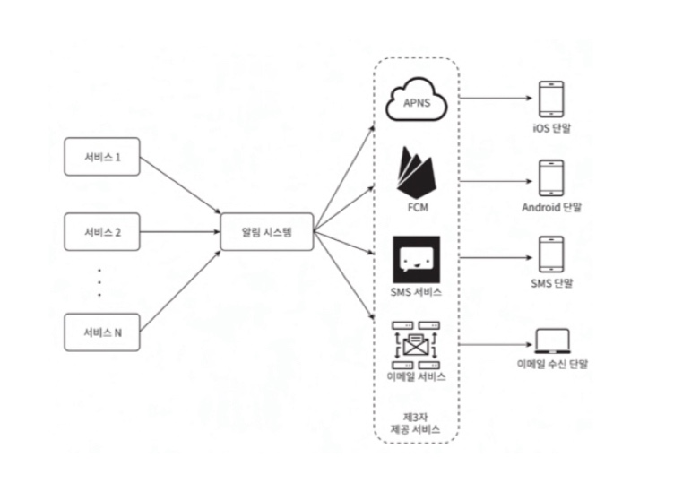
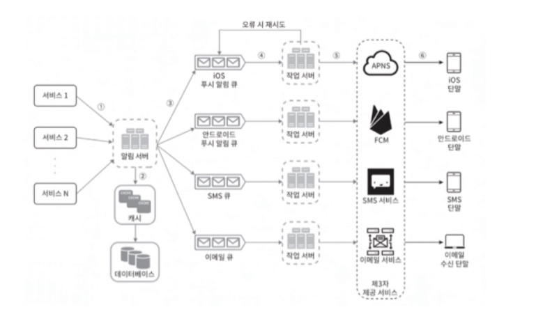
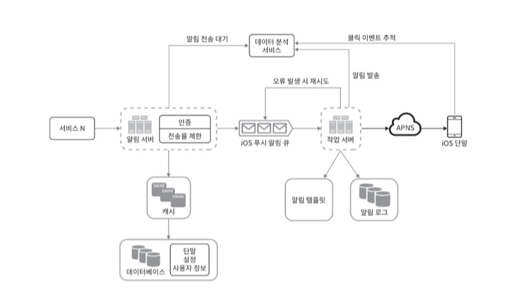

## 2-3. 알림 서비스

하루에 백만 건 이상의 알림을 처리하는 시스템을 구축하는 게 쉬운 과제는 아니다. 먼저 아래의 가정이 추가로 필요할 수 있다.
- 알림의 종류 (푸시 알림 / SMS / 이메일)
- 실시간 처리가 필요한 지
- 어떤 단말을 지원할 지
- 하루에 몇 건의 알림을 처리해야 하는 지

만약 푸시 알림을 사용한다면 각 단말마다 Provider가 다르다는 점을 유의해야 한다.
- IOS: APNS(Apple Push Notification Service)
- AOS: FCM(Firebase Cloud Messing)

SMS나 EMAIL은 상용 서비스를 이용하면 된다.

개략적 설계는 다음과 같다.

여기서 문제를 몇가지 발견할 수 있다.
- SPOF(Single-Point-Of-Failure): 단일 장애 포인트가 존재
- 병목: Provider의 응답 지연이 전체 서비스의 장애로 이어질 수 있다.
- 확장성: 한 대 서비스로 푸시 알림에 관계된 모든 것을 처리하므로 컴포넌트 확장이 어려움

이를 개선하기 위해 아래의 방향을 잡아보자.
- DB와 캐시를 알림 시스템의 주 서버에서 분리한다.
- 알림 서버를 증설하고 자동으로 Scale-Out이 가능하도록 한다.
- MQ를 통해 컴포넌트 사이의 강한 결합을 끊는다.

아래는 해당 개선안을 반영한 것이다.

각 컴포넌트의 역할은 아래와 같다.
- 알림 서버
    - 알림 검증
    - DB 및 캐시 질의
    - 알림 전송
- 캐시
    - 사용자 정보, 단말 정보, 알림 템플릿 캐싱
- DB
    - 사용자, 알림, 설정 등의 정보를 저장
- MQ
    - 컴포넌트 간 강결합을 제거하기 위해 사용
    - 다량의 경우 버퍼 역할도 수행
- 작업 서버
    - 메시지 큐에서 전송할 알림을 꺼내서 제3자 서비스로 전달한다.

더 상세히 고민해보면 **안정성** 확보를 생각해볼 수 있다.

**데이터 손실 방지**

알림 시스템에서 중요한 것은 데이터의 순서가 틀리거나 지연되어도 괜찮지만 알림이 사라지면 안된다는 점이다.

데이터 손실 방지를 위해 작업 서버에서 알림 로그를 데이터베이스에 저장할 수 있다.

**중복 전송 방지**

같은 알림이 여러개 반복될 수 있다.

해결 방법은 동일한 ID에 대해 이미 발송했는 지 검사를 해서 멱등성을 유지해야 한다.

**알림 템플릿**

알림을 매번 새로 생성해서 처리한다면 관리가 어려울 수 있다.

그래서 알림을 일관되게 발송하기 위해 템플릿으로 관리한다.

**알림 설정**

사용자는 특정 종류의 알림을 받지 않도록 설정할 수 있어야 한다.

그래서 이런 정보를 보관할 테이블이 필요하다.

**인증 및 전송률 제한**

알림서버는 너무 많은 알림을 보내지 않도록 전송률을 제한할 수 있다.

그리고 인증된 사용자만 API에 접근할 수 있어야 한다.

**재시도**

알림 발송이 실패할 수 있다. 실패한 건에 대해서 수동으로 처리하지 않고

자동화된 프로세스를 구축해야 한다.

**큐 모니터링**

큐에 데이터가 너무 많이 쌓이면 작업 서버를 증설해야 할 수 있다.

그래서 큐의 현재 상태에 대한 분석이 필요하다.

**이벤트 추적**

알림 확인율, 클릭율, 실제 앱 사용으로 이어지는 비율과 같은 메트릭은 사용자를 이해하는데 중요한 지표이다.

일반적으로는 이러한 데이터 분석 서비스와 알림 시스템을 통합해서 사용한다.

아래는 해당 고민들을 반영한 최종 설계안이다.

이제 규모 확장(Scale out)이 가능하고 푸시 알림, SMS 메시지 알림, 이메일 등 다양한 정보 전달 방식을 지원하는 알림 시스템을 만들었다.

시스템 컴포넌트 사이의 결합도를 낮추기 위해 Message Queue를 활용했고 안정성, 보안, 이벤트 추적, 사용자 설정, 전송률 제한, 실패 시 재시도 등의 처리까지 고려할 수 있었다.