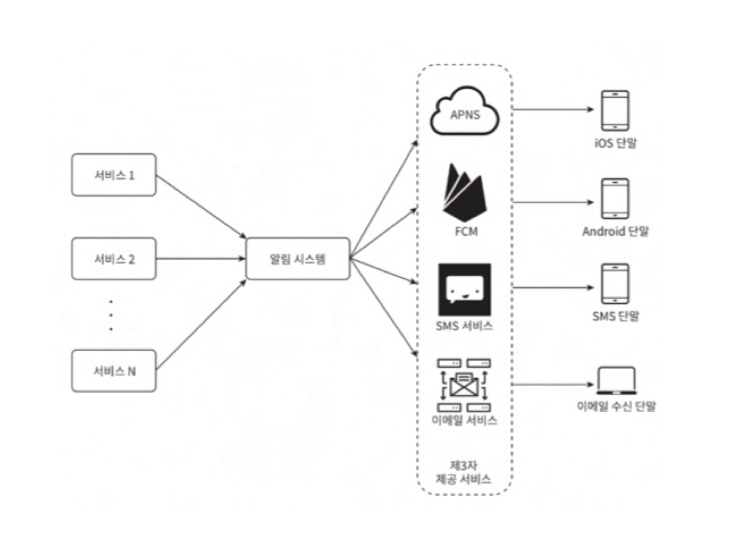
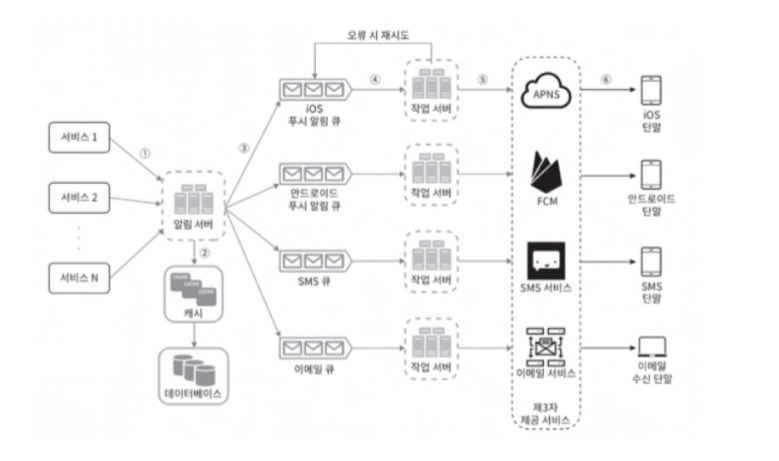

## 알림 시스템 설계

이번에는 SNS 아키텍처에서 사용할 알림 시스템을 설계해보자.  하루에 백만 건 이상의 알림을 처리하는 시스템을 구축하는 게 쉬운 과제는 아니다.

먼저 아래의 가정이 필요할 수 있다.
- 알림의 종류 (푸시 알림 / SMS / 이메일)
- 실시간 처리가 필요한 지
- 어떤 단말을 지원할 지
- 하루에 몇 건의 알림을 처리해야 하는 지

## 가정

이번 설계에서는 아래 요구사항을 가정한다.
- 푸시 알림, SMS 메시지, 이메일을 모두 지원한다.
- 연성 실시간(Soft Real-Time)을 보장한다.
  - 알림은 가능한 빨리 전달한다.
  - 시스템의 부하가 크다면 약간의 지연은 무방하다.
- 알림을 받지 않도록 설정할 수 있다.
- 하루에 1천만 건의 푸시 알림, 1백만 건의 SMS 메시지, 5백만 건의 이메일을 보낼 수 있어야 한다.

## 가정

푸시 알림을 사용한다면 각 단말마다 Provider가 다르다는 점을 유의해야 한다.
- IOS: APNS(Apple Push Notification Service)
- AOS: FCM(Firebase Cloud Messing)

SMS나 EMAIL은 상용 서비스를 이용하면 된다.

개략적 설계는 다음과 같다.

여기서 문제를 몇가지 발견할 수 있다.
- SPOF(Single-Point-Of-Failure): 단일 장애 포인트가 존재
- 병목: Provider의 응답 지연이 전체 서비스의 장애로 이어질 수 있다.
- 확장성: 한 대 서비스로 푸시 알림에 관계된 모든 것을 처리하므로 컴포넌트 확장이 어려움

이를 개선하기 위해 아래의 방향을 잡아보자.
- DB와 캐시를 알림 시스템의 주 서버에서 분리한다.
- 알림 서버를 증설하고 자동으로 Scale-Out이 가능하도록 한다.
- MQ를 통해 컴포넌트 사이의 강한 결합을 끊는다.

아래는 해당 개선안을 반영한 것이다.

각 컴포넌트의 역할은 아래와 같다.
- 알림 서버
    - 알림 검증
    - DB 및 캐시 질의
    - 알림 전송
- 캐시
    - 사용자 정보, 단말 정보, 알림 템플릿 캐싱
- DB
    - 사용자, 알림, 설정 등의 정보를 저장
- MQ
    - 컴포넌트 간 강결합을 제거하기 위해 사용
    - 다량의 경우 버퍼 역할도 수행
- 작업 서버
    - 메시지 큐에서 전송할 알림을 꺼내서 제3자 서비스로 전달한다.

## 상세 설계

상세 설계에서는 **안정성** 확보 부분에 대해서 생각해볼 수 있다.

**데이터 손실 방지**

알림 시스템에서 중요한 것은 데이터의 순서가 틀리거나 지연되어도 괜찮지만 알림이 사라지면 안된다는 점이다.

데이터 손실 방지를 위해 작업 서버에서 알림 로그를 데이터베이스에 저장할 수 있다.

**중복 전송 방지**

같은 알림이 여러개 반복될 수 있다.

해결 방법은 동일한 ID에 대해 이미 발송했는 지 검사를 해서 멱등성을 유지해야 한다.

**알림 템플릿**

알림을 매번 새로 생성해서 처리한다면 관리가 어려울 수 있다.

그래서 알림을 일관되게 발송하기 위해 템플릿으로 관리한다.

**알림 설정**

사용자는 특정 종류의 알림을 받지 않도록 설정할 수 있어야 한다.

그래서 이런 정보를 보관할 테이블이 필요하다.

**인증 및 전송률 제한**

알림서버는 너무 많은 알림을 보내지 않도록 전송률을 제한할 수 있다.

그리고 인증된 사용자만 API에 접근할 수 있어야 한다.

**재시도**

알림 발송이 실패할 수 있다. 실패한 건에 대해서 수동으로 처리하지 않고

자동화된 프로세스를 구축해야 한다.

**큐 모니터링**

큐에 데이터가 너무 많이 쌓이면 작업 서버를 증설해야 할 수 있다.

그래서 큐의 현재 상태에 대한 분석이 필요하다.

**이벤트 추적**

알림 확인율, 클릭율, 실제 앱 사용으로 이어지는 비율과 같은 메트릭은 사용자를 이해하는데 중요한 지표이다.

일반적으로는 이러한 데이터 분석 서비스와 알림 시스템을 통합해서 사용한다.

아래는 해당 고민들을 반영한 최종 설계안이다.

개략적 설계에 없던 많은 컴포넌트가 추가되었다.
- 알림 서버에 인증 및 전송률 제한 기능
- 전송 실패에 대응하기 위한 재시도 기능 추가
- 알림 전송 템플릿을 사용하여 알림 생성 과정을 단순화하고 내용 일관성을 유지
- 모니터링과 추적 시스템을 추가하여 추후 개선 용이

결과적으로 규모 확장(Scale out)이 가능하고 푸시 알림, SMS 메시지 알림, 이메일 등 다양한 정보 전달 방식을 지원하는 알림 시스템을 만들었다.

시스템 컴포넌트 사이의 결합도를 낮추기 위해 Message Queue를 활용했고 안정성, 보안, 이벤트 추적, 사용자 설정, 전송률 제한, 실패 시 재시도 등의 처리까지 고려할 수 있었다.

## 참고

- https://product.kyobobook.co.kr/detail/S000001033116
- https://smpark1020.tistory.com/401
- https://thalals.tistory.com/441